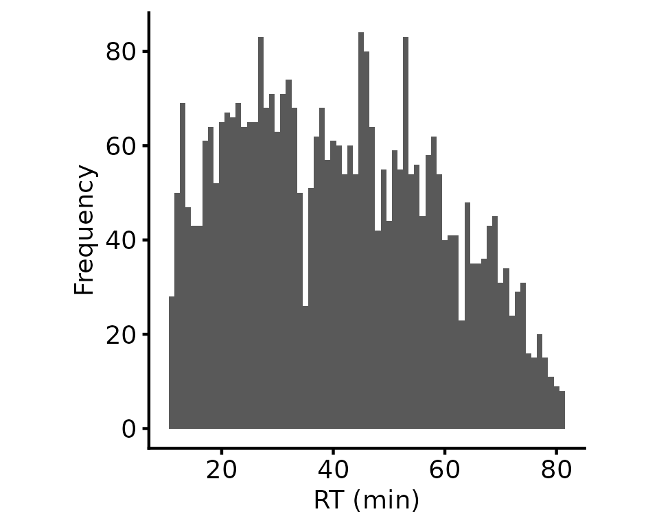
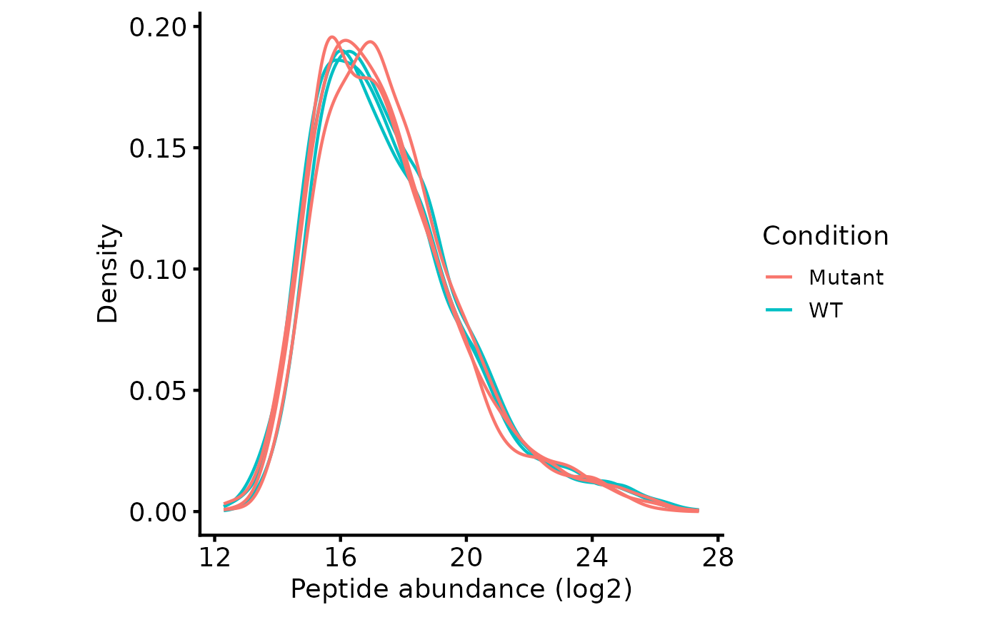
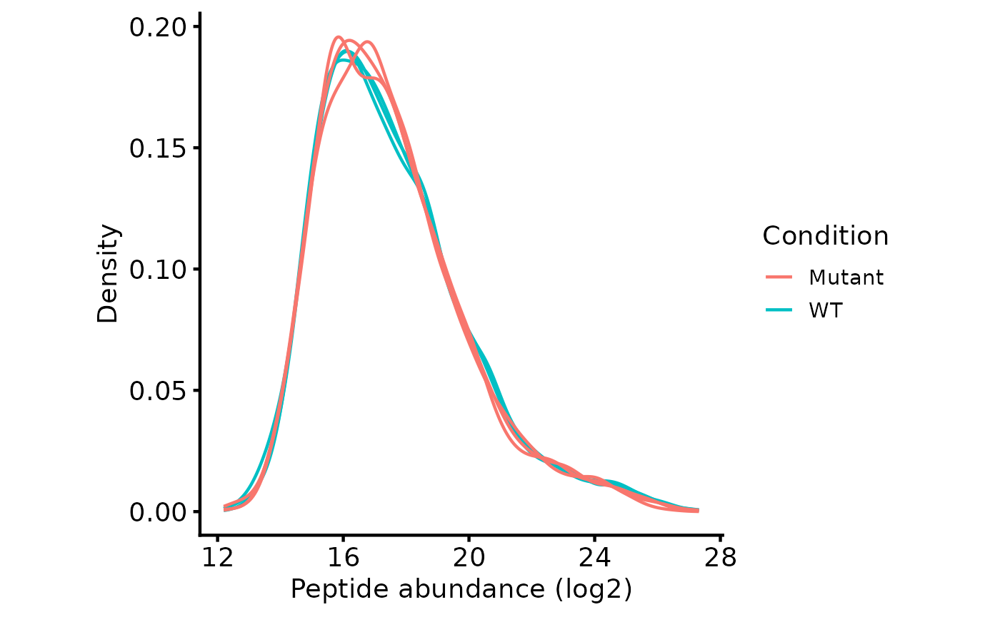
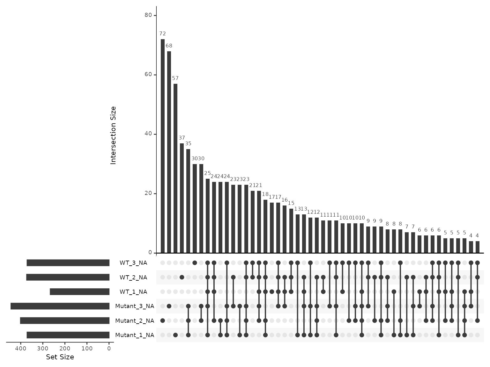
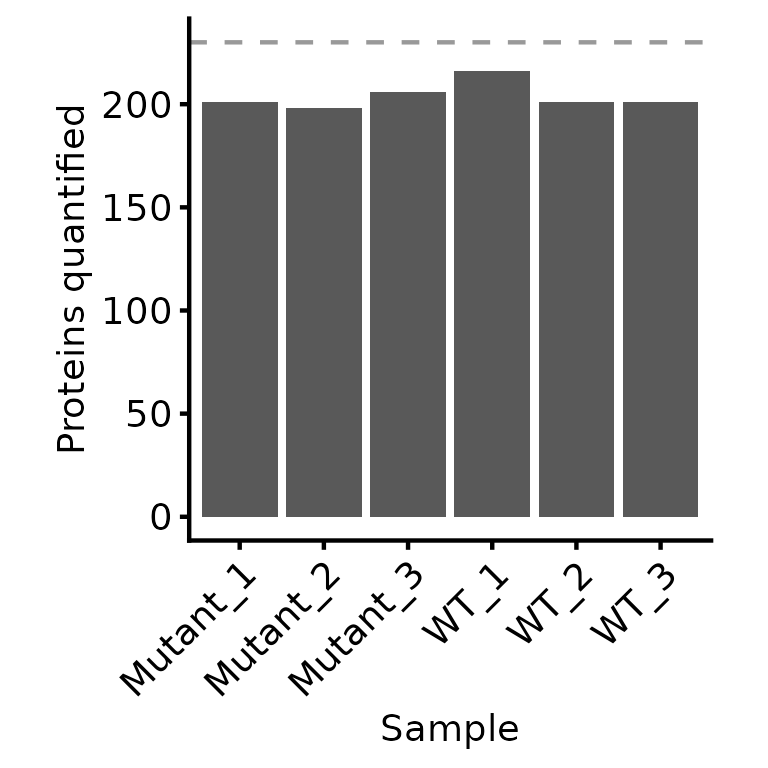
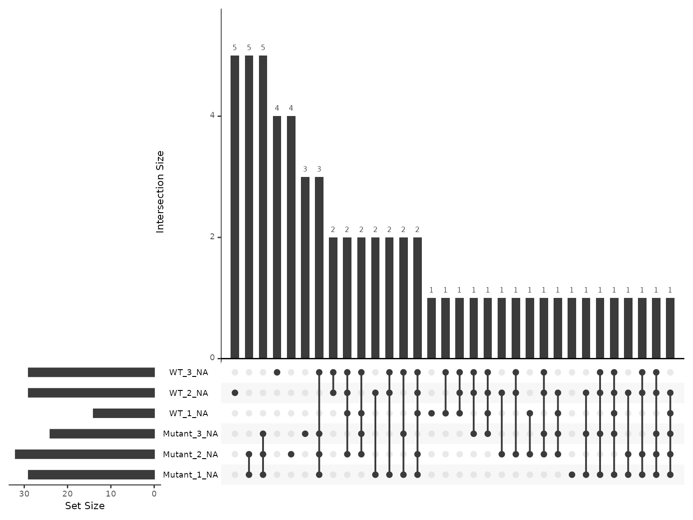

# LFQ-DDA workflow: peptide QC and protein summarisation

Label-Free Quantification (LFQ) is the simplest form of quantitative
bottom-up proteomics, in which different samples are quantified in
separate MS runs. Quantification is either performed by Data-Dependent
Acquisition (DDA), where the Mass Spectrometer triggers fragmentation of
ions within a given m/z range with the aim being to focus attention of
individual peptides separately, or Data-Independent Acquisition (DIA),
where a much wider m/z range is used and a mix of peptides are
co-fragmented and quantified simultaneously by deconvoluting the
resultant complex spectra. This article covers LFQ-DDA; DIA is a
different enough problem to have its own, in [LFQ-DIA precursor
QC](https://lmb-mass-spec-compbio.github.io/biomasslmb/articles/LFQ_DIA_Precursor_QC_Summarisation.md).

Since each sample is run separately, different peptides will be
quantified in each sample and the peptide intensities may not be
directly comparable between samples. The common solution to the higher
burden of missing values is to use the ‘match-between-runs’ (Cox et al.
2014), or the functionally equivalent ‘Minora’ algorithm employed by
Proteome Discoverer (PD). These algorithms use the observed retention
times of MS1 ions which were successfully spectrum matched in one sample
to identify the likely peptide sequence of MS1 ions that could not be
spectrum matched in another sample. However, even with these algorithms
enabled, DDA LFQ will still typically have many more missing values than
labelled proteomics, e.g TMT.

The analysis is straightforward in outline. Three of its steps carry
most of the risk — normalisation, the missing value threshold, and the
protein inference that summarisation rests on — and each is flagged
where it arrives below.

This vignette works through one typical experiment from end to end: a
whole-proteome comparison between two conditions, three replicates each.
That is the common case, and the choices made below are the conventional
ones for it. An enrichment experiment — an IP, BioID or TurboID pulldown
— needs different reasoning about normalisation and about missing
values, and is covered in [enrichment
designs](https://lmb-mass-spec-compbio.github.io/biomasslmb/articles/interactome_designs.md).

If this is your first analysis with the package, [getting
started](https://lmb-mass-spec-compbio.github.io/biomasslmb/articles/biomasslmb.md)
explains which route applies to your experiment and shows a complete one
in forty lines, and [working with QFeatures
objects](https://lmb-mass-spec-compbio.github.io/biomasslmb/articles/qfeatures_objects.md)
covers the object every step below operates on. Annotations are worth
retrieving before any of this — see [protein
annotation](https://lmb-mass-spec-compbio.github.io/biomasslmb/articles/protein_annotation.md).

## Load required packages

``` r

library(QFeatures)
library(biomasslmb)
library(ggplot2)
library(tidyr)
library(dplyr)
```

## The experimental design

`lfq_dda_pd_PeptideGroups.txt` is a file available from the `biomasslmb`
package containing the peptide-level output from Proteome Discoverer
(PD) for a real DDA LFQ experiment: a whole-proteome comparison between
a wild type human cell line and a point mutant of the same line, 3
replicates each. It is truncated to a subset of proteins for a
manageable vignette.

``` r

pep_inf <- system.file(
  "extdata", "lfq_dda_pd_PeptideGroups.txt",
  package = "biomasslmb"
)
```

## Defining the contaminant proteins

Contaminant proteins have to be removed. This search was performed
against the ‘0602_Universal Contaminants’ database (Frankenfield et al.
2022), so parsing that same fasta gives the accessions to match against.

``` r


contaminant_fasta_inf <- system.file(
  "extdata", "0602_Universal_Contaminants.fasta.gz",
  package = "biomasslmb"
)

# Extract the protein IDs associated with each contaminant protein
contaminant_accessions <- biomasslmb::get_contaminant_fasta_accessions(contaminant_fasta_inf)

print(head(contaminant_accessions))
#> [1] "Cont_P00722" "Cont_P09870" "Cont_P30879" "Cont_P0C1U8" "Cont_Q2FZL2"
#> [6] "Cont_P00698"
```

This PD export also includes PD’s own `Contaminant` column, populated
from the same search against the ‘0602_Universal Contaminants’ database.
`filter_features_pd_dda` uses this column automatically, in addition to
the `contaminant_accessions` extracted above.

These are separate defences that do not always agree with one another,
and when one of them silently fails the filtering still appears to work.
[Contaminants and protein
FDR](https://lmb-mass-spec-compbio.github.io/biomasslmb/articles/gotcha_contaminants_and_FDR.md)
measures what each one catches and what a mismatch between the accession
list and the search database leaves behind.

## Read in input data

The data go into a `QFeatures` object, the standard Bioconductor
container for quantitative proteomics data. See
[here](https://www.bioconductor.org/packages/release/bioc/html/QFeatures.html)
for documentation about the `QFeatures` object.

The abundance column names are not useful as they stand — they carry the
PD file ID (`F7`, `F8`, …) rather than which sample is which.

``` r

infdf <- read.delim(pep_inf)

abundance_cols_ix <- grep('^Abundance', colnames(infdf))

colnames(infdf)[abundance_cols_ix]
#> [1] "Abundance.F7.Sample"  "Abundance.F8.Sample"  "Abundance.F9.Sample" 
#> [4] "Abundance.F10.Sample" "Abundance.F11.Sample" "Abundance.F12.Sample"
```

Which file ID corresponds to which sample comes from the design table
supplied with the experiment, so that is built first. The three wild
type replicates were acquired before the three mutant replicates.

``` r

exp_design <- data.frame(
  quantCols = colnames(infdf)[abundance_cols_ix],
  Condition = rep(c('WT', 'Mutant'), each = 3),
  Replicate = rep(1:3, times = 2))

exp_design$Sample <- paste(exp_design$Condition, exp_design$Replicate, sep = '_')

knitr::kable(exp_design)
```

| quantCols            | Condition | Replicate | Sample   |
|:---------------------|:----------|----------:|:---------|
| Abundance.F7.Sample  | WT        |         1 | WT_1     |
| Abundance.F8.Sample  | WT        |         2 | WT_2     |
| Abundance.F9.Sample  | WT        |         3 | WT_3     |
| Abundance.F10.Sample | Mutant    |         1 | Mutant_1 |
| Abundance.F11.Sample | Mutant    |         2 | Mutant_2 |
| Abundance.F12.Sample | Mutant    |         3 | Mutant_3 |

Relabelling the abundance columns with the sample names means everything
downstream refers to samples rather than file IDs.

``` r

colnames(infdf)[abundance_cols_ix] <- exp_design$Sample
exp_design$quantCols <- exp_design$Sample

colnames(infdf)[abundance_cols_ix]
#> [1] "WT_1"     "WT_2"     "WT_3"     "Mutant_1" "Mutant_2" "Mutant_3"
```

The data can now be read in.

``` r

# Read in peptide-level quantification from the DDA LFQ experiment (using QFeatures function)
lfq_qf <- readQFeatures(assayData = infdf,
                        quantCols = abundance_cols_ix,
                        colData = exp_design,
                        name = "peptides_raw")
#> Checking arguments.
#> Loading data as a 'SummarizedExperiment' object.
#> Formatting sample annotations (colData).
#> Formatting data as a 'QFeatures' object.
```

[`readQFeatures()`](https://rformassspectrometry.github.io/QFeatures/reference/readQFeatures.html)
attaches the design at the object level only, so
[`sync_coldata()`](https://lmb-mass-spec-compbio.github.io/biomasslmb/reference/sync_coldata.md)
copies it onto the assay as well, which is what the plotting and
modelling functions read. See [working with QFeatures
objects](https://lmb-mass-spec-compbio.github.io/biomasslmb/articles/qfeatures_objects.md).

``` r

lfq_qf <- sync_coldata(lfq_qf, 'peptides_raw')
```

The retention time (RT) distribution is worth assessing before anything
is filtered, because a chromatography problem is cheaper to find now
than after summarisation. `plot_rt_dist` defaults to the column name
Proteome Discoverer uses for a Sequest HT search; this search was run
with CHIMERYS, so the column is named explicitly.

**The peptide count holds up across most of the gradient**, tailing off
over the last 20 minutes, which is what an even elution looks like. A
large early or late spike, or a gap in the middle, would point at a
chromatography problem worth resolving before going further.

``` r

rt_col <- 'PSM.RT.in.min.by.Search.Engine.CHIMERYS'

plot_rt_dist(lfq_qf[['peptides_raw']], rt_col = rt_col)
```



The companion check, `plot_rt_vs_delta`, plots the precursor mass error
against RT and would reveal a mass calibration that drifts across the
run. It needs a reported mass error to work with, and this export gives
a delta of exactly zero for every peptide, so there is nothing to plot
here. A Sequest HT export reports the measured error and the check is
worth making.

## Filter peptides

Routine filtering removes peptides that:

- Could originate from contaminants. See
  [`?filter_features_pd_dda`](https://lmb-mass-spec-compbio.github.io/biomasslmb/reference/filter_features_pd_dda.md)
  for further details, including the removal of ‘associated’
  contaminants.
- Don’t have any quantification values

`unique_master = FALSE` keeps the peptides whose master protein is a
group of several accessions, such as `Q16875; P16118` — 318 of the 3544
peptides here, in 162 distinct groups. Each group summarises to its own
protein row later in this vignette, separate from the rows for its
individual members; `unique_master = TRUE` drops those peptides instead.
The `proteotypic` argument asks a different question — whether the
peptide sequence occurs in only one protein at all — and is likewise not
applied here. See [peptides are not
proteins](https://lmb-mass-spec-compbio.github.io/biomasslmb/articles/gotcha_peptide_to_protein.md).

``` r

# Perform routine raw data filtering.
# - Remove peptides from contaminant proteins
# - Remove peptides with no master protein

lfq_qf[['peptides_filtered']] <- filter_features_pd_dda(lfq_qf[['peptides_raw']],
                                                 contaminant_proteins=contaminant_accessions,
                                                 filter_contaminant=TRUE,
                                                 filter_associated_contaminant=TRUE,
                                                 unique_master=FALSE,
                                                 remove_no_quant = TRUE)
#> Filtering data...
#> 3544 features found from 670 master proteins => Input
#> 381 contaminant proteins supplied
#> 743 proteins identified as 'contaminant associated'
#> 3389 features found from 609 master proteins => contaminant features removed
#> 3375 features found from 599 master proteins => associated contaminant features removed
#> 3375 features found from 599 master proteins => PD-labelled 'Contaminants' removed
#> 3375 features found from 599 master proteins => features without a master protein removed
#> 2325 features found from 402 master proteins => features without quantification removed

lfq_qf <- sync_coldata(lfq_qf, 'peptides_filtered')
```

Peptides that are not rank 1 according to the search engine are removed
next. Every peptide in this export is rank 1, so nothing goes at this
step — but it belongs in the pipeline, because an export that reports
lower-ranked matches will contain some.

``` r


lfq_qf <- lfq_qf %>%
filterFeatures(~ PSM.Search.Engine.Rank.by.Search.Engine.CHIMERYS == 1,
               i = "peptides_filtered")
#> 'PSM.Search.Engine.Rank.by.Search.Engine.CHIMERYS' found in 2 out of 2 assay(s).

message_parse(rowData(lfq_qf[['peptides_filtered']]),
                           'Master.Protein.Accessions',
                           "Removing peptides that are not rank 1")
#> 2325 features found from 402 master proteins => Removing peptides that are not rank 1
```

Summarisation needs the quantification values on a log scale, so they
are transformed here.

``` r

lfq_qf[['peptides_filtered']] <- QFeatures::logTransform(
  lfq_qf[['peptides_filtered']], base=2)
```

The peptide intensity distributions, coloured by `Condition`:

``` r


# Plot the peptide-level quantification distributions per sample
plot_quant(lfq_qf[['peptides_filtered']], log2transform=FALSE, method='density') +
  theme_biomasslmb() +
  aes(colour=Condition, group=sample) +
  xlab('Peptide abundance (log2)')
```



### Normalise

The same amount of material was injected for every sample, and this is a
whole-proteome comparison in which most proteins are expected to be
unchanged between the two conditions, so any systematic offset between
the distributions above is technical rather than biological.
`diff.median` normalisation shifts each sample to a common median and
removes it.

``` r

lfq_qf[['peptides_filtered_norm']] <- QFeatures::normalize(
  lfq_qf[['peptides_filtered']], method = 'diff.median')

lfq_qf <- sync_coldata(lfq_qf, 'peptides_filtered_norm')

plot_quant(lfq_qf[['peptides_filtered_norm']], log2transform=FALSE, method='density') +
  theme_biomasslmb() +
  aes(colour=Condition, group=sample) +
  xlab('Peptide abundance (log2)')
```



That assumption is what makes this step safe, and it is worth stating
explicitly because it is not always true: an [enrichment
design](https://lmb-mass-spec-compbio.github.io/biomasslmb/articles/interactome_designs.md)
expects the conditions to differ in overall composition, and normalising
to a common median there erodes the signal being measured.

### Summarising to protein-level abundances

Summarisation takes the master protein assignment at face value: every
peptide contributes to exactly one protein, the one the search engine
assigned it to. That assignment is an inference rather than a
measurement, and for proteins whose peptides are largely shared with
their homologues it is not a reliable one. [Peptides are not
proteins](https://lmb-mass-spec-compbio.github.io/biomasslmb/articles/gotcha_peptide_to_protein.md)
covers how the assignment is made and how to tell which of your proteins
it can support.

Before deciding how to handle missing values, it’s worth checking how
much missingness there is, and whether it’s structured by `Condition`.
`condition_miss_score` fits, for each peptide, a logistic regression of
missingness against `Condition`, and returns Tjur’s R² as a per-feature
score: values near 1 mean a peptide’s missingness pattern is well
explained by `Condition`. `condition_miss_index` aggregates these into a
single dataset-level value between 0 and 1.

``` r

miss_res <- condition_miss_score(lfq_qf, i = 'peptides_filtered_norm', group_cols = 'Condition')
#> Analysing assay 'peptides_filtered_norm': 2325 features x 6 samples
#> Group variable: Condition (2 levels: Mutant, WT)
#> Results: 787 informative features | mean condition miss score = 0.281 | condition-structured: 2.1% | condition-independent: 22.8%
condition_miss_index(miss_res$summary)$index
#> Condition missingness index: 0.1048 | Weighted mean score: 0.3095 | Coverage: 33.8% (787 / 2325 features informative) [coverage penalty applied]
#> [1] 0.1047774
```

**Missing values are common, but they are not structured by condition.**
787 of the 2325 peptides have at least one, and yet the index is low.
That is the expected picture for a whole-proteome comparison: a peptide
near the limit of detection drops out of whichever runs happened to miss
it, rather than out of one condition specifically. `plot_missing_upset`
shows the most common patterns.

``` r

plot_missing_upset(lfq_qf, i='peptides_filtered_norm')
```



Unstructured or not, there are far too many missing values to discard
every peptide that has one, which is the usual state of affairs for DDA
LFQ. That rules out summing, which needs complete features, and makes
[`MsCoreUtils::robustSummary`](https://rdrr.io/pkg/MsCoreUtils/man/robustSummary.html)
the appropriate estimator: it summarises accurately without requiring
complete data (Sticker et al. 2020). Peptides missing in almost every
sample still contribute little beyond noise, so a threshold is applied
first — at most 4/6 missing values here. Set it tighter and more of the
proteome falls below the two-peptide rule imposed next; set it looser
and protein estimates rest on peptides measured twice. [Comparing
protein summarisation
approaches](https://lmb-mass-spec-compbio.github.io/biomasslmb/articles/summarisation_methods.md)
puts `sum` and `robustSummary` side by side on this same dataset.

``` r


lfq_qf[['peptides_filtered_missing']] <- QFeatures::filterNA(
  lfq_qf[['peptides_filtered_norm']], 4/6)

message_parse(rowData(lfq_qf[['peptides_filtered_missing']]),
                           'Master.Protein.Accessions',
                           "Removing peptides with more than 4/6 missing values")
#> 2226 features found from 392 master proteins => Removing peptides with more than 4/6 missing values
```

Peptides belonging to proteins with fewer than 2 peptides are then
removed.

``` r

min_peps <- 2
lfq_qf[['peptides_for_summarisation']] <- filter_features_per_protein(
  lfq_qf[['peptides_filtered_missing']], min_features = min_peps)

message_parse(rowData(lfq_qf[['peptides_for_summarisation']]),
                           'Master.Protein.Accessions',
                           "Removing 'one-hit' wonders")
#> 2064 features found from 230 master proteins => Removing 'one-hit' wonders
```

Summarising with `robustSummary`:

``` r

set.seed(42)

# Aggregate to protein-level abundances (using QFeatures function)
lfq_qf <- aggregateFeatures(lfq_qf,
                            i = "peptides_for_summarisation",
                            fcol = "Master.Protein.Accessions",
                            name = "protein",
                            fun = MsCoreUtils::robustSummary,
                            maxit=10000)
#> Your quantitative data contain missing values. Please read the relevant
#> section(s) in the aggregateFeatures manual page regarding the effects
#> of missing values on data aggregation.
#> Aggregated: 1/1

lfq_qf <- sync_coldata(lfq_qf, 'protein')
```

The two-peptide filter above was applied per protein, not per sample,
and peptides with missing values were deliberately kept — so in any
given sample a protein can still end up summarised from a single
peptide. Nothing in the output marks these values as weaker than the
rest.
[`get_protein_no_quant_mask()`](https://lmb-mass-spec-compbio.github.io/biomasslmb/reference/get_protein_no_quant_mask.md)
finds where a protein abundance rests on fewer than `n` peptides, and
[`mask_protein_level_quant()`](https://lmb-mass-spec-compbio.github.io/biomasslmb/reference/mask_protein_level_quant.md)
replaces those values with `NA`.

``` r

# plot = TRUE means we will also get a plot of the number of proteins quantified in each sample
protein_retain_mask <- biomasslmb::get_protein_no_quant_mask(
  lfq_qf[['peptides_for_summarisation']], min_features=min_peps, plot=TRUE)

lfq_qf[['protein']] <- biomasslmb::mask_protein_level_quant(
  lfq_qf[['protein']], protein_retain_mask)
```



### Re-inspecting missing values at protein-level

Masking changes the missingness picture, so it is worth re-reading at
protein level. 11.377% of protein values are missing overall, and at
most 13.913% in any one sample. Summarising has reduced the missingness
considerably relative to the peptide level, since a protein only loses a
sample when every one of its peptides does. What remains is spread
across samples rather than concentrated in one condition, consistent
with the peptide-level picture above.

``` r


plot_missing_upset(lfq_qf, i='protein' )
```



### Inspecting the number of peptides and proteins through the processing steps

Each filtering step above removed something, and the totals are easier
to judge together than one message at a time.
[`get_samples_present()`](https://lmb-mass-spec-compbio.github.io/biomasslmb/reference/get_samples_present.md)
and
[`plot_samples_present()`](https://lmb-mass-spec-compbio.github.io/biomasslmb/reference/plot_samples_present.md)
show how many peptides and proteins survived each stage, and in how many
samples. Both take a named character vector selecting the assays to
plot, since the `QFeatures` names are not self-explanatory.

The assay names to choose from:

``` r

names(lfq_qf)
#> [1] "peptides_raw"               "peptides_filtered"         
#> [3] "peptides_filtered_norm"     "peptides_filtered_missing" 
#> [5] "peptides_for_summarisation" "protein"
```

#### Samples per peptide

Peptides first. The row variables are `Annotated.Sequence` and
`Modifications`, so that the count is of unique modified peptides rather
than of rows.

``` r


rename_cols <- c('All peptides' = 'peptides_raw' ,
                 'Quantified, contaminants removed' = 'peptides_filtered',
                 'At most 4/6 missing values' = 'peptides_filtered_missing',
                 '>1 peptide per protein' = 'peptides_for_summarisation')

rowvars <- c('Annotated.Sequence', 'Modifications')

samples_present <- get_samples_present(lfq_qf[,,unname(rename_cols)], rowvars, rename_cols)
#> Warning: 'experiments' dropped; see 'drops()'
#> harmonizing input:
#>   removing 12 sampleMap rows not in names(experiments)
plot_samples_present(samples_present, rowvars, breaks=seq(2,6,2)) + ylab('Peptide')
#> Scale for fill is already present.
#> Adding another scale for fill, which will replace the existing scale.
```


Samples quantified for each peptide at each level of processing

#### Samples per Protein

Then proteins, from the same functions: the named vector gains the
`protein` assay, and the row variable becomes
`Master.Protein.Accessions` alone.

``` r


rename_cols_prot <- c(rename_cols, 'Protein'='protein')

rowvars_prot <- c('Master.Protein.Accessions')

samples_present <- get_samples_present(lfq_qf, rowvars_prot, rename_cols_prot)
plot_samples_present(samples_present, rowvars_prot, breaks=seq(2,6,2))
#> Scale for fill is already present.
#> Adding another scale for fill, which will replace the existing scale.
```


Samples quantified for each protein at each level of processing

**The two-peptide rule is cheap in peptides and expensive in proteins.**
It removes few peptides, because most peptides belong to proteins that
have several; it removes many more proteins, because a protein
identified by one peptide loses its only evidence. Those proteins are
the ones whose quantification would have been least reliable, so the
trade is usually worth making — but it is a trade, and an experiment
targeting a low-abundance protein family may not want it.

The same six runs were also processed with MaxQuant, and [comparing
processing
pipelines](https://lmb-mass-spec-compbio.github.io/biomasslmb/articles/processing_pipeline_comparison.md)
puts that output through this pipeline to show how much of the protein
list and the significant hits depend on the choice of pipeline rather
than on the biology.

``` r

# Save file to package as data so it can be read back in in other vignettes
usethis::use_data(lfq_qf, overwrite=TRUE)
```

## Reading MaxQuant output

Everything above the `peptides_filtered` assay is Proteome Discoverer
specific: the file, the column names and the contaminant convention.
Everything below it is not. This section covers the difference, using
MaxQuant output from the same six runs.

MaxQuant’s `peptides.txt` is the counterpart of PD’s peptide groups
export, holding the same quantities under different names.

| Quantity | Proteome Discoverer | MaxQuant |
|----|----|----|
| Protein assignment | `Master.Protein.Accessions` | `Leading.razor.protein` |
| Quantification | `Abundance.<file ID>` | `Intensity.<experiment>` |
| Contaminant flag | `Contaminant` | `Potential.contaminant` |
| Decoy flag | removed before export | `Reverse` |
| Shared-peptide flag | `Number.of.Protein.Groups` | `Unique..Groups.` and `Unique..Proteins.` |
| Accession separator | `"; "` | `";"` |

``` r

mq_inf <- system.file("extdata", "lfq_dda_mq_peptides.txt.gz",
                      package = "biomasslmb")

mq_df <- read.delim(gzfile(mq_inf))

mq_intensity_ix <- grep('^Intensity\\.', colnames(mq_df))

colnames(mq_df)[mq_intensity_ix]
#> [1] "Intensity.A" "Intensity.B" "Intensity.C" "Intensity.D" "Intensity.F"
#> [6] "Intensity.G"
```

The intensity columns are named for MaxQuant’s ‘experiment’ labels
rather than for the samples, so as with the PD export the first job is
to attach the design.

``` r

mq_design <- data.frame(
  Condition = rep(c('WT', 'Mutant'), each = 3),
  Replicate = rep(1:3, times = 2))

mq_design$Sample <- paste(mq_design$Condition, mq_design$Replicate, sep = '_')
mq_design$quantCols <- mq_design$Sample

colnames(mq_df)[mq_intensity_ix] <- mq_design$Sample

knitr::kable(mq_design)
```

| Condition | Replicate | Sample   | quantCols |
|:----------|----------:|:---------|:----------|
| WT        |         1 | WT_1     | WT_1      |
| WT        |         2 | WT_2     | WT_2      |
| WT        |         3 | WT_3     | WT_3      |
| Mutant    |         1 | Mutant_1 | Mutant_1  |
| Mutant    |         2 | Mutant_2 | Mutant_2  |
| Mutant    |         3 | Mutant_3 | Mutant_3  |

One difference has to be dealt with before anything else. MaxQuant
writes an intensity of exactly zero where it has no measurement, whereas
PD leaves the cell empty. Mass spectrometry cannot assert that a peptide
was absent, only that it was not detected, so those zeros have to become
`NA` — left as they are, they are treated as real measurements at the
bottom of the scale and pull every subsequent summary down towards it.

``` r

mq_qf <- readQFeatures(assayData = mq_df, quantCols = mq_intensity_ix,
                       colData = mq_design, name = 'peptides_raw')

mq_qf <- sync_coldata(mq_qf, 'peptides_raw')

mq_qf[['peptides_raw']] <- zeroIsNA(mq_qf[['peptides_raw']])
```

The filtering call then changes in three ways.
[`filter_features_mq_dda()`](https://lmb-mass-spec-compbio.github.io/biomasslmb/reference/filter_features_mq_dda.md)
replaces
[`filter_features_pd_dda()`](https://lmb-mass-spec-compbio.github.io/biomasslmb/reference/filter_features_pd_dda.md).
The contaminant accessions come from
[`get_maxquant_cont_accessions()`](https://lmb-mass-spec-compbio.github.io/biomasslmb/reference/get_maxquant_cont_accessions.md)
rather than from a search FASTA, because MaxQuant searches against its
own contaminants database with `CON__` prefixed accessions. And there is
no `unique_master` argument, because MaxQuant nominates a single leading
razor protein for every peptide instead of reporting a tie — its nearest
counterpart is `proteotypic`, which keeps only peptides matching exactly
one protein. That is the stricter filter of the two and it is left off
here, to match what the PD pipeline above does. See [peptides are not
proteins](https://lmb-mass-spec-compbio.github.io/biomasslmb/articles/gotcha_peptide_to_protein.md)
for what the two questions actually differ on.

``` r

mq_qf[['peptides_filtered']] <- filter_features_mq_dda(
  mq_qf[['peptides_raw']],
  contaminant_proteins = get_maxquant_cont_accessions(),
  filter_contaminant = TRUE,
  filter_associated_contaminant = TRUE,
  remove_no_quant = TRUE)

mq_qf <- sync_coldata(mq_qf, 'peptides_filtered')

nrow(mq_qf[['peptides_filtered']])
#> [1] 1952
```

From here the vignette applies unchanged, with `Leading.razor.protein`
in place of `Master.Protein.Accessions` wherever it appears as a
`master_protein_col` or an `fcol`. The rank filter is the one step with
no MaxQuant equivalent, and is simply omitted: `peptides.txt` reports
one row per peptide rather than one per spectrum match, and the
confidence filtering has already been applied through MaxQuant’s own
posterior error probabilities.

[Comparing processing
pipelines](https://lmb-mass-spec-compbio.github.io/biomasslmb/articles/processing_pipeline_comparison.md)
takes both exports of these runs through to a tested protein list, and
measures how much of the answer depends on which of the two produced it.

## Where to go next

- [Data exploration and statistical
  testing](https://lmb-mass-spec-compbio.github.io/biomasslmb/articles/exploration_and_statistical_testing.md)
  picks up from the protein-level abundances produced here: checking the
  experiment worked, deciding which proteins can be tested, and testing
  them.
- [Handling missing
  values](https://lmb-mass-spec-compbio.github.io/biomasslmb/articles/handling_missing_values.md)
  covers the `filterNA` threshold applied above in full, and what the
  alternatives to discarding cost.
- [Choosing a summarisation
  method](https://lmb-mass-spec-compbio.github.io/biomasslmb/articles/summarisation_methods.md)
  compares `robustSummary` against summing on this same dataset.
- If this was an enrichment experiment rather than a whole-proteome
  comparison, [enrichment
  designs](https://lmb-mass-spec-compbio.github.io/biomasslmb/articles/interactome_designs.md)
  covers the normalisation and missing-value reasoning that changes.

## Getting help

If your experiment does not fit what this article assumes, or a result
looks wrong, please get in touch with Tom Smith (<tsmith@mrclmb.ac.uk>)
rather than guessing — it is far easier to help while an analysis is in
progress than to unpick a decision afterwards, and easier still before
the samples are run. [Getting
started](https://lmb-mass-spec-compbio.github.io/biomasslmb/articles/biomasslmb.md)
sets out which article applies to which experiment.

``` r

sessionInfo()
#> R version 4.5.3 (2026-03-11)
#> Platform: x86_64-pc-linux-gnu
#> Running under: Ubuntu 24.04.5 LTS
#> 
#> Matrix products: default
#> BLAS:   /usr/lib/x86_64-linux-gnu/openblas-pthread/libblas.so.3 
#> LAPACK: /usr/lib/x86_64-linux-gnu/openblas-pthread/libopenblasp-r0.3.26.so;  LAPACK version 3.12.0
#> 
#> locale:
#>  [1] LC_CTYPE=C.UTF-8       LC_NUMERIC=C           LC_TIME=C.UTF-8       
#>  [4] LC_COLLATE=C.UTF-8     LC_MONETARY=C.UTF-8    LC_MESSAGES=C.UTF-8   
#>  [7] LC_PAPER=C.UTF-8       LC_NAME=C              LC_ADDRESS=C          
#> [10] LC_TELEPHONE=C         LC_MEASUREMENT=C.UTF-8 LC_IDENTIFICATION=C   
#> 
#> time zone: UTC
#> tzcode source: system (glibc)
#> 
#> attached base packages:
#> [1] stats4    stats     graphics  grDevices utils     datasets  methods  
#> [8] base     
#> 
#> other attached packages:
#>  [1] dplyr_1.2.1                 tidyr_1.3.2                
#>  [3] ggplot2_4.0.3               biomasslmb_0.1.0           
#>  [5] QFeatures_1.20.0            MultiAssayExperiment_1.36.2
#>  [7] SummarizedExperiment_1.40.0 Biobase_2.70.0             
#>  [9] GenomicRanges_1.62.1        Seqinfo_1.0.0              
#> [11] IRanges_2.44.0              S4Vectors_0.48.1           
#> [13] BiocGenerics_0.56.0         generics_0.1.4             
#> [15] MatrixGenerics_1.22.0       matrixStats_1.5.0          
#> 
#> loaded via a namespace (and not attached):
#>  [1] DBI_1.3.0               gridExtra_2.3.1         rlang_1.3.0            
#>  [4] magrittr_2.0.5          clue_0.3-68             otel_0.2.0             
#>  [7] compiler_4.5.3          RSQLite_3.53.3          png_0.1-9              
#> [10] systemfonts_1.3.2       vctrs_0.7.3             reshape2_1.4.5         
#> [13] stringr_1.6.0           ProtGenerics_1.42.0     pkgconfig_2.0.3        
#> [16] crayon_1.5.3            fastmap_1.2.0           backports_1.5.1        
#> [19] XVector_0.50.0          labeling_0.4.3          rmarkdown_2.32         
#> [22] visdat_0.6.0            ragg_1.5.2              UpSetR_1.4.1           
#> [25] purrr_1.2.2             bit_4.6.0               xfun_0.60              
#> [28] cachem_1.1.0            jsonlite_2.0.0          blob_1.3.0             
#> [31] DelayedArray_0.36.1     cluster_2.1.8.2         R6_2.6.1               
#> [34] bslib_0.12.0            stringi_1.8.9           RColorBrewer_1.1-3     
#> [37] genefilter_1.92.0       jquerylib_0.1.4         Rcpp_1.1.2             
#> [40] knitr_1.52              BiocBaseUtils_1.12.0    Matrix_1.7-4           
#> [43] splines_4.5.3           igraph_2.3.3            tidyselect_1.2.1       
#> [46] abind_1.4-8             yaml_2.3.12             lattice_0.22-9         
#> [49] tibble_3.3.1            plyr_1.8.9              withr_3.0.3            
#> [52] KEGGREST_1.50.0         S7_0.2.2                evaluate_1.0.5         
#> [55] uniprotREST_1.0.0       desc_1.4.3              survival_3.8-6         
#> [58] Biostrings_2.78.0       pillar_1.11.1           corrplot_0.95          
#> [61] checkmate_2.3.4         scales_1.4.0            xtable_1.8-8           
#> [64] glue_1.8.1              lazyeval_0.2.3          tools_4.5.3            
#> [67] robustbase_0.99-7       annotate_1.88.0         fs_2.1.0               
#> [70] XML_3.99-0.24           grid_4.5.3              MsCoreUtils_1.22.1     
#> [73] AnnotationDbi_1.72.0    naniar_1.1.0            cli_3.6.6              
#> [76] textshaping_1.0.5       S4Arrays_1.10.1         AnnotationFilter_1.34.0
#> [79] gtable_0.3.6            DEoptimR_1.2-1          sass_0.4.10            
#> [82] digest_0.6.39           SparseArray_1.10.10     htmlwidgets_1.6.4      
#> [85] farver_2.1.2            memoise_2.0.1           htmltools_0.5.9        
#> [88] pkgdown_2.2.1           lifecycle_1.0.5         httr_1.4.9             
#> [91] bit64_4.8.6             MASS_7.3-65
```

Cox, Jürgen, Marco Y. Hein, Christian A. Luber, Igor Paron, Nagarjuna
Nagaraj, and Matthias Mann. 2014. “Accurate Proteome-Wide Label-Free
Quantification by Delayed Normalization and Maximal Peptide Ratio
Extraction, Termed MaxLFQ\*.” *Molecular & Cellular Proteomics* 13 (9):
2513–26. <https://doi.org/10.1074/mcp.M113.031591>.

Frankenfield, Ashley M., Jiawei Ni, Mustafa Ahmed, and Ling Hao. 2022.
“Protein Contaminants Matter: Building Universal Protein Contaminant
Libraries for DDA and DIA Proteomics.” *Journal of Proteome Research* 21
(9): 2104–13. <https://doi.org/10.1021/acs.jproteome.2c00145>.

Sticker, Adriaan, Ludger Goeminne, Lennart Martens, and Lieven Clement.
2020. “Robust Summarization and Inference in Proteome-wide Label-free
Quantification.” *Molecular & cellular proteomics: MCP* 19 (7): 1209–19.
<https://doi.org/10.1074/mcp.RA119.001624>.
