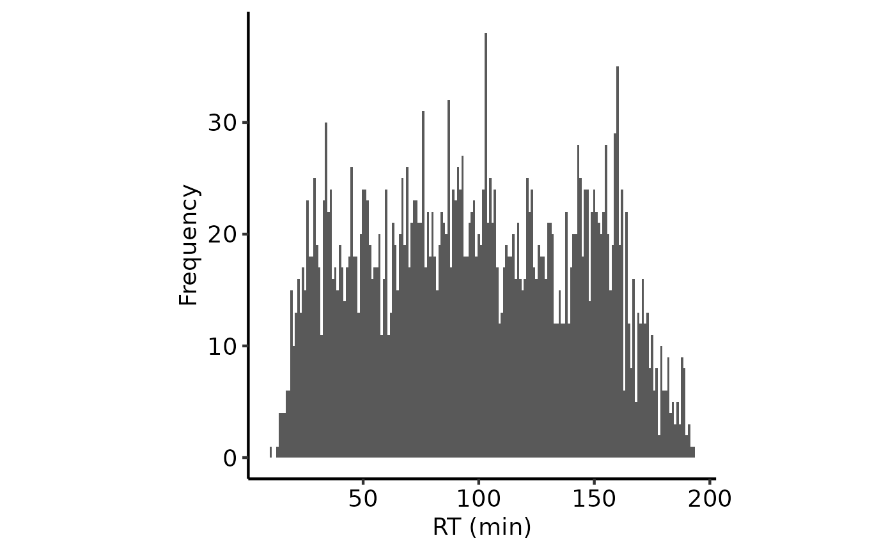
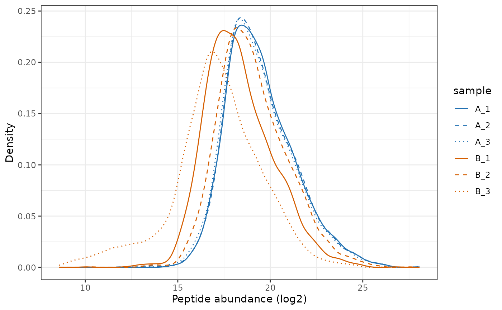
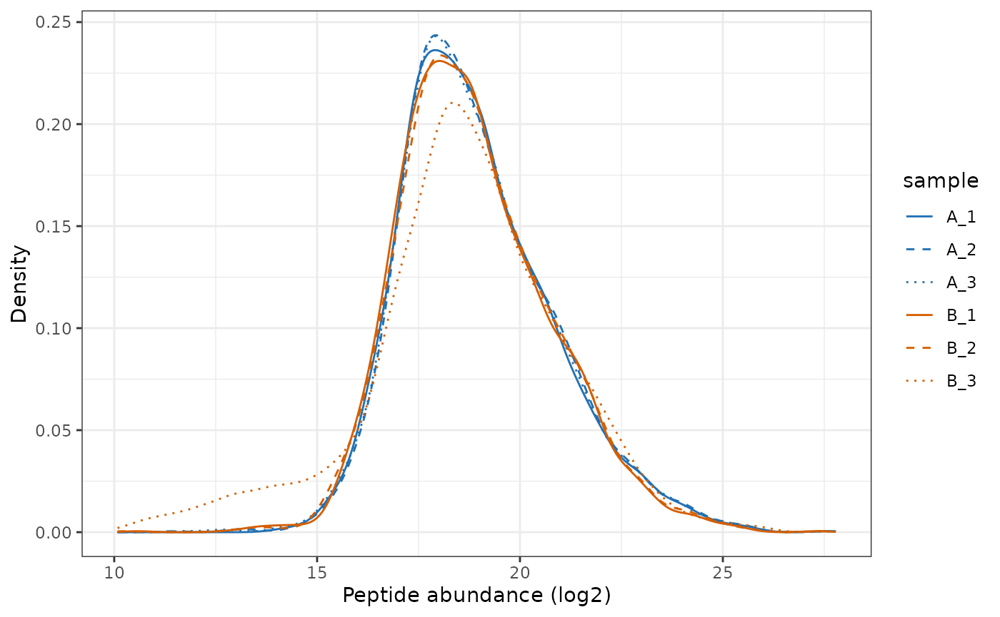
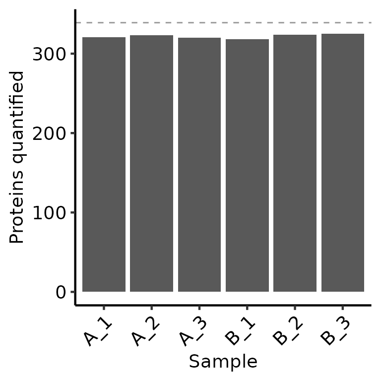
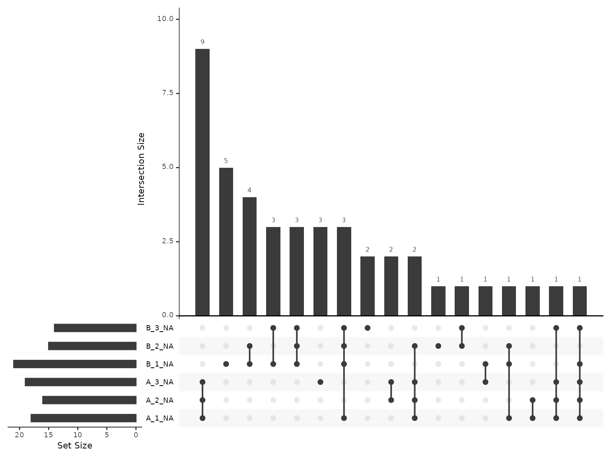

# LFQ-DDA QC Peptide-level quantification and summarisation to protein-level abundance

Label-Free Quantification (LFQ) is the simplest form of quantitative
proteomics, in which different samples are quantified in separate MS
runs. Quantification is either performed by Data-Dependent Aquisition
(DDA), where the Mass Spectrometer triggers fragmentation of ions within
a given m/z range with the aim being to focus attention of individual
peptides separately, or Data-Independent Aquisition (DIA), where a much
wider m/z range is used and a mix of peptides are co-fragmented and
quantified simultaneously by deconvoluting the resultant complex
spectra. Here, we will focus on just LFQ-DDA.

Since each sample is run separately, different peptides will be
quantified in each sample and the peptide intensities may not be
directly comparable between samples. The common solution to the higher
burden of missing values is to use the ‘match-between-runs’ (Cox et
al. 2014\[UPDATE REF!!!\]), or the functionally equivalent ‘Minora’
algorithm employed by Proteome Discoverer (PD). These algorithms use the
observed retention times of MS1 ions which were successfully spectrum
matched in one sample to identify the likely peptide sequence of MS1
ions that could not be spectrum matched in another sample. However, even
with these algorithms, DDA LFQ will still typically have many more
missing values than labelled LFQ, e.g TMT.

Despite the pitfalls of LFQ, the data analysis is still relatively
straightforward, though there are steps that need some careful
consideration and quality control assessment.

## Load required packages

To clarify which functionality is provided by which package, we will use
`package::function`. For your own code, there is no need to specify the
package unless you want to maintain this clarity.

``` r
library(QFeatures)
library(biomasslmb)
library(ggplot2)
library(tidyr)
library(dplyr)
```

## Defining the contaminant proteins

We need to remove contaminant proteins. These were defined here using
the cRAP database. Below, we parse the contaminants fasta to extract the
IDs for the proteins in both ‘cRAP’ format and Uniprot IDs.

``` r

crap_fasta_inf <- system.file(
  "extdata", "cRAP_20190401.fasta.gz", 
  package = "biomasslmb"
)

# Extract the protein IDs associated with each cRAP protein
crap_accessions <- biomasslmb::get_crap_fasta_accessions(crap_fasta_inf)

print(head(crap_accessions))
#> [1] "cRAP001" "P00330"  "cRAP002" "P02768"  "cRAP003" "P00883"
```

## Read in input data

We start by reading in quantitative proteomics data into a `QFeatures`
object, which is the standard Bioconductor object for holding
quantitative proteomics data. See
[here](https://www.bioconductor.org/packages/release/bioc/html/QFeatures.html)
for documentation about the `QFeatures` object.In this case, we are not
adding any experimental details to the `QFeatures` object, so the
`ColData` will be empty.

`??` is a data set available from the `biomasslmb` package

`lfq_dda_pd_PeptideGroups.txt` is a file available from the `biomasslmb`
package containing the Peptide-level output from Proteome Discoverer
(PD) for an experiment with 6 samples. It is a truncated file containing
the precursors peptides quantification for just 500 proteins.

``` r
pep_inf <- system.file(
  "extdata", "lfq_dda_pd_PeptideGroups.txt", 
  package = "biomasslmb"
)
```

Inspecting the column names for the abundances, we see the names are not
particularly useful. The `Abundance.FXX.na.Sample.` part is irrelevant
and the replicate number is not included

``` r
infdf <- read.delim(pep_inf)

abundance_cols_ix <-18:23

colnames(infdf)[abundance_cols_ix]
#> [1] "Abundance.F12.na.Sample.A" "Abundance.F13.na.Sample.A"
#> [3] "Abundance.F14.na.Sample.A" "Abundance.F15.na.Sample.B"
#> [5] "Abundance.F16.na.Sample.B" "Abundance.F17.na.Sample.B"
```

Below, we update the column names for the abundance columns

``` r
# Clean up sample names
colnames(infdf)[abundance_cols_ix] <- paste(gsub('Abundance.F\\d+.na.Sample.', '',
                                        colnames(infdf)[abundance_cols_ix]), rep(1:3, times=2), sep='_')

colnames(infdf)[abundance_cols_ix]
#> [1] "A_1" "A_2" "A_3" "B_1" "B_2" "B_3"
```

Before we read in the data, we also want to define the experimental
conditions for each sample. We can then provide the

``` r
exp_design <- data.frame(quantCols=colnames(infdf)[abundance_cols_ix]) %>%
  separate(quantCols, sep='_', into=c('condition', 'replicate'), remove = FALSE) 

knitr::kable(exp_design)
```

| quantCols | condition | replicate |
|:----------|:----------|:----------|
| A_1       | A         | 1         |
| A_2       | A         | 2         |
| A_3       | A         | 3         |
| B_1       | B         | 1         |
| B_2       | B         | 2         |
| B_3       | B         | 3         |

Now we can read the data into a `QFeatures` object

``` r
# Read in PSM-level quantification from TMT experiment (using QFeatures function)
lfq_qf <- readQFeatures(assayData = infdf,
                        quantCols = abundance_cols_ix, 
                        colData = exp_design,
                        name = "peptides_raw")
#> Checking arguments.
#> Loading data as a 'SummarizedExperiment' object.
#> Formatting sample annotations (colData).
#> Formatting data as a 'QFeatures' object.
```

Adding the `colData` to the peptide-level data too.

``` r
colData(lfq_qf[['peptides_raw']]) <- colData(lfq_qf)
```

Extract the gene name and long-form protein name from the descriptions.

``` r

tmt_qf[['peptides_raw']] <- add_gene_long_protein_name_pd(tmt_qf[['peptides_raw']])
```

It’s helpful to assess the retention time (RT) for the peptides and the
relationship with the delta mass for the precursor ion. Everything looks
OK here.

``` r
plot_rt_dist(lfq_qf[['peptides_raw']])
plot_rt_vs_delta(lfq_qf[['peptides_raw']])
```



## Filter peptides

We first perform routine filtering to remove PSMs that:

- Could originate from contaminants. See `?filter_features` for further
  details, including the removal of ‘associated cRAP’.
- Don’t have a unique master protein
- Don’t have any quantification values

``` r
# Perform routine raw data filtering.
# - Remove PSMs from contaminant proteins
# - Remove PSMs where protein ID is empty or not unique

lfq_qf[['peptides_filtered']] <- filter_features_pd_dda(lfq_qf[['peptides_raw']],
                                                        protein_col='Master.Protein.Accessions', # UPDATE WHEN RE-EXPORTED
                                                 contaminant_proteins=crap_accessions,
                                                 filter_contaminant =TRUE,
                                                 filter_associated_contaminant=TRUE,
                                                 unique_master=FALSE,
                                                 remove_no_quant = TRUE)
#> Filtering data...
#> 3106 features found from 500 master proteins => Input
#> 242 contaminant proteins supplied
#> 15 proteins identified as 'contaminant associated'
#> 3091 features found from 498 master proteins => contaminant features removed
#> 3091 features found from 498 master proteins => associated contaminant features removed
#> 3091 features found from 498 master proteins => features without a master protein removed
#> 2746 features found from 461 master proteins => features without quantification removed
```

We will also remove peptides that are not rank 1 according to the search
engine

``` r

lfq_qf <- lfq_qf %>%
filterFeatures(~ Search.Engine.Rank.by.Search.Engine.Sequest.HT == 1,
               i = "peptides_filtered") 
#> 'Search.Engine.Rank.by.Search.Engine.Sequest.HT' found in 2 out of 2 assay(s)

biomasslmb:::message_parse(rowData(lfq_qf[['peptides_filtered']]),
                           'Master.Protein.Accessions',
                           "Removing peptides that are not rank 1")
#> 2741 features found from 461 master proteins => Removing peptides that are not rank 1
```

For the normalisation and summarisation, we need our quantification
values to be on a log-scale, so we log-transform below

``` r
lfq_qf[['peptides_filtered']] <- QFeatures::logTransform(
  lfq_qf[['peptides_filtered']], base=2)
```

Next, we plot the peptide intensities.

``` r

# Plot the peptide-level quantification distributions per sample
plot_quant(lfq_qf[['peptides_filtered']], log2transform=FALSE, method='density') +
  scale_colour_manual(values=rep(get_cat_palette(3), each=3)) +
  aes(linetype=sample) +
  scale_linetype_manual(values=rep(1:3, times=3)) +
  xlab('Peptide abundance (log2)')
```



### Normalise

Since the same amount of sample was injected for each sample, we want to
normalise to remove differences in the overall disribution of
abundances. We will thus perform ‘diff.median’ normalisation with
[`QFeatures::normalize`](https://rdrr.io/pkg/BiocGenerics/man/normalize.html).

``` r
lfq_qf[['peptides_norm']] <- QFeatures::normalize(lfq_qf[['peptides_filtered']],
                                                  method='diff.median')
```

``` r

# Plot the peptide-level quantification distributions per sample
plot_quant(lfq_qf[['peptides_norm']], log2transform=FALSE, method='density') +
  scale_colour_manual(values=rep(get_cat_palette(3), each=3)) +
  aes(linetype=sample) +
  scale_linetype_manual(values=rep(1:3, times=3)) +
  xlab('Peptide abundance (log2)')
```



### Summarising to protein-level abundances

For the summarisation to protein, we will use `robustSummary`. We do not
need to remove peptides with any missing values. However, we still don’t
want to retain peptides with too many missing values, since these will
not be very informative in estimating the protein-level quantification.

Below, we inspect the most common patterns for the missing values.

The missingness is most frequently consigned to all samples from one
condition and also commonly 2/3 replicates from one condition. It looks
like the missingness is far from missing at random (MAR) and is likely
missing due to falling below detection limits.

``` r
plot_missing_upset(lfq_qf, i='peptides_norm')
#> Warning: `aes_string()` was deprecated in ggplot2 3.0.0.
#> ℹ Please use tidy evaluation idioms with `aes()`.
#> ℹ See also `vignette("ggplot2-in-packages")` for more information.
#> ℹ The deprecated feature was likely used in the UpSetR package.
#>   Please report the issue to the authors.
#> This warning is displayed once per session.
#> Call `lifecycle::last_lifecycle_warnings()` to see where this warning was
#> generated.
#> Warning: Using `size` aesthetic for lines was deprecated in ggplot2 3.4.0.
#> ℹ Please use `linewidth` instead.
#> ℹ The deprecated feature was likely used in the UpSetR package.
#>   Please report the issue to the authors.
#> This warning is displayed once per session.
#> Call `lifecycle::last_lifecycle_warnings()` to see where this warning was
#> generated.
#> Warning: The `size` argument of `element_line()` is deprecated as of ggplot2 3.4.0.
#> ℹ Please use the `linewidth` argument instead.
#> ℹ The deprecated feature was likely used in the UpSetR package.
#>   Please report the issue to the authors.
#> This warning is displayed once per session.
#> Call `lifecycle::last_lifecycle_warnings()` to see where this warning was
#> generated.
```


Since DDA LFQ typically has too many missing values to exclude peptides
with missing values, the
[`MsCoreUtils::robustSummary`](https://rdrr.io/pkg/MsCoreUtils/man/robustSummary.html)
method should preferred for summarisation to protein-level abundance.
With `robustSummary`, we do not need to remove all PSMs with missing
values since the summarisation algorithm deals with them appropriately
(Sticker et al. 2020).. However, we still don’t want to retain PSMs with
too many missing values, since these will not be very informative in
estimating the protein-level quantification. Here, we will retain PSMs
with at most 4/6 missing values

``` r

lfq_qf[['peptides_filtered_missing']] <- QFeatures::filterNA(
  lfq_qf[['peptides_norm']], 4/6)

biomasslmb:::message_parse(rowData(lfq_qf[['peptides_filtered_missing']]),
                           'Master.Protein.Accessions',
                           "Removing peptides with more than 4/6 missing values")
#> 2704 features found from 457 master proteins => Removing peptides with more than 4/6 missing values
```

Next, we remove peptides for proteins with fewer than 2 peptides.

``` r
min_peps <- 2
lfq_qf[['peptides_for_summarisation']] <- filter_features_per_protein(
  lfq_qf[['peptides_filtered_missing']], min_features = min_peps)

biomasslmb:::message_parse(rowData(lfq_qf[['peptides_for_summarisation']]),
                           'Master.Protein.Accessions',
                           "Removing 'one-hit' wonders")
#> 2586 features found from 339 master proteins => Removing 'one-hit' wonders
```

Now we can summarise with `robustSummary`

``` r
set.seed(42)

# Aggregate to protein-level abundances (using QFeatures function)
lfq_qf <- aggregateFeatures(lfq_qf, 
                            i = "peptides_for_summarisation",
                            #i = "peptides_filtered_missing", 
                            fcol = "Master.Protein.Accessions",
                            name = "protein",
                            fun = MsCoreUtils::robustSummary,
                            maxit=10000)
#> Your quantitative and row data contain missing values. Please read the
#> relevant section(s) in the aggregateFeatures manual page regarding the
#> effects of missing values on data aggregation.
```

Prior to summaristaion, we removed PSMs from proteins with fewer than 2
peptides. However, since we left in peptides with missing values, it’s
possible for some protein-level abundances to be derived from just a
single peptide. We can use the `get_protein_no_quant_mask` from
`biomasslmb` to identify where the protein abundances will be derived
from fewer than `n` features (peptides). We can then give this mask to
`mask_protein_level_quant` to replace these quantification values with
NA.

``` r
# plot = TRUE means we will also get a plot of the number of proteins quantified in each sample
protein_retain_mask <- biomasslmb::get_protein_no_quant_mask(
  lfq_qf[['peptides_for_summarisation']], min_features=min_peps, plot=TRUE) 

lfq_qf[['protein']] <- biomasslmb::mask_protein_level_quant(
  lfq_qf[['protein']], protein_retain_mask)
```



### Re-inspecting missing values at protein-level

Now that we have protein-level abundances, we would like to re-inspect
the missing values. Overall, we have 5.064 % missing values, with at
most 10.565 % missing values in any given sample. The most common
missingness patterns are for the protein to be missing from 1,2 or 3
replicates from a single condition, suggesting the quantification is
missing due to detection limits.

``` r

plot_missing_upset(lfq_qf, i='protein' )
```



### Inspecting the number of peptides and proteins through the processing steps

Now that we have performed all the filtering steps and summarisation to
protein-level abundances, it’s helpful to visualise how many
peptides/proteins were retained at each level of the processing. We can
use the
[`biomasslmb::get_samples_present`](https://lmb-mass-spec-compbio.github.io/biomasslmb/reference/get_samples_present.md)
and
[`biomasslmb::plot_samples_present`](https://lmb-mass-spec-compbio.github.io/biomasslmb/reference/plot_samples_present.md)
functions for this. First though, we need to decide which ‘experiments’
we want to plot and define a named character vector since the QFeatures
names are not sufficiently clear by themselves

Below, we inspect the experiment names.

``` r
names(lfq_qf)
#> [1] "peptides_raw"               "peptides_filtered"         
#> [3] "peptides_norm"              "peptides_filtered_missing" 
#> [5] "peptides_for_summarisation" "protein"
```

In this case, we don’t want to plot the `peptides_norm`, since that’s
just the normalised quantification present in `peptides_filtered` and no
peptides were removed in that step.

#### Samples per peptide

We’ll start by inspecting the number of peptides in each experiment. We
therefore define a named character vector all the peptides-level
experiments, excluding `psms_filtered_norm`. We set the row variables to
be `Annotated.Sequence` and `Modifications` so that we count the number
of unique peptides.

``` r


rename_cols <- c('All peptides' = 'peptides_raw' ,
                 'Quantified, contaminants removed' = 'peptides_filtered',
                 'No missing values' = 'peptides_filtered_missing',
                 '>1 PSM per protein' = 'peptides_for_summarisation')

rowvars <- c('Annotated.Sequence', 'Modifications')

samples_present <- get_samples_present(lfq_qf[,,unname(rename_cols)], rowvars, rename_cols)
#> Warning: 'experiments' dropped; see 'drops()'
#> harmonizing input:
#>   removing 12 sampleMap rows not in names(experiments)
plot_samples_present(samples_present, rowvars, breaks=seq(2,10,2)) + ylab('PSM')
#> Scale for fill is already present.
#> Adding another scale for fill, which will replace the existing scale.
```


Samples quantified for each PSM at each level of processing

#### Samples per Protein

Next, we’ll use the same functions to inspect the number of proteins at
each level of processing. We need to supply an updated named character
vector to include the `protein` experiment and set the row variables to
be just the `Master.Protein.Accesions` column.

``` r

rename_cols_prot <- c(rename_cols, 'Protein'='protein')

rowvars_prot <- c('Master.Protein.Accessions')

samples_present <- get_samples_present(lfq_qf, rowvars_prot, rename_cols_prot)
plot_samples_present(samples_present, rowvars_prot, breaks=seq(2,10,2))
#> Scale for fill is already present.
#> Adding another scale for fill, which will replace the existing scale.
```


Samples quantified for each protein at each level of processing

From these two plots, we can see that the filtering to ensure that all
proteins have \>1 peptides removed only a few peptides, but more
proteins. Whether this is appropriate will depend on your data in hand.

``` r
sessionInfo()
#> R version 4.4.3 (2025-02-28)
#> Platform: x86_64-pc-linux-gnu
#> Running under: Ubuntu 24.04.3 LTS
#> 
#> Matrix products: default
#> BLAS:   /usr/lib/x86_64-linux-gnu/openblas-pthread/libblas.so.3 
#> LAPACK: /usr/lib/x86_64-linux-gnu/openblas-pthread/libopenblasp-r0.3.26.so;  LAPACK version 3.12.0
#> 
#> locale:
#>  [1] LC_CTYPE=C.UTF-8       LC_NUMERIC=C           LC_TIME=C.UTF-8       
#>  [4] LC_COLLATE=C.UTF-8     LC_MONETARY=C.UTF-8    LC_MESSAGES=C.UTF-8   
#>  [7] LC_PAPER=C.UTF-8       LC_NAME=C              LC_ADDRESS=C          
#> [10] LC_TELEPHONE=C         LC_MEASUREMENT=C.UTF-8 LC_IDENTIFICATION=C   
#> 
#> time zone: UTC
#> tzcode source: system (glibc)
#> 
#> attached base packages:
#> [1] stats4    stats     graphics  grDevices utils     datasets  methods  
#> [8] base     
#> 
#> other attached packages:
#>  [1] dplyr_1.1.4                 tidyr_1.3.2                
#>  [3] ggplot2_4.0.1               biomasslmb_0.0.4           
#>  [5] QFeatures_1.16.0            MultiAssayExperiment_1.32.0
#>  [7] SummarizedExperiment_1.36.0 Biobase_2.66.0             
#>  [9] GenomicRanges_1.58.0        GenomeInfoDb_1.42.3        
#> [11] IRanges_2.40.1              S4Vectors_0.44.0           
#> [13] BiocGenerics_0.52.0         MatrixGenerics_1.18.1      
#> [15] matrixStats_1.5.0          
#> 
#> loaded via a namespace (and not attached):
#>  [1] DBI_1.2.3               gridExtra_2.3           rlang_1.1.7            
#>  [4] magrittr_2.0.4          clue_0.3-66             otel_0.2.0             
#>  [7] compiler_4.4.3          RSQLite_2.4.5           png_0.1-8              
#> [10] systemfonts_1.3.1       vctrs_0.6.5             reshape2_1.4.5         
#> [13] stringr_1.6.0           ProtGenerics_1.38.0     pkgconfig_2.0.3        
#> [16] crayon_1.5.3            fastmap_1.2.0           backports_1.5.0        
#> [19] XVector_0.46.0          labeling_0.4.3          rmarkdown_2.30         
#> [22] UCSC.utils_1.2.0        UpSetR_1.4.0            visdat_0.6.0           
#> [25] ragg_1.5.0              purrr_1.2.1             bit_4.6.0              
#> [28] xfun_0.55               zlibbioc_1.52.0         cachem_1.1.0           
#> [31] jsonlite_2.0.0          blob_1.2.4              DelayedArray_0.32.0    
#> [34] cluster_2.1.8           R6_2.6.1                bslib_0.9.0            
#> [37] stringi_1.8.7           RColorBrewer_1.1-3      genefilter_1.88.0      
#> [40] jquerylib_0.1.4         Rcpp_1.1.1              knitr_1.51             
#> [43] usethis_3.2.1           BiocBaseUtils_1.8.0     Matrix_1.7-2           
#> [46] splines_4.4.3           igraph_2.2.1            tidyselect_1.2.1       
#> [49] abind_1.4-8             yaml_2.3.12             lattice_0.22-6         
#> [52] tibble_3.3.1            plyr_1.8.9              withr_3.0.2            
#> [55] KEGGREST_1.46.0         S7_0.2.1                evaluate_1.0.5         
#> [58] uniprotREST_1.0.0       desc_1.4.3              survival_3.8-3         
#> [61] Biostrings_2.74.1       pillar_1.11.1           corrplot_0.95          
#> [64] checkmate_2.3.3         generics_0.1.4          rprojroot_2.1.1        
#> [67] scales_1.4.0            xtable_1.8-4            glue_1.8.0             
#> [70] lazyeval_0.2.2          tools_4.4.3             robustbase_0.99-6      
#> [73] annotate_1.84.0         fs_1.6.6                XML_3.99-0.20          
#> [76] grid_4.4.3              MsCoreUtils_1.18.0      AnnotationDbi_1.68.0   
#> [79] GenomeInfoDbData_1.2.13 naniar_1.1.0            cli_3.6.5              
#> [82] textshaping_1.0.4       S4Arrays_1.6.0          AnnotationFilter_1.30.0
#> [85] gtable_0.3.6            DEoptimR_1.1-4          sass_0.4.10            
#> [88] digest_0.6.39           SparseArray_1.6.2       htmlwidgets_1.6.4      
#> [91] farver_2.1.2            memoise_2.0.1           htmltools_0.5.9        
#> [94] pkgdown_2.2.0           lifecycle_1.0.5         httr_1.4.7             
#> [97] bit64_4.6.0-1           MASS_7.3-64
```

Sticker, Adriaan, Ludger Goeminne, Lennart Martens, and Lieven Clement.
2020. “Robust Summarization and Inference in Proteome-wide Label-free
Quantification.” *Molecular & cellular proteomics: MCP* 19 (7): 1209–19.
<https://doi.org/10.1074/mcp.RA119.001624>.
