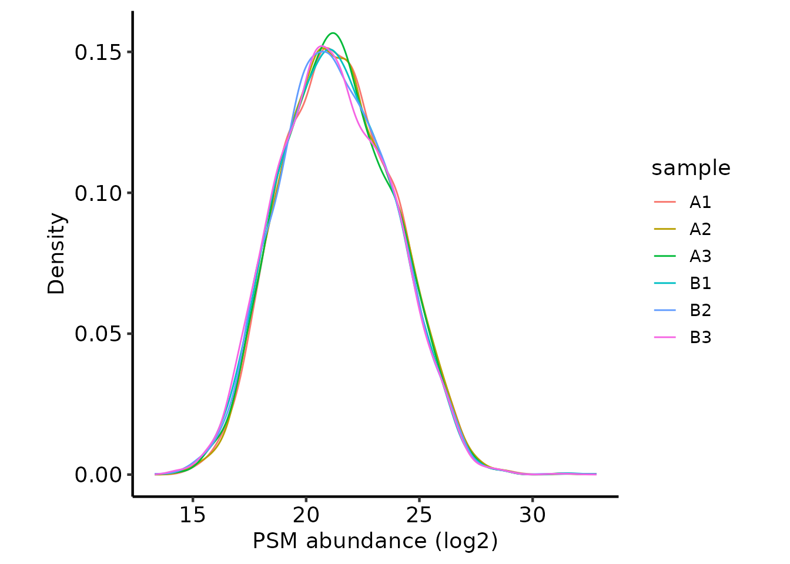
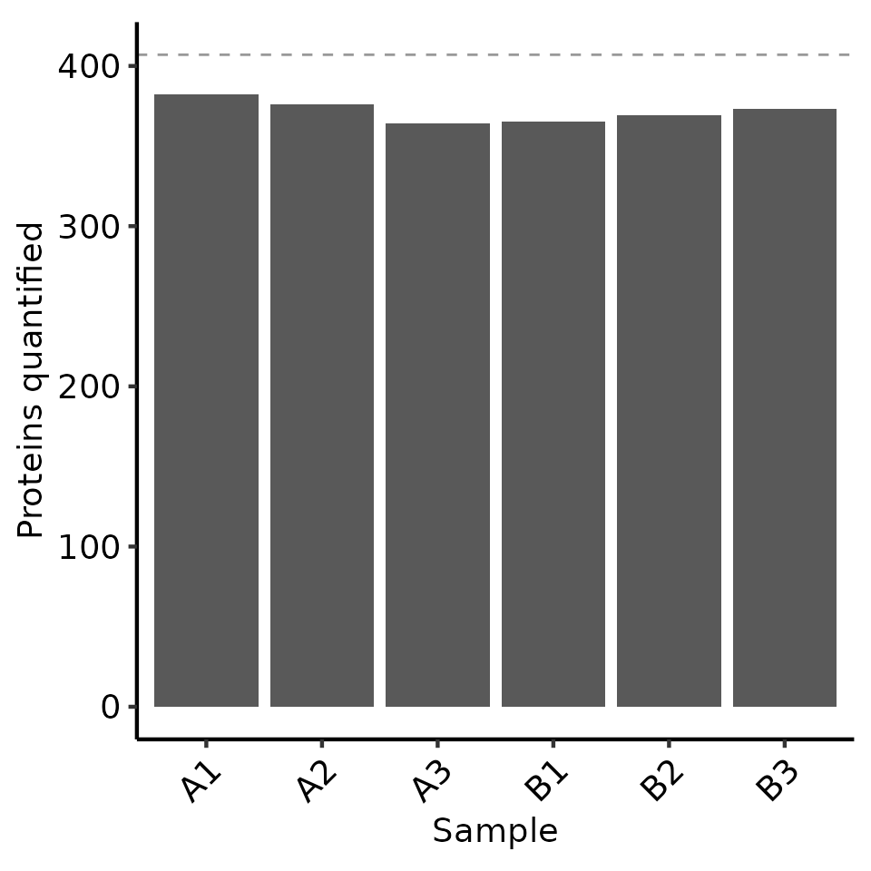

# LFQ-DIA QC Peptide-level quantification and summarisation to protein-level abundance

THIS VIGNETTE IS A WORK IN PROGRESS!

Label-Free Quantification (LFQ) is the simplest form of quantitative
proteomics, in which different samples are quantified in separate MS
runs. Quantification is either performed by Data-Dependent Aquisition
(DDA), where the Mass Spectrometer triggers fragmentation of ions within
a given m/z range with the aim being to focus attention of individual
peptides separately, or Data-Independent Aquisition (DIA), where a much
wider m/z range is used and a mix of peptides are co-fragmented and
quantified simultaneously by deconvoluting the resultant complex
spectra. Here, we will focus on just LFQ-DIA.

MORE DETAILS ON DIA REQUIRED HERE!

## Load required packages

To clarify which functionality is provided by which package, we will use
`package::function`. For your own code, there is no need to specify the
package unless you want to maintain this clarity.

``` r
library(QFeatures)
library(biomasslmb)
library(ggplot2)
library(tidyr)
library(dplyr)
```

## Defining the contaminant proteins

We need to remove contaminant proteins. These were defined here using
the cRAP database. Below, we parse the contaminants fasta to extract the
IDs for the proteins in both ‘cRAP’ format and Uniprot IDs.

``` r

crap_fasta_inf <- system.file(
  "extdata", "cRAP_20190401.fasta.gz", 
  package = "biomasslmb"
)

# Extract the protein IDs associated with each cRAP protein
crap_accessions <- biomasslmb::get_crap_fasta_accessions(crap_fasta_inf)

print(head(crap_accessions))
#> [1] "cRAP001" "P00330"  "cRAP002" "P02768"  "cRAP003" "P00883"
```

## Read in input data

We start by reading in quantitative proteomics data into a `QFeatures`
object, which is the standard Bioconductor object for holding
quantitative proteomics data. See
[here](https://www.bioconductor.org/packages/release/bioc/html/QFeatures.html)
for documentation about the `QFeatures` object.

Here, we will use the `biomasslmb::readDIANNFilter` function, which also
allows us to control the FDR thresholds for the precursor and protein
(run-specific and global). This function reads in the `report.tsv` file
from DIA-NN. If you are happy with the filtering settings in DIA-NN, you
can directly read the `report.pr_matrix.tsv` into a `QFeatures` object
using the
[`QFeatures::readQFeatures`](https://rdrr.io/pkg/QFeatures/man/readQFeatures.html)
function.

`diann_report.tsv` is a file available from the `biomasslmb` package
containing the output from DIA-NN for an experiment with 6 samples. It
is a truncated file containing the precursors (peptides) for just 500
proteins.

``` r
diann_report_inf <- system.file(
  "extdata", "diann_report.tsv", 
  package = "biomasslmb"
)

dia_qf <- readDIANNFilterQJoin(diann_report_inf,
                               global_protein_q=0.01,
                               run_protein_q=0.01,
                               run_precursor_q=0.01)
#> Checking arguments.
#> Loading data as a 'SummarizedExperiment' object.
#> Splitting data in runs.
#> Formatting sample annotations (colData).
#> Formatting data as a 'QFeatures' object.
#> 'Lib.PG.Q.Value' found in 6 out of 6 assay(s)
#> 'PG.Q.Value' found in 6 out of 6 assay(s)
#> 'Q.Value' found in 6 out of 6 assay(s)
#> Warning: 'experiments' dropped; see 'drops()'
#> harmonizing input:
#>   removing 6 sampleMap rows not in names(experiments)
```

We have 0 quantification values which are exactly zero here. Where these
do exist, they should be replaced with NA, since mass spectrometry is
not capable of asserting that the protein had zero abundance in the
sample.

``` r
tmt_qf[['peptides_fdr_cntrl']] <- QFeatures::zeroIsNA(dia_qf[['peptides_fdr_cntrl']])
```

Our column names include redundant information (‘HYE_DIA’)

``` r
colnames(dia_qf)[["peptides_fdr_cntrl"]]
#> [1] "HYE_DIA_A1" "HYE_DIA_A2" "HYE_DIA_A3" "HYE_DIA_B1" "HYE_DIA_B2"
#> [6] "HYE_DIA_B3"
```

Below, we update the column names to remove the redundant information
and then update the sample names in the QFeatures

``` r
colnames(dia_qf)[["peptides_fdr_cntrl"]] <- gsub('HYE_DIA_', '', colnames(dia_qf)[["peptides_fdr_cntrl"]])
dia_qf <- renamePrimary(dia_qf, colnames(dia_qf)[["peptides_fdr_cntrl"]])
```

We need to populate the `colData`, which is currently empty

``` r
data.frame(colData(dia_qf))
#> data frame with 0 columns and 6 rows
```

Here, we can create our `colData` from the sample names. In other cases,
you may need to read in a separate experimental design file.

``` r

colData(dia_qf) <- data.frame(quantCols=rownames(colData(dia_qf))) %>%
  separate(quantCols, sep='', into=c(NA, 'condition', 'replicate'), remove = FALSE) %>%
  tibble::column_to_rownames('quantCols')

data.frame(colData(dia_qf))
#>    condition replicate
#> A1         A         1
#> A2         A         2
#> A3         A         3
#> B1         B         1
#> B2         B         2
#> B3         B         3
```

Adding the `colData` to the peptide-level data too.

``` r
colData(dia_qf[['peptides_fdr_cntrl']]) <- colData(dia_qf)
```

We first perform routine filtering to remove PSMs that:

- Could originate from contaminants. See
  [`?filter_features_pd_dda`](https://lmb-mass-spec-compbio.github.io/biomasslmb/reference/filter_features_pd_dda.md)
  for further details, including the removal of ‘associated cRAP’.
- Don’t have a unique master protein.

``` r
dia_qf[['peptides_filtered']] <- biomasslmb::filter_features_diann(dia_qf[['peptides_fdr_cntrl']], contaminant_proteins=crap_accessions)
#> Filtering data...
#> 5009 features found from 454 master proteins => Input
#> 242 contaminant proteins supplied
#> 11 proteins identified as 'contaminant associated'
#> 4998 features found from 453 master proteins => contaminant features removed
#> 4998 features found from 453 master proteins => associated contaminant features removed
#> 4998 features found from 453 master proteins => features without a master protein removed
#> 4955 features found from 448 master proteins => features with non-unique master proteins removed
#> 4955 features found from 448 master proteins => features without quantification removed
```

## Check normalisation

Next, we plot the peptide intensity distribution to check they are
approximately the same using
[`biomasslmb::plot_quant`](https://lmb-mass-spec-compbio.github.io/biomasslmb/reference/plot_quant.md).
By default, DIA-NN performs normalisation. See the
[documentation](https://github.com/vdemichev/DiaNN?tab=readme-ov-file#readme)
for details of the underlying assumptions for the normalisation and use
cases where this normalisation approach may not be appropriate, e.g
interactome proteomics.

``` r

# Plot the peptide-level quantification distributions per sample
biomasslmb::plot_quant(dia_qf[['peptides_filtered']],
                       log2transform=TRUE,
                       method='density') +
  theme_biomasslmb() +
  xlab('PSM abundance (log2)')
```



### Missing values

Below, we inspect the number of missing values per sample

``` r


nNA(dia_qf[['peptides_filtered']])$nNAcols %>%
  data.frame() %>% knitr::kable(digits=2)
```

| name |  nNA |  pNA |
|:-----|-----:|-----:|
| A1   |  641 | 0.13 |
| A2   |  736 | 0.15 |
| A3   | 1029 | 0.21 |
| B1   |  674 | 0.14 |
| B2   |  597 | 0.12 |
| B3   |  613 | 0.12 |

Here, the samples have between 12 - 21 % missing values. This is fairly
typical of DIA data at the precursor level.

Next, we inspect the most common patterns for the missing values.

``` r
plot_missing_upset(dia_qf, i='peptides_filtered')
#> Warning: `aes_string()` was deprecated in ggplot2 3.0.0.
#> ℹ Please use tidy evaluation idioms with `aes()`.
#> ℹ See also `vignette("ggplot2-in-packages")` for more information.
#> ℹ The deprecated feature was likely used in the UpSetR package.
#>   Please report the issue to the authors.
#> This warning is displayed once per session.
#> Call `lifecycle::last_lifecycle_warnings()` to see where this warning was
#> generated.
#> Warning: Using `size` aesthetic for lines was deprecated in ggplot2 3.4.0.
#> ℹ Please use `linewidth` instead.
#> ℹ The deprecated feature was likely used in the UpSetR package.
#>   Please report the issue to the authors.
#> This warning is displayed once per session.
#> Call `lifecycle::last_lifecycle_warnings()` to see where this warning was
#> generated.
#> Warning: The `size` argument of `element_line()` is deprecated as of ggplot2 3.4.0.
#> ℹ Please use the `linewidth` argument instead.
#> ℹ The deprecated feature was likely used in the UpSetR package.
#>   Please report the issue to the authors.
#> This warning is displayed once per session.
#> Call `lifecycle::last_lifecycle_warnings()` to see where this warning was
#> generated.
```

 The
missingness is frequently observed for all 3 replicates of a single
condition, but also commonly just for a single sample.

### Summarising to protein-level abundances

Now that we have inspected the peptide-level quantification and filtered
the peptides, we can summarise the peptide-level quantification to
protein-level abundances.

Since DIA typically has too many missing values to exclude peptides with
missing values, the
[`MsCoreUtils::robustSummary`](https://rdrr.io/pkg/MsCoreUtils/man/robustSummary.html)
method should preferred for summarisation to protein-level abundance.
With `robustSummary`, we do not need to remove all PSMs with missing
values since the summarisation algorithm deals with them appropriately
(Sticker et al. 2020).. However, we still don’t want to retain PSMs with
too many missing values, since these will not be very informative in
estimating the protein-level quantification. Here, we will retain PSMs
with at most 4/6 missing values

``` r
dia_qf[['peptides_filtered_missing']] <- QFeatures::filterNA(
  dia_qf[['peptides_filtered']], 4/6)

biomasslmb:::message_parse(rowData(dia_qf[['peptides_filtered_missing']]),
                           'Protein.Group',
                           "Removing peptides with > 4/6 missing values")
#> 4863 features found from 441 master proteins => Removing peptides with > 4/6 missing values
```

Next, we will remove PSMs for proteins with fewer than 2 PSMs. This is a
common filter in proteomics to ensure the protein-level quantifications
are derived from at least two independent observations. In some cases,
for example phosphoproteomics, or where this filter appears to be too
stringent, it may be appropriate to skip it.

``` r

min_psms <- 2
 
dia_qf[['peptides_filtered_forRobust']] <- biomasslmb::filter_features_per_protein(
  dia_qf[['peptides_filtered_missing']], min_features = min_psms, master_protein_col='Protein.Group')

biomasslmb:::message_parse(rowData(dia_qf[['peptides_filtered_forRobust']]),
                           'Protein.Group',
                           "Removing peptides for proteins with < 2 peptides")
#> 4829 features found from 407 master proteins => Removing peptides for proteins with < 2 peptides
```

Now we can summarise with `robustSummary`

``` r

# Aggregate to protein-level abundances (using QFeatures function)
dia_qf <- QFeatures::aggregateFeatures(dia_qf, 
                                       i = "peptides_filtered_forRobust", 
                                       fcol = "Protein.Group",
                                       name = "protein",
                                       fun = MsCoreUtils::robustSummary,
                                       maxit=10000) # ensure sufficient iterations for convergance
#> Your quantitative data contain missing values. Please read the relevant
#> section(s) in the aggregateFeatures manual page regarding the effects
#> of missing values on data aggregation.

biomasslmb:::message_parse(rowData(dia_qf[['protein']]),
                           'Protein.Group',
                           "Summarised to proteins")
#> 407 features found from 407 master proteins => Summarised to proteins
```

Prior to summaristaion, we removed PSMs from proteins with fewer than 2
PSMs. However, since we left in PSMs with missing values, it’s possible
for some protein-level abundances to be derived from just a single PSM.
We can use the `get_protein_no_quant_mask` from `biomasslmb` to identify
where the protein abundances will be derived from fewer than `n`
features (PSMs). We can then give this mask to
`mask_protein_level_quant` to replace these quantification values with
NA.

``` r
# plot = TRUE means we will also get a plot of the number of proteins quantified in each sample
protein_retain_mask <- biomasslmb::get_protein_no_quant_mask(
  dia_qf[['peptides_filtered_forRobust']], min_features=2, plot=TRUE, master_protein_col='Protein.Group') 
```



``` r

dia_qf[['protein']] <- biomasslmb::mask_protein_level_quant(
  dia_qf[['protein']], protein_retain_mask)
```

### Re-inspecting missing values at protein-level

Now that we have protein-level abundances, we would like to re-inspect
the missing values. Overall, we have 8.722 % missing values, with at
most 10.565 % missing values in any given sample. The most common
missingness pattern is for the protein to be missing from all 3 samples
for a single condition.

``` r

nNA(dia_qf[['protein']])$nNAcols %>%
  data.frame() %>% knitr::kable(digits=2)
```

| name | nNA |  pNA |
|:-----|----:|-----:|
| A1   |  25 | 0.06 |
| A2   |  31 | 0.08 |
| A3   |  43 | 0.11 |
| B1   |  42 | 0.10 |
| B2   |  38 | 0.09 |
| B3   |  34 | 0.08 |

``` r

plot_missing_upset(dia_qf, i='protein')
```


### Inspecting the number of peptides and proteins through the processing steps

Now that we have performed all the filtering steps and summarisation to
protein-level abundances, it’s helpful to visualise how many
peptides/proteins were retained at each level of the processing. We can
use the
[`biomasslmb::get_samples_present`](https://lmb-mass-spec-compbio.github.io/biomasslmb/reference/get_samples_present.md)
and
[`biomasslmb::plot_samples_present`](https://lmb-mass-spec-compbio.github.io/biomasslmb/reference/plot_samples_present.md)
functions for this. First though, we need to decide which ‘experiments’
we want to plot and define a named character vector since the QFeatures
names are not sufficiently clear by themselves

Below, we inspect the experiment names.

``` r
names(dia_qf)
#> [1] "peptides_fdr_cntrl"          "peptides_filtered"          
#> [3] "peptides_filtered_missing"   "peptides_filtered_forRobust"
#> [5] "protein"
```

In this case, we want to plot all the experiments.

#### Samples per PSM

We’ll start by inspecting the number of PSMs in each experiment. We
therefore define a named character vector all the PSM-level experiments,
exlcuding `psms_filtered_norm`. We set the row variables to be
`Precursor.Id` so that we count the number of unique peptides
(precursors).

``` r


rename_cols <- c('Peptides passing FDR thresholds' = 'peptides_fdr_cntrl' ,
                 'Quantified, contaminants removed' = 'peptides_filtered',
                 '<= 4/6 missing values' = 'peptides_filtered_missing',
                 '>1 peptides per protein' = 'peptides_filtered_forRobust')

rowvars <- c('Precursor.Id')

samples_present <- get_samples_present(dia_qf[,,unname(rename_cols)], rowvars, rename_cols)
#> harmonizing input:
#>   removing 6 sampleMap rows not in names(experiments)
plot_samples_present(samples_present, rowvars, breaks=seq(2,10,2)) + ylab('PSM')
#> Scale for fill is already present.
#> Adding another scale for fill, which will replace the existing scale.
```


Samples quantified for each PSM at each level of processing

#### Samples per Protein

Next, we’ll use the same functions to inspect the number of proteins at
each level of processing. We need to supply an updated named character
vector to include the `protein` experiment and set the row variables to
be just the `Master.Protein.Accesions` column.

``` r

rename_cols_prot <- c(rename_cols, 'Protein'='protein')

rowvars_prot <- c('Protein.Group')

samples_present <- get_samples_present(dia_qf, rowvars_prot, rename_cols_prot)
plot_samples_present(samples_present, rowvars_prot, breaks=seq(2,10,2))
#> Scale for fill is already present.
#> Adding another scale for fill, which will replace the existing scale.
```


Samples quantified for each protein at each level of processing

From these two plots, we can see that the filtering to ensure that all
proteins have \>1 peptides removed only a few peptides, but more
proteins. Whether this is appropriate will depend on your data in hand.

``` r
sessionInfo()
#> R version 4.4.3 (2025-02-28)
#> Platform: x86_64-pc-linux-gnu
#> Running under: Ubuntu 24.04.3 LTS
#> 
#> Matrix products: default
#> BLAS:   /usr/lib/x86_64-linux-gnu/openblas-pthread/libblas.so.3 
#> LAPACK: /usr/lib/x86_64-linux-gnu/openblas-pthread/libopenblasp-r0.3.26.so;  LAPACK version 3.12.0
#> 
#> locale:
#>  [1] LC_CTYPE=C.UTF-8       LC_NUMERIC=C           LC_TIME=C.UTF-8       
#>  [4] LC_COLLATE=C.UTF-8     LC_MONETARY=C.UTF-8    LC_MESSAGES=C.UTF-8   
#>  [7] LC_PAPER=C.UTF-8       LC_NAME=C              LC_ADDRESS=C          
#> [10] LC_TELEPHONE=C         LC_MEASUREMENT=C.UTF-8 LC_IDENTIFICATION=C   
#> 
#> time zone: UTC
#> tzcode source: system (glibc)
#> 
#> attached base packages:
#> [1] stats4    stats     graphics  grDevices utils     datasets  methods  
#> [8] base     
#> 
#> other attached packages:
#>  [1] dplyr_1.1.4                 tidyr_1.3.2                
#>  [3] ggplot2_4.0.1               biomasslmb_0.0.4           
#>  [5] QFeatures_1.16.0            MultiAssayExperiment_1.32.0
#>  [7] SummarizedExperiment_1.36.0 Biobase_2.66.0             
#>  [9] GenomicRanges_1.58.0        GenomeInfoDb_1.42.3        
#> [11] IRanges_2.40.1              S4Vectors_0.44.0           
#> [13] BiocGenerics_0.52.0         MatrixGenerics_1.18.1      
#> [15] matrixStats_1.5.0          
#> 
#> loaded via a namespace (and not attached):
#>  [1] DBI_1.2.3               gridExtra_2.3           rlang_1.1.7            
#>  [4] magrittr_2.0.4          clue_0.3-66             otel_0.2.0             
#>  [7] compiler_4.4.3          RSQLite_2.4.5           png_0.1-8              
#> [10] systemfonts_1.3.1       vctrs_0.6.5             reshape2_1.4.5         
#> [13] stringr_1.6.0           ProtGenerics_1.38.0     pkgconfig_2.0.3        
#> [16] crayon_1.5.3            fastmap_1.2.0           backports_1.5.0        
#> [19] XVector_0.46.0          labeling_0.4.3          rmarkdown_2.30         
#> [22] UCSC.utils_1.2.0        UpSetR_1.4.0            visdat_0.6.0           
#> [25] ragg_1.5.0              purrr_1.2.1             bit_4.6.0              
#> [28] xfun_0.55               zlibbioc_1.52.0         cachem_1.1.0           
#> [31] jsonlite_2.0.0          blob_1.2.4              DelayedArray_0.32.0    
#> [34] cluster_2.1.8           R6_2.6.1                bslib_0.9.0            
#> [37] stringi_1.8.7           RColorBrewer_1.1-3      genefilter_1.88.0      
#> [40] jquerylib_0.1.4         Rcpp_1.1.1              knitr_1.51             
#> [43] usethis_3.2.1           BiocBaseUtils_1.8.0     Matrix_1.7-2           
#> [46] splines_4.4.3           igraph_2.2.1            tidyselect_1.2.1       
#> [49] abind_1.4-8             yaml_2.3.12             lattice_0.22-6         
#> [52] tibble_3.3.1            plyr_1.8.9              withr_3.0.2            
#> [55] KEGGREST_1.46.0         S7_0.2.1                evaluate_1.0.5         
#> [58] uniprotREST_1.0.0       desc_1.4.3              survival_3.8-3         
#> [61] Biostrings_2.74.1       pillar_1.11.1           corrplot_0.95          
#> [64] checkmate_2.3.3         generics_0.1.4          rprojroot_2.1.1        
#> [67] scales_1.4.0            xtable_1.8-4            glue_1.8.0             
#> [70] lazyeval_0.2.2          tools_4.4.3             robustbase_0.99-6      
#> [73] annotate_1.84.0         fs_1.6.6                XML_3.99-0.20          
#> [76] grid_4.4.3              MsCoreUtils_1.18.0      AnnotationDbi_1.68.0   
#> [79] GenomeInfoDbData_1.2.13 naniar_1.1.0            cli_3.6.5              
#> [82] textshaping_1.0.4       S4Arrays_1.6.0          AnnotationFilter_1.30.0
#> [85] gtable_0.3.6            DEoptimR_1.1-4          sass_0.4.10            
#> [88] digest_0.6.39           SparseArray_1.6.2       htmlwidgets_1.6.4      
#> [91] farver_2.1.2            memoise_2.0.1           htmltools_0.5.9        
#> [94] pkgdown_2.2.0           lifecycle_1.0.5         httr_1.4.7             
#> [97] bit64_4.6.0-1           MASS_7.3-64
```

Sticker, Adriaan, Ludger Goeminne, Lennart Martens, and Lieven Clement.
2020. “Robust Summarization and Inference in Proteome-wide Label-free
Quantification.” *Molecular & cellular proteomics: MCP* 19 (7): 1209–19.
<https://doi.org/10.1074/mcp.RA119.001624>.
