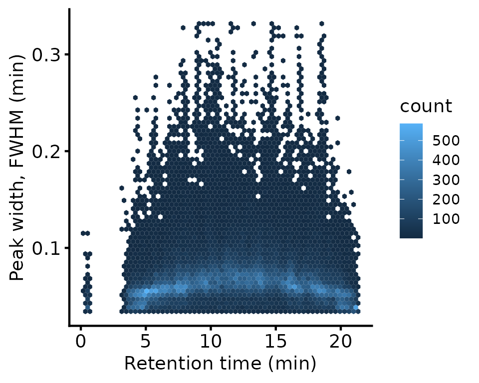
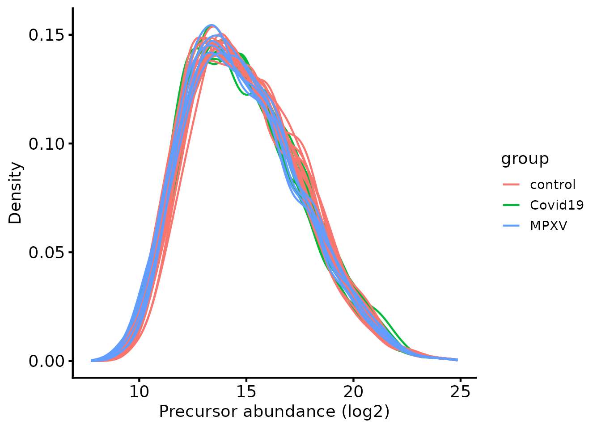
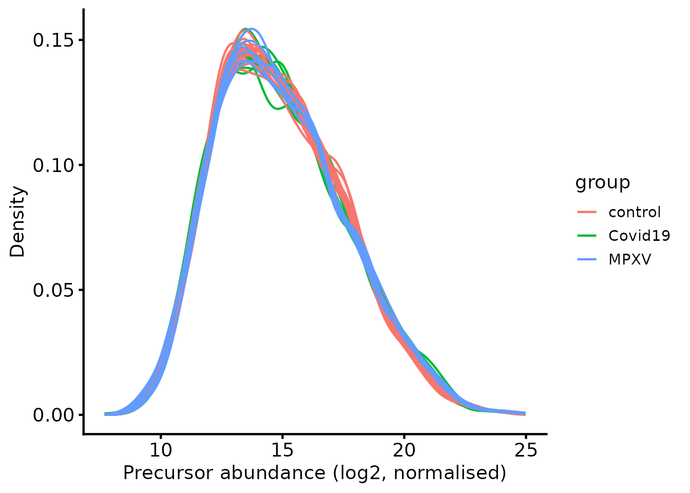
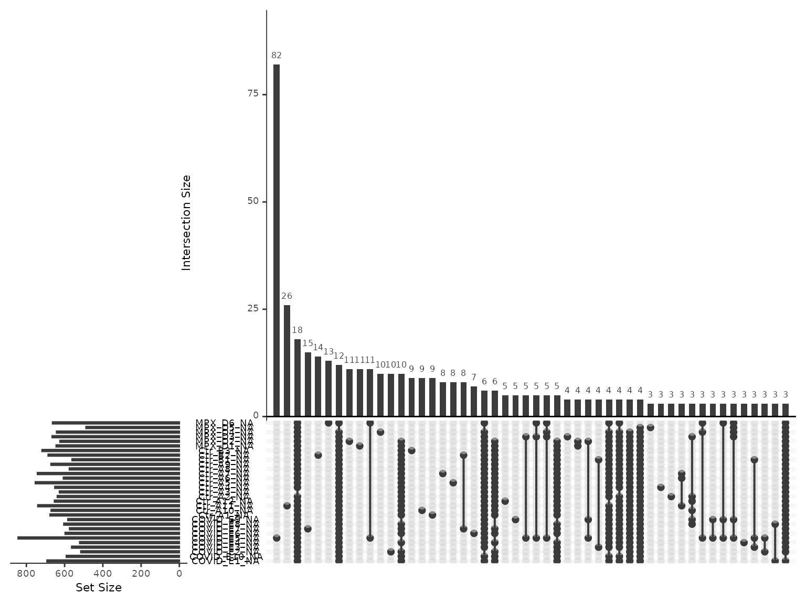
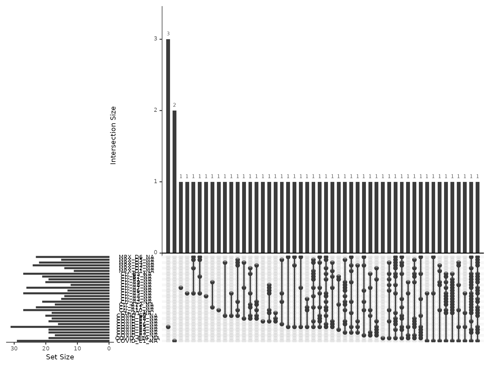

# LFQ-DIA workflow: precursor QC and protein summarisation

Label-Free Quantification (LFQ) is the simplest form of quantitative
proteomics, in which different samples are quantified in separate MS
runs. Quantification is either performed by Data-Dependent Acquisition
(DDA), where the Mass Spectrometer triggers fragmentation of ions within
a given m/z range with the aim being to focus attention of individual
peptides separately, or Data-Independent Acquisition (DIA), where a much
wider m/z range is used and a mix of peptides are co-fragmented and
quantified simultaneously by deconvoluting the resultant complex
spectra. This article covers LFQ-DIA; DDA is a different enough problem
to have its own, in [LFQ-DDA peptide
QC](https://lmb-mass-spec-compbio.github.io/biomasslmb/articles/LFQ_DDA_Peptide_QC_Summarisation.md).

DIA data is commonly searched with
[DIA-NN](https://github.com/vdemichev/DiaNN), which reports results at
multiple levels. This article starts from the precursor level — a
specific peptide sequence, with modifications, at a specific charge
state — because it is the level at which the QC decisions below can
still be made. Since DIA co-fragments many precursors at once, DIA-NN
infers identifications either from a project-specific spectral library
or from a library predicted in-silico from the sequence database, then
rescores them, optionally using match-between-runs (MBR) to borrow
confidence across runs. None of that removes the need to filter to
confident identifications, remove contaminants, handle missing values
and summarise to protein-level abundance before any statistical
analysis.

This vignette works through one typical experiment from end to end: a
whole-proteome comparison between groups, with no enrichment step and a
single acquisition batch. That is the common case, and the choices made
below are the conventional ones for it. An enrichment experiment — an
IP, BioID or TurboID pulldown — needs different reasoning about
normalisation and about missing values, and is covered in [enrichment
designs](https://lmb-mass-spec-compbio.github.io/biomasslmb/articles/interactome_designs.md).

If this is your first analysis with the package, [getting
started](https://lmb-mass-spec-compbio.github.io/biomasslmb/articles/biomasslmb.md)
explains which route applies to your experiment and shows a complete one
in forty lines, and [working with QFeatures
objects](https://lmb-mass-spec-compbio.github.io/biomasslmb/articles/qfeatures_objects.md)
covers the object every step below operates on. Annotations are worth
retrieving before any of this — see [protein
annotation](https://lmb-mass-spec-compbio.github.io/biomasslmb/articles/protein_annotation.md).

The data used in this vignette is a real DIA-NN `report.parquet` output
for a plasma proteomics case series comparing Mpox (MPXV) infection,
COVID-19, and healthy controls (Wang et al. 2022). It is also used, with
accompanying teaching material, in the [Proteomics Data Analysis Using
R](https://github.com/bioinformatics-core-shared-training/Proteomics_stats_R)
course. Unlike the truncated demonstration files used elsewhere in
`biomasslmb`, this dataset is used here in full - it is small enough not
to need subsetting

Spectronaut is the other search engine in common use for DIA data. Only
the reading step differs: [reading Spectronaut
output](#reading-spectronaut-output) at the end of this vignette shows
how to reach the same `precursors` assay, after which every step below
applies unchanged.

## Load required packages

``` r

library(QFeatures)
library(biomasslmb)
library(ggplot2)
library(tidyr)
library(dplyr)
library(arrow)
library(readxl)
```

## Defining the contaminant proteins

Contaminant proteins have to be removed. This search was performed
against a version of the Hao lab’s ‘0602 Universal Contaminants’
database (Frankenfield et al. 2022) with the Fetal Bovine Serum-derived
entries removed, since they are not relevant to a human plasma sample.
The standard database bundled with `biomasslmb` is used below instead —
the FBS-specific entries it additionally contains are never observed in
this dataset, so filtering behaves identically either way.

``` r

contaminant_fasta_inf <- system.file(
  "extdata", "0602_Universal_Contaminants.fasta.gz",
  package = "biomasslmb"
)

# Extract the protein IDs associated with each contaminant protein
contaminant_accessions <- biomasslmb::get_contaminant_fasta_accessions(contaminant_fasta_inf)

print(head(contaminant_accessions))
#> [1] "Cont_P00722" "Cont_P09870" "Cont_P30879" "Cont_P0C1U8" "Cont_Q2FZL2"
#> [6] "Cont_P00698"
```

DIA-NN was run with this contaminants database included directly in the
search FASTA, so contaminant entries are named with a `Cont_` prefix
that is carried straight through into the `Protein.Ids` and
`Protein.Group` columns of the DIA-NN output. `filter_features_diann`
uses this prefix automatically, in addition to the
`contaminant_accessions` extracted above.

The prefix and the accession list are separate defences, and a search
database whose contaminant entries were never renamed provides neither.
[Contaminants and protein
FDR](https://lmb-mass-spec-compbio.github.io/biomasslmb/articles/gotcha_contaminants_and_FDR.md)
measures what each one catches and what is left behind when they do not
match.

## Read in input data

The data go into a `QFeatures` object, the standard Bioconductor
container for quantitative proteomics data. See
[here](https://www.bioconductor.org/packages/release/bioc/html/QFeatures.html)
for documentation about the `QFeatures` object.

Unlike PD’s peptide-level export, DIA-NN’s `report.parquet` is a
**long-format** table: each row is a single precursor-sample
combination, rather than one row per precursor across all samples.
[`arrow::read_parquet`](https://arrow.apache.org/docs/r/reference/read_parquet.html)
reads it.

``` r

diann_report_inf <- system.file(
  "extdata", "monkeypox_plasma_proteomes.parquet",
  package = "biomasslmb"
)

diann_df <- arrow::read_parquet(diann_report_inf)

dim(diann_df)
#> [1] 120505     71
```

Sample metadata (which group, sex and age band each run belongs to) is
provided separately, in `monkeypox_metadata.xlsx`.

``` r

metadata_inf <- system.file(
  "extdata", "monkeypox_metadata.xlsx",
  package = "biomasslmb"
)

sample_metadata <- readxl::read_excel(metadata_inf)

print(sample_metadata)
#> # A tibble: 31 × 5
#>    sample_id                                   runCol  group   sex   age.group
#>    <chr>                                       <chr>   <chr>   <chr> <chr>    
#>  1 20220624_Z1_ZW_001_30-0066_Ctr-A1_heat_DIA  Ctr_A1  control m     21-30    
#>  2 20220624_Z1_ZW_001_30-0066_Ctr-A10_heat_DIA Ctr_A10 control m     31-40    
#>  3 20220624_Z1_ZW_001_30-0066_Ctr-A11_heat_DIA Ctr_A11 control m     31-40    
#>  4 20220624_Z1_ZW_001_30-0066_Ctr-A12_heat_DIA Ctr_A12 control m     41-50    
#>  5 20220624_Z1_ZW_001_30-0066_Ctr-A2_heat_DIA  Ctr_A2  control m     21-30    
#>  6 20220624_Z1_ZW_001_30-0066_Ctr-A3_heat_DIA  Ctr_A3  control m     21-30    
#>  7 20220624_Z1_ZW_001_30-0066_Ctr-A4_heat_DIA  Ctr_A4  control m     21-30    
#>  8 20220624_Z1_ZW_001_30-0066_Ctr-A5_heat_DIA  Ctr_A5  control m     21-30    
#>  9 20220624_Z1_ZW_001_30-0066_Ctr-A6_heat_DIA  Ctr_A6  control m     21-30    
#> 10 20220624_Z1_ZW_001_30-0066_Ctr-A7_heat_DIA  Ctr_A7  control m     21-30    
#> # ℹ 21 more rows
```

The `Run` column in the DIA-NN output inherits the full raw file path,
pasting together the `.wiff2` folder and `.wiff.scan` file names.
Stripping that back to match the `sample_id` field in the metadata
allows the concise `runCol` label to be merged in, which serves as the
sample identifier from here on.

``` r

diann_df[, "Run"] %>% unique() %>% head(2)
#> # A tibble: 2 × 1
#>   Run                                                                           
#>   <chr>                                                                         
#> 1 20220624_Z1_ZW_001_30-0066_COVID-E9_heat_DIA.wiff2-20220624_Z1_ZW_001_30-0066…
#> 2 20220624_Z1_ZW_001_30-0066_MPX-D2_heat_DIA.wiff2-20220624_Z1_ZW_001_30-0066_M…

diann_df <- diann_df %>%
  mutate(Run = sub('\\..*', '', Run)) %>%
  merge(sample_metadata[, c("sample_id", "runCol")], by.x = "Run", by.y = "sample_id")

diann_df[, "Run"] %>% unique() %>% head(2)
#> [1] "20220624_Z1_ZW_001_30-0066_COVID-E1_heat_DIA" 
#> [2] "20220624_Z1_ZW_001_30-0066_COVID-E10_heat_DIA"
```

`readQFeaturesFromDIANN` reads the long-format table in, creating one
`SummarizedExperiment` per run. The split matters: the per-run quality
metrics in `rowData` (`Q.Value`, `FWHM` and the rest) are run-specific,
and combining the runs immediately would discard them before they can be
filtered on. They are used below, and the runs joined afterwards.

``` r

dia_qf <- readQFeaturesFromDIANN(
  diann_df,
  quantCols = "Precursor.Quantity",
  fnames = "Precursor.Id",
  runCol = "runCol",
  colData = sample_metadata
)
#> Checking arguments.
#> Loading data as a 'SummarizedExperiment' object.
#> Splitting data in runs.
#> Formatting sample annotations (colData).
#> Formatting data as a 'QFeatures' object.
#> Setting assay rownames.

dia_qf
#> An instance of class QFeatures (type: bulk) with 31 sets:
#> 
#>  [1] COVID_E1: SummarizedExperiment with 3834 rows and 1 columns 
#>  [2] COVID_E10: SummarizedExperiment with 3914 rows and 1 columns 
#>  [3] COVID_E2: SummarizedExperiment with 4016 rows and 1 columns 
#>  ...
#>  [29] MPX_D4: SummarizedExperiment with 3950 rows and 1 columns 
#>  [30] MPX_D5: SummarizedExperiment with 4043 rows and 1 columns 
#>  [31] MPX_D6: SummarizedExperiment with 3861 rows and 1 columns
```

The retention time (RT) distribution and its relationship with
chromatographic peak width (FWHM, the Full-Width at Half Maximum) are
worth assessing before anything is filtered, because a chromatography
problem is cheaper to find now than after summarisation. Narrow,
symmetrical peaks are what a good separation looks like, and FWHM rising
systematically with RT would indicate the later part of the gradient is
resolving poorly.

``` r

rbindRowData(dia_qf, i = names(dia_qf)) %>%
  data.frame() %>%
  ggplot(aes(RT, FWHM)) +
  geom_hex(bins = 60) +
  theme_biomasslmb(aspect_square = FALSE) +
  labs(x = 'Retention time (min)', y = 'Peak width, FWHM (min)')
```



## Filter precursors

DIA-NN assigns a Q-value to each precursor and protein group
identification, representing the local false discovery rate (FDR) at
that score threshold. This data was processed with match-between-runs
enabled, which is why both the run-level and library-level Q-values are
filtered (`Q.Value`/`PG.Q.Value` and `Lib.Q.Value`/`Lib.PG.Q.Value`
respectively), at a standard 1% FDR threshold. Filtering only the
run-level pair would accept identifications that MBR transferred on weak
library-level evidence. Passing no `i` argument to `filterFeatures`
applies the filter to every per-run set at once.

``` r

dia_qf <- dia_qf %>%
  filterFeatures(~ Q.Value <= 0.01) %>%
  filterFeatures(~ PG.Q.Value <= 0.01) %>%
  filterFeatures(~ Lib.Q.Value <= 0.01) %>%
  filterFeatures(~ Lib.PG.Q.Value <= 0.01)
#> 'Q.Value' found in 31 out of 31 assay(s).
#> 'PG.Q.Value' found in 31 out of 31 assay(s).
#> 'Lib.Q.Value' found in 31 out of 31 assay(s).
#> 'Lib.PG.Q.Value' found in 31 out of 31 assay(s).
```

The per-run sets are then combined into a single `"precursors"` set with
`joinAssays`, aligning features by `Precursor.Id`. A precursor not
detected in a given run becomes `NA` for that sample. Only `rowData`
columns that are shared across runs and have consistent values survive
the join; the run-specific quality metrics already filtered on
(`Q.Value`, `RT`) are dropped, having served their purpose.

``` r

dia_qf <- joinAssays(
  x = dia_qf,
  i = names(dia_qf),
  name = "precursors",
  fcol = "Precursor.Id"
)
#> Using 'Precursor.Id' to join assays.

# The per-run sets are no longer needed now they're joined; removing them
# keeps the QFeatures object focused on the combined set for the rest of
# this vignette.
dia_qf <- removeAssay(dia_qf, i = which(names(dia_qf) != "precursors"))
#> Warning: 'experiments' dropped; see 'drops()'
#> harmonizing input:
#>   removing 31 sampleMap rows not in names(experiments)

dia_qf <- sync_coldata(dia_qf, 'precursors')
```

Routine filtering removes precursors that:

- Could originate from contaminants. See
  [`?filter_features_diann`](https://lmb-mass-spec-compbio.github.io/biomasslmb/reference/filter_features_diann.md)
  for further details, including the removal of contaminant-associated
  proteins.
- Have more than one accession in `Protein.Group`, meaning DIA-NN could
  not resolve which protein the precursor came from.
- Don’t have any quantification values

[`filter_features_diann()`](https://lmb-mass-spec-compbio.github.io/biomasslmb/reference/filter_features_diann.md)
applies all three by default, so the call below passes none of them.
`unique_master` asks whether the search engine settled on a single
protein identity. The separate `proteotypic` argument asks whether the
peptide sequence occurs in only one protein at all — a feature can have
one unambiguous master protein and still be shared with the other
members of that protein group. See [peptides are not
proteins](https://lmb-mass-spec-compbio.github.io/biomasslmb/articles/gotcha_peptide_to_protein.md).

``` r

dia_qf[['peptides_filtered']] <- biomasslmb::filter_features_diann(
  dia_qf[['precursors']],
  contaminant_proteins = contaminant_accessions
)
#> Filtering data...
#> 4692 features found from 367 master proteins => Input
#> 381 contaminant proteins supplied
#> 275 proteins identified as 'contaminant associated'
#> 4417 features found from 345 master proteins => contaminant features removed
#> 4417 features found from 345 master proteins => associated contaminant features removed
#> 4417 features found from 345 master proteins => features without a master protein removed
#> 4375 features found from 327 master proteins => features with non-unique master proteins removed
#> 4375 features found from 327 master proteins => features without quantification removed

dia_qf <- sync_coldata(dia_qf, 'peptides_filtered')
```

Summarisation needs the quantification values on a log scale, so they
are transformed here.

``` r

dia_qf[['peptides_filtered']] <- QFeatures::logTransform(
  dia_qf[['peptides_filtered']], base = 2)
```

The precursor intensity distributions, coloured by `group`:

``` r

biomasslmb::plot_quant(dia_qf[['peptides_filtered']], log2transform = FALSE, method = 'density') +
  theme_biomasslmb(aspect_square = FALSE) +
  aes(colour = group, group = sample) +
  xlab('Precursor abundance (log2)')
```



### Normalise

This is a whole-plasma-proteome comparison between clinical groups, in
which overall protein content is not expected to differ systematically
between groups, so any offset between the distributions above is
technical. `diff.median` normalisation with
[`QFeatures::normalize`](https://rdrr.io/pkg/BiocGenerics/man/normalize.html)
shifts each sample to a common median and removes it. The assumption is
worth stating, because an [enrichment
design](https://lmb-mass-spec-compbio.github.io/biomasslmb/articles/interactome_designs.md)
breaks it — there the conditions are expected to differ in composition,
and normalising to a common median erodes the signal being measured.

``` r

dia_qf <- QFeatures::normalize(
  dia_qf, i = 'peptides_filtered', name = 'peptides_filtered_norm', method = 'diff.median')

dia_qf <- sync_coldata(dia_qf, 'peptides_filtered_norm')
```

``` r

biomasslmb::plot_quant(dia_qf[['peptides_filtered_norm']], log2transform = FALSE, method = 'density') +
  theme_biomasslmb(aspect_square = FALSE) +
  aes(colour = group, group = sample) +
  xlab('Precursor abundance (log2, normalised)')
```



### Summarising to protein-level abundances

Summarisation takes the protein group assignment at face value: every
precursor contributes to exactly one protein group. That assignment is
an inference rather than a measurement, and for proteins whose peptides
are largely shared with their homologues it is not a reliable one.
[Peptides are not
proteins](https://lmb-mass-spec-compbio.github.io/biomasslmb/articles/gotcha_peptide_to_protein.md)
covers how the assignment is made and how to tell which of your proteins
it can support.

Before deciding how to handle missing values, it’s worth checking how
much missingness there is, and whether it’s structured by `group`.
`condition_miss_score` fits, for each peptide, a logistic regression of
missingness against `group`, and returns Tjur’s R² as a per-feature
score: values near 1 mean a peptide’s missingness pattern is well
explained by `group`. `condition_miss_index` aggregates these into a
single dataset-level value between 0 and 1.

``` r

miss_res <- condition_miss_score(dia_qf, i = 'peptides_filtered_norm', group_cols = 'group')
#> Analysing assay 'peptides_filtered_norm': 4375 features x 31 samples
#> Group variable: group (3 levels: control, Covid19, MPXV)
#> Results: 1772 informative features | mean condition miss score = 0.144 | condition-structured: 1.7% | condition-independent: 30.9%
condition_miss_index(miss_res$summary)$index
#> Condition missingness index: 0.0698 | Weighted mean score: 0.1724 | Coverage: 40.5% (1772 / 4375 features informative) [coverage penalty applied]
#> [1] 0.06983525
```

**Missingness is substantial but unstructured by group.** 1772 of 4375
precursors have at least one missing value, which is typical of DIA-NN
precursor-level output, and yet the condition missingness index is close
to zero. That combination is what distinguishes this from a pulldown,
where missingness is explained by condition by construction and
discarding it would discard the finding. `plot_missing_upset` shows the
most common patterns.

``` r

plot_missing_upset(dia_qf, i = 'peptides_filtered_norm')
```



At this level of missingness, requiring complete precursors would
discard most of the data, which rules out summing and makes
[`MsCoreUtils::robustSummary`](https://rdrr.io/pkg/MsCoreUtils/man/robustSummary.html)
the appropriate estimator: it summarises accurately without complete
features (Sticker et al. 2020). Precursors missing from almost every
sample still contribute little beyond noise, so a threshold is applied
first — retaining those observed in at least 25% of the 31 samples
(`pNA` of at most 0.75), matching the threshold applied to this dataset
in the [Proteomics Data Analysis Using
R](https://github.com/bioinformatics-core-shared-training/Proteomics_stats_R)
course. Set it tighter and more of the plasma proteome falls below the
two-precursor rule imposed next; set it looser and protein estimates
rest on precursors seen a handful of times.

``` r

dia_qf[['peptides_filtered_missing']] <- QFeatures::filterNA(
  dia_qf[['peptides_filtered_norm']], pNA = 0.75)

message_parse(rowData(dia_qf[['peptides_filtered_missing']]),
                           'Protein.Group',
                           "Removing peptides with > 75% missing values")
#> 4105 features found from 271 master proteins => Removing peptides with > 75% missing values
```

Precursors belonging to proteins with fewer than 2 precursors are
removed next. This is routine practice and worth being explicit about,
because it is doing more than tidying.

A protein quantified from a single precursor has no internal
replication: there is no second measurement to disagree with the first,
so nothing about it can be checked. Any error in that one precursor — a
misassigned peptide, interference, a bad integration — passes straight
through to the protein-level value with nothing to average it out. Its
missingness pattern is also the missingness pattern of one precursor
rather than of the protein, which matters for everything downstream that
reasons about missing values.

The cost is real, and asymmetric: single-precursor proteins are
disproportionately the low-abundance ones, so this filter removes
preferentially from the part of the proteome that was hardest to
measure. `min_features` is the dial. Raising it buys confidence and
loses coverage; there is no threshold that is correct independent of
what the result will be used for.

``` r

min_peps <- 2
dia_qf[['peptides_for_summarisation']] <- filter_features_per_protein(
  dia_qf[['peptides_filtered_missing']], min_features = min_peps, master_protein_col = 'Protein.Group')

message_parse(rowData(dia_qf[['peptides_for_summarisation']]),
                           'Protein.Group',
                           "Removing 'one-hit' wonders")
#> 4073 features found from 239 master proteins => Removing 'one-hit' wonders
```

Summarising with `robustSummary`:

``` r

set.seed(42)

dia_qf <- aggregateFeatures(dia_qf,
                            i = "peptides_for_summarisation",
                            fcol = "Protein.Group",
                            name = "protein",
                            fun = MsCoreUtils::robustSummary,
                            maxit = 10000)
#> Your quantitative data contain missing values. Please read the relevant
#> section(s) in the aggregateFeatures manual page regarding the effects
#> of missing values on data aggregation.
#> Aggregated: 1/1

dia_qf <- sync_coldata(dia_qf, 'protein')
```

The two-precursor filter above was applied per protein, not per sample,
and precursors with missing values were deliberately kept — so in any
given sample a protein can still end up summarised from a single
precursor. Nothing in the output marks these values as weaker than the
rest.
[`get_protein_no_quant_mask()`](https://lmb-mass-spec-compbio.github.io/biomasslmb/reference/get_protein_no_quant_mask.md)
finds where a protein abundance rests on fewer than `n` precursors, and
[`mask_protein_level_quant()`](https://lmb-mass-spec-compbio.github.io/biomasslmb/reference/mask_protein_level_quant.md)
replaces those values with `NA`.

``` r

protein_retain_mask <- biomasslmb::get_protein_no_quant_mask(
  dia_qf[['peptides_for_summarisation']], min_features = min_peps,
  master_protein_col = 'Protein.Group')

dia_qf[['protein']] <- biomasslmb::mask_protein_level_quant(
  dia_qf[['protein']], protein_retain_mask)
```

### Re-inspecting missing values at protein-level

Masking changes the missingness picture, so it is worth re-reading at
protein level. 8.314% of protein values are missing overall, and at most
12.971% in any one sample — far less than at precursor level, because a
protein only loses a sample when every one of its precursors does.

``` r

plot_missing_upset(dia_qf, i = 'protein')
```



### Inspecting the number of peptides and proteins through the processing steps

Each filtering step above removed something, and the totals are easier
to judge together than one message at a time.
[`get_samples_present()`](https://lmb-mass-spec-compbio.github.io/biomasslmb/reference/get_samples_present.md)
and
[`plot_samples_present()`](https://lmb-mass-spec-compbio.github.io/biomasslmb/reference/plot_samples_present.md)
show how many precursors and proteins survived each stage, and in how
many samples. Both take a named character vector selecting the assays to
plot, since the `QFeatures` names are not self-explanatory.

The assay names to choose from:

``` r

names(dia_qf)
#> [1] "precursors"                 "peptides_filtered"         
#> [3] "peptides_filtered_norm"     "peptides_filtered_missing" 
#> [5] "peptides_for_summarisation" "protein"
```

#### Samples per peptide

Precursors first. The row variable is `Precursor.Id`, so that the count
is of unique precursors rather than of rows.

``` r

rename_cols <- c('All precursors' = 'precursors',
                 'Quantified, contaminants removed' = 'peptides_filtered',
                 'At most 75% missing values' = 'peptides_filtered_missing',
                 '>1 peptide per protein' = 'peptides_for_summarisation')

rowvars <- c('Precursor.Id')

samples_present <- get_samples_present(dia_qf[,,unname(rename_cols)], rowvars, rename_cols)
#> harmonizing input:
#>   removing 62 sampleMap rows not in names(experiments)
plot_samples_present(samples_present, rowvars, breaks = seq(5, 30, 5)) + ylab('Precursor')
#> Scale for fill is already present.
#> Adding another scale for fill, which will replace the existing scale.
```


Samples quantified for each precursor at each level of processing

#### Samples per Protein

Then proteins, from the same functions: the named vector gains the
`protein` assay, and the row variable becomes `Protein.Group` alone.

``` r

rename_cols_prot <- c(rename_cols, 'Protein' = 'protein')

rowvars_prot <- c('Protein.Group')

samples_present <- get_samples_present(dia_qf, rowvars_prot, rename_cols_prot)
plot_samples_present(samples_present, rowvars_prot, breaks = seq(5, 30, 5))
#> Scale for fill is already present.
#> Adding another scale for fill, which will replace the existing scale.
```


Samples quantified for each protein at each level of processing

**The missingness and two-precursor filters are cheap in precursors and
expensive in proteins.** Few precursors go, because most belong to
proteins that have several; many more proteins go, because a protein
resting on one sparsely-observed precursor loses its only evidence.
Those are the proteins whose quantification would have been least
reliable, so the trade is usually worth making — but in plasma it falls
hardest on the low-abundance fraction, which is often exactly where the
interesting biology is.

``` r

# Save file to package as data so it can be read back in in other vignettes
usethis::use_data(dia_qf, overwrite = TRUE)
```

## Reading Spectronaut output

Everything above the `precursors` assay is DIA-NN specific: the file
format, the column names and the Q-value fields. Everything below it is
not. This section covers the difference, using a Spectronaut export from
a total-lysate comparison between a vehicle control and an inhibitor
treatment, three replicates each.

Spectronaut’s ‘BGS Factory Report’ is long-format like DIA-NN’s report,
one row per precursor per run, but a plain TSV rather than parquet. The
export shipped here has been reduced to the columns needed downstream,
which is worth doing to your own exports too — the full report has well
over a hundred columns and is correspondingly slow to read.

``` r

spectronaut_inf <- system.file(
  "extdata", "spectronaut_report.tsv.gz", package = "biomasslmb")

spectronaut_df <- read.delim(spectronaut_inf)

colnames(spectronaut_df)
#>  [1] "R.FileName"                     "PG.ProteinGroups"              
#>  [3] "PG.ProteinAccessions"           "PG.Qvalue"                     
#>  [5] "PG.PEP"                         "PEP.StrippedSequence"          
#>  [7] "PEP.NrOfMissedCleavages"        "PEP.IsProteotypic"             
#>  [9] "EG.ModifiedSequence"            "EG.IsDecoy"                    
#> [11] "EG.Qvalue"                      "EG.PEP"                        
#> [13] "EG.TotalQuantity..Settings."    "EG.UsedForProteinGroupQuantity"
#> [15] "FG.Charge"                      "FG.Quantity"
```

The correspondence with the DIA-NN fields used above is direct:

| Quantity | DIA-NN | Spectronaut |
|----|----|----|
| Run | `Run` | `R.FileName` |
| Precursor quantity | `Precursor.Quantity` | `FG.Quantity` |
| Precursor identifier | `Precursor.Id` | `EG.ModifiedSequence` + `FG.Charge` |
| Protein group | `Protein.Group` | `PG.ProteinGroups` |
| Precursor confidence | `Q.Value` | `EG.Qvalue` |
| Protein group confidence | `PG.Q.Value` | `PG.Qvalue` |

Spectronaut has no single precursor identifier column, so one has to be
built: `readQFeatures` needs a value that is unique within a run.

``` r

spectronaut_df$Precursor.Id <- paste(
  spectronaut_df$EG.ModifiedSequence, spectronaut_df$FG.Charge, sep = '.')
```

The sample metadata is constructed the same way as before. Here the run
names already encode the design, so the columns are derived from them
rather than from a separate file.

``` r

spectronaut_design <- data.frame(runCol = sort(unique(spectronaut_df$R.FileName)))

spectronaut_design <- spectronaut_design %>%
  mutate(quantCols = 'FG.Quantity',
         Condition = sub('_.*', '', runCol),
         Replicate = sub('.*_', '', runCol))

knitr::kable(spectronaut_design)
```

| runCol    | quantCols   | Condition | Replicate |
|:----------|:------------|:----------|:----------|
| Control_1 | FG.Quantity | Control   | 1         |
| Control_2 | FG.Quantity | Control   | 2         |
| Control_3 | FG.Quantity | Control   | 3         |
| Treated_1 | FG.Quantity | Treated   | 1         |
| Treated_2 | FG.Quantity | Treated   | 2         |
| Treated_3 | FG.Quantity | Treated   | 3         |

``` r

sn_qf <- readQFeatures(
  spectronaut_df,
  quantCols = "FG.Quantity",
  fnames = "Precursor.Id",
  runCol = "R.FileName",
  colData = spectronaut_design
)
#> Checking arguments.
#> Loading data as a 'SummarizedExperiment' object.
#> Splitting data in runs.
#> Formatting sample annotations (colData).
#> Formatting data as a 'QFeatures' object.
#> Setting assay rownames.
```

Filtering on the two Q-value columns and joining the runs is the same
operation as above, with the Spectronaut column names substituted. Note
that there are no library Q-value fields to filter on:
match-between-runs is a DIA-NN concept and Spectronaut’s equivalent is
handled within its own scoring.

``` r

sn_qf <- sn_qf %>%
  filterFeatures(~ EG.Qvalue <= 0.01) %>%
  filterFeatures(~ PG.Qvalue <= 0.01)
#> 'EG.Qvalue' found in 6 out of 6 assay(s).
#> 'PG.Qvalue' found in 6 out of 6 assay(s).

sn_qf <- joinAssays(
  x = sn_qf, i = names(sn_qf), name = "precursors", fcol = "Precursor.Id")
#> Using 'Precursor.Id' to join assays.

sn_qf <- sync_coldata(sn_qf, 'precursors')

dim(sn_qf[['precursors']])
#> [1] 5390    6
```

From here the vignette applies unchanged, with `Protein.Group` replaced
by `PG.ProteinGroups` wherever it appears as a `master_protein_col` or
`fcol`. The one function that is DIA-NN specific is
[`filter_features_diann()`](https://lmb-mass-spec-compbio.github.io/biomasslmb/reference/filter_features_diann.md),
which relies on DIA-NN’s `Cont_` contaminant prefix and its column
names; for Spectronaut, filter contaminants by matching
`PG.ProteinAccessions` against the accessions from your contaminants
FASTA.

``` r

c(precursors = nrow(sn_qf[['precursors']]),
  protein_groups = length(unique(rowData(sn_qf[['precursors']])$PG.ProteinGroups)),
  percent_missing = round(100 * mean(is.na(assay(sn_qf[['precursors']]))), 1))
#>      precursors  protein_groups percent_missing 
#>          5390.0           250.0            17.4
```

At the equivalent stage the DIA-NN dataset above is 18.6% missing
against this one’s 17.4%, though with 31 samples rather than 6, so the
two are not strictly comparable. The point is only that they are the
same order of magnitude: pervasive precursor-level missingness is a
property of label-free acquisition rather than of the search engine, and
the reasoning in [handling missing
values](https://lmb-mass-spec-compbio.github.io/biomasslmb/articles/handling_missing_values.md)
applies to both.

## Where to go next

- [Data exploration and statistical
  testing](https://lmb-mass-spec-compbio.github.io/biomasslmb/articles/exploration_and_statistical_testing.md)
  picks up from the protein-level abundances produced here, and works
  through this same dataset: checking the experiment worked, deciding
  which proteins can be tested, and testing them.
- [Handling missing
  values](https://lmb-mass-spec-compbio.github.io/biomasslmb/articles/handling_missing_values.md)
  covers the `filterNA` threshold applied above in full. DIA carries
  enough missingness for that choice to matter, and for the
  missingness-aware alternatives to testing to be worth considering.
- [Choosing a summarisation
  method](https://lmb-mass-spec-compbio.github.io/biomasslmb/articles/summarisation_methods.md)
  explains why `robustSummary` rather than summing, and measures the
  difference.
- If this was an enrichment experiment rather than a whole-proteome
  comparison, [enrichment
  designs](https://lmb-mass-spec-compbio.github.io/biomasslmb/articles/interactome_designs.md)
  covers the normalisation and missing-value reasoning that changes.

## Getting help

If your experiment does not fit what this article assumes, or a result
looks wrong, please get in touch with Tom Smith (<tsmith@mrclmb.ac.uk>)
rather than guessing — it is far easier to help while an analysis is in
progress than to unpick a decision afterwards, and easier still before
the samples are run. [Getting
started](https://lmb-mass-spec-compbio.github.io/biomasslmb/articles/biomasslmb.md)
sets out which article applies to which experiment.

``` r

sessionInfo()
#> R version 4.5.3 (2026-03-11)
#> Platform: x86_64-pc-linux-gnu
#> Running under: Ubuntu 24.04.5 LTS
#> 
#> Matrix products: default
#> BLAS:   /usr/lib/x86_64-linux-gnu/openblas-pthread/libblas.so.3 
#> LAPACK: /usr/lib/x86_64-linux-gnu/openblas-pthread/libopenblasp-r0.3.26.so;  LAPACK version 3.12.0
#> 
#> locale:
#>  [1] LC_CTYPE=C.UTF-8       LC_NUMERIC=C           LC_TIME=C.UTF-8       
#>  [4] LC_COLLATE=C.UTF-8     LC_MONETARY=C.UTF-8    LC_MESSAGES=C.UTF-8   
#>  [7] LC_PAPER=C.UTF-8       LC_NAME=C              LC_ADDRESS=C          
#> [10] LC_TELEPHONE=C         LC_MEASUREMENT=C.UTF-8 LC_IDENTIFICATION=C   
#> 
#> time zone: UTC
#> tzcode source: system (glibc)
#> 
#> attached base packages:
#> [1] stats4    stats     graphics  grDevices utils     datasets  methods  
#> [8] base     
#> 
#> other attached packages:
#>  [1] readxl_1.5.0                arrow_25.0.1               
#>  [3] dplyr_1.2.1                 tidyr_1.3.2                
#>  [5] ggplot2_4.0.3               biomasslmb_0.1.0           
#>  [7] QFeatures_1.20.0            MultiAssayExperiment_1.36.2
#>  [9] SummarizedExperiment_1.40.0 Biobase_2.70.0             
#> [11] GenomicRanges_1.62.1        Seqinfo_1.0.0              
#> [13] IRanges_2.44.0              S4Vectors_0.48.1           
#> [15] BiocGenerics_0.56.0         generics_0.1.4             
#> [17] MatrixGenerics_1.22.0       matrixStats_1.5.0          
#> 
#> loaded via a namespace (and not attached):
#>  [1] DBI_1.3.0               gridExtra_2.3.1         rlang_1.3.0            
#>  [4] magrittr_2.0.5          clue_0.3-68             otel_0.2.0             
#>  [7] compiler_4.5.3          RSQLite_3.53.3          png_0.1-9              
#> [10] systemfonts_1.3.2       vctrs_0.7.3             reshape2_1.4.5         
#> [13] stringr_1.6.0           ProtGenerics_1.42.0     pkgconfig_2.0.3        
#> [16] crayon_1.5.3            fastmap_1.2.0           backports_1.5.1        
#> [19] XVector_0.50.0          labeling_0.4.3          utf8_1.2.6             
#> [22] rmarkdown_2.32          UpSetR_1.4.1            visdat_0.6.0           
#> [25] ragg_1.5.2              purrr_1.2.2             bit_4.6.0              
#> [28] xfun_0.60               cachem_1.1.0            jsonlite_2.0.0         
#> [31] blob_1.3.0              DelayedArray_0.36.1     cluster_2.1.8.2        
#> [34] R6_2.6.1                bslib_0.12.0            stringi_1.8.9          
#> [37] RColorBrewer_1.1-3      genefilter_1.92.0       cellranger_1.1.0       
#> [40] jquerylib_0.1.4         Rcpp_1.1.2              assertthat_0.2.1       
#> [43] knitr_1.52              BiocBaseUtils_1.12.0    Matrix_1.7-4           
#> [46] splines_4.5.3           igraph_2.3.3            tidyselect_1.2.1       
#> [49] abind_1.4-8             yaml_2.3.12             lattice_0.22-9         
#> [52] tibble_3.3.1            plyr_1.8.9              withr_3.0.3            
#> [55] KEGGREST_1.50.0         S7_0.2.2                evaluate_1.0.5         
#> [58] uniprotREST_1.0.0       desc_1.4.3              survival_3.8-6         
#> [61] Biostrings_2.78.0       pillar_1.11.1           corrplot_0.95          
#> [64] checkmate_2.3.4         scales_1.4.0            xtable_1.8-8           
#> [67] glue_1.8.1              lazyeval_0.2.3          tools_4.5.3            
#> [70] hexbin_1.28.6           robustbase_0.99-7       annotate_1.88.0        
#> [73] fs_2.1.0                XML_3.99-0.24           grid_4.5.3             
#> [76] MsCoreUtils_1.22.1      AnnotationDbi_1.72.0    naniar_1.1.0           
#> [79] cli_3.6.6               textshaping_1.0.5       S4Arrays_1.10.1        
#> [82] AnnotationFilter_1.34.0 gtable_0.3.6            DEoptimR_1.2-1         
#> [85] sass_0.4.10             digest_0.6.39           SparseArray_1.10.10    
#> [88] htmlwidgets_1.6.4       farver_2.1.2            memoise_2.0.1          
#> [91] htmltools_0.5.9         pkgdown_2.2.1           lifecycle_1.0.5        
#> [94] httr_1.4.9              bit64_4.8.6             MASS_7.3-65
```

Frankenfield, Ashley M., Jiawei Ni, Mustafa Ahmed, and Ling Hao. 2022.
“Protein Contaminants Matter: Building Universal Protein Contaminant
Libraries for DDA and DIA Proteomics.” *Journal of Proteome Research* 21
(9): 2104–13. <https://doi.org/10.1021/acs.jproteome.2c00145>.

Sticker, Adriaan, Ludger Goeminne, Lennart Martens, and Lieven Clement.
2020. “Robust Summarization and Inference in Proteome-wide Label-free
Quantification.” *Molecular & cellular proteomics: MCP* 19 (7): 1209–19.
<https://doi.org/10.1074/mcp.RA119.001624>.

Wang, Ziyue, Pinkus Tober-Lau, Vadim Farztdinov, et al. 2022. “The Human
Host Response to Monkeypox Infection: A Proteomic Case Series Study.”
*EMBO Molecular Medicine* 14 (11): e16643.
<https://doi.org/10.15252/emmm.202216643>.
