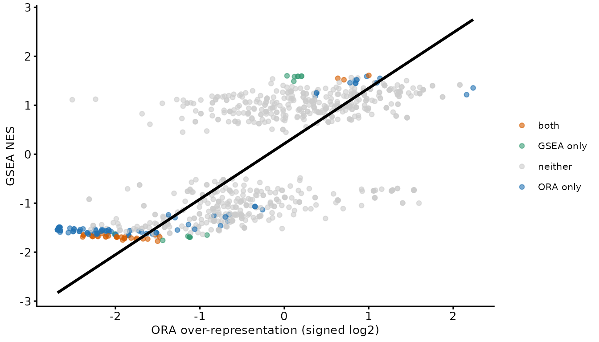

# ORA or GSEA?

There are two ways to ask whether a set of results is functionally
structured, and they differ in what they take as input.

**Over-representation analysis (ORA)** takes a list: the proteins you
called significant. It asks whether a term appears in that list more
often than the background rate. **Gene set enrichment analysis (GSEA)**
takes a ranking: every protein you tested, ordered by a signed
statistic. It asks whether a term’s proteins sit systematically towards
one end of that ranking.

The practical consequence is that ORA depends on where you put the
significance threshold and GSEA does not, while GSEA depends on the
ranking statistic and ORA does not. Neither is generally better. Below
we run both on the same data and look at where they agree, where they
disagree, and what the disagreements have in common.

The [functional
enrichment](https://lmb-mass-spec-compbio.github.io/biomasslmb/articles/functional_enrichment.md)
vignette covers the ORA workflow in detail; here it is compressed to
what is needed for the comparison.

## Load required packages

``` r

library(QFeatures)
library(biomasslmb)
library(ggplot2)
library(dplyr)
library(limma)
library(goseq)
library(fgsea)

dia_qf <- biomasslmb::dia_qf
```

## Shared input

The same MPXV-vs-control plasma comparison used in [functional
enrichment](https://lmb-mass-spec-compbio.github.io/biomasslmb/articles/functional_enrichment.md),
and the same GO annotations.

``` r

dia_prot <- dia_qf[, colData(dia_qf)$group %in% c('control', 'MPXV')]

group <- factor(dia_prot[['protein']]$group, levels = c('control', 'MPXV'))

n_quant <- sapply(levels(group), function(g){
  rowSums(!is.na(assay(dia_prot[['protein']])[, group == g, drop = FALSE]))
})

testable <- rownames(n_quant)[apply(n_quant, 1, min) >= 2]

limma_results <- assay(dia_prot[['protein']])[testable, ] %>%
  lmFit(model.matrix(~group)) %>%
  eBayes(trend = TRUE, robust = TRUE) %>%
  topTable(coef = 'groupMPXV', number = Inf) %>%
  tibble::rownames_to_column('Protein')

go_res_all <- readRDS(system.file(
  'extdata', 'go_enrichment_cache.rds', package = 'biomasslmb'))$go_res_all

gene2cat <- go_res_all[, c('UNIPROTKB', 'GO.ID')]
```

## ORA

Two tests, one per direction, each against the tested proteins as
background.

``` r

bias <- setNames(limma_results$AveExpr, limma_results$Protein)

run_ora <- function(sig, direction){
  pwf <- nullp(sig, bias.data = bias, plot.fit = FALSE)

  get_enriched_go(pwf, gene2cat = gene2cat, method = 'Wallenius') %>%
    estimate_overrep(pwf, gene2cat) %>%
    add_independent_filtering_padj(plot = FALSE) %>%
    mutate(over_represented_adj_pval = padj_if, direction = direction)
}

set.seed(0)

ora <- bind_rows(
  run_ora(setNames(limma_results$adj.P.Val < 0.05 & limma_results$logFC > 0,
                   limma_results$Protein), 'Increased'),
  run_ora(setNames(limma_results$adj.P.Val < 0.05 & limma_results$logFC < 0,
                   limma_results$Protein), 'Decreased'))
```

To compare against a single signed GSEA statistic, we reduce each term
to its better-supported direction and give the over-representation a
sign.

``` r

ora_best <- ora %>%
  group_by(category) %>%
  # with_ties = FALSE guarantees one row per term even where a term is called
  # equally strongly in both directions, so the join against GSEA stays 1:1
  slice_min(padj_if, n = 1, with_ties = FALSE) %>%
  ungroup() %>%
  mutate(ora_score = ifelse(direction == 'Increased',
                            log2(adj_overrep), -log2(adj_overrep)))
```

## GSEA

`fgsea` needs the annotations as a list of protein vectors, and a named
vector of ranking statistics. We rank by `logFC * -log10(P.Value)`, so
that a protein needs both a consistent direction and a small p-value to
rank at either extreme — ranking on fold-change alone would put noisy,
weakly-measured proteins at the top.

``` r

pathways <- lapply(split(go_res_all$UNIPROTKB, go_res_all$GO.ID), unique)

stats <- setNames(limma_results$logFC * -log10(limma_results$P.Value),
                  limma_results$Protein)
```

`minSize` and `maxSize` do the job that independent filtering does for
ORA: they exclude terms too small to be estimated and too large to be
specific, before any multiple-testing correction.

``` r

set.seed(0)

gsea <- fgsea(pathways = pathways, stats = stats,
              minSize = 5, maxSize = 200, nPermSimple = 10000) %>%
  as.data.frame()

go_terms <- distinct(go_res_all[, c('GO.ID', 'TERM', 'ONTOLOGY')])

gsea <- merge(gsea, go_terms, by.x = 'pathway', by.y = 'GO.ID') %>%
  arrange(pval)

c(terms_tested = nrow(gsea), significant = sum(gsea$padj < 0.05, na.rm = TRUE))
#> terms_tested  significant 
#>          868           48
```

Note that GSEA needed no direction split. The sign of the normalised
enrichment score (NES) carries it, and one test covers both.

## Where they agree

``` r

comparison <- merge(
  ora_best[, c('category', 'term', 'ontology', 'numDEInCat', 'numInCat',
               'padj_if', 'direction', 'ora_score')],
  gsea[, c('pathway', 'NES', 'padj', 'size')],
  by.x = 'category', by.y = 'pathway') %>%
  mutate(called = case_when(
    padj_if < 0.05 & padj < 0.05 ~ 'both',
    padj_if < 0.05 ~ 'ORA only',
    padj < 0.05 ~ 'GSEA only',
    TRUE ~ 'neither'))

comparison %>% count(called) %>% knitr::kable()
```

| called    |   n |
|:----------|----:|
| GSEA only |  15 |
| ORA only  |  86 |
| both      |  33 |
| neither   | 680 |

Both methods put the same terms on the same side. Below, the signed ORA
effect size against the GSEA NES, for the 814 terms both tested.

The trend line is fitted by total least squares, via
[`biomasslmb::tls`](https://lmb-mass-spec-compbio.github.io/biomasslmb/reference/tls.md).
Ordinary least squares assumes the x variable is measured without error
and minimises vertical distance, which makes the fitted slope depend on
which variable you happen to put on which axis. Here neither is a
predictor of the other — both are noisy estimates of the same underlying
enrichment — so the symmetric fit is the appropriate one. The same
argument applies to any logFC-against-logFC comparison of two methods or
two experiments.

``` r

comparison %>%
  ggplot(aes(ora_score, NES)) +
  geom_point(aes(colour = called), size = 1.5, alpha = 0.6) +
  geom_smooth(method = biomasslmb::tls, se = FALSE, colour = 'black') +
  scale_colour_manual(values = c(both = get_cat_palette(3)[2],
                                 `ORA only` = get_cat_palette(3)[1],
                                 `GSEA only` = get_cat_palette(3)[3],
                                 neither = 'grey80'),
                      name = NULL) +
  theme_biomasslmb(base_size = 10, aspect_square = FALSE) +
  labs(x = 'ORA over-representation (signed log2)', y = 'GSEA NES')
```



The correlation between the two effect sizes is 0.67. Where they
disagree, they disagree about magnitude and about significance, not
about direction — which is worth knowing, because it means a term called
by one method and missed by the other is usually a power difference
rather than a contradiction.

## Where they disagree

``` r

comparison %>%
  filter(called == 'ORA only') %>%
  arrange(padj_if) %>%
  select(term, numInCat, numDEInCat, ora_score, padj_if, padj) %>%
  head(6) %>%
  knitr::kable(digits = c(NA, 0, 0, 2, 4, 3),
               caption = 'Called by ORA only')
```

| term | numInCat | numDEInCat | ora_score | padj_if | padj |
|:---|---:|---:|---:|---:|---:|
| phospholipid efflux | 7 | 6 | -2.66 | 0.0054 | 0.078 |
| complement binding | 9 | 8 | 2.24 | 0.0058 | 0.345 |
| plasma lipoprotein particle assembly | 9 | 6 | -2.33 | 0.0088 | 0.089 |
| chylomicron | 9 | 6 | -2.32 | 0.0088 | 0.061 |
| neutral lipid catabolic process | 6 | 5 | -2.69 | 0.0088 | 0.117 |
| acylglycerol catabolic process | 6 | 5 | -2.69 | 0.0088 | 0.117 |

Called by ORA only {.table}

``` r

comparison %>%
  filter(called == 'GSEA only') %>%
  arrange(padj) %>%
  select(term, numInCat, numDEInCat, NES, padj, padj_if) %>%
  head(6) %>%
  knitr::kable(digits = c(NA, 0, 0, 2, 4, 3),
               caption = 'Called by GSEA only')
```

| term | numInCat | numDEInCat | NES | padj | padj_if |
|:---|---:|---:|---:|---:|---:|
| response to stimulus | 190 | 39 | 1.60 | 0.0278 | 0.535 |
| molecular function activator activity | 21 | 7 | -1.76 | 0.0278 | 0.050 |
| leukocyte mediated immunity | 62 | 13 | 1.58 | 0.0320 | 0.805 |
| receptor-mediated endocytosis | 11 | 3 | -1.67 | 0.0320 | 0.445 |
| membrane | 137 | 28 | 1.49 | 0.0320 | 0.767 |
| immunoglobulin mediated immune response | 58 | 13 | 1.59 | 0.0320 | 0.767 |

Called by GSEA only {.table}

Compare the `numInCat` (proteins in the background) and `numDEInCat` (of
those, significant) columns between the two tables. Most of the
difference is there:

- **ORA finds small terms that are almost entirely significant.**
  `phospholipid efflux` has 7 proteins in the background and 6 of them
  are significant. That is a striking result for a hypergeometric test,
  and a weak one for a ranking test: 7 proteins out of 231 cannot occupy
  enough of the ranking to produce an extreme enrichment score, however
  well they are placed.
- **GSEA finds large terms that shift consistently without individually
  clearing the threshold.** `leukocyte mediated immunity` has 62
  background proteins of which 13 are significant — an unremarkable
  fraction — but enough of the other 49 sit on the same side of the
  ranking that the term is enriched overall. ORA cannot see those 49 at
  all; they are simply absent from its input.

Neither is an error. They are answering different questions, and the
term sizes tell you which question a given term was ever going to be
able to answer.

## Does either handle abundance bias better?

`goseq` corrects for abundance bias explicitly, through the probability
weighting function. `fgsea` has no equivalent: the ranking statistic is
its only input, so any tendency for abundant proteins to rank more
extremely is carried straight through. It would be reasonable to expect
the ORA results to end up less associated with abundance as a result.

On these data they do not.

``` r

mean_abundance <- sapply(pathways[comparison$category], function(p){
  mean(bias[intersect(p, names(bias))], na.rm = TRUE)
})

comparison$mean_abundance <- mean_abundance

comparison %>%
  summarise(
    ORA = cor(mean_abundance, -log10(padj_if + 1e-10), use = 'complete.obs'),
    GSEA = cor(mean_abundance, -log10(padj + 1e-10), use = 'complete.obs')) %>%
  round(3) %>%
  knitr::kable(caption = 'Correlation of term mean abundance with significance')
```

|   ORA |  GSEA |
|------:|------:|
| 0.364 | 0.296 |

Correlation of term mean abundance with significance {.table}

Both outputs retain a similar association between a term’s mean protein
abundance and its significance, and the ORA one is slightly the
stronger. The PWF corrects the test; it does not make the surviving term
list abundance-neutral, partly because term size and mean abundance are
themselves related and independent filtering removes small terms
preferentially.

The useful conclusion is not that the correction is worthless — it
changes which terms are called, and on this data it is the difference
between 18 and 41 significant terms in the increased direction. It is
that neither method’s output should be read as free of abundance
effects, and that checking is cheap.

## Which to use

Run both. They cost seconds, they use the same inputs, and the
comparison above is more informative than either alone. When they must
be reduced to one:

| Situation | Prefer | Why |
|:---|:---|:---|
| Few significant proteins | GSEA | ORA loses power with the foreground; GSEA uses every tested protein |
| Many significant proteins | Either | Both have power; disagreements are informative |
| Interest is in small, specific terms | ORA | A small term cannot move a ranking statistic far enough |
| Interest is in broad programmes | GSEA | A diffuse shift never reaches the ORA foreground |
| Threshold is arbitrary or contested | GSEA | GSEA has no threshold to argue about |
| Abundance bias is a known concern | ORA, but verify | Only goseq offers a correction, and it is not a guarantee |

Two things apply whichever you use. Report the background, since neither
result means anything without it. And collapse the GO hierarchy before
counting your findings —
[`remove_redundant_go()`](https://lmb-mass-spec-compbio.github.io/biomasslmb/reference/remove_redundant_go.md)
works on `fgsea` output too, given the right column names:

``` r

gsea %>%
  filter(padj < 0.05) %>%
  remove_redundant_go(go_category_col = 'pathway', p_value_col = 'pval')
```

## Summary

- ORA takes a thresholded list and asks whether a term is
  over-represented in it; GSEA takes the full ranking and asks whether a
  term’s proteins are concentrated at one end
- On the same data they agreed on direction, with the two effect sizes
  correlating at 0.67, and disagreed on 101 of 814 terms
- The disagreements follow term size: ORA wins on small terms that are
  almost wholly significant, GSEA on large terms that shift consistently
  below the threshold
- Only `goseq` offers an abundance-bias correction, but on this data the
  surviving term lists were similarly associated with abundance either
  way, so verify rather than assume
- [`tls()`](https://lmb-mass-spec-compbio.github.io/biomasslmb/reference/tls.md)
  gives the appropriate fit when comparing two methods’ effect sizes,
  since neither axis is the predictor

## Where to go next

- [Functional
  enrichment](https://lmb-mass-spec-compbio.github.io/biomasslmb/articles/functional_enrichment.md)
  covers the ORA workflow properly, including what the foreground
  threshold costs.
- [Data exploration and statistical
  testing](https://lmb-mass-spec-compbio.github.io/biomasslmb/articles/exploration_and_statistical_testing.md)
  covers where the ranking statistic comes from.

## Getting help

If your experiment does not fit what this article assumes, or a result
looks wrong, please get in touch with Tom Smith (<tsmith@mrclmb.ac.uk>)
rather than guessing — it is far easier to help while an analysis is in
progress than to unpick a decision afterwards, and easier still before
the samples are run. [Getting
started](https://lmb-mass-spec-compbio.github.io/biomasslmb/articles/biomasslmb.md)
sets out which article applies to which experiment.

``` r

sessionInfo()
#> R version 4.5.3 (2026-03-11)
#> Platform: x86_64-pc-linux-gnu
#> Running under: Ubuntu 24.04.5 LTS
#> 
#> Matrix products: default
#> BLAS:   /usr/lib/x86_64-linux-gnu/openblas-pthread/libblas.so.3 
#> LAPACK: /usr/lib/x86_64-linux-gnu/openblas-pthread/libopenblasp-r0.3.26.so;  LAPACK version 3.12.0
#> 
#> locale:
#>  [1] LC_CTYPE=C.UTF-8       LC_NUMERIC=C           LC_TIME=C.UTF-8       
#>  [4] LC_COLLATE=C.UTF-8     LC_MONETARY=C.UTF-8    LC_MESSAGES=C.UTF-8   
#>  [7] LC_PAPER=C.UTF-8       LC_NAME=C              LC_ADDRESS=C          
#> [10] LC_TELEPHONE=C         LC_MEASUREMENT=C.UTF-8 LC_IDENTIFICATION=C   
#> 
#> time zone: UTC
#> tzcode source: system (glibc)
#> 
#> attached base packages:
#> [1] stats4    stats     graphics  grDevices utils     datasets  methods  
#> [8] base     
#> 
#> other attached packages:
#>  [1] fgsea_1.36.2                goseq_1.62.0               
#>  [3] geneLenDataBase_1.46.0      BiasedUrn_2.0.12           
#>  [5] limma_3.66.0                dplyr_1.2.1                
#>  [7] ggplot2_4.0.3               biomasslmb_0.1.0           
#>  [9] QFeatures_1.20.0            MultiAssayExperiment_1.36.2
#> [11] SummarizedExperiment_1.40.0 Biobase_2.70.0             
#> [13] GenomicRanges_1.62.1        Seqinfo_1.0.0              
#> [15] IRanges_2.44.0              S4Vectors_0.48.1           
#> [17] BiocGenerics_0.56.0         generics_0.1.4             
#> [19] MatrixGenerics_1.22.0       matrixStats_1.5.0          
#> 
#> loaded via a namespace (and not attached):
#>   [1] naniar_1.1.0             RColorBrewer_1.1-3       jsonlite_2.0.0          
#>   [4] magrittr_2.0.5           GenomicFeatures_1.62.0   farver_2.1.2            
#>   [7] corrplot_0.95            rmarkdown_2.32           fs_2.1.0                
#>  [10] BiocIO_1.20.0            ragg_1.5.2               vctrs_0.7.3             
#>  [13] memoise_2.0.1            Rsamtools_2.26.0         RCurl_1.98-1.20         
#>  [16] htmltools_0.5.9          S4Arrays_1.10.1          BiocBaseUtils_1.12.0    
#>  [19] progress_1.2.3           curl_8.0.0               SparseArray_1.10.10     
#>  [22] sass_0.4.10              uniprotREST_1.0.0        bslib_0.12.0            
#>  [25] htmlwidgets_1.6.4        desc_1.4.3               plyr_1.8.9              
#>  [28] httr2_1.3.0              cachem_1.1.0             GenomicAlignments_1.46.0
#>  [31] igraph_2.3.3             lifecycle_1.0.5          pkgconfig_2.0.3         
#>  [34] Matrix_1.7-4             R6_2.6.1                 fastmap_1.2.0           
#>  [37] clue_0.3-68              digest_0.6.39            AnnotationDbi_1.72.0    
#>  [40] textshaping_1.0.5        RSQLite_3.53.3           labeling_0.4.3          
#>  [43] filelock_1.0.3           mgcv_1.9-4               httr_1.4.9              
#>  [46] abind_1.4-8              compiler_4.5.3           bit64_4.8.6             
#>  [49] withr_3.0.3              S7_0.2.2                 backports_1.5.1         
#>  [52] BiocParallel_1.44.0      DBI_1.3.0                biomaRt_2.66.2          
#>  [55] MASS_7.3-65              DelayedArray_0.36.1      rjson_0.2.23            
#>  [58] tools_4.5.3              otel_0.2.0               visdat_0.6.0            
#>  [61] glue_1.8.1               restfulr_0.0.17          nlme_3.1-168            
#>  [64] grid_4.5.3               checkmate_2.3.4          cluster_2.1.8.2         
#>  [67] reshape2_1.4.5           gtable_0.3.6             tidyr_1.3.2             
#>  [70] data.table_1.18.6.1      hms_1.1.4                XVector_0.50.0          
#>  [73] pillar_1.11.1            stringr_1.6.0            genefilter_1.92.0       
#>  [76] robustbase_0.99-7        splines_4.5.3            BiocFileCache_3.0.0     
#>  [79] lattice_0.22-9           survival_3.8-6           rtracklayer_1.70.1      
#>  [82] bit_4.6.0                annotate_1.88.0          tidyselect_1.2.1        
#>  [85] GO.db_3.22.0             Biostrings_2.78.0        knitr_1.52              
#>  [88] ProtGenerics_1.42.0      xfun_0.60                statmod_1.5.2           
#>  [91] DEoptimR_1.2-1           stringi_1.8.9            UCSC.utils_1.6.1        
#>  [94] lazyeval_0.2.3           yaml_2.3.12              evaluate_1.0.5          
#>  [97] codetools_0.2-20         cigarillo_1.0.0          MsCoreUtils_1.22.1      
#> [100] tibble_3.3.1             cli_3.6.6                xtable_1.8-8            
#> [103] systemfonts_1.3.2        jquerylib_0.1.4          Rcpp_1.1.2              
#> [106] GenomeInfoDb_1.46.2      dbplyr_2.6.0             png_0.1-9               
#> [109] XML_3.99-0.24            parallel_4.5.3           pkgdown_2.2.1           
#> [112] blob_1.3.0               prettyunits_1.2.0        AnnotationFilter_1.34.0 
#> [115] bitops_1.1-0             txdbmaker_1.6.2          scales_1.4.0            
#> [118] purrr_1.2.2              crayon_1.5.3             rlang_1.3.0             
#> [121] fastmatch_1.1-8          cowplot_1.2.0            KEGGREST_1.50.0
```
