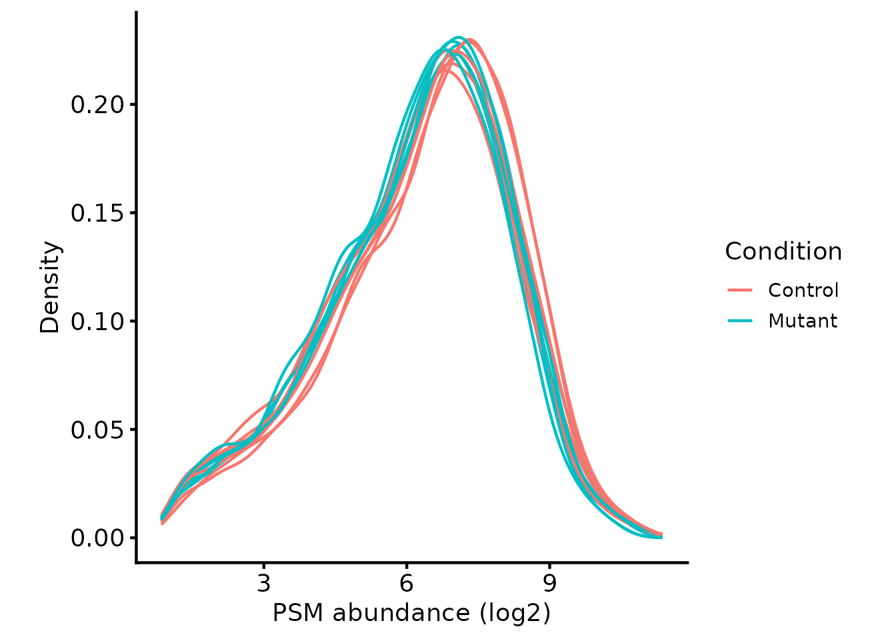
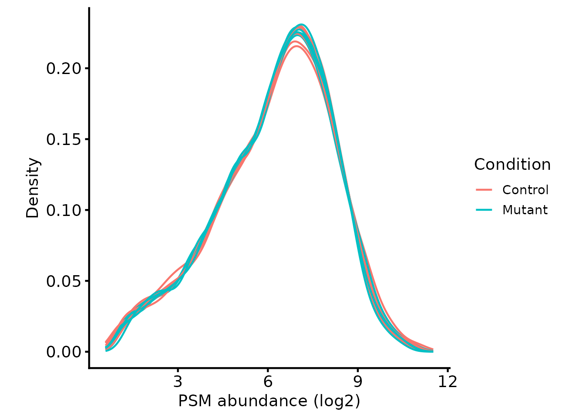
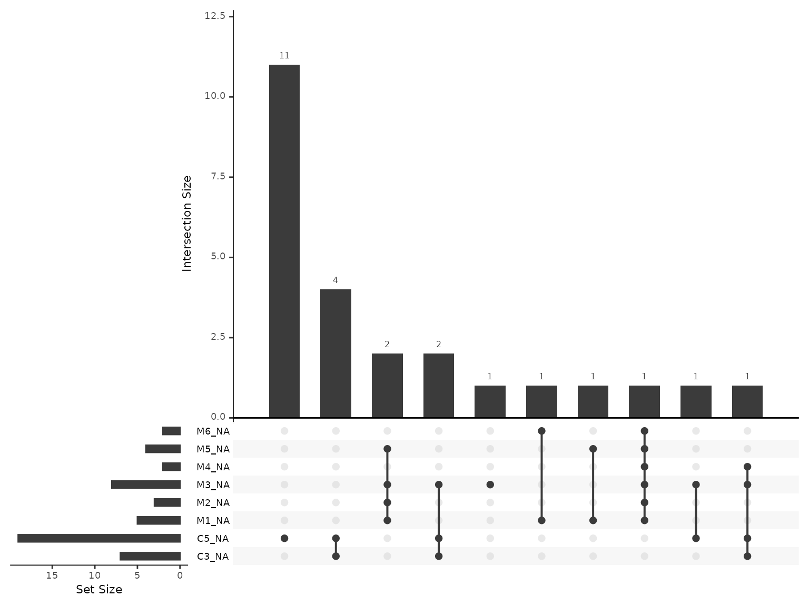

# TMT workflow: PSM QC and protein summarisation

Quantitative proteomics using isobaric tagging such as Tandem Mass Tags
(TMT) has a considerable benefit over Label-Free Quantification (LFQ) in
that many samples can be quantified for each Peptide Spectrum Match
(PSM). The standard TMTpro reagent set provides 18 channels (Li et al.
2021). Higher multiplexing is now commercially available, up to 35
channels, achieved by adding a set of deuterated reagents (Zuniga et al.
2024). The trade-off is that deuterium substitution shifts retention
time and degrades coelution between the deuterated and non-deuterated
channels, so the two sub-plexes have to be designed and normalised
separately using bridge channels. This has multiple benefits over
analysing samples in separate runs (LFQ):

1.  TMT reduces protein quantification variance since PSM-level
    quantification is derived from the same MS1 ion for all samples
2.  LFQ suffers from much higher missing values when comparing across
    samples due to the limited number of ions that can be fragmented in
    each run and the associated issue of peptides being identified in
    only a subset of runs (O’Connell et al. 2018). This is ameliorated
    to a significant degree by Data-Independent Acquisition (DIA) LFQ.
    However, DIA still involves quantifying each sample separately, so
    missing values are not entirely removed, and proteins in each sample
    may be quantified from different sets of peptides.

Because TMT quantifies from the same MS1 ion for all samples, this
standardises the features quantified in each sample, which simplifies
the comparison between samples and increases quantification accuracy of
summarised features such as proteins.

However, TMT does suffer from ratio compression, caused by co-isolation
of contaminating precursor ions that get fragmented alongside the target
peptide and inflate the reporter ion signal. This should be avoided by
performing quantification with SPS MS3 (McAlister et al. 2014).

This vignette works through one typical experiment from end to end: a
whole-proteome comparison between two conditions, labelled in a single
TMT plex and searched with Proteome Discoverer (PD). That combination
covers the majority of TMT experiments, and the choices made below are
the conventional ones for it.

Experiments that depart from it are covered separately, since the
departures change the reasoning rather than just the code:

- **Several plexes.** A design too large for one plex needs each plex
  processed on its own and then brought onto a common scale — see
  [multi-plex
  TMT](https://lmb-mass-spec-compbio.github.io/biomasslmb/articles/TMT_multiplex.md).
- **An enrichment design.** An IP, BioID or TurboID experiment breaks
  the assumptions behind normalisation and behind discarding missing
  values — see [enrichment
  designs](https://lmb-mass-spec-compbio.github.io/biomasslmb/articles/interactome_designs.md).
- **An enriched PTM fraction.** Modified peptides have to be localised
  to a residue, summarised to sites rather than proteins, and normalised
  against a matched total fraction rather than against themselves — see
  [PTM site
  quantification](https://lmb-mass-spec-compbio.github.io/biomasslmb/articles/PTM_site_quantification.md).
- **MaxQuant instead of PD.** The principles are the same, but the
  column names differ and two of the QC metrics used below — reporter
  signal:noise and SPS mass matches — are not reported at all, so the
  PSM quality filter has to be rebuilt around the one that is. [Reading
  MaxQuant output](#reading-maxquant-output) at the end of this vignette
  covers what transfers and what does not.

## Load required packages

``` r

library(QFeatures)
library(biomasslmb)
library(ggplot2)
library(tidyr)
library(dplyr)
```

## The experimental design

`psm_tmt_clock` and `tmt_clock_design` are datasets available from the
`biomasslmb` package, derived from a real TMT12plex experiment comparing
`Control` and `Mutant` samples (6 replicates each). `psm_tmt_clock` is
the PD PSM-level output, truncated to a subset of proteins for a
manageable vignette. `tmt_clock_design` gives the experimental design:
which sample each TMT tag corresponds to, and its `Condition` and
`Replicate`.

``` r

knitr::kable(tmt_clock_design)
```

|     | tag  | Condition | Replicate | quantCols |
|:----|:-----|:----------|:----------|:----------|
| C1  | 130C | Control   | 1         | C1        |
| C4  | 132N | Control   | 4         | C4        |
| C5  | 128C | Control   | 5         | C5        |
| C6  | 128N | Control   | 6         | C6        |
| M1  | 126  | Mutant    | 1         | M1        |
| M4  | 129N | Mutant    | 4         | M4        |
| M3  | 133N | Mutant    | 3         | M3        |
| C2  | 133C | Control   | 2         | C2        |
| C3  | 130N | Control   | 3         | C3        |
| M2  | 134C | Mutant    | 2         | M2        |
| M6  | 131C | Mutant    | 6         | M6        |
| M5  | 135N | Mutant    | 5         | M5        |

Unlike a `data.frame` read from a single PD output file, real
experiments nearly always have an associated design table like this
(often as a spreadsheet from whoever ran the samples), which needs to be
read in and used both to make sense of the TMT tags and to define
experimental details for exploration and statistical testing.

## Read in input data

The data go into a `QFeatures` object, the standard Bioconductor
container for quantitative proteomics data. See
[here](https://www.bioconductor.org/packages/release/bioc/html/QFeatures.html)
for documentation about the `QFeatures` object.

`psm_tmt_clock` contains the PSM-level output from PD for this
experiment, with the abundance columns already renamed to match the
sample names used in `tmt_clock_design`. Passing `tmt_clock_design` as
the `colData` keeps the experimental design travelling with the
quantification data.

[`readQFeatures()`](https://rformassspectrometry.github.io/QFeatures/reference/readQFeatures.html)
attaches the design at the object level only, so
[`sync_coldata()`](https://lmb-mass-spec-compbio.github.io/biomasslmb/reference/sync_coldata.md)
copies it onto the assay as well — functions that plot or model a single
assay, such as
[`plot_quant()`](https://lmb-mass-spec-compbio.github.io/biomasslmb/reference/plot_quant.md)
below, read it from there. [Working with QFeatures
objects](https://lmb-mass-spec-compbio.github.io/biomasslmb/articles/qfeatures_objects.md)
covers this and the rest of the object’s vocabulary.

``` r


tmt_qf <- QFeatures::readQFeatures(assayData = psm_tmt_clock,
                                   colData = tmt_clock_design,
                                   quantCols = rownames(tmt_clock_design),
                                   name = "psms_raw")
#> Checking arguments.
#> Loading data as a 'SummarizedExperiment' object.
#> Formatting sample annotations (colData).
#> Formatting data as a 'QFeatures' object.

tmt_qf <- sync_coldata(tmt_qf, "psms_raw")
```

## Defining the contaminant proteins

Contaminant proteins have to be removed. This search was performed
against the ‘0602_Universal Contaminants’ database (Frankenfield et al.
2022), so parsing that same fasta gives the accessions to match against,
in the `Cont_<UniProt accession>` format PD reports them in. PD
sometimes assigns the bare UniProt accession as the master protein even
for a contaminant hit — matching on both forms costs nothing and catches
those.

``` r


contaminant_fasta_inf <- system.file(
  "extdata", "0602_Universal_Contaminants.fasta.gz",
  package = "biomasslmb"
)

# Extract the protein IDs associated with each contaminant protein
contaminant_accessions <- biomasslmb::get_contaminant_fasta_accessions(contaminant_fasta_inf)
contaminant_accessions <- c(contaminant_accessions, sub('^Cont_', '', contaminant_accessions))

print(head(contaminant_accessions))
#> [1] "Cont_P00722" "Cont_P09870" "Cont_P30879" "Cont_P0C1U8" "Cont_Q2FZL2"
#> [6] "Cont_P00698"
```

Routine filtering removes PSMs that:

- Could originate from contaminants. See
  [`?filter_features_pd_dda`](https://lmb-mass-spec-compbio.github.io/biomasslmb/reference/filter_features_pd_dda.md)
  for further details, including the removal of ‘associated’
  contaminants.
- Have more than one accession in the master protein column, meaning the
  search engine could not resolve which protein the PSM came from.

The accession list, the `Cont_` prefix and PD’s own `Contaminant` column
are three separate defences, and they do not always agree with one
another. [Contaminants and protein
FDR](https://lmb-mass-spec-compbio.github.io/biomasslmb/articles/gotcha_contaminants_and_FDR.md)
measures what each one catches and what is left behind when the database
naming does not match what the filter expects.

`unique_master` asks whether the search engine settled on a single
protein identity. The separate `proteotypic` argument asks whether the
peptide sequence occurs in only one protein at all — a feature can have
one unambiguous master protein and still be shared with the other
members of that protein group. See [peptides are not
proteins](https://lmb-mass-spec-compbio.github.io/biomasslmb/articles/gotcha_peptide_to_protein.md).

``` r

# Perform routine raw data filtering.
# - Remove PSMs from contaminant proteins
# - Remove PSMs with no master protein, or with more than one
tmt_qf[['psms_filtered']] <- filter_features_pd_dda(tmt_qf[['psms_raw']],
                                             contaminant_proteins=contaminant_accessions,
                                             filter_contaminant=TRUE,
                                             filter_associated_contaminant=TRUE,
                                             unique_master=TRUE)
#> Filtering data...
#> 11281 features found from 790 master proteins => Input
#> 762 contaminant proteins supplied
#> 4949 proteins identified as 'contaminant associated'
#> 9785 features found from 746 master proteins => contaminant features removed
#> 8956 features found from 727 master proteins => associated contaminant features removed
#> 8956 features found from 727 master proteins => PD-labelled 'Contaminants' removed
#> 8953 features found from 726 master proteins => features without a master protein removed
#> 8822 features found from 648 master proteins => features with non-unique master proteins removed
#> 6312 features found from 606 master proteins => features without quantification removed

tmt_qf <- sync_coldata(tmt_qf, 'psms_filtered')
```

## Normalise

[`biomasslmb::plot_quant`](https://lmb-mass-spec-compbio.github.io/biomasslmb/reference/plot_quant.md)
shows whether the PSM intensity distributions are approximately the same
across channels. Colouring by `Condition` answers a second question at
the same time — whether the two conditions already separate before any
normalisation or filtering, which would point at a labelling or loading
problem rather than at biology.

``` r


# Plot the peptide-level quantification distributions per sample
biomasslmb::plot_quant(tmt_qf[['psms_filtered']],
                       log2transform=TRUE,
                       method='density') +
  theme_biomasslmb() +
  aes(colour=Condition, group=sample) +
  xlab('PSM abundance (log2)')
```



The same amount of material was labelled in every channel, and this is a
whole-proteome comparison in which most proteins are expected to be
unchanged, so any systematic offset between those distributions is
technical. `diff.median` normalisation with
[`QFeatures::normalize`](https://rdrr.io/pkg/BiocGenerics/man/normalize.html)
shifts each channel to a common median and removes it. The abundances
are log-transformed first, so that the shift is multiplicative on the
original scale, then exponentiated back afterwards — `sum` summarisation
below needs untransformed values.

That assumption is worth stating explicitly, because it is the step most
easily carried into an experiment where it does not hold: an [enrichment
design](https://lmb-mass-spec-compbio.github.io/biomasslmb/articles/interactome_designs.md)
expects the conditions to differ in overall composition, and normalising
to a common median there erodes the signal being measured.

``` r


# Normalise the log2-transformed abundances using diff.median
tmt_qf[['psms_filtered_norm']] <- QFeatures::normalize(
  logTransform(tmt_qf[['psms_filtered']], base=2), method='diff.median')

# Exponentiate the quantification values back to the initial scale.
assay(tmt_qf[['psms_filtered_norm']]) <- 2^assay(tmt_qf[['psms_filtered_norm']])

tmt_qf <- sync_coldata(tmt_qf, 'psms_filtered_norm')

# Plot the peptide-level quantification distributions per sample
biomasslmb::plot_quant(tmt_qf[['psms_filtered_norm']],
                       log2transform=TRUE,
                       method='density') +
  theme_biomasslmb() +
  aes(colour=Condition, group=sample) +
  xlab('PSM abundance (log2)')
```



## Removing low quality PSMs

Low Signal:Noise (S:N) PSMs are worth removing on two counts at once:
their quantification is less accurate, and they account for most of the
missing values. `plot_missing_SN` shows the relationship between the
two.

**Missing channels are concentrated below S:N 10 and scarce above it.**
That coincidence is what makes a single S:N threshold the right tool
here — it removes the PSMs that generate missing values and the PSMs
whose measured values are least trustworthy, in one filter, without any
modelling.

``` r

# Add a more accurate average S:N ratio value.
# The one calculated by PD doesn't treat NA values appropriately!
tmt_qf[['psms_filtered_norm']] <- update_average_sn(tmt_qf[['psms_filtered_norm']])

plot_missing_SN(tmt_qf[['psms_filtered_norm']], bins = 20)
```


Missing values per PSM, in relation to the signal:noise ratio

`plot_missing_SN_per_sample` breaks the same relationship down by tag,
which is how a labelling failure in one channel shows up: that tag would
keep dropping values where the others do not. No tag behaves that way
here above S:N 10.

``` r

plot_missing_SN_per_sample(tmt_qf[['psms_filtered_norm']], bins = 20)
```


Missing values per tag, in relation to the signal:noise ratio

`filter_TMT_PSMs` applies both thresholds the plots above justify: S:N
\> 10, and interference/co-isolation \< 50%. The second targets a
different problem — a PSM whose isolation window contained more than one
precursor reports a blend of their reporter ions, so its ratios are
compressed towards no change rather than merely noisy. [Enrichment
designs](https://lmb-mass-spec-compbio.github.io/biomasslmb/articles/interactome_designs.md)
shows what the interference distribution looks like when the threshold
has to be argued rather than assumed.

``` r

# Then filter PSMs to remove low S:N and/or high interference
tmt_qf[['psms_filtered_sn']] <- filter_TMT_PSMs(tmt_qf[['psms_filtered_norm']],
                                                inter_thresh=50, sn_thresh=10)
#> Filtering PSMs...
#> 6312 features found from 606 master proteins => Initial PSMs
#> 5751 features found from 587 master proteins => PSMs with Quan.Info removed
#> 5751 features found from 587 master proteins => PSMs which are not selected or unambiguous removed
#> 5751 features found from 587 master proteins => Removing PSMs without quantification values
#> 5663 features found from 583 master proteins => Removing PSMs with high Co-isolation/interference
#> 5021 features found from 536 master proteins => Removing PSMs with low average S:N ratio
#> Not performing filtering by SPS-MM (`spsmm_thresh`=0)
tmt_qf <- sync_coldata(tmt_qf, 'psms_filtered_sn')
```

Peptides that are not rank 1 according to the search engine are removed
next.

``` r


tmt_qf[['psms_filtered_rank']] <- tmt_qf[['psms_filtered_sn']]

tmt_qf <- tmt_qf %>%
  filterFeatures(~ Rank == 1, i = 'psms_filtered_rank')
#> 'Rank' found in 5 out of 5 assay(s).

message_parse(rowData(tmt_qf[['psms_filtered_rank']]),
                         'Master.Protein.Accessions',
                         "Removing peptides that are not rank 1")
#> 5012 features found from 536 master proteins => Removing peptides that are not rank 1
```

## Summarising to protein-level abundances

With the PSM-level quantification inspected and filtered, the PSMs can
be summarised to protein-level abundances.

Summarisation takes the master protein assignment at face value: every
PSM contributes to exactly one protein, the one the search engine
assigned it to. That assignment is an inference rather than a
measurement, and for proteins whose peptides are largely shared with
their homologues it is not a reliable one. [Peptides are not
proteins](https://lmb-mass-spec-compbio.github.io/biomasslmb/articles/gotcha_peptide_to_protein.md)
covers how the assignment is made and how to tell which of your proteins
it can support.

For TMT, summing the PSM-level abundances gives accurate protein
estimates so long as there are no missing values. Where there are many,
[`MsCoreUtils::robustSummary`](https://rdrr.io/pkg/MsCoreUtils/man/robustSummary.html)
is the better estimator, since it summarises accurately without complete
data (Sticker et al. 2020). Which of those applies is a property of the
dataset rather than a preference, so it is settled below by measurement.
[Comparing protein summarisation
approaches](https://lmb-mass-spec-compbio.github.io/biomasslmb/articles/summarisation_methods.md)
runs both on this dataset and on one where the answer goes the other
way.

### Exploring missing values

Before deciding how to handle missing values, it’s worth checking how
much missingness there is, and whether it’s random or structured by
experimental condition. Condition-structured missingness (e.g. a PSM
detected in every `Control` sample but no `Mutant` sample) can indicate
a real biological or technical difference between conditions, and should
make you wary of simply discarding those PSMs. Missingness scattered
independently of condition, on the other hand, more likely reflects
individual TMT channels whose intensity falls around the limit of
detection: the S:N filter above is applied per-PSM, so a PSM can pass
that threshold overall while one or two of its channels still drop out.

`plot_missing_upset` visualises the most common patterns of missingness
across samples. Samples with no missing PSMs at all are omitted from the
plot, since they don’t contribute to any missingness pattern.

``` r

plot_missing_upset(tmt_qf, i = 'psms_filtered_rank')
```



`condition_miss_score` complements this by fitting, for each PSM, a
logistic regression of missingness against a `colData` grouping column,
and returning Tjur’s R² as a per-feature score: values near 1 mean a
PSM’s missingness pattern is well explained by `Condition`, values near
0 mean it looks unrelated to `Condition`. `condition_miss_index`
aggregates these per-feature scores into a single dataset-level value
between 0 and 1.

``` r

miss_res <- condition_miss_score(tmt_qf, i = 'psms_filtered_rank', group_cols = 'Condition')
#> Analysing assay 'psms_filtered_rank': 5012 features x 12 samples
#> Group variable: Condition (2 levels: Control, Mutant)
#> Results: 25 informative features | mean condition miss score = 0.175 | condition-structured: 0.0% | condition-independent: 0.4%
condition_miss_index(miss_res$summary)$index
#> Condition missingness index: 0.0014 | Weighted mean score: 0.2744 | Coverage: 0.5% (25 / 5012 features informative) [coverage penalty applied]
#> [1] 0.001368517
```

**Missing values are both rare and unstructured here**, which is what
settles the summarisation choice. Only 25 of 5012 PSMs have any missing
value at all, and the condition missingness index is close to zero, so
there is no evidence that the missingness there is tracks `Condition`.

That makes the simplest route the defensible one: discard the PSMs with
any missing value and sum the rest. The cost is those PSMs, and it is
small precisely because they are few — in a dataset where they were
many, or where they clustered in one condition, the same step would
discard a large fraction of the data or the signal itself. The [LFQ-DDA
workflow](https://lmb-mass-spec-compbio.github.io/biomasslmb/articles/LFQ_DDA_Peptide_QC_Summarisation.md)
works through a dataset where the trade comes out the other way.

Complete data is a requirement rather than a convenience for `sum`.
Summing over whatever PSMs happen to be present would build a protein’s
abundance from different PSMs in different samples, so the resulting
values would not be comparable across the very samples they exist to be
compared between.

``` r

tmt_qf[['psms_filtered_missing']] <- QFeatures::filterNA(
  tmt_qf[['psms_filtered_rank']], 0)
```

PSMs belonging to proteins with fewer than 2 PSMs are then removed, so
that every protein quantification rests on at least two independent
observations. The filter is not always right: in phosphoproteomics a
site is often supported by one PSM and discarding it discards the
measurement, which is why [PTM site
quantification](https://lmb-mass-spec-compbio.github.io/biomasslmb/articles/PTM_site_quantification.md)
does not apply it.

``` r

min_psms <- 2
tmt_qf[['psms_filtered_forSum']] <- biomasslmb::filter_features_per_protein(
  tmt_qf[['psms_filtered_missing']], min_features = min_psms)
```

Then the summarisation itself.

``` r

# Aggregate to protein-level abundances (using QFeatures function)
tmt_qf <- QFeatures::aggregateFeatures(tmt_qf,
                                       i = "psms_filtered_forSum",
                                       fcol = "Master.Protein.Accessions",
                                       name = "protein",
                                       fun = base::colSums)

tmt_qf <- sync_coldata(tmt_qf, 'protein')
```

``` r

tmt_qf[['protein']] <- QFeatures::logTransform(
  tmt_qf[['protein']], base=2)
```

### Inspecting the number of PSMs and proteins through the processing steps

Each filtering step above removed something, and the totals are easier
to judge together than one message at a time.
[`get_samples_present()`](https://lmb-mass-spec-compbio.github.io/biomasslmb/reference/get_samples_present.md)
and
[`plot_samples_present()`](https://lmb-mass-spec-compbio.github.io/biomasslmb/reference/plot_samples_present.md)
show how many PSMs and proteins survived each stage, and in how many
samples. Both take a named character vector selecting the assays to
plot, since the `QFeatures` names are not self-explanatory.

The assay names to choose from:

``` r

names(tmt_qf)
#> [1] "psms_raw"              "psms_filtered"         "psms_filtered_norm"   
#> [4] "psms_filtered_sn"      "psms_filtered_rank"    "psms_filtered_missing"
#> [7] "psms_filtered_forSum"  "protein"
```

`psms_filtered_norm` is left out: it holds the normalised quantification
of `psms_filtered` and no PSMs were removed at that step, so it would
plot as a duplicate.

#### Samples per PSM

PSMs first. The row variables are `Sequence`, `Modifications` and
`RT.in.min`, so that the count is of unique PSMs rather than of rows.

``` r


rename_cols <- c('All PSMs' = 'psms_raw' ,
                 'Quantified, contaminants removed' = 'psms_filtered',
                 'Signal:Noise > 10' = 'psms_filtered_sn',
                 'PSMs - filtered (Rank1)' = 'psms_filtered_rank',
                 'No missing values' = 'psms_filtered_missing',
                 '>1 PSM per protein' = 'psms_filtered_forSum')

rowvars <- c('Sequence', 'Modifications', 'RT.in.min')

samples_present <- get_samples_present(tmt_qf[,,unname(rename_cols)], rowvars, rename_cols)
#> Warning: 'experiments' dropped; see 'drops()'
#> harmonizing input:
#>   removing 24 sampleMap rows not in names(experiments)
plot_samples_present(samples_present, rowvars, breaks=seq(2,12,2)) + ylab('PSM')
#> Scale for fill is already present.
#> Adding another scale for fill, which will replace the existing scale.
```


Samples quantified for each PSM at each level of processing

#### Samples per Protein

Then proteins, from the same functions: the named vector gains the
`protein` assay, and the row variable becomes
`Master.Protein.Accessions` alone.

``` r


rename_cols_prot <- c(rename_cols, 'Protein'='protein')

rowvars_prot <- c('Master.Protein.Accessions')

samples_present <- get_samples_present(tmt_qf, rowvars_prot, rename_cols_prot)
plot_samples_present(samples_present, rowvars_prot, breaks=seq(2,12,2))
#> Scale for fill is already present.
#> Adding another scale for fill, which will replace the existing scale.
```


Samples quantified for each protein at each level of processing

**The two-PSM rule is cheap in PSMs and expensive in proteins.** It
removes few PSMs, because most PSMs belong to proteins that have
several; it removes many more proteins, because a protein identified by
one PSM loses its only evidence. Those proteins are the ones whose
quantification would have been least reliable, so the trade is usually
worth making — but it is a trade, and an experiment targeting a
low-abundance protein family may not want it.

``` r

# Save file to package as data so it can be read back in in other vignettes
usethis::use_data(tmt_qf, overwrite=TRUE)
```

## Summary

The PSMs were QCed and filtered in the following steps:

- Remove PSMs that are likely from contaminants
- Remove PSMs without a unique ‘master protein’
- Remove PSMs without any quantification values
- Normalise the abundance values so they have the same median value in
  all samples, which is reasonable here because the same amount of
  material was labelled in every channel
- Remove PSMs with very low signal:noise and high interference

The PSM-level abundances were then summarised to protein level with
`sum`, having first removed the small number of PSMs with any missing
value. See the [Comparing protein summarisation
approaches](https://lmb-mass-spec-compbio.github.io/biomasslmb/articles/summarisation_methods.md)
vignette for a direct comparison against `robustSummary`, and the [Data
exploration and statistical
testing](https://lmb-mass-spec-compbio.github.io/biomasslmb/articles/exploration_and_statistical_testing.md)
vignette for how to explore and statistically test the resulting
protein-level data using the experimental design attached here.

Two of those steps are specific to this being a straightforward
whole-proteome comparison in a single plex. Normalising to a common
median assumes most proteins are unchanged, which an [enrichment
design](https://lmb-mass-spec-compbio.github.io/biomasslmb/articles/interactome_designs.md)
violates, and summing complete PSMs is only cheap because within-plex
missingness is low — between plexes it is not, which is what [multi-plex
TMT](https://lmb-mass-spec-compbio.github.io/biomasslmb/articles/TMT_multiplex.md)
addresses.

## Reading MaxQuant output

Everything above is Proteome Discoverer specific in its column names,
and one section of it more deeply than that. This part covers what
transfers to MaxQuant and what does not, using `psm_tmt_factorial`: the
`evidence.txt` PSM-level output from a TMT18plex whole-proteome
experiment, with `tmt_factorial_design`. It is subsetted to a random
sample of proteins, so the counts below are smaller than a full
experiment’s, but every filtering step is doing real work on real PSMs.

| Quantity | Proteome Discoverer | MaxQuant |
|----|----|----|
| Protein assignment | `Master.Protein.Accessions` | `Leading.razor.protein` |
| All candidate proteins | `Protein.Accessions` | `Proteins` |
| Contaminant accessions | search FASTA, `Cont_` prefix | [`get_maxquant_cont_accessions()`](https://lmb-mass-spec-compbio.github.io/biomasslmb/reference/get_maxquant_cont_accessions.md), `CON__` prefix |
| Decoy flag | removed before export | `Reverse` |
| Search engine rank | `Rank` | not reported per PSM |
| Co-isolation | `Isolation.Interference.in.Percent` | `PIF` |
| Reporter signal:noise | `Average.Reporter.SN` | **not reported** |
| SPS mass matches | `SPS.Mass.Matches.in.Percent` | **not reported** |
| Missing quantification | empty | `0` |

The design is crossed rather than a single comparison: three cell lines,
each treated with a vehicle or a compound, in three replicates.

``` r

knitr::kable(tmt_factorial_design)
```

|                   | Genotype | Treatment | Replicate | quantCols         |
|:------------------|:---------|:----------|:----------|:------------------|
| Line_A_Control_1  | Line_A   | Control   | 1         | Line_A_Control_1  |
| Line_AB_Control_1 | Line_AB  | Control   | 1         | Line_AB_Control_1 |
| Line_A_Control_2  | Line_A   | Control   | 2         | Line_A_Control_2  |
| Line_AB_Control_2 | Line_AB  | Control   | 2         | Line_AB_Control_2 |
| Line_B_Treated_1  | Line_B   | Treated   | 1         | Line_B_Treated_1  |
| Line_B_Control_2  | Line_B   | Control   | 2         | Line_B_Control_2  |
| Line_B_Treated_2  | Line_B   | Treated   | 2         | Line_B_Treated_2  |
| Line_B_Control_1  | Line_B   | Control   | 1         | Line_B_Control_1  |
| Line_AB_Treated_1 | Line_AB  | Treated   | 1         | Line_AB_Treated_1 |
| Line_A_Control_3  | Line_A   | Control   | 3         | Line_A_Control_3  |
| Line_A_Treated_3  | Line_A   | Treated   | 3         | Line_A_Treated_3  |
| Line_B_Treated_3  | Line_B   | Treated   | 3         | Line_B_Treated_3  |
| Line_AB_Control_3 | Line_AB  | Control   | 3         | Line_AB_Control_3 |
| Line_A_Treated_1  | Line_A   | Treated   | 1         | Line_A_Treated_1  |
| Line_AB_Treated_2 | Line_AB  | Treated   | 2         | Line_AB_Treated_2 |
| Line_A_Treated_2  | Line_A   | Treated   | 2         | Line_A_Treated_2  |
| Line_B_Control_3  | Line_B   | Control   | 3         | Line_B_Control_3  |
| Line_AB_Treated_3 | Line_AB  | Treated   | 3         | Line_AB_Treated_3 |

Nothing in the reading or filtering below depends on that structure. It
starts to matter at the point of testing, where a second factor changes
both what the model should contain and what its coefficients mean, and
[data exploration and statistical
testing](https://lmb-mass-spec-compbio.github.io/biomasslmb/articles/exploration_and_statistical_testing.md)
picks this dataset up there.

``` r

tmt_mq <- QFeatures::readQFeatures(assayData = psm_tmt_factorial,
                                   colData = tmt_factorial_design,
                                   quantCols = rownames(tmt_factorial_design),
                                   name = 'psms_raw')

tmt_mq <- sync_coldata(tmt_mq, 'psms_raw')
```

One step has no counterpart in the PD workflow and has to come first.
MaxQuant writes an intensity of exactly zero where it has no
measurement, whereas PD leaves the cell empty. Mass spectrometry cannot
assert that a peptide was absent, only that it was not detected, so
those zeros have to become `NA` — left as they are they are treated as
real measurements at the bottom of the scale, and they pull every
median, every summarisation and every fold change towards it.

``` r

tmt_mq[['psms_raw']] <- QFeatures::zeroIsNA(tmt_mq[['psms_raw']])
```

[`filter_features_mq_dda()`](https://lmb-mass-spec-compbio.github.io/biomasslmb/reference/filter_features_mq_dda.md)
replaces
[`filter_features_pd_dda()`](https://lmb-mass-spec-compbio.github.io/biomasslmb/reference/filter_features_pd_dda.md),
and takes its contaminant accessions from
[`get_maxquant_cont_accessions()`](https://lmb-mass-spec-compbio.github.io/biomasslmb/reference/get_maxquant_cont_accessions.md)
rather than from a search FASTA, because MaxQuant searches against its
own contaminants database with `CON__` prefixed accessions. It also
removes hits to the decoy database, which PD has already removed before
the PSM export exists.

``` r

tmt_mq[['psms_filtered']] <- filter_features_mq_dda(
  tmt_mq[['psms_raw']],
  contaminant_proteins = get_maxquant_cont_accessions(),
  filter_contaminant = TRUE,
  filter_associated_contaminant = TRUE)

tmt_mq <- sync_coldata(tmt_mq, 'psms_filtered')
```

Normalisation is unchanged, and rests on the same assumption: equal
loading per channel, and most proteins unchanged between conditions.

``` r

tmt_mq[['psms_norm']] <- QFeatures::normalize(
  logTransform(tmt_mq[['psms_filtered']], base = 2), method = 'diff.median')

assay(tmt_mq[['psms_norm']]) <- 2^assay(tmt_mq[['psms_norm']])

tmt_mq <- sync_coldata(tmt_mq, 'psms_norm')
```

**The low-quality PSM section is the part that does not transfer.**
MaxQuant does not report reporter ion signal:noise at all, so the S:N
threshold that does most of the quality filtering above has no
counterpart, and neither has the SPS mass match percentage. What remains
is `PIF`, the precursor intensity fraction, which measures the same
thing as PD’s co-isolation percentage from the other direction: the
fraction of the isolation window accounted for by the intended
precursor, so a high `PIF` is good where a high interference percentage
is bad.

``` r

summary(rowData(tmt_mq[['psms_norm']])$PIF)
#>    Min. 1st Qu.  Median    Mean 3rd Qu.    Max.    NA's 
#>  0.0000  0.8318  0.9343  0.8735  0.9756  1.0000    1156
```

Two consequences follow, and both are worth taking seriously rather than
working around.

The first is that filtering has to lean on `PIF` alone, which controls
for co-isolation but says nothing about how close a reporter ion was to
the noise. The PD filter above discarded PSMs on both counts, and only
one of them is available here.

The second is that `PIF` is itself frequently `NA`, reported only where
MaxQuant could assess the window — 1156 of 17639 PSMs here — so a
threshold on it carries a second decision about what to do with the PSMs
it cannot assess. Discarding them is the conservative choice and the one
taken below.

The threshold itself is a judgement rather than a standard. The direct
counterpart of the PD filter used above, interference under 50%, is
`PIF` above 0.5, which would remove 650 PSMs; the stricter `PIF` above
0.75 used here removes 2594. The stricter threshold buys cleaner ratios
at the price of those PSMs, and is worth it in a whole-proteome
experiment where PSMs are plentiful. In an experiment where they are not
— a low-input sample, or a protein of interest identified by two
peptides — the same threshold can remove the measurement being sought.

``` r

pif <- rowData(tmt_mq[['psms_norm']])$PIF

tmt_mq[['psms_pif']] <- tmt_mq[['psms_norm']][!is.na(pif) & pif > 0.75, ]

tmt_mq <- sync_coldata(tmt_mq, 'psms_pif')

nrow(tmt_mq[['psms_pif']])
#> [1] 13889
```

The rank filter has no MaxQuant equivalent and is simply omitted:
`evidence.txt` reports the accepted match rather than every candidate,
and the confidence filtering has already been applied through MaxQuant’s
posterior error probabilities.

Missing values are the one thing to re-check rather than carry over. The
argument above for discarding PSMs with any missing value rested on
there being very few, and that in turn rested on the S:N filter, which
is not available here — so it has to be re-made on this dataset.

``` r

miss_mq <- condition_miss_score(tmt_mq, i = 'psms_pif', group_cols = 'Treatment')
#> Analysing assay 'psms_pif': 13889 features x 18 samples
#> Group variable: Treatment (2 levels: Control, Treated)
#> Results: 278 informative features | mean condition miss score = 0.063 | condition-structured: 0.0% | condition-independent: 1.9%

condition_miss_index(miss_mq$summary)$index
#> Condition missingness index: 0.0014 | Weighted mean score: 0.0676 | Coverage: 2.0% (278 / 13889 features informative) [coverage penalty applied]
#> [1] 0.001352647
```

**The argument survives.** Only 278 of 13889 PSMs have any missing
value, and the condition missingness index is near zero, so discarding
them costs little and loses nothing that tracks `Treatment`.

``` r

tmt_mq[['psms_complete']] <- QFeatures::filterNA(tmt_mq[['psms_pif']], 0)

tmt_mq[['psms_forSum']] <- filter_features_per_protein(
  tmt_mq[['psms_complete']],
  master_protein_col = 'Leading.razor.protein',
  min_features = 2)

tmt_mq <- sync_coldata(tmt_mq, 'psms_forSum')
```

Summarisation is then the same operation with a different column name.
`Leading.razor.protein` replaces `Master.Protein.Accessions` everywhere
it appears as a `master_protein_col` or an `fcol`, which is the single
most common cause of a MaxQuant analysis failing partway through a
workflow written for PD.

``` r

tmt_mq <- QFeatures::aggregateFeatures(tmt_mq,
                                       i = 'psms_forSum',
                                       fcol = 'Leading.razor.protein',
                                       name = 'protein',
                                       fun = base::colSums)

tmt_mq <- sync_coldata(tmt_mq, 'protein')

tmt_mq[['protein']] <- QFeatures::logTransform(tmt_mq[['protein']], base = 2)

nrow(tmt_mq[['protein']])
#> [1] 1173
```

``` r

# Save to the package so the testing vignette can read it back in. Only the
# protein assay is kept: the PSM-level assays are already available as
# `psm_tmt_factorial`, and carrying them here would make the saved object an
# order of magnitude larger.
tmt_qf_factorial <- tmt_mq[, , 'protein']

usethis::use_data(tmt_qf_factorial, overwrite = TRUE)
```

## Where to go next

Both routes above end in the same place: protein-level abundances with
the experimental design attached, summarised with `sum`.

- [Data exploration and statistical
  testing](https://lmb-mass-spec-compbio.github.io/biomasslmb/articles/exploration_and_statistical_testing.md)
  picks up from exactly that object — checking the experiment worked,
  deciding which proteins can be tested, and testing them.
- [Multiplexed
  TMT](https://lmb-mass-spec-compbio.github.io/biomasslmb/articles/TMT_multiplex.md)
  covers what changes once a design runs to more than one plex. Summing
  complete PSMs is cheap here only because within-plex missingness is
  low; between plexes it is not, and a bridge channel rather than a
  summarisation choice is what makes the plexes comparable.
- [Comparing protein summarisation
  approaches](https://lmb-mass-spec-compbio.github.io/biomasslmb/articles/summarisation_methods.md)
  measures `sum` against `robustSummary` on this dataset and on one
  where the answer goes the other way.
- The contaminant filtering above rests on three separate defences that
  do not always agree; [contaminants and protein
  FDR](https://lmb-mass-spec-compbio.github.io/biomasslmb/articles/gotcha_contaminants_and_FDR.md)
  shows what each one catches and how a silent failure looks.

## Getting help

If your experiment does not fit what this article assumes, or a result
looks wrong, please get in touch with Tom Smith (<tsmith@mrclmb.ac.uk>)
rather than guessing — it is far easier to help while an analysis is in
progress than to unpick a decision afterwards, and easier still before
the samples are run. [Getting
started](https://lmb-mass-spec-compbio.github.io/biomasslmb/articles/biomasslmb.md)
sets out which article applies to which experiment.

``` r

sessionInfo()
#> R version 4.5.3 (2026-03-11)
#> Platform: x86_64-pc-linux-gnu
#> Running under: Ubuntu 24.04.5 LTS
#> 
#> Matrix products: default
#> BLAS:   /usr/lib/x86_64-linux-gnu/openblas-pthread/libblas.so.3 
#> LAPACK: /usr/lib/x86_64-linux-gnu/openblas-pthread/libopenblasp-r0.3.26.so;  LAPACK version 3.12.0
#> 
#> locale:
#>  [1] LC_CTYPE=C.UTF-8       LC_NUMERIC=C           LC_TIME=C.UTF-8       
#>  [4] LC_COLLATE=C.UTF-8     LC_MONETARY=C.UTF-8    LC_MESSAGES=C.UTF-8   
#>  [7] LC_PAPER=C.UTF-8       LC_NAME=C              LC_ADDRESS=C          
#> [10] LC_TELEPHONE=C         LC_MEASUREMENT=C.UTF-8 LC_IDENTIFICATION=C   
#> 
#> time zone: UTC
#> tzcode source: system (glibc)
#> 
#> attached base packages:
#> [1] stats4    stats     graphics  grDevices utils     datasets  methods  
#> [8] base     
#> 
#> other attached packages:
#>  [1] dplyr_1.2.1                 tidyr_1.3.2                
#>  [3] ggplot2_4.0.3               biomasslmb_0.1.0           
#>  [5] QFeatures_1.20.0            MultiAssayExperiment_1.36.2
#>  [7] SummarizedExperiment_1.40.0 Biobase_2.70.0             
#>  [9] GenomicRanges_1.62.1        Seqinfo_1.0.0              
#> [11] IRanges_2.44.0              S4Vectors_0.48.1           
#> [13] BiocGenerics_0.56.0         generics_0.1.4             
#> [15] MatrixGenerics_1.22.0       matrixStats_1.5.0          
#> 
#> loaded via a namespace (and not attached):
#>   [1] DBI_1.3.0               gridExtra_2.3.1         rlang_1.3.0            
#>   [4] magrittr_2.0.5          clue_0.3-68             otel_0.2.0             
#>   [7] compiler_4.5.3          RSQLite_3.53.3          png_0.1-9              
#>  [10] systemfonts_1.3.2       vctrs_0.7.3             reshape2_1.4.5         
#>  [13] stringr_1.6.0           ProtGenerics_1.42.0     pkgconfig_2.0.3        
#>  [16] crayon_1.5.3            fastmap_1.2.0           backports_1.5.1        
#>  [19] XVector_0.50.0          labeling_0.4.3          rmarkdown_2.32         
#>  [22] UpSetR_1.4.1            visdat_0.6.0            ragg_1.5.2             
#>  [25] purrr_1.2.2             bit_4.6.0               xfun_0.60              
#>  [28] cachem_1.1.0            jsonlite_2.0.0          blob_1.3.0             
#>  [31] DelayedArray_0.36.1     cluster_2.1.8.2         R6_2.6.1               
#>  [34] bslib_0.12.0            stringi_1.8.9           RColorBrewer_1.1-3     
#>  [37] genefilter_1.92.0       rpart_4.1.24            jquerylib_0.1.4        
#>  [40] Rcpp_1.1.2              knitr_1.52              base64enc_0.1-6        
#>  [43] BiocBaseUtils_1.12.0    nnet_7.3-20             Matrix_1.7-4           
#>  [46] splines_4.5.3           igraph_2.3.3            tidyselect_1.2.1       
#>  [49] rstudioapi_0.19.0       abind_1.4-8             yaml_2.3.12            
#>  [52] lattice_0.22-9          tibble_3.3.1            plyr_1.8.9             
#>  [55] withr_3.0.3             KEGGREST_1.50.0         S7_0.2.2               
#>  [58] evaluate_1.0.5          uniprotREST_1.0.0       foreign_0.8-91         
#>  [61] desc_1.4.3              survival_3.8-6          Biostrings_2.78.0      
#>  [64] pillar_1.11.1           corrplot_0.95           checkmate_2.3.4        
#>  [67] scales_1.4.0            xtable_1.8-8            glue_1.8.1             
#>  [70] Hmisc_5.3-0             lazyeval_0.2.3          tools_4.5.3            
#>  [73] data.table_1.18.6.1     robustbase_0.99-7       annotate_1.88.0        
#>  [76] fs_2.1.0                XML_3.99-0.24           grid_4.5.3             
#>  [79] cutr_0.0.0.9000         colorspace_2.1-3        MsCoreUtils_1.22.1     
#>  [82] AnnotationDbi_1.72.0    htmlTable_2.5.0         Formula_1.2-6          
#>  [85] naniar_1.1.0            cli_3.6.6               textshaping_1.0.5      
#>  [88] S4Arrays_1.10.1         AnnotationFilter_1.34.0 gtable_0.3.6           
#>  [91] DEoptimR_1.2-1          sass_0.4.10             digest_0.6.39          
#>  [94] SparseArray_1.10.10     htmlwidgets_1.6.4       farver_2.1.2           
#>  [97] memoise_2.0.1           htmltools_0.5.9         pkgdown_2.2.1          
#> [100] lifecycle_1.0.5         httr_1.4.9              bit64_4.8.6            
#> [103] MASS_7.3-65
```

Frankenfield, Ashley M., Jiawei Ni, Mustafa Ahmed, and Ling Hao. 2022.
“Protein Contaminants Matter: Building Universal Protein Contaminant
Libraries for DDA and DIA Proteomics.” *Journal of Proteome Research* 21
(9): 2104–13. <https://doi.org/10.1021/acs.jproteome.2c00145>.

Li, Jiaming, Zhenying Cai, Ryan D. Bomgarden, et al. 2021.
“TMTpro-18plex: The Expanded and Complete Set of TMTpro Reagents for
Sample Multiplexing.” *Journal of Proteome Research* 20 (5): 2964–72.
<https://doi.org/10.1021/acs.jproteome.1c00168>.

McAlister, Graeme C., David P. Nusinow, Mark P. Jedrychowski, et al.
2014. “MultiNotch MS3 Enables Accurate, Sensitive, and Multiplexed
Detection of Differential Expression Across Cancer Cell Line Proteomes.”
*Analytical Chemistry* 86 (14): 7150–58.
<https://doi.org/10.1021/ac502040v>.

O’Connell, Jeremy D., Joao A. Paulo, Jonathon J. O’Brien, and Steven P.
Gygi. 2018. “Proteome-Wide Evaluation of Two Common Protein
Quantification Methods.” *Journal of Proteome Research* 17 (5): 1934–42.
<https://doi.org/10.1021/acs.jproteome.8b00016>.

Sticker, Adriaan, Ludger Goeminne, Lennart Martens, and Lieven Clement.
2020. “Robust Summarization and Inference in Proteome-wide Label-free
Quantification.” *Molecular & cellular proteomics: MCP* 19 (7): 1209–19.
<https://doi.org/10.1074/mcp.RA119.001624>.

Zuniga, Nathan R., Dustin C. Frost, Karsten Kuhn, et al. 2024.
“Achieving a 35-Plex Tandem Mass Tag Reagent Set through Deuterium
Incorporation.” *Journal of Proteome Research* 23 (11): 5153–65.
<https://doi.org/10.1021/acs.jproteome.4c00668>.
