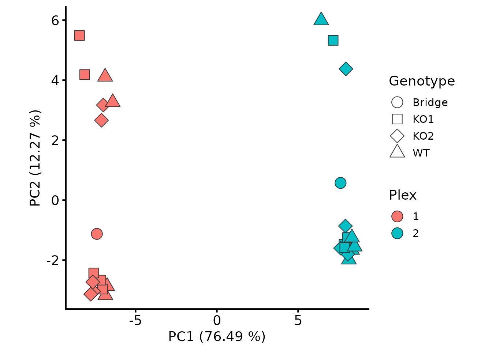
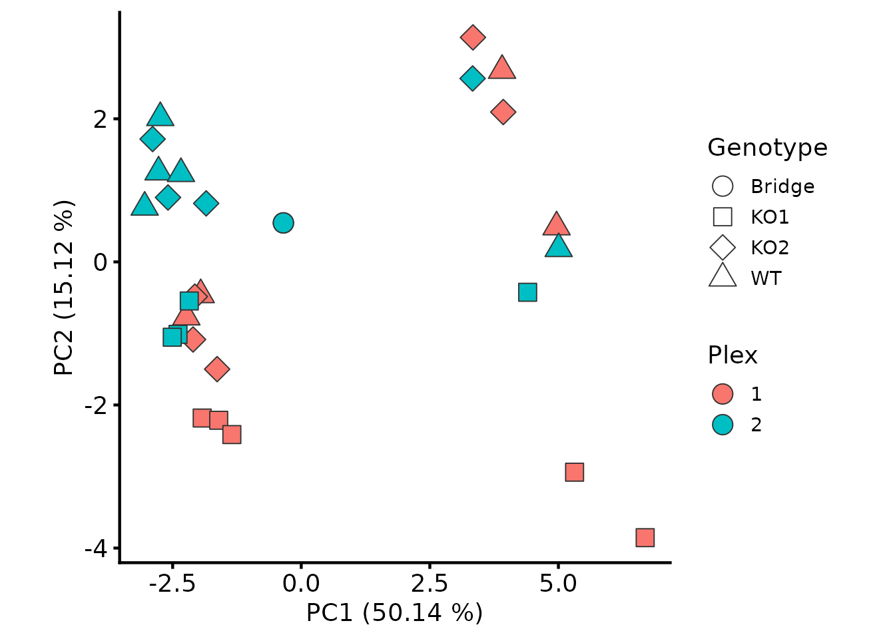
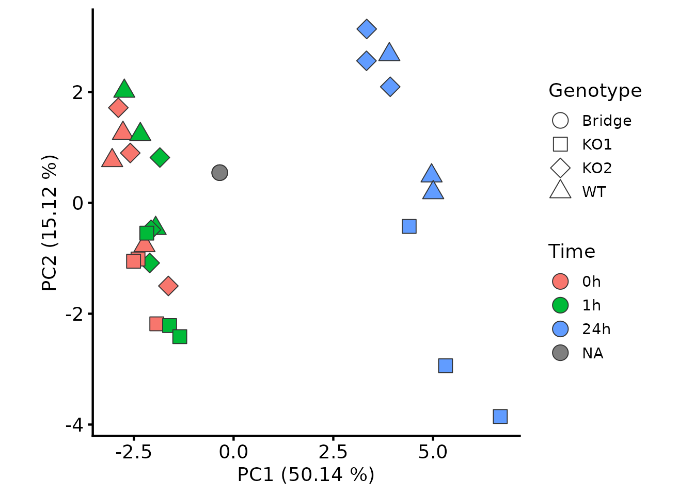

# TMT workflow: multiple plexes and bridge correction

A standard TMTpro plex holds 18 samples, so any larger design has to be
split over several plexes. Each plex is a separate MS run, which changes
the analysis in one important way: the PSMs quantified in one plex are
not the same PSMs as those quantified in another, so a protein’s
abundance in plex 1 and its abundance in plex 2 are built from different
peptides and are not directly comparable. Merging the plexes without
correcting for this confounds plex identity with biology.

This is where TMT’s missing values live. Within a plex, the samples are
quantified from the same MS1 ion and the data are close to complete;
*between* plexes, a protein can be quantified from an entirely different
set of PSMs. The fix is not imputation but a bridge channel: a pooled
sample, identical in every plex, that provides a per-protein reference
point for putting the plexes on a common scale.

The QC and summarisation applied to each plex are those of the [TMT PSM
QC and
summarisation](https://lmb-mass-spec-compbio.github.io/biomasslmb/articles/TMT_PSM_QC_Summarisation.md)
vignette, which works through them on a single plex and explains the
reasoning for each. This vignette assumes them, and concentrates on what
multi-plex experiments add: reading several plexes into one object,
keeping them separate through processing, and joining them onto a common
scale afterwards.

`psm_tmt_2plex` and `tmt_2plex_design` are a real two-plex TMTpro 18plex
experiment: a 3 × 3 factorial of three cell lines (`WT` and two
knockouts) against three drug treatment timepoints, three replicates
each, with one pooled bridge channel per plex.

## Load required packages

``` r

library(QFeatures)
library(biomasslmb)
library(ggplot2)
```

## The experimental design

``` r

knitr::kable(tmt_2plex_design)
```

| Sample    | quantCols | runCol | Plex | Genotype | Time | Replicate |
|:----------|:----------|-------:|:-----|:---------|:-----|:----------|
| Bridge_1  | 126       |      1 | 1    | Bridge   | NA   | NA        |
| KO1_0h_1  | 129C      |      1 | 1    | KO1      | 0h   | 1         |
| KO1_1h_1  | 132C      |      1 | 1    | KO1      | 1h   | 1         |
| KO1_1h_3  | 131N      |      1 | 1    | KO1      | 1h   | 3         |
| KO1_24h_2 | 130N      |      1 | 1    | KO1      | 24h  | 2         |
| KO1_24h_3 | 129N      |      1 | 1    | KO1      | 24h  | 3         |
| KO2_0h_1  | 132N      |      1 | 1    | KO2      | 0h   | 1         |
| KO2_1h_1  | 130C      |      1 | 1    | KO2      | 1h   | 1         |
| KO2_1h_2  | 131C      |      1 | 1    | KO2      | 1h   | 2         |
| KO2_24h_1 | 133C      |      1 | 1    | KO2      | 24h  | 1         |
| KO2_24h_2 | 134C      |      1 | 1    | KO2      | 24h  | 2         |
| WT_0h_2   | 127N      |      1 | 1    | WT       | 0h   | 2         |
| WT_1h_1   | 127C      |      1 | 1    | WT       | 1h   | 1         |
| WT_24h_1  | 134N      |      1 | 1    | WT       | 24h  | 1         |
| WT_24h_2  | 135N      |      1 | 1    | WT       | 24h  | 2         |
| Bridge_2  | 126       |      2 | 2    | Bridge   | NA   | NA        |
| KO1_0h_2  | 130N      |      2 | 2    | KO1      | 0h   | 2         |
| KO1_0h_3  | 131N      |      2 | 2    | KO1      | 0h   | 3         |
| KO1_1h_2  | 133C      |      2 | 2    | KO1      | 1h   | 2         |
| KO1_24h_1 | 127N      |      2 | 2    | KO1      | 24h  | 1         |
| KO2_0h_2  | 131C      |      2 | 2    | KO2      | 0h   | 2         |
| KO2_0h_3  | 130C      |      2 | 2    | KO2      | 0h   | 3         |
| KO2_1h_3  | 128N      |      2 | 2    | KO2      | 1h   | 3         |
| KO2_24h_3 | 135N      |      2 | 2    | KO2      | 24h  | 3         |
| WT_0h_1   | 127C      |      2 | 2    | WT       | 0h   | 1         |
| WT_0h_3   | 128C      |      2 | 2    | WT       | 0h   | 3         |
| WT_1h_2   | 133N      |      2 | 2    | WT       | 1h   | 2         |
| WT_1h_3   | 134N      |      2 | 2    | WT       | 1h   | 3         |
| WT_24h_3  | 134C      |      2 | 2    | WT       | 24h  | 3         |

Three things differ from the single-plex designs above. `quantCols`
holds the TMT tag rather than a sample name, since the same tag denotes
a different sample in each plex. `runCol` holds the plex, and is what
[`QFeatures::readQFeatures`](https://rformassspectrometry.github.io/QFeatures/reference/readQFeatures.html)
uses to split the PSMs into one assay per run. And the bridge channels
are marked by a `Genotype` of `Bridge`: they are the same pooled
material in both plexes, so they have no genotype, timepoint or
replicate of their own.

Channels that were not labelled in a given plex are simply absent from
the design.

## Standardising the peptide to protein assignments

Proteome Discoverer’s PSM-level export can report different sets of
protein accessions for the same peptide sequence, either because several
search engines were used and they disagree, or because leucine and
isoleucine are indistinguishable at typical collision energies and the
redundant sequence matches are reported separately. The peptide-level
export has one consistent assignment per sequence, and
`update_peptide_assignments` uses it to overwrite the PSM-level
assignments.

``` r

pep_inf <- system.file(
  "extdata", "tmt_2plex_PeptideGroups.txt.gz",
  package = "biomasslmb"
)

psms_2plex <- biomasslmb::update_peptide_assignments(
  psm_tmt_2plex, pep_inf, verbose = TRUE)
#> 11619 features found from 504 master proteins => Input
#> 11590 features found from 506 master proteins => Updating peptide assignments
```

The output is shorter than the input because the peptide-level export
selects one of the leucine/isoleucine-equivalent sequences, so PSMs
matched to the sequences it did not select are dropped.

This step is worth doing before `remove_redundant_psm_quant` below,
which refuses to run on inconsistent assignments — it identifies
redundant quantification by looking for duplicate rows, and cannot do so
reliably if the same spectrum appears under two different protein
assignments.

## Reading several plexes into one `QFeatures` object

Passing `runCol = 'Plex'` splits the PSM table on its `Plex` column and
creates one assay per plex, matching channels to plexes through the
`runCol` column of the design.

``` r

tmt_qf_2plex <- QFeatures::readQFeatures(
  assayData = psms_2plex,
  colData = tmt_2plex_design,
  runCol = "Plex")
#> Checking arguments.
#> Loading data as a 'SummarizedExperiment' object.
#> Splitting data in runs.
#> Formatting sample annotations (colData).
#> Formatting data as a 'QFeatures' object.

names(tmt_qf_2plex) <- paste0("psms_raw_", names(tmt_qf_2plex))

names(tmt_qf_2plex)
#> [1] "psms_raw_1" "psms_raw_2"
```

Every assay gets a column for every tag used anywhere in the experiment,
so the assays currently include channels that were not labelled in that
plex. Those columns are entirely `NA` and have no design information
attached, so we remove them.

``` r

tmt_qf_2plex <- tmt_qf_2plex[, !is.na(tmt_qf_2plex$Genotype)]

lapply(experiments(tmt_qf_2plex), dim)
#> $psms_raw_1
#> [1] 5738   15
#> 
#> $psms_raw_2
#> [1] 5852   14
```

The remaining column names combine the plex and the tag, since neither
identifies a sample by itself.

## Processing each plex separately

Everything up to and including summarisation happens within a plex, for
the same reason the plexes cannot be merged yet: `diff.median`
normalisation compares channels within a run, signal:noise and
co-isolation are properties of a spectrum in a particular run, and
summing PSMs across runs would mix quantification from different ions.
The steps themselves are those of the single-plex pipeline, applied in a
loop.

`remove_redundant_psm_quant` is the one addition. Where several search
engines have matched the same spectrum, the PSM export contains one row
per engine per spectrum, with identical quantification; keeping them
would count the same measurement more than once during summarisation.

``` r

plexes <- c("1", "2")

contaminant_accessions <- biomasslmb::get_contaminant_fasta_accessions(
  system.file("extdata", "0602_Universal_Contaminants.fasta.gz",
              package = "biomasslmb"))
contaminant_accessions <- c(contaminant_accessions,
                            sub("^Cont_", "", contaminant_accessions))

for (plex in plexes) {

  raw <- paste0("psms_raw_", plex)
  filtered <- paste0("psms_filtered_", plex)
  normalised <- paste0("psms_norm_", plex)
  sn_filtered <- paste0("psms_filtered_sn_", plex)
  for_sum <- paste0("psms_filtered_forSum_", plex)

  tmt_qf_2plex[[raw]] <- biomasslmb::update_average_sn(tmt_qf_2plex[[raw]])

  tmt_qf_2plex[[filtered]] <- biomasslmb::filter_features_pd_dda(
    tmt_qf_2plex[[raw]],
    contaminant_proteins = contaminant_accessions,
    filter_contaminant = TRUE,
    filter_associated_contaminant = TRUE,
    unique_master = TRUE)

  tmt_qf_2plex <- QFeatures::filterFeatures(
    tmt_qf_2plex, ~ Rank == 1, i = filtered)

  tmt_qf_2plex[[filtered]] <- biomasslmb::remove_redundant_psm_quant(
    tmt_qf_2plex[[filtered]])

  # Normalise on the log2 scale, then return to the original scale
  tmt_qf_2plex[[normalised]] <- QFeatures::normalize(
    QFeatures::logTransform(tmt_qf_2plex[[filtered]], base = 2),
    method = "diff.median")
  assay(tmt_qf_2plex[[normalised]]) <- 2^assay(tmt_qf_2plex[[normalised]])

  tmt_qf_2plex[[sn_filtered]] <- biomasslmb::filter_TMT_PSMs(
    tmt_qf_2plex[[normalised]],
    inter_thresh = 50, sn_thresh = 5, spsmm_thresh = 65)

  tmt_qf_2plex[[for_sum]] <- biomasslmb::filter_features_per_protein(
    QFeatures::filterNA(tmt_qf_2plex[[sn_filtered]], 0), min_features = 2)

  tmt_qf_2plex <- QFeatures::aggregateFeatures(
    tmt_qf_2plex,
    i = for_sum,
    fcol = "Master.Protein.Accessions",
    name = paste0("protein_", plex),
    fun = base::colSums)

  tmt_qf_2plex[[paste0("protein_", plex)]] <- QFeatures::logTransform(
    tmt_qf_2plex[[paste0("protein_", plex)]], base = 2)
}
```

As in the single-plex pipeline, we remove PSMs with any missing value
and summarise by summing. Even at 18 channels, only around a tenth of
the PSMs surviving the signal:noise filter have a missing value in any
channel, so this costs little.

``` r

sapply(plexes, function(plex) {
  nrow(tmt_qf_2plex[[paste0("protein_", plex)]])
})
#>   1   2 
#> 253 270
```

## Joining the plexes

[`QFeatures::joinAssays`](https://rformassspectrometry.github.io/QFeatures/reference/joinAssays.html)
merges the per-plex protein assays into one, matching on row name.

``` r

tmt_qf_2plex <- QFeatures::joinAssays(
  tmt_qf_2plex,
  i = paste0("protein_", plexes),
  name = "protein_joined")

tmt_qf_2plex <- sync_coldata(tmt_qf_2plex, "protein_joined")

dim(tmt_qf_2plex[["protein_joined"]])
#> [1] 284  29
```

The result holds every protein quantified in either plex, with `NA`
where a protein was quantified in one plex but not the other. Proteins
quantified in only one plex are not automatically a problem, but they
carry no information about the plex difference and cannot be corrected
for it, so a testability filter later will usually remove them.

``` r

length(intersect(rownames(tmt_qf_2plex[["protein_1"]]),
                 rownames(tmt_qf_2plex[["protein_2"]])))
#> [1] 239
```

## Why the plexes are not yet comparable

The bridge channels are the same pooled material, so in the absence of a
plex effect their protein abundances should agree. Plotting one against
the other shows they do not.

``` r

bridge_cols <- rownames(colData(tmt_qf_2plex))[
  colData(tmt_qf_2plex)$Genotype == "Bridge"]

bridge_quant <- assay(tmt_qf_2plex[["protein_joined"]])[, bridge_cols]

plot(bridge_quant,
     xlab = "Bridge, plex 1 (log2)", ylab = "Bridge, plex 2 (log2)")
```


``` r


sd(bridge_quant[, 1] - bridge_quant[, 2], na.rm = TRUE)
#> [1] 0.8740993
```

The consequence for the experiment as a whole is visible in a PCA: plex,
not biology, is the dominant source of variance.

How much that matters for the final result depends on how the conditions
are distributed across the plexes, and it is not always a question of
power. Where a contrast is balanced across plexes the plex effect
inflates the residual variance and costs you hits you should have found;
where it is confounded with plex, the uncorrected analysis reports
differences that are the plex rather than the biology.

``` r

biomasslmb::plot_pca(tmt_qf_2plex, i = "protein_joined",
                     colour_by = "Plex", shape_by = "Genotype")
```



## Bridge correction

`bridge_normalise` takes, for each protein, the difference between its
abundance in a plex’s bridge channel and its abundance across the
plexes’ bridge channels, and subtracts that from every sample in that
plex. On the log2 scale a subtraction is a ratio, so this rescales each
plex by the per-protein factor needed to bring its bridge into line with
the others.

`bridge_cols` identifies the bridge channels. It takes a logical vector
rather than a column name, because designs record which channels are the
pooled reference in whatever way suits them — a `Type` column, a `Pool`
prefix on a sample identifier — and a predicate works with all of them.

``` r

protein_joined <- tmt_qf_2plex[["protein_joined"]]

tmt_qf_2plex[["protein_bridge_norm"]] <- biomasslmb::bridge_normalise(
  protein_joined,
  plex_col = "Plex",
  bridge_cols = protein_joined$Genotype == "Bridge")
#> 284 features across 2 plexes
#> plex 1: 1 bridge channel(s), median absolute correction 0.302
#> plex 2: 1 bridge channel(s), median absolute correction 0.282
```

The reported correction is the size of the plex effect being removed: a
median of around 0.3 on the log2 scale is a factor of about 1.2 in
abundance, applied per protein.

A protein needs a bridge value in a plex to be placed on the common
scale. Where one is missing but the protein was quantified in that
plex’s samples, those samples are set to `NA` by default, since there is
no basis for comparing them with the other plexes; `on_missing` offers
the alternatives of dropping the protein or leaving the plex
uncorrected. Proteins absent from a plex altogether are unaffected —
there is nothing there to correct.

The bridge channels are now identical by construction, so their
agreement is not evidence that the correction worked. The evidence is
what happened to the other samples: plex is no longer the dominant
source of variance.

``` r

biomasslmb::plot_pca(tmt_qf_2plex, i = "protein_bridge_norm",
                     colour_by = "Plex", shape_by = "Genotype")
```



Colouring the same PCA by timepoint instead shows what the plex effect
was hiding: the 24 hour samples separate from the earlier timepoints
along PC1, in both plexes and in all three cell lines.

``` r

biomasslmb::plot_pca(tmt_qf_2plex, i = "protein_bridge_norm",
                     colour_by = "Time", shape_by = "Genotype")
```



## Removing the bridge channels

The bridge channels have served their purpose and are not samples of the
experiment, so we drop them. With the plexes now on a common scale, the
tag-and-plex column names can be replaced by the sample names from the
design.

``` r

protein_se <- tmt_qf_2plex[["protein_bridge_norm"]]
protein_se <- protein_se[, protein_se$Genotype != "Bridge"]
colnames(protein_se) <- protein_se$Sample

tmt_qf_2plex[["protein"]] <- protein_se

colData(tmt_qf_2plex[["protein"]])[1:3, ]
#> DataFrame with 3 rows and 7 columns
#>                Sample   quantCols    runCol     Plex    Genotype        Time
#>           <character> <character> <numeric> <factor> <character> <character>
#> WT_0h_2       WT_0h_2        127N         1        1          WT          0h
#> WT_1h_1       WT_1h_1        127C         1        1          WT          1h
#> KO1_24h_3   KO1_24h_3        129N         1        1         KO1         24h
#>             Replicate
#>           <character>
#> WT_0h_2             2
#> WT_1h_1             1
#> KO1_24h_3           3
```

## If there is no bridge channel

Bridge channels cost one channel per plex, and experiments do arrive
without them. The usual alternative is internal reference scaling: use
each plex’s own channels as the per-protein reference in place of the
bridge, which is `bridge_cols = rep(TRUE, ncol(protein_joined))`. This
assumes that the average sample is equivalent in every plex, which holds
when the conditions are balanced across plexes and fails when they are
not — an unbalanced split can remove the biological difference along
with the plex effect. Including plex as a term in the `limma` design
matrix is another option, and models the plex offset rather than
removing it, but it cannot be used for analyses that need a corrected
quantification matrix.

If you are still designing the experiment, include a bridge channel: it
makes the correction explicit, checkable, and independent of how the
conditions are distributed across plexes.

## Where to go next

The bridge-normalised protein-level abundances are ready for the
exploration and testing described in the [data exploration and
statistical
testing](https://lmb-mass-spec-compbio.github.io/biomasslmb/articles/exploration_and_statistical_testing.md)
vignette. Include `Plex` among the variables you inspect there: bridge
correction should have removed the plex effect, and a PCA still
separating on plex means it did not.

## Getting help

If your experiment does not fit what this article assumes, or a result
looks wrong, please get in touch with Tom Smith (<tsmith@mrclmb.ac.uk>)
rather than guessing — it is far easier to help while an analysis is in
progress than to unpick a decision afterwards, and easier still before
the samples are run. [Getting
started](https://lmb-mass-spec-compbio.github.io/biomasslmb/articles/biomasslmb.md)
sets out which article applies to which experiment.

``` r

sessionInfo()
#> R version 4.5.3 (2026-03-11)
#> Platform: x86_64-pc-linux-gnu
#> Running under: Ubuntu 24.04.5 LTS
#> 
#> Matrix products: default
#> BLAS:   /usr/lib/x86_64-linux-gnu/openblas-pthread/libblas.so.3 
#> LAPACK: /usr/lib/x86_64-linux-gnu/openblas-pthread/libopenblasp-r0.3.26.so;  LAPACK version 3.12.0
#> 
#> locale:
#>  [1] LC_CTYPE=C.UTF-8       LC_NUMERIC=C           LC_TIME=C.UTF-8       
#>  [4] LC_COLLATE=C.UTF-8     LC_MONETARY=C.UTF-8    LC_MESSAGES=C.UTF-8   
#>  [7] LC_PAPER=C.UTF-8       LC_NAME=C              LC_ADDRESS=C          
#> [10] LC_TELEPHONE=C         LC_MEASUREMENT=C.UTF-8 LC_IDENTIFICATION=C   
#> 
#> time zone: UTC
#> tzcode source: system (glibc)
#> 
#> attached base packages:
#> [1] stats4    stats     graphics  grDevices utils     datasets  methods  
#> [8] base     
#> 
#> other attached packages:
#>  [1] ggplot2_4.0.3               biomasslmb_0.1.0           
#>  [3] QFeatures_1.20.0            MultiAssayExperiment_1.36.2
#>  [5] SummarizedExperiment_1.40.0 Biobase_2.70.0             
#>  [7] GenomicRanges_1.62.1        Seqinfo_1.0.0              
#>  [9] IRanges_2.44.0              S4Vectors_0.48.1           
#> [11] BiocGenerics_0.56.0         generics_0.1.4             
#> [13] MatrixGenerics_1.22.0       matrixStats_1.5.0          
#> 
#> loaded via a namespace (and not attached):
#>  [1] tidyselect_1.2.1        dplyr_1.2.1             farver_2.1.2           
#>  [4] blob_1.3.0              Biostrings_2.78.0       S7_0.2.2               
#>  [7] fastmap_1.2.0           lazyeval_0.2.3          XML_3.99-0.24          
#> [10] digest_0.6.39           lifecycle_1.0.5         cluster_2.1.8.2        
#> [13] ProtGenerics_1.42.0     survival_3.8-6          KEGGREST_1.50.0        
#> [16] RSQLite_3.53.3          magrittr_2.0.5          genefilter_1.92.0      
#> [19] compiler_4.5.3          rlang_1.3.0             sass_0.4.10            
#> [22] tools_4.5.3             igraph_2.3.3            yaml_2.3.12            
#> [25] corrplot_0.95           knitr_1.52              labeling_0.4.3         
#> [28] S4Arrays_1.10.1         htmlwidgets_1.6.4       bit_4.6.0              
#> [31] DelayedArray_0.36.1     plyr_1.8.9              RColorBrewer_1.1-3     
#> [34] abind_1.4-8             withr_3.0.3             purrr_1.2.2            
#> [37] desc_1.4.3              grid_4.5.3              xtable_1.8-8           
#> [40] scales_1.4.0            MASS_7.3-65             cli_3.6.6              
#> [43] rmarkdown_2.32          crayon_1.5.3            ragg_1.5.2             
#> [46] otel_0.2.0              robustbase_0.99-7       httr_1.4.9             
#> [49] reshape2_1.4.5          BiocBaseUtils_1.12.0    DBI_1.3.0              
#> [52] cachem_1.1.0            stringr_1.6.0           splines_4.5.3          
#> [55] AnnotationDbi_1.72.0    AnnotationFilter_1.34.0 XVector_0.50.0         
#> [58] vctrs_0.7.3             Matrix_1.7-4            jsonlite_2.0.0         
#> [61] naniar_1.1.0            visdat_0.6.0            bit64_4.8.6            
#> [64] clue_0.3-68             systemfonts_1.3.2       tidyr_1.3.2            
#> [67] jquerylib_0.1.4         annotate_1.88.0         glue_1.8.1             
#> [70] DEoptimR_1.2-1          pkgdown_2.2.1           uniprotREST_1.0.0      
#> [73] stringi_1.8.9           gtable_0.3.6            tibble_3.3.1           
#> [76] pillar_1.11.1           htmltools_0.5.9         R6_2.6.1               
#> [79] textshaping_1.0.5       evaluate_1.0.5          lattice_0.22-9         
#> [82] backports_1.5.1         png_0.1-9               memoise_2.0.1          
#> [85] bslib_0.12.0            Rcpp_1.1.2              checkmate_2.3.4        
#> [88] SparseArray_1.10.10     xfun_0.60               MsCoreUtils_1.22.1     
#> [91] fs_2.1.0                pkgconfig_2.0.3
```
