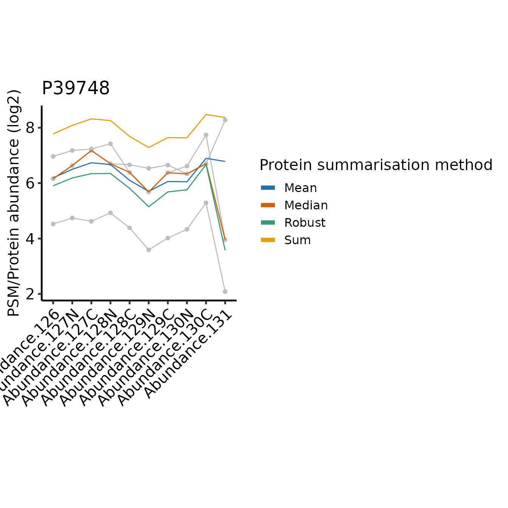
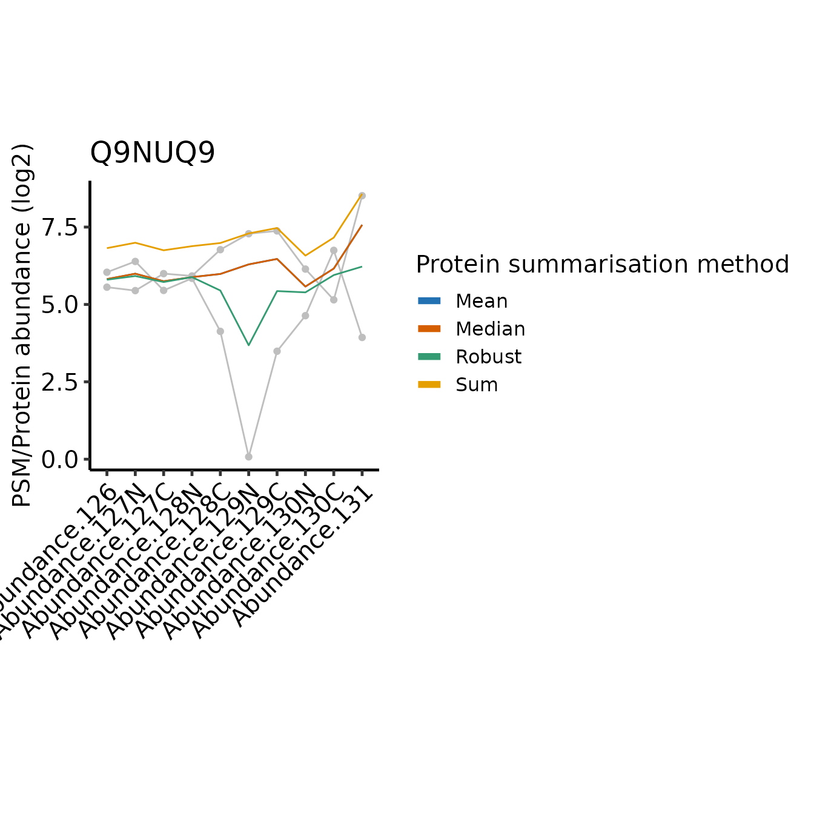

# TMT - comparing protein summarisation approaches

Here, we will consider different protein summarisation approaches for
TMT data, depending on whether missing values need to be retained. The
comparison between summarisation approaches is also informative when
considering what it means to summarise from PSMs to protein-level
abundances.

For PSM to protein summarisation with TMT quantification, simply summing
together the PSM-level abundances provides accurate estimates, so long
as there are no missing values. If many missing values are present, the
[`MsCoreUtils::robustSummary`](https://rdrr.io/pkg/MsCoreUtils/man/robustSummary.html)
method may be preferred, since it is able to summarise accurately, even
in the presence of missing values (Sticker et al. 2020).

## Load required packages

To clarify which functionality is provided by which package, we will use
`package::function`. For your own code, there is no need to specify the
package unless you want to maintain this clarity.

``` r
library(QFeatures)
library(biomasslmb)
library(ggplot2)
library(tidyr)
library(dplyr)
```

`tmt_qf` is a `QFeatures` object available from the `biomasslmb` package
which was generated in the
`TMT QC PSM-level quantification and summarisation to protein-level abundance`
vignette. It already contains protein-level quantification from a simple
‘sum’ summarisation, where missing values were removed and proteins with
a single PSM were removed. Here, we will compare this with the ‘robust’
summaristion, which requires some additional steps to ensure it is
performed appropriately.

### Summarisation with robustSummary

With `robustSummary`, we do not need to remove all PSMs with missing
values since the summarisation algorithm deals with them appropriately.
However, we still don’t want to retain PSMs with too many missing
values, since these will not be very informative in estimating the
protein-level quantification. Here, we will retain PSMs with at most
5/10 missing values

``` r
tmt_qf[['psms_filtered_forRobust']] <- QFeatures::filterNA(
  tmt_qf[['psms_filtered_rank']], 5/10)
```

Next, we remove PSMs for proteins with fewer than 2 PSMs.

``` r

min_psms <- 2
 
tmt_qf[['psms_filtered_forRobust']] <- biomasslmb::filter_features_per_protein(
  tmt_qf[['psms_filtered_forRobust']], min_features = min_psms)
```

For the `robustSummary` summarisation, we need our quantification values
to be approximately Gaussian distributed. Hence, we log transform them.

``` r
tmt_qf[['psms_filtered_forRobust']] <- QFeatures::logTransform(
  tmt_qf[['psms_filtered_forRobust']], base=2)
```

Now we can summarise with `robustSummary`

``` r
# Aggregate to protein-level abundances (using QFeatures function)
tmt_qf <- QFeatures::aggregateFeatures(tmt_qf, 
                                       i = "psms_filtered_forRobust", 
                                       fcol = "Master.Protein.Accessions",
                                       name = "protein_robust",
                                       fun = MsCoreUtils::robustSummary,
                                       maxit=1000)
#> Your quantitative data contain missing values. Please read the relevant
#> section(s) in the aggregateFeatures manual page regarding the effects
#> of missing values on data aggregation.
```

Prior to summaristaion, we removed PSMs from proteins with fewer than 2
PSMs. However, since we left in PSMs with missing values, it’s possible
for some protein-level abundances to be derived from just a single PSM.
We can use the `get_protein_no_quant_mask` from `biomasslmb` to identify
where the protein abundances will be derived from fewer than `n`
features (PSMs). We can then give this mask to
`mask_protein_level_quant` to replace these quantification values with
NA.

``` r
# plot = TRUE means we will also get a plot of the number of proteins quantified in each sample
protein_retain_mask <- biomasslmb::get_protein_no_quant_mask(
  tmt_qf[['psms_filtered_forRobust']], min_features=2, plot=TRUE) 
```


``` r

tmt_qf[['protein_robust']] <- biomasslmb::mask_protein_level_quant(
  tmt_qf[['protein_robust']], protein_retain_mask)
```

### Summarisation with median or mean

We will also include summarisation with mean and median, since these are
typical approaches for summarising across observations and will aid the
interpretation when we compare the summasiation approaches. We will use
the PSMs with missing values filtered, even though `mean` and `median`
can handle missing values with `na.rm=TRUE`, since ignoring missing
values is inappropriate for summarisation of PSMs to proteins with these
methods.

``` r

tmt_qf <- QFeatures::aggregateFeatures(tmt_qf, 
                                       i = "psms_filtered_forSum", 
                                       fcol = "Master.Protein.Accessions",
                                       name = "protein_mean",
                                       fun = base::colMeans, na.rm=TRUE)

tmt_qf <- QFeatures::aggregateFeatures(tmt_qf, 
                                       i = "psms_filtered_forSum", 
                                       fcol = "Master.Protein.Accessions",
                                       name = "protein_median",
                                       fun = matrixStats::colMedians, na.rm=TRUE)

tmt_qf[['protein_mean']] <- QFeatures::logTransform(
  tmt_qf[['protein_mean']], base=2)

tmt_qf[['protein_median']] <- QFeatures::logTransform(
  tmt_qf[['protein_median']], base=2)
```

### Comparing the summarisation approaches

We can see that performing the robust summarisation allows us to retain
more proteins, since we can still use the PSMs with a low number of
missing values.

``` r
nrow(tmt_qf[['protein']])
#> [1] 891
nrow(tmt_qf[['protein_robust']])
#> [1] 921
```

However, with sum summarisation, we have complete quantification data
(no missing values), whereas with `robustSummary`, we will proteins with
missing values in some samples. In this case, the protein-level data is
99.48 % complete, so the impact of the missing values on the downstream
analysis will be minimal. We can inspect missing values using the
[`QFeatures::nNA`](https://rdrr.io/pkg/QFeatures/man/QFeatures-missing-data.html)
function, or just `is.na` on the quantitative data matrix.

``` r
QFeatures::nNA(tmt_qf[['protein']])$nNAcols
#> DataFrame with 10 rows and 3 columns
#>             name       nNA       pNA
#>      <character> <integer> <numeric>
#> 1  Abundance....         0         0
#> 2  Abundance....         0         0
#> 3  Abundance....         0         0
#> 4  Abundance....         0         0
#> 5  Abundance....         0         0
#> 6  Abundance....         0         0
#> 7  Abundance....         0         0
#> 8  Abundance....         0         0
#> 9  Abundance....         0         0
#> 10 Abundance....         0         0
QFeatures::nNA(tmt_qf[['protein_robust']])$nNAcols
#> DataFrame with 10 rows and 3 columns
#>             name       nNA        pNA
#>      <character> <integer>  <numeric>
#> 1  Abundance....         0 0.00000000
#> 2  Abundance....         0 0.00000000
#> 3  Abundance....         1 0.00108578
#> 4  Abundance....         5 0.00542888
#> 5  Abundance....         2 0.00217155
#> 6  Abundance....         5 0.00542888
#> 7  Abundance....         2 0.00217155
#> 8  Abundance....         7 0.00760043
#> 9  Abundance....        11 0.01194354
#> 10 Abundance....        15 0.01628664


message(sprintf('%.2f %% missing values', 100*mean(
  is.na(assay(tmt_qf[['protein_robust']])))))
#> 0.52 % missing values
```

To better understand the difference between how the two summarisation
methods use the available data, we can inspect the single protein which
has no missing values with `robustSummary`, but is not summarised with
`sum`.

``` r
# Identify the proteins with no missing values present only following robustSummary
protein_robust_proteins <- rownames(filterNA(tmt_qf[['protein_robust']]))
protein_sum_proteins <- rownames(filterNA(tmt_qf[['protein']]))

no_missing_robustSummary_only <- setdiff(protein_robust_proteins, protein_sum_proteins)
print(no_missing_robustSummary_only)
#> [1] "P22695"
```

If we inspect the PSM level abundances for this protein, we see that
there are 3 PSMs, of which the first two contain missing values in a
single sample. Thus, we have only one complete PSM, which is
insufficient for confident summarisation using `sum`. However, all 3
PSMs have sufficiently few missing values to be used with the
`robustSummary` method and all samples have at least two non missing
values across the 3 PSMs, so this protein is quantified in all samples
with `robustSummary`.

``` r

retain_psms <- rowData(
  tmt_qf[['psms_filtered_sn']])$Master.Protein.Accessions==no_missing_robustSummary_only

assay(tmt_qf[['psms_filtered_sn']][retain_psms,])
#>      Abundance.126 Abundance.127N Abundance.127C Abundance.128N Abundance.128C
#> 517      114.68442       158.3876       286.2073       438.4889       173.5508
#> 1686     587.11851       412.4273       322.2673       232.8183      1419.0267
#> 3597      89.15436       134.6058       212.5193       336.5223       139.6542
#>      Abundance.129N Abundance.129C Abundance.130N Abundance.130C Abundance.131
#> 517        41.27858       15.23801       10.07546             NA            NA
#> 1686      494.28845             NA       23.85513      33.802622     58.042540
#> 3597       31.63687       24.65788       17.03938       4.101573      8.346825
```

We can directly compare the protein-level abundance estimates to explore
where these two summarisation methods differ in their estimates.

``` r
# Define a function to extract the protein abundances in long form and
# add a column annotating the method
get_long_form_prot_exp <- function(obj, method_name) {
  assay(obj) %>%
    data.frame() %>%
    tibble::rownames_to_column('protein') %>%
    pivot_longer(cols=-protein) %>%
    mutate(method = method_name)
}

# Single object with protein inference from both methods 
compare_protein_abundances <- rbind(
  mutate(longFormat(tmt_qf[['protein']]), method='Sum'),
  mutate(longFormat(tmt_qf[['protein_robust']]), method='Robust'),
  mutate(longFormat(tmt_qf[['protein_median']]), method='Median'),
  mutate(longFormat(tmt_qf[['protein_mean']]), method='Mean')
)


print(head(compare_protein_abundances))
#>   rowname       colname     value method
#> 1  A1L0T0 Abundance.126  8.340996    Sum
#> 2  A4D1E9 Abundance.126  9.674770    Sum
#> 3  A6NHR9 Abundance.126 10.319013    Sum
#> 4  O00116 Abundance.126  6.884527    Sum
#> 5  O00154 Abundance.126  5.597842    Sum
#> 6  O00159 Abundance.126 10.410898    Sum
```

We want to identify the proteins with the lowest correlation for
abundances across the samples between summarisation methods so we can
inspect the difference between them.

``` r
proteins_of_interest <- compare_protein_abundances %>%
  pivot_wider(names_from = method, values_from = value) %>%
  group_by(rowname) %>%
  summarise(cor_sum_median=cor(Sum, Median),
            cor_sum_robust=cor(Sum, Robust)) %>%
  pivot_longer(cols=-rowname) %>%
  group_by(rowname) %>%
  summarise(min_cor=min(value)) %>%
  slice_min(min_cor, n=5) %>%
  pull(rowname)
```

Below, we define a function to plot the PSM and protein level abundances
for a single protein.

``` r
plot_pep_and_protein <- function(protein_of_interest) {
  
  to_plot_compare <- compare_protein_abundances %>% 
    filter(rowname == protein_of_interest)
  
  QFeatures::filterFeatures(
    tmt_qf,
    VariableFilter("Master.Protein.Accessions",
                   protein_of_interest,
                   condition = "=="))[['psms_filtered_sn']] %>%
    longFormat() %>%
    ggplot(aes(x = colname, y = log2(value))) +
    geom_line(aes(group = rowname), colour = 'grey') +
    geom_point(colour = 'grey') +
    geom_line(data = to_plot_compare,
              aes(x = colname, y = value, colour = method, group = method)) +
    #geom_point(data = to_plot_compare,  position=position_dodge(width=0.5),
    #           aes(x = colname, y = value, colour = method)) +
    scale_colour_manual(values = get_cat_palette(4),
                        name = 'Protein summarisation method') +
    theme_biomasslmb(base_size = 15, border = FALSE, base_family = 'sans') +
    theme(axis.text.x = element_text(angle = 45, vjust = 1, hjust = 1)) +
    labs(
      title = protein_of_interest,
      x = '',
      y = 'PSM/Protein abundance (log2)'
    ) +
    guides(color = guide_legend(override.aes = list(linewidth = 2) ) )
}
```

In the plots below, PSM level quantifications are in grey and the
summarised protein-level abundances are in colours. You can disregard
the y-axis scale when comparing between the methods, or between the
protein and peptide level abundances. The important thing to focus on is
the abundance profile between the tags for any one summarisation method
or PSM.

``` r
for(poi in proteins_of_interest) print(plot_pep_and_protein(poi))
```



In all cases, the protein-level quantification values are relatively
similar for most tags, the differences between the approach typically
restricted to one or two tags where the PSMs disagree on the relative
abundances between the samples.

Since `sum` simply adds together the abundance values across the PSMs
for a given tag and the abundance values may be across multiple orders
of magnitude, the protein-level abundance pattern across the tags is
weighted towards the most abundant PSMs. This is likely to be a positive
attribute, since the most abundant PSMs will be more accurately
quantified. However, the summarisation is also sensitive to high
abundance outliers.

On the other hand, `robustSummary` is less sensitive to outliers, but it
treats all PSMs equally. In the forth example (Q9NUQ9) we can see how
this can lead to potential inaccuracies when we have only 2 PSMs and one
is very low intensity. For example, tag 129C is mid-range intensity
compared to the other tags for the abundant PSM, but very low for the
less abundant PSM. This has almost no impact on the `sum` summarise
protein abundance, but a large impact when we use `robustSummary`.

Note that mean is identical to sum with respect to the relative
abundance across the samples, just on a difference scale, since mean is
sum/n(PSMs).

The median is less sensitive to outliers than the mean, but ignores much
of the quantitative data since it’s only affected by the ‘middle’ PSMs.
In the most extreme instances, median just simplifies the PSM level
abundances down to a single representative ‘middle’ PSM.

### Summary

`sum`/`mean` are more sensitive to the abundances for the highest
intensity PSMs, which are likely to be the most accurately quantified.
However, they are therefore also more sensitive to outlier values with
very high abundance. `robustSummary` handles missing values and
therefore enables more proteins to be quantified but it is more
sensitive to low intensity PSMs, which may be less accurately
quantified. For typical TMT datasets with very low missing values,
`sum`/`mean` are likely to be the best approach. Where there are more
missing values, consider using `robust` instead.

``` r
sessionInfo()
#> R version 4.4.3 (2025-02-28)
#> Platform: x86_64-pc-linux-gnu
#> Running under: Ubuntu 24.04.3 LTS
#> 
#> Matrix products: default
#> BLAS:   /usr/lib/x86_64-linux-gnu/openblas-pthread/libblas.so.3 
#> LAPACK: /usr/lib/x86_64-linux-gnu/openblas-pthread/libopenblasp-r0.3.26.so;  LAPACK version 3.12.0
#> 
#> locale:
#>  [1] LC_CTYPE=C.UTF-8       LC_NUMERIC=C           LC_TIME=C.UTF-8       
#>  [4] LC_COLLATE=C.UTF-8     LC_MONETARY=C.UTF-8    LC_MESSAGES=C.UTF-8   
#>  [7] LC_PAPER=C.UTF-8       LC_NAME=C              LC_ADDRESS=C          
#> [10] LC_TELEPHONE=C         LC_MEASUREMENT=C.UTF-8 LC_IDENTIFICATION=C   
#> 
#> time zone: UTC
#> tzcode source: system (glibc)
#> 
#> attached base packages:
#> [1] stats4    stats     graphics  grDevices utils     datasets  methods  
#> [8] base     
#> 
#> other attached packages:
#>  [1] dplyr_1.1.4                 tidyr_1.3.2                
#>  [3] ggplot2_4.0.1               biomasslmb_0.0.4           
#>  [5] QFeatures_1.16.0            MultiAssayExperiment_1.32.0
#>  [7] SummarizedExperiment_1.36.0 Biobase_2.66.0             
#>  [9] GenomicRanges_1.58.0        GenomeInfoDb_1.42.3        
#> [11] IRanges_2.40.1              S4Vectors_0.44.0           
#> [13] BiocGenerics_0.52.0         MatrixGenerics_1.18.1      
#> [15] matrixStats_1.5.0          
#> 
#> loaded via a namespace (and not attached):
#>  [1] DBI_1.2.3               rlang_1.1.7             magrittr_2.0.4         
#>  [4] clue_0.3-66             otel_0.2.0              compiler_4.4.3         
#>  [7] RSQLite_2.4.5           png_0.1-8               systemfonts_1.3.1      
#> [10] vctrs_0.6.5             reshape2_1.4.5          stringr_1.6.0          
#> [13] ProtGenerics_1.38.0     pkgconfig_2.0.3         crayon_1.5.3           
#> [16] fastmap_1.2.0           backports_1.5.0         XVector_0.46.0         
#> [19] labeling_0.4.3          rmarkdown_2.30          UCSC.utils_1.2.0       
#> [22] visdat_0.6.0            ragg_1.5.0              purrr_1.2.1            
#> [25] bit_4.6.0               xfun_0.55               zlibbioc_1.52.0        
#> [28] cachem_1.1.0            jsonlite_2.0.0          blob_1.2.4             
#> [31] DelayedArray_0.32.0     cluster_2.1.8           R6_2.6.1               
#> [34] bslib_0.9.0             stringi_1.8.7           RColorBrewer_1.1-3     
#> [37] genefilter_1.88.0       jquerylib_0.1.4         Rcpp_1.1.1             
#> [40] knitr_1.51              BiocBaseUtils_1.8.0     Matrix_1.7-2           
#> [43] splines_4.4.3           igraph_2.2.1            tidyselect_1.2.1       
#> [46] abind_1.4-8             yaml_2.3.12             lattice_0.22-6         
#> [49] tibble_3.3.1            plyr_1.8.9              withr_3.0.2            
#> [52] KEGGREST_1.46.0         S7_0.2.1                evaluate_1.0.5         
#> [55] uniprotREST_1.0.0       desc_1.4.3              survival_3.8-3         
#> [58] Biostrings_2.74.1       pillar_1.11.1           corrplot_0.95          
#> [61] checkmate_2.3.3         generics_0.1.4          scales_1.4.0           
#> [64] xtable_1.8-4            glue_1.8.0              lazyeval_0.2.2         
#> [67] tools_4.4.3             robustbase_0.99-6       annotate_1.84.0        
#> [70] fs_1.6.6                XML_3.99-0.20           grid_4.4.3             
#> [73] MsCoreUtils_1.18.0      AnnotationDbi_1.68.0    GenomeInfoDbData_1.2.13
#> [76] naniar_1.1.0            cli_3.6.5               textshaping_1.0.4      
#> [79] S4Arrays_1.6.0          AnnotationFilter_1.30.0 gtable_0.3.6           
#> [82] DEoptimR_1.1-4          sass_0.4.10             digest_0.6.39          
#> [85] SparseArray_1.6.2       htmlwidgets_1.6.4       farver_2.1.2           
#> [88] memoise_2.0.1           htmltools_0.5.9         pkgdown_2.2.0          
#> [91] lifecycle_1.0.5         httr_1.4.7              bit64_4.6.0-1          
#> [94] MASS_7.3-64
```

Sticker, Adriaan, Ludger Goeminne, Lennart Martens, and Lieven Clement.
2020. “Robust Summarization and Inference in Proteome-wide Label-free
Quantification.” *Molecular & cellular proteomics: MCP* 19 (7): 1209–19.
<https://doi.org/10.1074/mcp.RA119.001624>.
