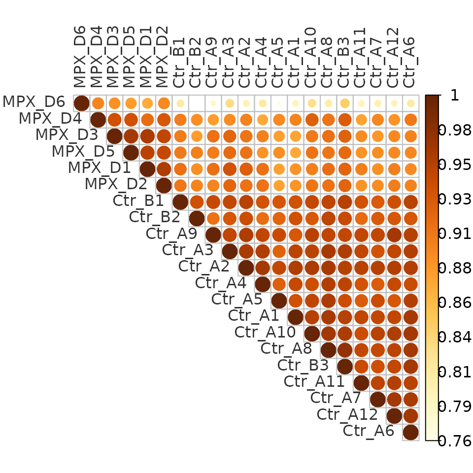
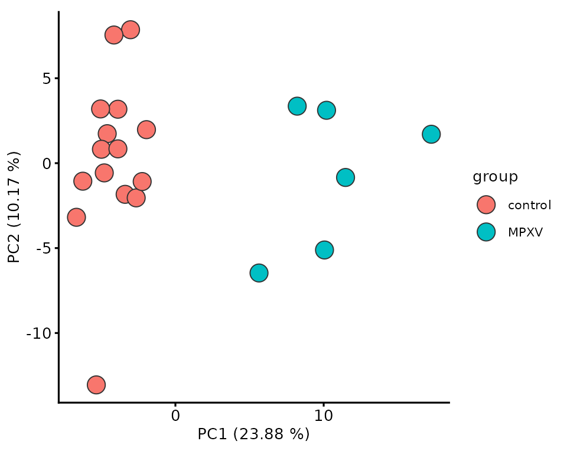
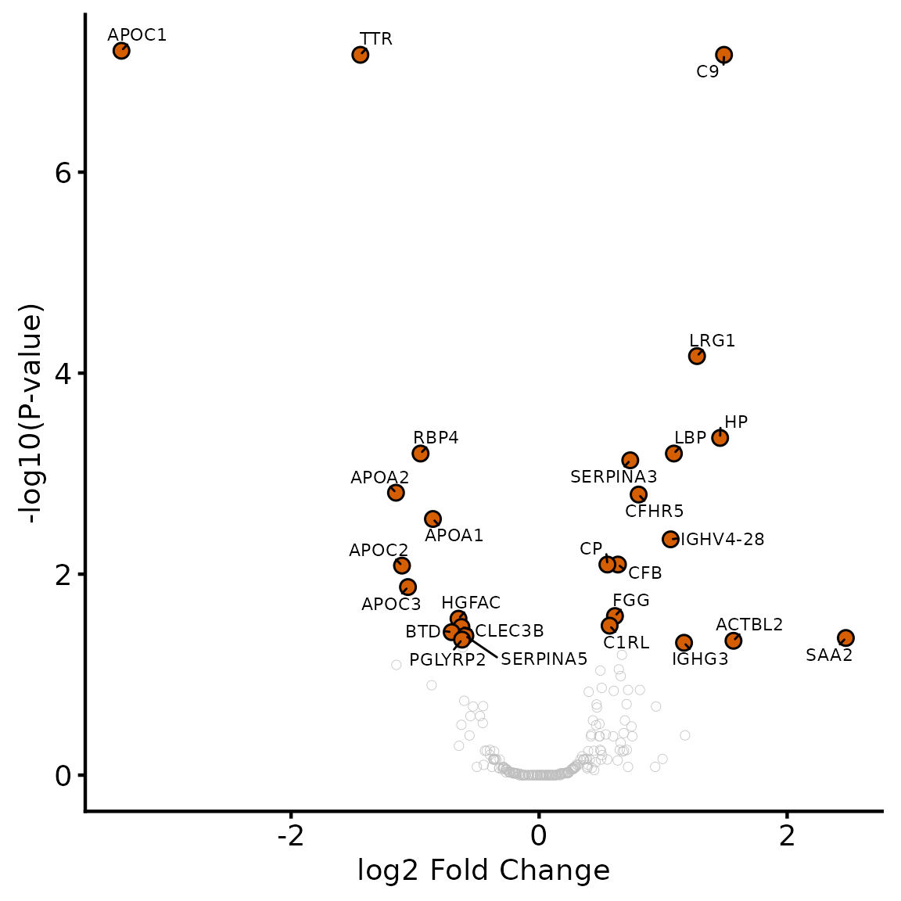
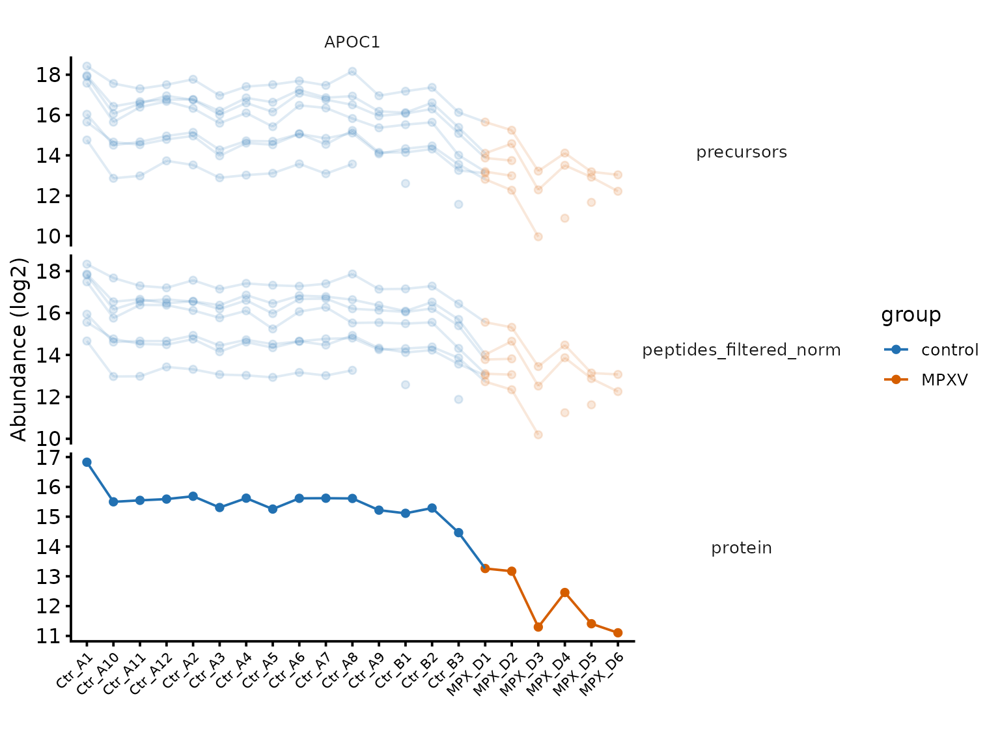
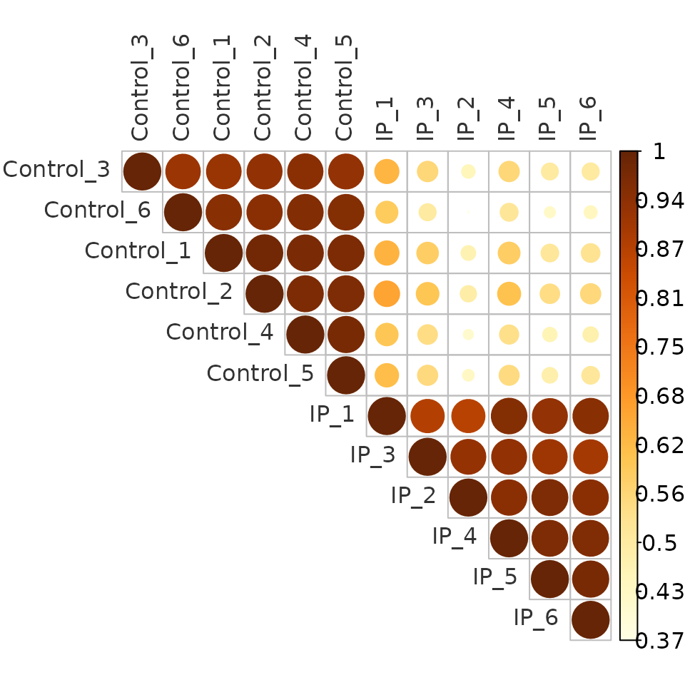
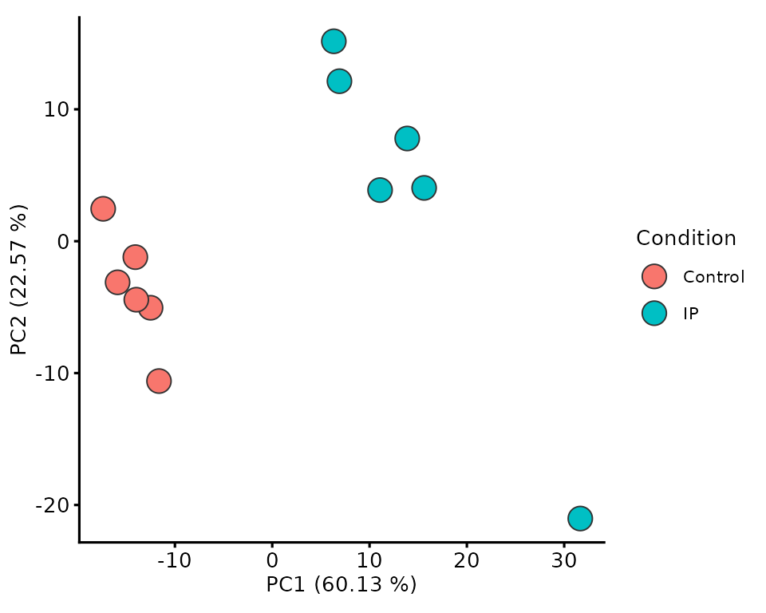
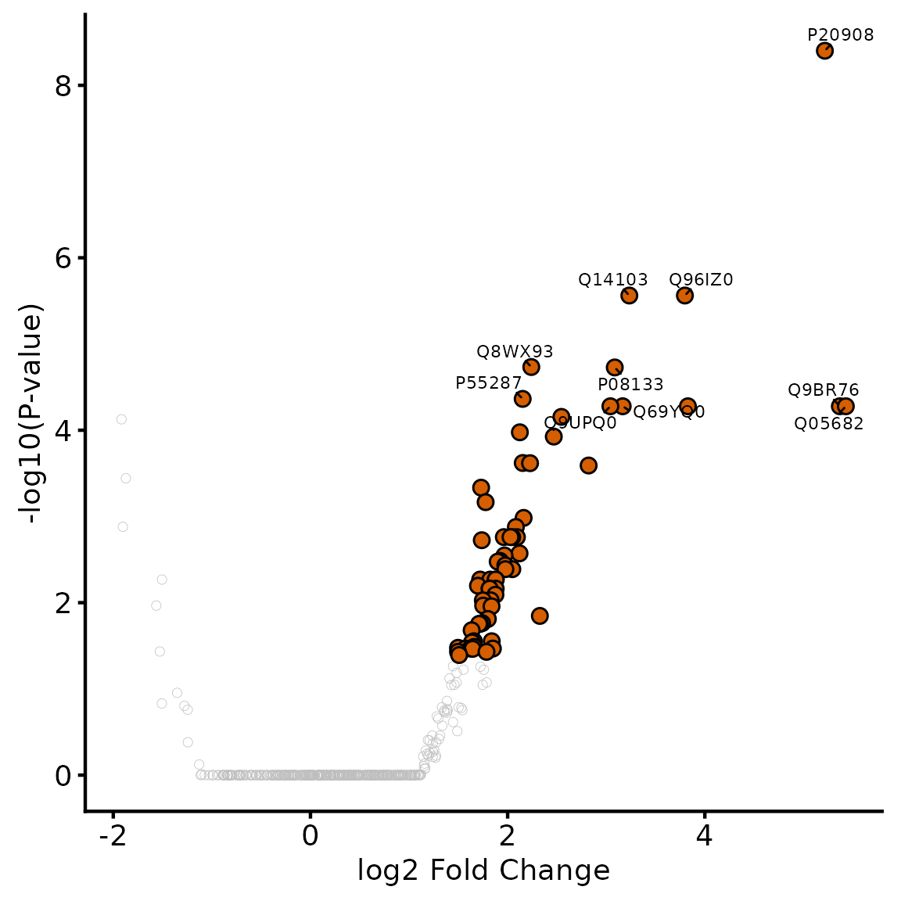
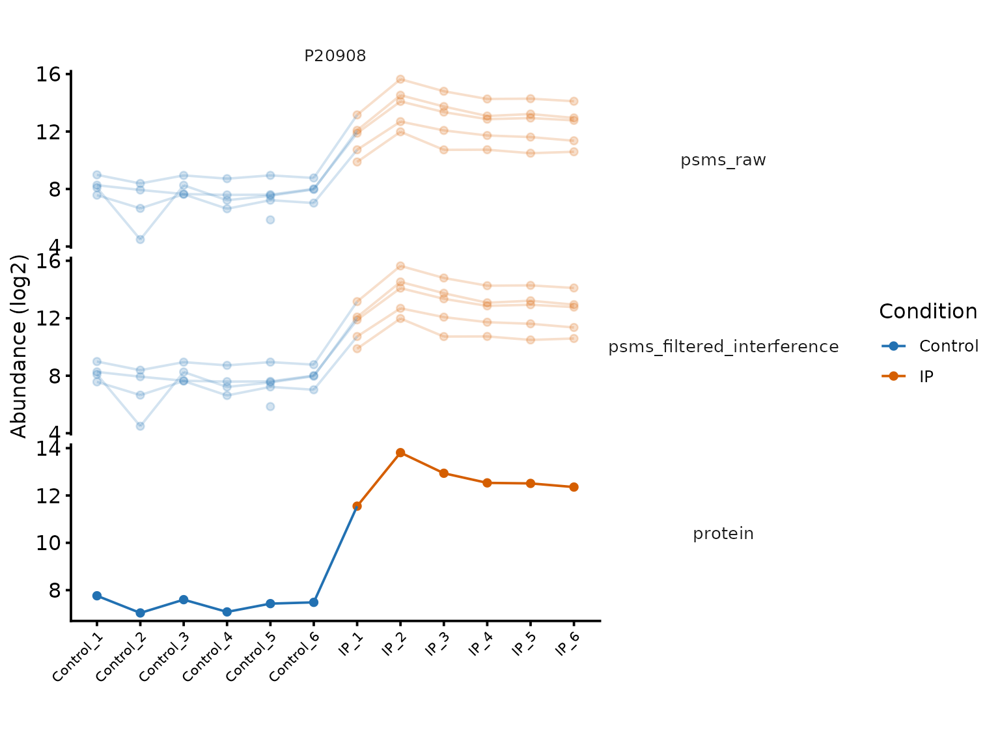
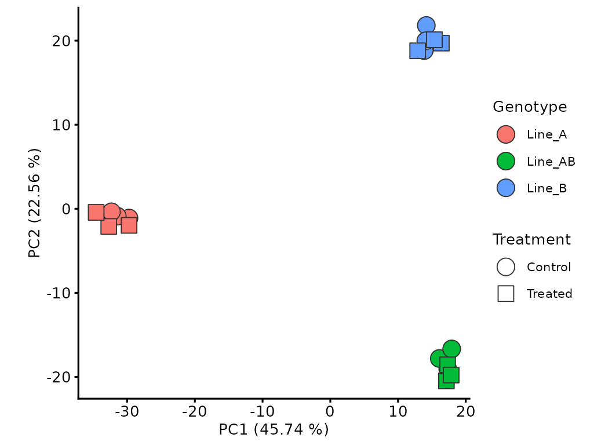

# Data exploration and statistical testing

Once protein-level abundances have been QCed, filtered and summarised,
the next step is to explore the data with respect to the experimental
design, then test for differential abundance between conditions. Below,
that process is worked through three times, using datasets carried over
from the QC vignettes: first with `dia_qf` (Part A), an LFQ-DIA
whole-proteome comparison of blood plasma from MPXV-infected and healthy
individuals; then with `tmt_qf_mq` (Part B), a TMT immunoprecipitation
comparing a bait pulldown (`IP`) against a `Control` pulldown; and
finally with `tmt_qf_factorial` (Part C), a TMT experiment with two
crossed factors rather than one. Each design calls for different choices
at the testing stage — an enrichment design changes what counts as a
meaningful fold change, and a second factor changes what the model
should contain and what its coefficients mean.

## Load required packages

``` r

library(QFeatures)
library(biomasslmb)
library(ggplot2)
library(tidyr)
library(dplyr)
library(limma)

dia_qf <- biomasslmb::dia_qf
tmt_qf_mq <- biomasslmb::tmt_qf_mq
tmt_qf_factorial <- biomasslmb::tmt_qf_factorial
```

## Part A: LFQ-DIA whole-proteome comparison

`dia_qf` is the blood plasma dataset from the [LFQ-DIA
QC](https://lmb-mass-spec-compbio.github.io/biomasslmb/articles/LFQ_DIA_Precursor_QC_Summarisation.md)
vignette (Wang et al. 2022): a case series comparing MPXV infection,
COVID-19 and healthy controls, summarised to protein level with
`robustSummary`. The clinical group of each sample is in the `group`
column. The MPXV-vs-control comparison is the one worked through here,
so the object is restricted to those samples up front.

``` r

names(dia_qf)
#> [1] "precursors"                 "peptides_filtered"         
#> [3] "peptides_filtered_norm"     "peptides_filtered_missing" 
#> [5] "peptides_for_summarisation" "protein"
knitr::kable(as.data.frame(colData(dia_qf))[, c('group', 'sex', 'age.group')])
```

|           | group   | sex | age.group |
|:----------|:--------|:----|:----------|
| COVID_E1  | Covid19 | m   | 21-30     |
| COVID_E10 | Covid19 | m   | 41-50     |
| COVID_E2  | Covid19 | m   | 21-30     |
| COVID_E3  | Covid19 | m   | 41-50     |
| COVID_E4  | Covid19 | m   | 31-40     |
| COVID_E5  | Covid19 | m   | 21-30     |
| COVID_E6  | Covid19 | m   | 21-30     |
| COVID_E7  | Covid19 | m   | 41-50     |
| COVID_E8  | Covid19 | m   | 41-50     |
| COVID_E9  | Covid19 | m   | 41-50     |
| Ctr_A1    | control | m   | 21-30     |
| Ctr_A10   | control | m   | 31-40     |
| Ctr_A11   | control | m   | 31-40     |
| Ctr_A12   | control | m   | 41-50     |
| Ctr_A2    | control | m   | 21-30     |
| Ctr_A3    | control | m   | 21-30     |
| Ctr_A4    | control | m   | 21-30     |
| Ctr_A5    | control | m   | 21-30     |
| Ctr_A6    | control | m   | 21-30     |
| Ctr_A7    | control | m   | 21-30     |
| Ctr_A8    | control | m   | 21-30     |
| Ctr_A9    | control | m   | 31-40     |
| Ctr_B1    | control | m   | 41-50     |
| Ctr_B2    | control | m   | 41-50     |
| Ctr_B3    | control | m   | 41-50     |
| MPX_D1    | MPXV    | m   | 21-30     |
| MPX_D2    | MPXV    | m   | 21-30     |
| MPX_D3    | MPXV    | m   | 31-40     |
| MPX_D4    | MPXV    | m   | 31-40     |
| MPX_D5    | MPXV    | m   | 41-50     |
| MPX_D6    | MPXV    | m   | 21-30     |

``` r

dia_prot <- dia_qf[, colData(dia_qf)$group %in% c('control', 'MPXV')]
```

### Sample correlation

A pairwise correlation heatmap is a quick way to check that replicates
agree with each other more than they agree with samples from the other
condition. `plot_cor_samples` computes the Spearman correlation between
samples for a given assay and plots it as a heatmap. Somewhat
confusingly, the `is.corr=FALSE` argument below is needed despite the
input being a correlation matrix: `plot_cor_samples` passes the input to
[`corrplot::corrplot`](https://rdrr.io/pkg/corrplot/man/corrplot.html),
which automatically sets the legend limits to -1 to 1 for correlations,
compressing the range the samples actually occupy. `order='hclust'`
clusters the samples by correlation, which is often more informative
than the original order.

``` r

plot_cor_samples(dia_prot, 'protein', is.corr=FALSE, order = 'hclust')
```



### Principal component analysis

`plot_pca` performs a PCA on a given assay and plots two of the
components, optionally colouring points by a `colData` column.
`robustSummary` doesn’t require complete peptides, so
`dia_qf[['protein']]` retains some missing values (8.3 % of the matrix).
[`stats::prcomp`](https://rdrr.io/r/stats/prcomp.html) can’t handle
missing values, so the default `allowing_missing=FALSE` would silently
drop every protein with any missing value via `filterNA`. Setting
`allowing_missing=TRUE` runs the PCA with
[`pcaMethods::pca`](https://rdrr.io/pkg/pcaMethods/man/pca.html)
instead. Note that `scale`/`center` are passed on to whichever
underlying PCA function is used, so with
[`pcaMethods::pca`](https://rdrr.io/pkg/pcaMethods/man/pca.html) `scale`
takes a scaling method name (`'uv'`, unit-variance, is the equivalent of
`scale=TRUE` in [`stats::prcomp`](https://rdrr.io/r/stats/prcomp.html))
rather than `TRUE`/`FALSE`.

``` r

plot_pca(dia_prot, 'protein', colour_by='group', scale='uv', center=TRUE, allowing_missing=TRUE) +
  theme_biomasslmb(base_size=10)
```



MPXV and control plasma separate along the first principal component,
consistent with the correlation heatmap above.

### Missingness and experimental condition

The protein-level abundances about to be tested contain missing values,
so it is worth checking whether that missingness is random or structured
by group. Missingness concentrated in one group — a protein consistently
absent from the controls, say — both distorts the linear model and can
be biologically meaningful in its own right, so it shouldn’t be ignored.

`condition_miss_score` fits a per-protein logistic regression of
missingness against group and returns Tjur’s R² per protein: values near
1 mean a protein’s missingness is well explained by group, values near 0
mean it looks unrelated to group. `condition_miss_index` summarises this
into a single dataset-level value.

``` r

miss_res <- condition_miss_score(dia_qf, i = 'protein', group_cols = 'group')
#> Analysing assay 'protein': 239 features x 31 samples
#> Group variable: group (3 levels: control, Covid19, MPXV)
#> Results: 71 informative features | mean condition miss score = 0.114 | condition-structured: 0.4% | condition-independent: 25.1%
condition_miss_index(miss_res$summary)$index
#> Condition missingness index: 0.0464 | Weighted mean score: 0.1561 | Coverage: 29.7% (71 / 239 features informative) [coverage penalty applied]
#> [1] 0.04637771
```

The index is close to zero: for this whole-proteome comparison,
protein-level missingness looks unrelated to group — in contrast to the
enrichment experiment in Part B, where absence from the control pulldown
is exactly the signal of interest. The protein-level abundances are
therefore tested directly, letting `limma` fit each protein on whichever
samples it was quantified in, rather than imputing.

### Which proteins can be tested?

`limma` fits a linear model per protein, so each protein needs enough
genuinely quantified values for its group means and its within-group
variance to be estimable. A protein that fails this is not “not
significant” — it is untested, and the two must not be reported as if
they were the same thing.

The rule applied here is at least 2 quantified values in *both*
conditions, counting the quantified values per condition so that the
rule can be applied and reported alongside the results.

This count treats every column as an independent replicate. Where a
sample has been acquired more than once, that is not true, and counting
the acquisitions rather than the samples inflates the apparent
replication while pulling the variance estimate towards technical rather
than biological noise. [Technical replicates are not biological
replicates](https://lmb-mass-spec-compbio.github.io/biomasslmb/articles/gotcha_technical_replicates.md)
measures what that does to a result, and what to do with the repeat
acquisitions instead.

``` r

group <- factor(dia_prot[['protein']]$group, levels = c('control', 'MPXV'))

n_quant <- sapply(levels(group), function(g){
  rowSums(!is.na(assay(dia_prot[['protein']])[, group == g, drop = FALSE]))
})

testable <- rownames(n_quant)[apply(n_quant, 1, min) >= 2]

length(testable)
#> [1] 231
n_quant[apply(n_quant, 1, min) < 2, ]
#>            control MPXV
#> A0A0C4DH31       0    4
#> P01706           1    4
#> P01714          10    1
#> P02741           1    6
#> P08294           9    1
#> Q08830           0    3
#> Q15166           7    0
#> Q9HDC9          10    1
```

Three of the excluded proteins have no quantified values at all in one
condition. `lmFit` cannot estimate a group coefficient from an empty
group, so it returns `NA` for those rows with a
`Partial NA coefficients` warning. `NA` adjusted p-values are then
dropped silently by [`table()`](https://rdrr.io/r/base/table.html),
`sum(..., na.rm=TRUE)` and most other summaries, so an unfiltered run
reports a plausible-looking number of significant proteins without ever
indicating that some proteins could not be fitted. Filtering first makes
the exclusion explicit and countable.

The remaining excluded proteins were quantified in one or both
conditions, but only once in one of them, so their fold-change rests on
a single measurement with no way to judge its reproducibility. This
filter is not free: `P02741` (CRP) is quantified in all 6 MPXV samples
and just 1 of 15 controls, and is almost certainly a genuine, large
increase — it is missing from the controls precisely *because* it is low
there. Excluding it is the conservative choice, not the correct one in
any absolute sense; recovering proteins like it requires modelling the
missingness or imputing, which is what
[`restrict_imputation()`](https://lmb-mass-spec-compbio.github.io/biomasslmb/reference/restrict_imputation.md)
and the
[`condition_miss_score()`](https://lmb-mass-spec-compbio.github.io/biomasslmb/reference/condition_miss_score.md)
family are for.

When imputed values are being tested, this becomes two filters rather
than one, because “quantified” and “has a value” stop being the same
thing: at least 2 *genuinely quantified* values in at least one
condition, checked against the unimputed assay, so that no result rests
entirely on imputed values; and at least 2 values in *both* conditions,
checked against the imputed assay that is actually being fitted, so that
the model can be fitted. Here nothing is imputed, so both reduce to the
single rule applied above.

For reporting, the per-condition counts are kept as columns so that a
reader of the results table can see how much of each fold-change is
supported by measurements.

``` r

n_quant_cols <- n_quant %>%
  as.data.frame() %>%
  setNames(paste0('n_quant_', levels(group))) %>%
  tibble::rownames_to_column('Protein')
```

### Differential abundance testing with limma

`limma` performs the differential abundance testing between `control`
and `MPXV`. `limma` fits a linear model per protein, then applies an
empirical Bayes step which borrows information across all proteins to
stabilise the variance estimate — important here since the 6 MPXV
replicates give fairly noisy per-protein variance estimates on their
own.

`treat` is used rather than plain `eBayes`. `treat` tests the null
hypothesis that the absolute fold-change is *below* a threshold (here
1.2-fold), rather than the standard null of exactly no difference — this
avoids flagging changes that are statistically detectable but too small
to be biologically interesting. `trend=TRUE` lets the variance prior
depend on mean abundance; `robust=TRUE` down-weights proteins with
unusually extreme variance so they don’t distort the shared prior.

Gene symbols from the `protein` assay’s `rowData` are attached to the
results, since they read more clearly than accessions on the volcano
plot.

``` r

design <- model.matrix(~group)

fit <- lmFit(assay(dia_prot[['protein']])[testable, ], design)
final_model <- treat(fit, fc = 1.2, trend = TRUE, robust = TRUE)

gene_names <- as.data.frame(rowData(dia_qf[['protein']])[, c('Protein.Group', 'Genes')])

limma_results <- topTreat(final_model, coef = 'groupMPXV', number = Inf) %>%
  tibble::rownames_to_column('Protein') %>%
  left_join(gene_names, by = c('Protein' = 'Protein.Group')) %>%
  left_join(n_quant_cols, by = 'Protein') %>%
  arrange(P.Value)

table(direction = ifelse(limma_results$logFC < 0, 'Dec.', 'Inc.'),
      sig = limma_results$adj.P.Val < 0.05)
#>          sig
#> direction FALSE TRUE
#>      Dec.    86   12
#>      Inc.   119   14
```

The FDR adjustment is over the 231 testable proteins, itself a subset of
those that passed the filtering thresholds in the QC vignette; a
stricter or looser peptide/protein filter, or a stricter testability
rule, would change the multiple-testing burden and hence the adjusted
p-values.

### Volcano plot

`plot_volcano` plots log-fold-change against -log10(p-value) directly
from a statistical testing results `data.frame`; by default it expects
`logFC` and `adj.P.Val` columns, which is exactly what `topTreat`
returns.

``` r

sig_hits <- limma_results %>% filter(adj.P.Val < 0.05) %>% pull(Protein)

plot_volcano(limma_results, sig_col = NULL) +
  geom_point(data = filter(limma_results, Protein %in% sig_hits),
             aes(fill = adj.P.Val < 0.05), pch = 21, size = 3) +
  scale_fill_manual(values = get_cat_palette(2)[2], guide = 'none') +
  ggrepel::geom_text_repel(
    data = filter(limma_results, Protein %in% sig_hits),
    aes(label = Genes), min.segment.length = 0, size = 3)
```



The significant proteins are dominated by the acute-phase response:
positive acute-phase reactants such as `SAA2`, `HP`, `LBP` and `C9` are
increased in MPXV plasma, while negative acute-phase reactants such as
`APOA1`, `APOA2`, `TTR` and `RBP4` are decreased.

### Inspecting proteins of interest

Before trusting a hit, it’s worth looking at the abundance values behind
it across the processing pipeline — from precursor level through to the
final protein-level estimate — to confirm the result isn’t being driven
by a single outlying precursor. `plot_protein_assays` plots one or more
proteins across any set of assays in the `QFeatures` object.

``` r

top_hit <- head(sig_hits, 1)

plot_protein_assays(
  dia_prot, top_hit,
  experiments_to_plot = c('precursors', 'peptides_filtered_norm', 'protein'),
  protein_id_col = 'Protein.Group',
  label_col = 'Genes',
  log2transform_cols = c('precursors')) +
  aes(colour = colData(dia_prot)[colname, 'group']) +
  scale_colour_manual(values = get_cat_palette(2), name = 'group') +
  theme(aspect.ratio = 1/3)
```



The precursor-level trend is consistent across the processing steps and
across the individual precursors contributing to the protein, giving
confidence that this is a genuine change rather than an artefact of
summarisation.

## Part B: a TMT immunoprecipitation

`tmt_qf_mq` is the immunoprecipitation dataset from Part A of the
[enrichment
designs](https://lmb-mass-spec-compbio.github.io/biomasslmb/articles/interactome_designs.md)
vignette: a bait pulldown (`IP`) against a control pulldown (`Control`),
6 replicates each, searched with MaxQuant and summarised to protein
level with `robustSummary`. Its `rowData` uses MaxQuant’s column names
rather than Proteome Discoverer’s, which is visible in the calls below.

An enrichment design also calls for choices at the testing stage that a
whole-proteome comparison does not, and how far those matter depends on
the acquisition. Part B of the [enrichment
designs](https://lmb-mass-spec-compbio.github.io/biomasslmb/articles/interactome_designs.md)
vignette works through them on a label-free pulldown, where they decide
the result; here they are comparatively mild, and the section on
testability below shows why.

``` r

names(tmt_qf_mq)
#> [1] "psms_raw"                   "psms_filtered"             
#> [3] "psms_filtered_interference" "psms_filtered_forSummary"  
#> [5] "protein"
knitr::kable(data.frame(colData(tmt_qf_mq)))
```

|           | Condition | Replicate | quantCols |
|:----------|:----------|:----------|:----------|
| IP_1      | IP        | 1         | IP_1      |
| Control_4 | Control   | 4         | Control_4 |
| IP_5      | IP        | 5         | IP_5      |
| Control_1 | Control   | 1         | Control_1 |
| IP_4      | IP        | 4         | IP_4      |
| Control_3 | Control   | 3         | Control_3 |
| Control_6 | Control   | 6         | Control_6 |
| IP_2      | IP        | 2         | IP_2      |
| Control_2 | Control   | 2         | Control_2 |
| IP_3      | IP        | 3         | IP_3      |
| Control_5 | Control   | 5         | Control_5 |
| IP_6      | IP        | 6         | IP_6      |

### Sample correlation

``` r

plot_cor_samples(tmt_qf_mq, 'protein', is.corr=FALSE, order = 'hclust')
```



### Principal component analysis

As in Part A, `tmt_qf_mq[['protein']]` retains missing values (0.8 % of
the matrix), so `allowing_missing=TRUE` is set and the PCA runs via
[`pcaMethods::pca`](https://rdrr.io/pkg/pcaMethods/man/pca.html). Most
of that missingness is contributed by the proteins the QC vignette
masked for resting on a single PSM per channel.

``` r

plot_pca(tmt_qf_mq, 'protein', colour_by='Condition', scale='uv', center=TRUE, allowing_missing=TRUE) +
  theme_biomasslmb(base_size=10)
```



IP and Control samples separate clearly, as expected for a specific
enrichment.

### Which proteins can be tested?

The same testability rule applies here.

``` r

condition_mq <- factor(tmt_qf_mq[['protein']]$Condition, levels = c('Control', 'IP'))

n_quant_mq <- sapply(levels(condition_mq), function(g){
  rowSums(!is.na(assay(tmt_qf_mq[['protein']])[, condition_mq == g, drop = FALSE]))
})

testable_mq <- rownames(n_quant_mq)[apply(n_quant_mq, 1, min) >= 2]

c(proteins = nrow(n_quant_mq),
  testable = length(testable_mq),
  absent_from_control = sum(n_quant_mq[, 'Control'] == 0))
#>            proteins            testable absent_from_control 
#>                 442                 441                   0
```

It excludes almost nothing, and — more to the point — not one protein is
absent from the control pulldown, which is the pattern an enrichment
design would lead you to expect and to worry about discarding.

That is the usual position for a single-plex TMT experiment, and the QC
vignette measures it directly: all twelve channels are quantified from
the same spectrum, so a protein enriched in the IP registers in the
control channels too, at a lower intensity rather than as a missing
value. The testability filter is doing ordinary work here, not the
enrichment-specific work it does when each sample is acquired separately
— which is where Part B of the [enrichment
designs](https://lmb-mass-spec-compbio.github.io/biomasslmb/articles/interactome_designs.md)
vignette picks up, with a testability rule and an imputation strategy
chosen for that case.

### Differential abundance testing with limma

The statistical model itself is the same as Part A, but the biological
question is different, and that changes what fold-change threshold is
appropriate. Part A looked for shifts in a whole-proteome comparison,
where a modest 1.2-fold `treat` threshold is appropriate. Part B
identifies bona fide interactors of the bait protein, and a real
interactor is substantially enriched in the IP relative to the control
rather than just detectably different, so the threshold here is a
stricter 2-fold.

``` r

design_mq <- model.matrix(~condition_mq)

fit_mq <- lmFit(assay(tmt_qf_mq[['protein']])[testable_mq, ], design_mq)
final_model_mq <- treat(fit_mq, fc = 2, trend = TRUE, robust = TRUE)

limma_results_mq <- topTreat(final_model_mq, coef = 'condition_mqIP', number = Inf) %>%
  tibble::rownames_to_column('Protein') %>%
  arrange(P.Value)

table(direction = ifelse(limma_results_mq$logFC < 0, 'Dec.', 'Inc.'),
      sig = limma_results_mq$adj.P.Val < 0.05)
#>          sig
#> direction FALSE TRUE
#>      Dec.   118    6
#>      Inc.   253   64
```

Both enriched and depleted proteins can be statistically significant
here, but identifying interactors turns specifically on enrichment in
the IP: a depleted protein does not indicate an interaction with the
bait, so the candidate interactors below are the significantly
*enriched* proteins only.

Filtering the results this way is not the same as testing one-sidedly.
The p-values above were computed against a two-sided null, so half of
each one covers the direction just discarded, and the multiple-testing
correction was applied across both directions. A one-sided test spends
that power on the direction of interest instead; the [enrichment
designs](https://lmb-mass-spec-compbio.github.io/biomasslmb/articles/interactome_designs.md)
vignette shows how, and what it does and does not buy.

``` r

sig_hits_mq <- limma_results_mq %>%
  filter(adj.P.Val < 0.05, logFC > 0) %>%
  pull(Protein)

length(sig_hits_mq)
#> [1] 64
```

### Volcano plot

With 64 candidate interactors, labelling every point would make the plot
unreadable, so only the 10 most significant are labelled.

``` r

top_hits_mq <- head(sig_hits_mq, 10)

plot_volcano(limma_results_mq, sig_col = NULL) +
  geom_point(data = filter(limma_results_mq, Protein %in% sig_hits_mq),
             aes(fill = adj.P.Val < 0.05), pch = 21, size = 3) +
  scale_fill_manual(values = get_cat_palette(2)[2], guide = 'none') +
  ggrepel::geom_text_repel(
    data = filter(limma_results_mq, Protein %in% top_hits_mq),
    aes(label = Protein), min.segment.length = 0, size = 3)
```



### Inspecting proteins of interest

As in Part A, the feature-to-protein trend behind the top candidate
interactor is worth inspecting, here working from PSMs rather than
precursors: `psms_raw` and `psms_filtered_interference` in place of
`precursors` and `peptides_filtered_norm`, and `Leading.razor.protein`
in place of `Protein.Group`.

``` r

top_hit_mq <- head(sig_hits_mq, 1)

plot_protein_assays(
  tmt_qf_mq, top_hit_mq,
  experiments_to_plot = c('psms_raw', 'psms_filtered_interference', 'protein'),
  protein_id_col = 'Leading.razor.protein',
  label_col = 'Leading.razor.protein',
  log2transform_cols = c('psms_raw')) +
  aes(colour = colData(tmt_qf_mq)[colname, 'Condition']) +
  scale_colour_manual(values = get_cat_palette(2), name = 'Condition') +
  theme(aspect.ratio = 1/3)
```



The PSMs consistently show higher abundance in the IP samples than the
Control samples, supporting this as a genuine interactor rather than an
artefact of a single PSM or a missing-value pattern.

## Part C: two factors at once

`tmt_qf_factorial` is the whole-proteome TMT experiment from [reading
MaxQuant
output](https://lmb-mass-spec-compbio.github.io/biomasslmb/articles/TMT_PSM_QC_Summarisation.html#reading-maxquant-output):
three cell lines, each treated with a vehicle (`Control`) or a compound
(`Treated`), in three replicates.

Both parts above had one factor and one comparison to make. This one has
two crossed factors, which changes three things: which terms belong in
the model, what the coefficients mean once they are there, and how much
of the answer is lost by leaving a factor out. Nothing about the QC or
the summarisation changed — the design only starts to matter here.

``` r

knitr::kable(data.frame(colData(tmt_qf_factorial)))
```

|                   | Genotype | Treatment | Replicate | quantCols         |
|:------------------|:---------|:----------|:----------|:------------------|
| Line_A_Control_1  | Line_A   | Control   | 1         | Line_A_Control_1  |
| Line_AB_Control_1 | Line_AB  | Control   | 1         | Line_AB_Control_1 |
| Line_A_Control_2  | Line_A   | Control   | 2         | Line_A_Control_2  |
| Line_AB_Control_2 | Line_AB  | Control   | 2         | Line_AB_Control_2 |
| Line_B_Treated_1  | Line_B   | Treated   | 1         | Line_B_Treated_1  |
| Line_B_Control_2  | Line_B   | Control   | 2         | Line_B_Control_2  |
| Line_B_Treated_2  | Line_B   | Treated   | 2         | Line_B_Treated_2  |
| Line_B_Control_1  | Line_B   | Control   | 1         | Line_B_Control_1  |
| Line_AB_Treated_1 | Line_AB  | Treated   | 1         | Line_AB_Treated_1 |
| Line_A_Control_3  | Line_A   | Control   | 3         | Line_A_Control_3  |
| Line_A_Treated_3  | Line_A   | Treated   | 3         | Line_A_Treated_3  |
| Line_B_Treated_3  | Line_B   | Treated   | 3         | Line_B_Treated_3  |
| Line_AB_Control_3 | Line_AB  | Control   | 3         | Line_AB_Control_3 |
| Line_A_Treated_1  | Line_A   | Treated   | 1         | Line_A_Treated_1  |
| Line_AB_Treated_2 | Line_AB  | Treated   | 2         | Line_AB_Treated_2 |
| Line_A_Treated_2  | Line_A   | Treated   | 2         | Line_A_Treated_2  |
| Line_B_Control_3  | Line_B   | Control   | 3         | Line_B_Control_3  |
| Line_AB_Treated_3 | Line_AB  | Treated   | 3         | Line_AB_Treated_3 |

``` r

factorial_prot <- assay(tmt_qf_factorial[['protein']])

genotype <- factor(tmt_qf_factorial[['protein']]$Genotype,
                   levels = c('Line_A', 'Line_B', 'Line_AB'))

treatment <- factor(tmt_qf_factorial[['protein']]$Treatment,
                    levels = c('Control', 'Treated'))
```

### Which factor dominates

``` r

plot_pca(tmt_qf_factorial, 'protein', colour_by = 'Genotype', shape_by = 'Treatment',
         scale. = TRUE, center = TRUE) +
  theme_biomasslmb(base_size = 10)
```



**The cell line separates the samples; the treatment does not.** That is
the ordinary situation for cell lines and it is visible before any model
is fitted. Quantifying it makes the size of the problem clear.

``` r

n_sig <- function(design, coef) {
  fit <- eBayes(lmFit(factorial_prot, design), trend = TRUE, robust = TRUE)
  sum(topTable(fit, coef = coef, number = Inf)$adj.P.Val < 0.05)
}

additive <- model.matrix(~ genotype + treatment)

c(proteins = nrow(factorial_prot),
  differ_between_lines = n_sig(additive, 2:3))
#>             proteins differ_between_lines 
#>                 1173                 1014
```

1014 of the 1173 proteins differ between the lines. A factor that moves
most of the proteome is not a detail to be only mentioned in the
methods; it is the largest source of variance in the experiment, and
every decision below follows from that.

### Testing for impact of treatment - what leaving the genotype out costs

The experiment is balanced — every line appears equally often in both
treatment groups — so leaving `genotype` out of the model does not bias
the treatment estimate. It is tempting to conclude from that it can be
left out when testing for an impact of treatment. It cannot, because
bias is not the only thing at stake: variance the model does not explain
stays in the residual, and the residual is what every p-value is
measured against.

``` r

c(ignoring_line = n_sig(model.matrix(~ treatment), 'treatmentTreated'),
  adjusting_for_line = n_sig(additive, 'treatmentTreated'))
#>      ignoring_line adjusting_for_line 
#>                  4                 75
```

**Leaving the genotype out costs most of the result.** The two models
estimate the same fold changes, and disagree only on how much noise
those fold changes are being compared against.

``` r

residual_sd <- function(design) {
  median(sqrt(eBayes(lmFit(factorial_prot, design),
                     trend = TRUE, robust = TRUE)$s2.post))
}

round(c(ignoring_line = residual_sd(model.matrix(~ treatment)),
        adjusting_for_line = residual_sd(additive)), 3)
#>      ignoring_line adjusting_for_line 
#>              0.172              0.074
```

This is the argument for recording every structured source of variation
you know about — culture batch, passage number, the day the samples were
prepared, which operator prepared them — and carrying it into `colData`
whether or not you expect to use it. A factor that was never recorded
cannot be adjusted for, and its variance is then indistinguishable from
noise. The [technical
replicates](https://lmb-mass-spec-compbio.github.io/biomasslmb/articles/gotcha_technical_replicates.md)
article covers the case where the repeated measurements are of the same
biological sample, which needs a different treatment again.

### Does the effect depend on the cell line?

`genotype + treatment` assumes the compound does the same thing in every
line. `genotype * treatment` drops that assumption and lets the
treatment effect differ between them. Which is right is a question about
the data, and it is answered by testing the interaction terms rather
than by choosing in advance.

``` r

interaction_design <- model.matrix(~ genotype * treatment)

colnames(interaction_design)
#> [1] "(Intercept)"                      "genotypeLine_B"                  
#> [3] "genotypeLine_AB"                  "treatmentTreated"                
#> [5] "genotypeLine_B:treatmentTreated"  "genotypeLine_AB:treatmentTreated"
```

``` r

interaction_terms <- grep(':', colnames(interaction_design), value = TRUE)

c(tested = nrow(factorial_prot),
  line_specific_response = n_sig(interaction_design, interaction_terms))
#>                 tested line_specific_response 
#>                   1173                      2
```

Two proteins out of 1173 respond to the compound differently depending
on the line. Those two are real findings and worth following up
individually, but a line-specific response is not a general feature of
this experiment, so the additive model describes the other 1171 proteins
better than the interaction model does.

### What an interaction term does to the other coefficients

Keeping the interaction term anyway looks harmless. It is not, and the
reason has nothing to do with the extra parameters.

``` r

c(additive = n_sig(additive, 'treatmentTreated'),
  interaction = n_sig(interaction_design, 'treatmentTreated'))
#>    additive interaction 
#>          75          20
```

**The same coefficient name means different things in the two models.**
In `~ genotype + treatment`, `treatmentTreated` is the treatment effect
averaged over the lines. In `~ genotype * treatment`, it is the
treatment effect *in the reference line alone* — `Line_A` here, because
that is the first level of the factor — and the other two lines’ effects
are that coefficient plus their own interaction term. Testing it answers
a question about one third of the experiment.

The average effect is still recoverable from the interaction model, with
a contrast that puts it back together explicitly.

``` r

contrast <- rep(0, ncol(interaction_design))
names(contrast) <- colnames(interaction_design)
contrast['treatmentTreated'] <- 1

# The treatment effect in the other two lines is treatmentTreated plus that
# line's interaction term, so weighting all three lines equally means 1/3 each
contrast[interaction_terms] <- 1/3

averaged <- eBayes(contrasts.fit(lmFit(factorial_prot, interaction_design), contrast),
                   trend = TRUE, robust = TRUE)

c(additive = n_sig(additive, 'treatmentTreated'),
  interaction_averaged = sum(topTable(averaged, number = Inf)$adj.P.Val < 0.05))
#>             additive interaction_averaged 
#>                   75                   74
```

Which settles what the earlier drop was. The interaction model has lost
almost no power — the two numbers above agree. Reading
`treatmentTreated` out of it without the contrast answers a different
question, and reports the answer under a name that looks like the one
you asked for.

### Which model to report

The interaction was tested and, for all but two proteins, not found, so
the additive model is the one to report here.

``` r

final_fit <- eBayes(lmFit(factorial_prot, additive), trend = TRUE, robust = TRUE)

factorial_results <- topTable(final_fit, coef = 'treatmentTreated', number = Inf) %>%
  tibble::rownames_to_column('Protein') %>%
  arrange(P.Value)

head(factorial_results, 5)
#>   Protein     logFC  AveExpr        t      P.Value    adj.P.Val        B
#> 1  Q16850 0.8314934 14.53444 25.86738 3.808485e-19 4.467353e-16 32.63074
#> 2  Q8NC54 0.5721619 13.96056 15.35763 5.577451e-14 3.271175e-11 21.93682
#> 3  P43007 0.3327107 13.84055 10.26136 2.706056e-10 9.704773e-08 13.69813
#> 4  Q16270 0.4517073 13.35909 10.14545 3.388863e-10 9.704773e-08 13.47600
#> 5  P23284 0.2685825 16.52120 10.04344 4.136732e-10 9.704773e-08 13.27901
```

One thing carried over from Part A is deliberately absent: there is no
`treat` fold-change threshold. Applied here at the 1.2-fold threshold
Part A used, it returns 2 proteins, because this compound’s
proteome-wide effects are genuinely small rather than because they are
unreliable. A `treat` threshold encodes a claim about which effect sizes
are worth reporting, and that claim has to be made for the experiment in
front of you — a threshold that was right for a plasma case series is
not right for a cell line treated for a few hours.

## Reporting the result

A volcano plot is a summary, not the end goal. What gets used downstream
is a table, and what makes it usable is the columns that let a reader
judge each row without re-running the analysis.

### The results table

Four kinds of column belong in it: the identifier, something
human-readable, the statistics, and the evidence behind them.

``` r

report <- limma_results %>%
  select(Protein, Genes, logFC, AveExpr, P.Value, adj.P.Val,
         n_quant_control, n_quant_MPXV) %>%
  arrange(adj.P.Val)

head(report, 5) %>%
  mutate(across(where(is.numeric), ~ signif(.x, 3))) %>%
  knitr::kable()
```

| Protein | Genes | logFC | AveExpr | P.Value | adj.P.Val | n_quant_control | n_quant_MPXV |
|:--------|:------|------:|--------:|--------:|----------:|----------------:|-------------:|
| P02654  | APOC1 | -3.37 |    14.5 | 0.0e+00 |  1.00e-07 |              15 |            6 |
| P02766  | TTR   | -1.44 |    13.3 | 0.0e+00 |  1.00e-07 |              15 |            6 |
| P02748  | C9    |  1.49 |    14.2 | 0.0e+00 |  1.00e-07 |              15 |            6 |
| P02750  | LRG1  |  1.27 |    14.4 | 1.2e-06 |  6.77e-05 |              15 |            6 |
| P00738  | HP    |  1.46 |    16.5 | 9.6e-06 |  4.41e-04 |              15 |            6 |

The per-condition counts are the column most often left out and the one
a reader most needs. A two-fold change resting on 6 measurements against
15 is a different claim from the same fold change resting on 2 against
2, and nothing else in the table distinguishes them.

Two things are worth adding explicitly rather than leaving implicit.

**The proteins that were not tested.** They are absent from
`limma_results` altogether, so a reader has no way to tell a protein
that was quantified and found unchanged from one that never entered the
model. Reporting them in the same file, flagged, prevents that being
read as evidence of no change.

``` r

untested <- setdiff(rownames(dia_prot[['protein']]), limma_results$Protein)

untested_report <- data.frame(
  Protein = untested,
  Genes = gene_names$Genes[match(untested, gene_names$Protein.Group)],
  n_quant_control = n_quant[untested, 'control'],
  n_quant_MPXV = n_quant[untested, 'MPXV'])

c(tested = nrow(report), untested = nrow(untested_report))
#>   tested untested 
#>      231        8
```

**Which threshold was applied.** Add the call rather than leaving the
reader to apply their own cutoff to the adjusted p-values, since the
fold-change threshold used by `treat` is already baked into them and is
not recoverable from the table.

``` r

report$significant <- report$adj.P.Val < 0.05
```

### Writing it out

`openxlsx` writes a workbook with one sheet per data frame, which keeps
the tested and untested proteins in one file without merging them.

``` r

openxlsx::write.xlsx(
  list(tested = report, untested = untested_report),
  file = 'MPXV_vs_control_results.xlsx')
```

A plain CSV is the better choice where the result feeds another script
rather than a person.

``` r

write.csv(report, 'MPXV_vs_control_results.csv', row.names = FALSE)
```

Save the `QFeatures` object alongside it. It holds every intermediate
assay, so it is the only artefact that makes the analysis reproducible
without re-running it, and it is what you will want if a question comes
back in six months.

``` r

saveRDS(dia_prot, 'MPXV_vs_control_qfeatures.rds')
```

### What to put in a methods section

The numbers a reader needs to judge the analysis are all produced above,
but they are scattered across the vignettes that produced them.
Collected in one place:

- **Search engine and version**, the sequence database and its release,
  and the contaminant database — all upstream of this package, and all
  determining what the input table contains.
- **Feature-level filtering**: the contaminant removal, the confidence
  or FDR thresholds, and any signal:noise or co-isolation cutoffs, with
  the values used.
- **How missing values were handled**: the `filterNA` threshold, whether
  anything was imputed and by what method, and the minimum features per
  protein.
- **The summarisation method**, and whether protein values resting on
  too few features were masked.
- **The normalisation**, and what it assumed was unchanged.
- **The testability rule**, and how many proteins passed it out of how
  many were quantified. This is the number that defines the
  multiple-testing burden, and it is rarely reported.
- **The test**, its fold-change threshold if any, and the
  multiple-testing correction.
- **Software versions.**
  [`sessionInfo()`](https://rdrr.io/r/utils/sessionInfo.html) at the end
  of every vignette here exists for this.

[`get_samples_present()`](https://lmb-mass-spec-compbio.github.io/biomasslmb/reference/get_samples_present.md)
and
[`plot_samples_present()`](https://lmb-mass-spec-compbio.github.io/biomasslmb/reference/plot_samples_present.md),
used in each QC vignette, produce the feature and protein counts at
every stage in a form that goes straight into a supplementary figure.

## Summary

For both a whole-proteome comparison (Part A) and an immunoprecipitation
(Part B), this vignette has:

- Checked that replicate samples correlate more strongly with each other
  than with the other condition, and that PCA separates the conditions —
  using `allowing_missing=TRUE` in both parts, since `robustSummary`
  retains some missing values
- Checked whether protein-level missingness was structured by
  experimental condition: unrelated to group in the whole-proteome
  comparison (Part A), and in the single-plex immunoprecipitation
  (Part B) not present in the on/off form an enrichment design predicts,
  because all channels are quantified from one spectrum
- Restricted testing to proteins with at least 2 quantified values in
  both conditions, and kept the per-condition counts in the results so
  that untested proteins are distinguishable from proteins tested and
  found unchanged
- Tested for differential protein abundance with
  [`limma::treat`](https://rdrr.io/pkg/limma/man/ebayes.html), using a
  fold-change threshold appropriate to the biological question: a modest
  threshold for whole-proteome changes in Part A, and a strict threshold
  to identify substantially-enriched candidate interactors in Part B
- Visualised the results with a volcano plot and inspected the
  feature-to-protein trend for a top hit

## Where to go next

- [Functional
  enrichment](https://lmb-mass-spec-compbio.github.io/biomasslmb/articles/functional_enrichment.md)
  asks whether the proteins that changed share a function, location or
  complex, rather than reading them one at a time. It picks up from the
  Part A results.
- [Choosing a summarisation
  method](https://lmb-mass-spec-compbio.github.io/biomasslmb/articles/summarisation_methods.md)
  covers how the protein-level values tested here were arrived at, and
  what a different choice would have changed.
- [Enrichment
  designs](https://lmb-mass-spec-compbio.github.io/biomasslmb/articles/interactome_designs.md)
  covers the QC and normalisation decisions behind the Part B dataset,
  and works a label-free pulldown through the testing choices an
  enrichment design calls for: a testability rule that keeps the
  control-absent proteins, imputation restricted to the condition where
  absence is defensible, and a one-sided test.

## Getting help

If your experiment does not fit what this article assumes, or a result
looks wrong, please get in touch with Tom Smith (<tsmith@mrclmb.ac.uk>)
rather than guessing — it is far easier to help while an analysis is in
progress than to unpick a decision afterwards, and easier still before
the samples are run. [Getting
started](https://lmb-mass-spec-compbio.github.io/biomasslmb/articles/biomasslmb.md)
sets out which article applies to which experiment.

``` r

sessionInfo()
#> R version 4.5.3 (2026-03-11)
#> Platform: x86_64-pc-linux-gnu
#> Running under: Ubuntu 24.04.5 LTS
#> 
#> Matrix products: default
#> BLAS:   /usr/lib/x86_64-linux-gnu/openblas-pthread/libblas.so.3 
#> LAPACK: /usr/lib/x86_64-linux-gnu/openblas-pthread/libopenblasp-r0.3.26.so;  LAPACK version 3.12.0
#> 
#> locale:
#>  [1] LC_CTYPE=C.UTF-8       LC_NUMERIC=C           LC_TIME=C.UTF-8       
#>  [4] LC_COLLATE=C.UTF-8     LC_MONETARY=C.UTF-8    LC_MESSAGES=C.UTF-8   
#>  [7] LC_PAPER=C.UTF-8       LC_NAME=C              LC_ADDRESS=C          
#> [10] LC_TELEPHONE=C         LC_MEASUREMENT=C.UTF-8 LC_IDENTIFICATION=C   
#> 
#> time zone: UTC
#> tzcode source: system (glibc)
#> 
#> attached base packages:
#> [1] stats4    stats     graphics  grDevices utils     datasets  methods  
#> [8] base     
#> 
#> other attached packages:
#>  [1] limma_3.66.0                dplyr_1.2.1                
#>  [3] tidyr_1.3.2                 ggplot2_4.0.3              
#>  [5] biomasslmb_0.1.0            QFeatures_1.20.0           
#>  [7] MultiAssayExperiment_1.36.2 SummarizedExperiment_1.40.0
#>  [9] Biobase_2.70.0              GenomicRanges_1.62.1       
#> [11] Seqinfo_1.0.0               IRanges_2.44.0             
#> [13] S4Vectors_0.48.1            BiocGenerics_0.56.0        
#> [15] generics_0.1.4              MatrixGenerics_1.22.0      
#> [17] matrixStats_1.5.0          
#> 
#> loaded via a namespace (and not attached):
#>  [1] DBI_1.3.0               rlang_1.3.0             magrittr_2.0.5         
#>  [4] clue_0.3-68             otel_0.2.0              compiler_4.5.3         
#>  [7] RSQLite_3.53.3          png_0.1-9               systemfonts_1.3.2      
#> [10] vctrs_0.7.3             reshape2_1.4.5          stringr_1.6.0          
#> [13] ProtGenerics_1.42.0     pkgconfig_2.0.3         crayon_1.5.3           
#> [16] fastmap_1.2.0           backports_1.5.1         XVector_0.50.0         
#> [19] labeling_0.4.3          rmarkdown_2.32          visdat_0.6.0           
#> [22] ragg_1.5.2              purrr_1.2.2             bit_4.6.0              
#> [25] xfun_0.60               cachem_1.1.0            jsonlite_2.0.0         
#> [28] blob_1.3.0              DelayedArray_0.36.1     cluster_2.1.8.2        
#> [31] R6_2.6.1                bslib_0.12.0            stringi_1.8.9          
#> [34] RColorBrewer_1.1-3      genefilter_1.92.0       jquerylib_0.1.4        
#> [37] Rcpp_1.1.2              knitr_1.52              BiocBaseUtils_1.12.0   
#> [40] Matrix_1.7-4            splines_4.5.3           igraph_2.3.3           
#> [43] tidyselect_1.2.1        abind_1.4-8             yaml_2.3.12            
#> [46] lattice_0.22-9          tibble_3.3.1            plyr_1.8.9             
#> [49] withr_3.0.3             KEGGREST_1.50.0         S7_0.2.2               
#> [52] evaluate_1.0.5          uniprotREST_1.0.0       desc_1.4.3             
#> [55] survival_3.8-6          Biostrings_2.78.0       pillar_1.11.1          
#> [58] corrplot_0.95           checkmate_2.3.4         scales_1.4.0           
#> [61] xtable_1.8-8            glue_1.8.1              lazyeval_0.2.3         
#> [64] tools_4.5.3             robustbase_0.99-7       annotate_1.88.0        
#> [67] fs_2.1.0                XML_3.99-0.24           grid_4.5.3             
#> [70] MsCoreUtils_1.22.1      AnnotationDbi_1.72.0    naniar_1.1.0           
#> [73] cli_3.6.6               textshaping_1.0.5       S4Arrays_1.10.1        
#> [76] AnnotationFilter_1.34.0 pcaMethods_2.2.0        gtable_0.3.6           
#> [79] DEoptimR_1.2-1          sass_0.4.10             digest_0.6.39          
#> [82] ggrepel_0.9.8           SparseArray_1.10.10     htmlwidgets_1.6.4      
#> [85] farver_2.1.2            memoise_2.0.1           htmltools_0.5.9        
#> [88] pkgdown_2.2.1           lifecycle_1.0.5         httr_1.4.9             
#> [91] statmod_1.5.2           bit64_4.8.6             MASS_7.3-65
```

Wang, Ziyue, Pinkus Tober-Lau, Vadim Farztdinov, et al. 2022. “The Human
Host Response to Monkeypox Infection: A Proteomic Case Series Study.”
*EMBO Molecular Medicine* 14 (11): e16643.
<https://doi.org/10.15252/emmm.202216643>.
