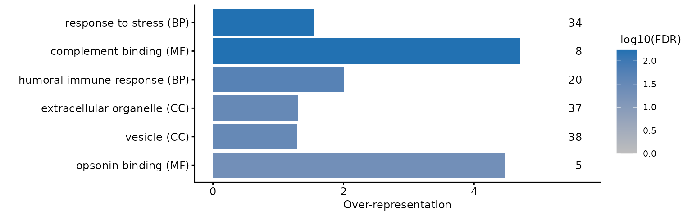
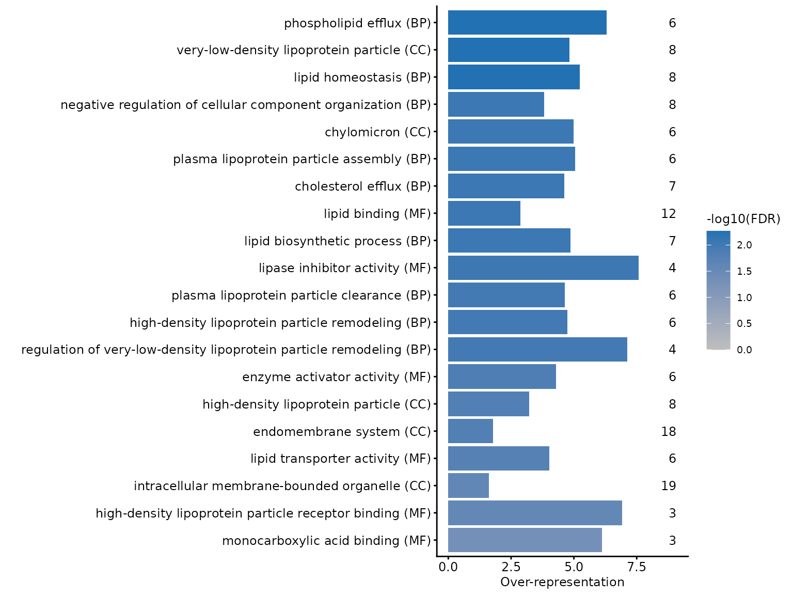
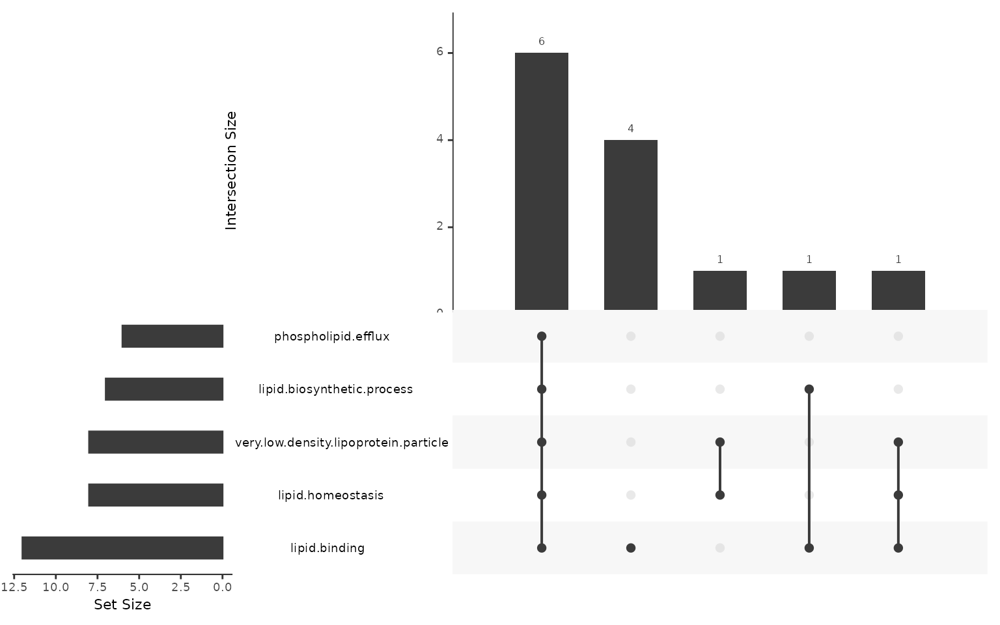

# Functional enrichment analysis

Statistical testing gives you a list of proteins. Functional enrichment
asks whether that list is structured — whether the proteins that changed
share a function, a location or a complex more often than a list of that
size drawn from the same experiment would.

That last clause is where most of the difficulty lies. Enrichment is a
comparison between a **foreground** (the proteins you called changed)
and a **background** (the proteins you could have called changed), and
both are properties of your experiment rather than of biology. Get
either wrong and the analysis will still run and still return small
p-values; they will just be answering a question you did not ask.

Over-representation analysis (ORA) with `goseq` is worked through here
on the whole-proteome comparison from the [testing
vignette](https://lmb-mass-spec-compbio.github.io/biomasslmb/articles/exploration_and_statistical_testing.md):
blood plasma from MPXV-infected individuals against healthy controls
(Wang et al. 2022). The expected answer is known — infection should
mount an acute-phase response — which makes it possible to judge whether
the analysis is behaving.

ORA is one of two standard approaches, and the choice between them is
worth making deliberately rather than by default. Gene set enrichment
analysis (GSEA) takes a ranking of every protein tested instead of a
list of those that passed a threshold, so it is not sensitive to where
that threshold sits — a difference that decides the outcome on this
data, as [what the foreground threshold
costs](#what-the-foreground-threshold-costs) shows below. [ORA or
GSEA?](https://lmb-mass-spec-compbio.github.io/biomasslmb/articles/ORA_vs_GSEA.md)
runs both on this same comparison and sets out where they agree and
where they do not.

## Load required packages

``` r

library(QFeatures)
library(biomasslmb)
library(ggplot2)
library(dplyr)
library(limma)
library(goseq)

dia_qf <- biomasslmb::dia_qf
```

## The proteins to test

The input comes from repeating the testing vignette’s analysis: restrict
to the two groups of interest, keep the proteins with at least 2
quantified values in both conditions, and fit the model.

``` r

dia_prot <- dia_qf[, colData(dia_qf)$group %in% c('control', 'MPXV')]

group <- factor(dia_prot[['protein']]$group, levels = c('control', 'MPXV'))

n_quant <- sapply(levels(group), function(g){
  rowSums(!is.na(assay(dia_prot[['protein']])[, group == g, drop = FALSE]))
})

testable <- rownames(n_quant)[apply(n_quant, 1, min) >= 2]

fit <- lmFit(assay(dia_prot[['protein']])[testable, ], model.matrix(~group))

limma_results <- eBayes(fit, trend = TRUE, robust = TRUE) %>%
  topTable(coef = 'groupMPXV', number = Inf) %>%
  tibble::rownames_to_column('Protein')
```

Changed proteins are defined by significance alone, without the `treat`
fold-change threshold used in the testing vignette. The threshold there
guards against calling small changes interesting; here it would shrink
the foreground, and the power of every enrichment test that follows
depends on the foreground size. What that choice costs is measured at
the end.

Increased and decreased proteins are tested separately. A term that is
over-represented among increased proteins and among decreased proteins
is not over-represented among changed proteins as a group — pooling the
two directions lets opposite biology cancel, which for this dataset
would mix the acute-phase response with the lipoprotein depletion it
drives.

``` r

bias <- setNames(limma_results$AveExpr, limma_results$Protein)

sig_up <- setNames(limma_results$adj.P.Val < 0.05 & limma_results$logFC > 0,
                   limma_results$Protein)
sig_dw <- setNames(limma_results$adj.P.Val < 0.05 & limma_results$logFC < 0,
                   limma_results$Protein)

c(tested = length(bias), increased = sum(sig_up), decreased = sum(sig_dw))
#>    tested increased decreased 
#>       231        43        27
```

Note what the background is here: the 231 proteins that were actually
tested, not the human proteome and not even everything identified in the
experiment. A plasma proteome is a heavily biased sample of the proteome
to begin with, so testing against all of UniProt would return
“secreted”, “extracellular region” and every related term for any
foreground at all, telling you only that you ran a plasma experiment.
The proteins that could have been called changed are the right
comparison, which is why the background is derived from the results
table rather than supplied separately.

## GO annotations

[`get_go_terms()`](https://lmb-mass-spec-compbio.github.io/biomasslmb/reference/get_go_terms.md)
retrieves the GO terms UniProt annotates to each accession.
`expand_terms = TRUE` also adds every ancestor term, so that a protein
annotated to `phospholipid efflux` also counts towards `lipid transport`
and `transport`. Enrichment tools that treat GO terms as flat, unrelated
categories — `goseq` among them — need this expansion, or a general term
will only ever be tested against the proteins annotated to it directly,
which is usually very few.

``` r

go_res_all <- get_go_terms(rownames(dia_qf[['protein']]), expand_terms = TRUE)
```

Expansion is slow and the query needs UniProt to be reachable, so a
stored copy of the result is read instead.
`data-raw/record_go_enrichment_cache.R` regenerates it, and `release`
records the UniProt release it was built from.

``` r

go_enrichment_cache <- readRDS(system.file(
  'extdata', 'go_enrichment_cache.rds', package = 'biomasslmb'))

go_enrichment_cache$release
#> [1] "2026_02"

go_res_all <- go_enrichment_cache$go_res_all

head(go_res_all)
#>   UNIPROTKB      GO.ID                              TERM ONTOLOGY
#> 1    P02786 GO:0000018   regulation of DNA recombination       BP
#> 2    P02787 GO:0000041    transition metal ion transport       BP
#> 3    P02786 GO:0000041    transition metal ion transport       BP
#> 4    P02790 GO:0000041    transition metal ion transport       BP
#> 5    Q562R1 GO:0000123 histone acetyltransferase complex       CC
#> 6    O00391 GO:0000139                    Golgi membrane       CC
```

`goseq` needs the mapping as two columns, feature and category.

``` r

gene2cat <- go_res_all[, c('UNIPROTKB', 'GO.ID')]
```

## Abundance bias

Abundant proteins are quantified more precisely and in more samples, so
they are more likely to reach significance for a change of a given size.
Abundance is also not spread evenly across GO terms. Together those two
facts mean a plain hypergeometric test will report terms rich in
abundant proteins as enriched whether or not anything happened to them.

[`nullp()`](https://rdrr.io/pkg/goseq/man/nullp.html) fits the
relationship between the bias and the probability of being called
significant, producing a probability weighting function (PWF). The bias
here is mean log2 abundance across samples — `AveExpr`, already in the
`limma` output. (For RNA-seq, which `goseq` was written for, the
equivalent bias is transcript length.)

``` r

set.seed(0)

pwf_up <- nullp(sig_up, bias.data = bias, plot.fit = FALSE)

plotPWF(pwf_up, binsize = 20,
        xlab = 'Mean abundance (log2)', ylab = 'Probability of significance')
```


Each point is a bin of 20 proteins ordered by abundance, and the line is
the fitted PWF. The trend is upward but shallow: the most abundant
proteins are 1.7 times as likely to be called significant as the least
abundant. Worth looking at rather than assuming — a flat PWF means the
correction will change nothing, and a steep one means an uncorrected
analysis would have been badly misleading.

## Over-representation testing

[`get_enriched_go()`](https://lmb-mass-spec-compbio.github.io/biomasslmb/reference/get_enriched_go.md)
wraps [`goseq()`](https://rdrr.io/pkg/goseq/man/goseq.html), adding
BH-adjusted p-values for over- and under-representation and a truncated
`term_short` column for plotting. The `Wallenius` method is what applies
the PWF: it treats the foreground as drawn from a biased urn, where each
protein’s chance of selection is its PWF value. Passing
`method = 'Hypergeometric'` instead runs the standard unweighted test
and ignores the PWF entirely, so the bias correction is a property of
the method, not of having fitted a PWF.

``` r

ora_up <- get_enriched_go(pwf_up, gene2cat = gene2cat, method = 'Wallenius')

nrow(ora_up)
#> [1] 1009
```

### Effect size

A p-value says a term is more represented than expected; it does not say
by how much, and with a large background a term can be highly
significant while barely enriched.
[`estimate_overrep()`](https://lmb-mass-spec-compbio.github.io/biomasslmb/reference/estimate_overrep.md)
adds two effect sizes: `overrep`, the ratio of the term’s foreground
rate to the overall foreground rate, and `adj_overrep`, the same ratio
after dividing out the PWF weight of the term’s proteins. Use
`adj_overrep` alongside a `Wallenius` p-value, so that both the test and
the effect size account for the bias.

``` r

ora_up <- estimate_overrep(ora_up, pwf_up, gene2cat)
```

### Independent filtering

Most GO terms cannot be informative in a given experiment: a term with 2
background proteins cannot survive correction across a thousand others
even if both are in the foreground, and a term covering most of the
background cannot be specific to anything. Both nonetheless add to the
multiple-testing burden.
[`add_independent_filtering_padj()`](https://lmb-mass-spec-compbio.github.io/biomasslmb/reference/add_independent_filtering_padj.md)
applies the principle DESeq2 uses for low-count genes — chooses a
minimum term size that maximises the number of rejections, then
re-adjusts p-values over only the terms that pass. This is valid because
term size is independent of the p-value under the null but not under the
alternative.

``` r

ora_up <- ora_up %>%
  add_independent_filtering_padj(plot = FALSE) %>%
  mutate(over_represented_adj_pval = padj_if)

sum(ora_up$over_represented_adj_pval < 0.05, na.rm = TRUE)
#> [1] 18
```

Setting `plot = TRUE` draws the number of rejections against the
filtering threshold, which is worth looking at if the chosen threshold
seems surprising.

### Redundant terms

The GO hierarchy guarantees that a real signal shows up as many terms at
once: if `high-density lipoprotein particle` is over-represented then so
are its parents, and each is reported as a separate finding.
[`remove_redundant_go()`](https://lmb-mass-spec-compbio.github.io/biomasslmb/reference/remove_redundant_go.md)
walks the hierarchy and keeps, from each branch, only the most
significant term.

``` r

ora_up_flt <- ora_up %>%
  filter(over_represented_adj_pval < 0.05) %>%
  remove_redundant_go()

nrow(ora_up_flt)
#> [1] 6
```

Note the order: filter to significant terms first, then de-duplicate.
Running it over every tested term would spend a lot of time collapsing
branches that were never significant, and could keep a non-significant
term as the representative of its branch.

## The decreased proteins

The same steps for the other direction.

``` r

pwf_dw <- nullp(sig_dw, bias.data = bias, plot.fit = FALSE)

ora_dw_flt <- get_enriched_go(pwf_dw, gene2cat = gene2cat, method = 'Wallenius') %>%
  estimate_overrep(pwf_dw, gene2cat) %>%
  add_independent_filtering_padj(plot = FALSE) %>%
  mutate(over_represented_adj_pval = padj_if) %>%
  filter(over_represented_adj_pval < 0.05) %>%
  remove_redundant_go()

nrow(ora_dw_flt)
#> [1] 20
```

## Plotting the results

[`plot_go()`](https://lmb-mass-spec-compbio.github.io/biomasslmb/reference/plot_go.md)
plots over-representation on the x-axis, shades by adjusted p-value and
annotates each bar with the number of foreground proteins carrying the
term. Both are needed to read the result: a large over-representation
resting on 4 proteins is a different claim from a small one resting on
40.

By default the axis labels come from `term_short`, the 30-character
truncation
[`get_enriched_go()`](https://lmb-mass-spec-compbio.github.io/biomasslmb/reference/get_enriched_go.md)
adds. GO terms that share a prefix collide once truncated, so the labels
below use the full `term`.

The increased proteins:

``` r

plot_go(ora_up_flt, term_col = 'term') +
  theme_biomasslmb(base_size = 9, border = FALSE, aspect_square = FALSE)
```



They are enriched for complement and humoral immune terms —
`complement binding` covers 8 of the 9 background proteins annotated to
it — which is the acute-phase response the design was expected to show.

The decreased proteins:

``` r

plot_go(ora_dw_flt, term_col = 'term') +
  theme_biomasslmb(base_size = 9, border = FALSE, aspect_square = FALSE)
```



They are enriched for lipoprotein particles and lipid transport, driven
by the apolipoproteins. This is the other half of the same biology: the
negative acute-phase reactants.

## Which proteins drive a term?

Related GO terms are annotated to overlapping sets of proteins, so a
column of significant terms can be one finding reported repeatedly
rather than several independent ones.
[`remove_redundant_go()`](https://lmb-mass-spec-compbio.github.io/biomasslmb/reference/remove_redundant_go.md)
addresses this through the hierarchy, but terms that overlap heavily
without being ancestors of each other survive it.
[`plot_go_terms_upset()`](https://lmb-mass-spec-compbio.github.io/biomasslmb/reference/plot_go_terms_upset.md)
shows the overlap directly, at the level of the proteins.

``` r

plot_go_terms_upset(
  goi = head(ora_dw_flt$term, 5),
  foi = names(sig_dw)[sig_dw],
  gene2cat = go_res_all)
```



Most of the five terms are carried by the same small core of proteins.
That does not make the enrichment wrong, but it does mean the five terms
are close to one finding, and a summary reporting them as five separate
results would overstate the evidence.

## What the foreground threshold costs

ORA needs a cut-off to define the foreground, and the result depends on
where it is put. Below, the same analysis with the foreground from
`treat` at a 1.2-fold threshold — the definition the testing vignette
used.

``` r

treat_results <- treat(fit, fc = 1.2, trend = TRUE, robust = TRUE) %>%
  topTreat(coef = 'groupMPXV', number = Inf) %>%
  tibble::rownames_to_column('Protein')

sig_up_treat <- setNames(treat_results$adj.P.Val < 0.05 & treat_results$logFC > 0,
                         treat_results$Protein)

bias_treat <- setNames(treat_results$AveExpr, treat_results$Protein)

ora_up_treat <- nullp(sig_up_treat, bias.data = bias_treat, plot.fit = FALSE) %>%
  get_enriched_go(gene2cat = gene2cat, method = 'Wallenius') %>%
  add_independent_filtering_padj(plot = FALSE)

c(foreground = sum(sig_up_treat),
  significant_terms = sum(ora_up_treat$padj_if < 0.05, na.rm = TRUE))
#>        foreground significant_terms 
#>                14                 0
```

``` r

ora_up_treat %>%
  arrange(over_represented_pvalue) %>%
  select(term_short, numDEInCat, numInCat, over_represented_pvalue, padj_if) %>%
  head(4) %>%
  knitr::kable(digits = c(NA, 0, 0, 4, 3))
```

| term_short | numDEInCat | numInCat | over_represented_pvalue | padj_if |
|:---|---:|---:|---:|---:|
| acute-phase response | 4 | 16 | 0.0124 | 0.668 |
| acute inflammatory response | 4 | 19 | 0.0235 | 0.668 |
| response to stress | 11 | 112 | 0.0237 | 0.668 |
| complement activation, alterna | 3 | 12 | 0.0273 | 0.668 |

The ranking is unchanged — `acute-phase response` is still the most
over-represented term, on 4 of its 16 background proteins — but with 14
foreground proteins instead of 43, nothing survives multiple-testing
correction across 675 terms. The biology did not change; the power did.

This is the general shape of the problem, and it cuts both ways: a
permissive threshold gives power but admits noise into the foreground,
and a strict one gives a foreground you trust and no power to use it.
Report the threshold you used, and treat a result that appears or
disappears when you move it as a weak result either way.

This is also the case for running GSEA alongside ORA rather than
choosing once and for all. Ranking every tested protein removes the
dependence on the cut-off entirely, at the price of a dependence on the
ranking statistic instead. [ORA or
GSEA?](https://lmb-mass-spec-compbio.github.io/biomasslmb/articles/ORA_vs_GSEA.md)
runs both on this data and compares what each finds.

## Summary

This vignette has:

- Defined a foreground and a background from the same testing results,
  so that enrichment is measured against the proteins that could have
  been called changed rather than against the proteome
- Retrieved GO annotations with `get_go_terms(expand_terms = TRUE)`,
  expanding to ancestor terms because `goseq` treats categories as flat
- Fitted a probability weighting function with
  [`nullp()`](https://rdrr.io/pkg/goseq/man/nullp.html) on mean protein
  abundance, and used `method = 'Wallenius'` so that the enrichment test
  actually applies it
- Tested each direction separately with
  [`get_enriched_go()`](https://lmb-mass-spec-compbio.github.io/biomasslmb/reference/get_enriched_go.md),
  added an effect size with
  [`estimate_overrep()`](https://lmb-mass-spec-compbio.github.io/biomasslmb/reference/estimate_overrep.md),
  reduced the multiple-testing burden with
  [`add_independent_filtering_padj()`](https://lmb-mass-spec-compbio.github.io/biomasslmb/reference/add_independent_filtering_padj.md)
  and collapsed hierarchy-redundant terms with
  [`remove_redundant_go()`](https://lmb-mass-spec-compbio.github.io/biomasslmb/reference/remove_redundant_go.md)
- Plotted the surviving terms with
  [`plot_go()`](https://lmb-mass-spec-compbio.github.io/biomasslmb/reference/plot_go.md)
  and checked, with
  [`plot_go_terms_upset()`](https://lmb-mass-spec-compbio.github.io/biomasslmb/reference/plot_go_terms_upset.md),
  how far they rest on the same proteins
- Shown that the foreground threshold, not the biology, decided whether
  the increased proteins yielded a significant term at all

## Where to go next

- [ORA or
  GSEA?](https://lmb-mass-spec-compbio.github.io/biomasslmb/articles/ORA_vs_GSEA.md)
  runs gene set enrichment analysis on this same data and compares it
  with the analysis above. GSEA ranks every tested protein by a signed
  statistic rather than thresholding, so it removes the sensitivity
  demonstrated in the last section, and it is worth running alongside
  ORA when the foreground is small.
- [Data exploration and statistical
  testing](https://lmb-mass-spec-compbio.github.io/biomasslmb/articles/exploration_and_statistical_testing.md)
  covers where the foreground came from, including the testability
  filter that decided which proteins entered the background.
- [Protein
  annotation](https://lmb-mass-spec-compbio.github.io/biomasslmb/articles/protein_annotation.md)
  covers
  [`get_go_terms()`](https://lmb-mass-spec-compbio.github.io/biomasslmb/reference/get_go_terms.md)
  and the rest of the UniProt annotation retrieval in more detail,
  including what happens to accessions that no longer map.

## Getting help

If your experiment does not fit what this article assumes, or a result
looks wrong, please get in touch with Tom Smith (<tsmith@mrclmb.ac.uk>)
rather than guessing — it is far easier to help while an analysis is in
progress than to unpick a decision afterwards, and easier still before
the samples are run. [Getting
started](https://lmb-mass-spec-compbio.github.io/biomasslmb/articles/biomasslmb.md)
sets out which article applies to which experiment.

``` r

sessionInfo()
#> R version 4.5.3 (2026-03-11)
#> Platform: x86_64-pc-linux-gnu
#> Running under: Ubuntu 24.04.5 LTS
#> 
#> Matrix products: default
#> BLAS:   /usr/lib/x86_64-linux-gnu/openblas-pthread/libblas.so.3 
#> LAPACK: /usr/lib/x86_64-linux-gnu/openblas-pthread/libopenblasp-r0.3.26.so;  LAPACK version 3.12.0
#> 
#> locale:
#>  [1] LC_CTYPE=C.UTF-8       LC_NUMERIC=C           LC_TIME=C.UTF-8       
#>  [4] LC_COLLATE=C.UTF-8     LC_MONETARY=C.UTF-8    LC_MESSAGES=C.UTF-8   
#>  [7] LC_PAPER=C.UTF-8       LC_NAME=C              LC_ADDRESS=C          
#> [10] LC_TELEPHONE=C         LC_MEASUREMENT=C.UTF-8 LC_IDENTIFICATION=C   
#> 
#> time zone: UTC
#> tzcode source: system (glibc)
#> 
#> attached base packages:
#> [1] stats4    stats     graphics  grDevices utils     datasets  methods  
#> [8] base     
#> 
#> other attached packages:
#>  [1] goseq_1.62.0                geneLenDataBase_1.46.0     
#>  [3] BiasedUrn_2.0.12            limma_3.66.0               
#>  [5] dplyr_1.2.1                 ggplot2_4.0.3              
#>  [7] biomasslmb_0.1.0            QFeatures_1.20.0           
#>  [9] MultiAssayExperiment_1.36.2 SummarizedExperiment_1.40.0
#> [11] Biobase_2.70.0              GenomicRanges_1.62.1       
#> [13] Seqinfo_1.0.0               IRanges_2.44.0             
#> [15] S4Vectors_0.48.1            BiocGenerics_0.56.0        
#> [17] generics_0.1.4              MatrixGenerics_1.22.0      
#> [19] matrixStats_1.5.0          
#> 
#> loaded via a namespace (and not attached):
#>   [1] naniar_1.1.0             RColorBrewer_1.1-3       jsonlite_2.0.0          
#>   [4] magrittr_2.0.5           GenomicFeatures_1.62.0   farver_2.1.2            
#>   [7] corrplot_0.95            rmarkdown_2.32           fs_2.1.0                
#>  [10] BiocIO_1.20.0            ragg_1.5.2               vctrs_0.7.3             
#>  [13] memoise_2.0.1            Rsamtools_2.26.0         RCurl_1.98-1.20         
#>  [16] htmltools_0.5.9          S4Arrays_1.10.1          BiocBaseUtils_1.12.0    
#>  [19] progress_1.2.3           curl_8.0.0               SparseArray_1.10.10     
#>  [22] sass_0.4.10              uniprotREST_1.0.0        bslib_0.12.0            
#>  [25] htmlwidgets_1.6.4        desc_1.4.3               plyr_1.8.9              
#>  [28] httr2_1.3.0              cachem_1.1.0             GenomicAlignments_1.46.0
#>  [31] igraph_2.3.3             lifecycle_1.0.5          pkgconfig_2.0.3         
#>  [34] Matrix_1.7-4             R6_2.6.1                 fastmap_1.2.0           
#>  [37] clue_0.3-68              digest_0.6.39            AnnotationDbi_1.72.0    
#>  [40] textshaping_1.0.5        RSQLite_3.53.3           labeling_0.4.3          
#>  [43] filelock_1.0.3           mgcv_1.9-4               httr_1.4.9              
#>  [46] abind_1.4-8              compiler_4.5.3           bit64_4.8.6             
#>  [49] withr_3.0.3              S7_0.2.2                 backports_1.5.1         
#>  [52] BiocParallel_1.44.0      DBI_1.3.0                UpSetR_1.4.1            
#>  [55] biomaRt_2.66.2           MASS_7.3-65              DelayedArray_0.36.1     
#>  [58] rjson_0.2.23             tools_4.5.3              otel_0.2.0              
#>  [61] visdat_0.6.0             glue_1.8.1               restfulr_0.0.17         
#>  [64] nlme_3.1-168             grid_4.5.3               checkmate_2.3.4         
#>  [67] cluster_2.1.8.2          reshape2_1.4.5           gtable_0.3.6            
#>  [70] tidyr_1.3.2              hms_1.1.4                XVector_0.50.0          
#>  [73] pillar_1.11.1            stringr_1.6.0            genefilter_1.92.0       
#>  [76] robustbase_0.99-7        splines_4.5.3            BiocFileCache_3.0.0     
#>  [79] lattice_0.22-9           survival_3.8-6           rtracklayer_1.70.1      
#>  [82] bit_4.6.0                annotate_1.88.0          tidyselect_1.2.1        
#>  [85] GO.db_3.22.0             Biostrings_2.78.0        knitr_1.52              
#>  [88] gridExtra_2.3.1          ProtGenerics_1.42.0      xfun_0.60               
#>  [91] statmod_1.5.2            DEoptimR_1.2-1           stringi_1.8.9           
#>  [94] UCSC.utils_1.6.1         lazyeval_0.2.3           yaml_2.3.12             
#>  [97] evaluate_1.0.5           codetools_0.2-20         cigarillo_1.0.0         
#> [100] MsCoreUtils_1.22.1       tibble_3.3.1             cli_3.6.6               
#> [103] xtable_1.8-8             systemfonts_1.3.2        jquerylib_0.1.4         
#> [106] Rcpp_1.1.2               GenomeInfoDb_1.46.2      dbplyr_2.6.0            
#> [109] png_0.1-9                XML_3.99-0.24            parallel_4.5.3          
#> [112] pkgdown_2.2.1            blob_1.3.0               prettyunits_1.2.0       
#> [115] AnnotationFilter_1.34.0  bitops_1.1-0             txdbmaker_1.6.2         
#> [118] scales_1.4.0             purrr_1.2.2              crayon_1.5.3            
#> [121] rlang_1.3.0              KEGGREST_1.50.0
```

Wang, Ziyue, Pinkus Tober-Lau, Vadim Farztdinov, et al. 2022. “The Human
Host Response to Monkeypox Infection: A Proteomic Case Series Study.”
*EMBO Molecular Medicine* 14 (11): e16643.
<https://doi.org/10.15252/emmm.202216643>.
