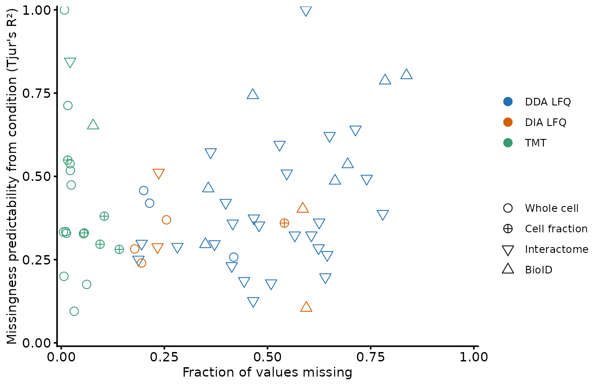
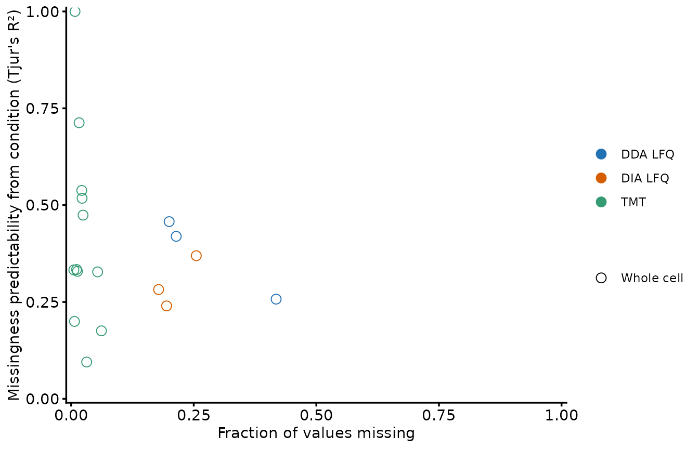
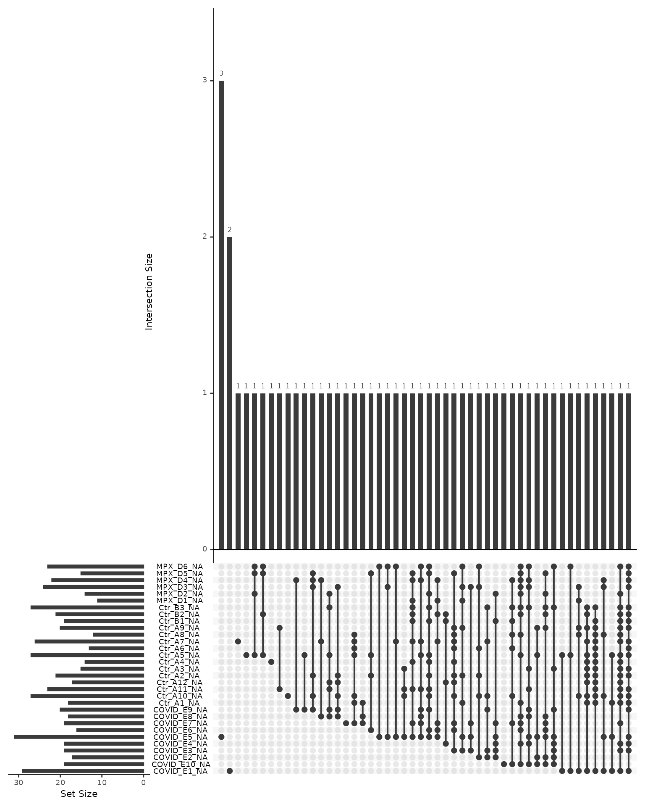
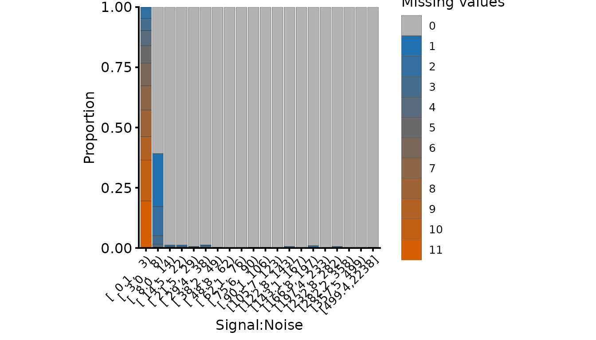
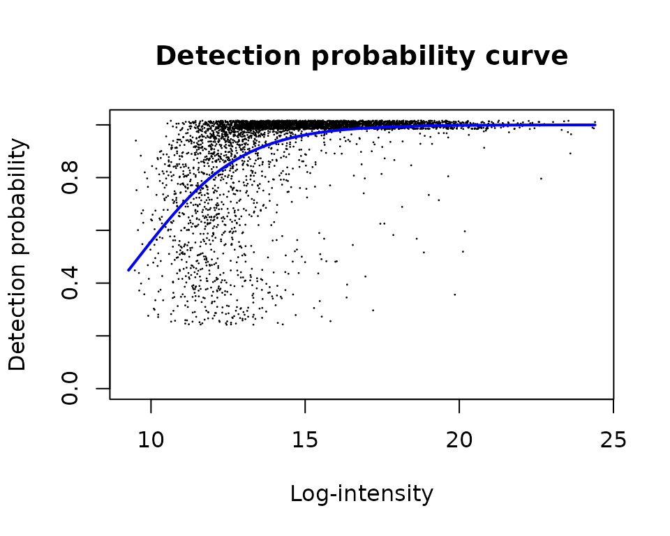
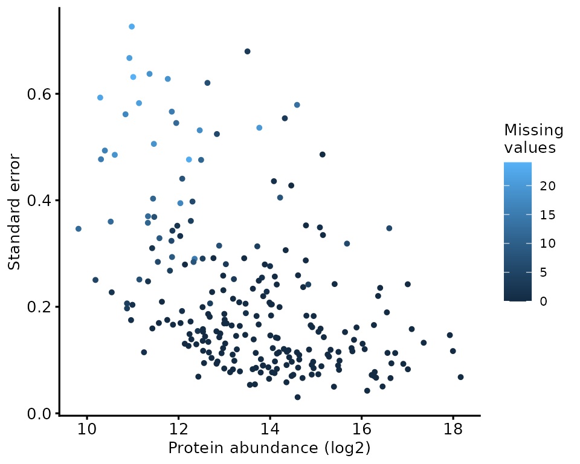
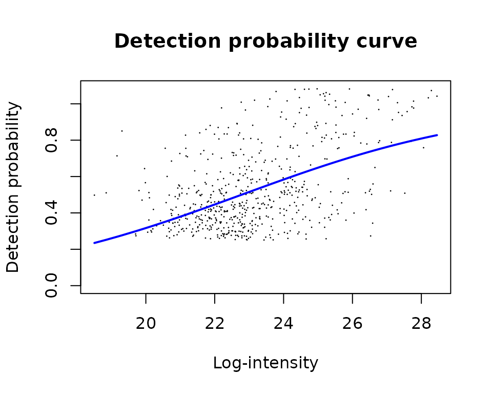

# Handling missing values

Every quantitative proteomics dataset has missing values, and every
stage of an analysis makes a decision about them — usually implicitly.
Filtering features, choosing a summarisation function, imputing or not,
and choosing a statistical test are all, in part, choices about what a
missing value means.

This article treats them as one decision rather than four. It works
through where missing values come from, how to find out what yours look
like, what can be done at each stage, and what each option costs. The
costs are the point: there is no option here that is free, and the
common failure is not picking the wrong one but picking one without
noticing that a choice was made.

## Load required packages

``` r

library(QFeatures)
library(biomasslmb)
library(ggplot2)
library(dplyr)
library(tidyr)
library(limma)

dia_qf <- biomasslmb::dia_qf
tmt_qf <- biomasslmb::tmt_qf
lfq_qf_turboid <- biomasslmb::lfq_qf_turboid
```

## Where missing values come from

Missing value severity is set by how the data were acquired. How much of
that missingness is structured by experimental condition is a separate
question with a separate answer, and the two are easy to run together.

A survey of 63 experiments processed by the facility separates them.
Each point is one experiment: the fraction of its matrix that is
missing, against how well experimental condition predicts which values
those are.

``` r

missingness_survey <- readRDS(system.file(
  'extdata', 'missingness_survey.rds', package = 'biomasslmb'))

survey_experiments <- missingness_survey$experiments %>%
  mutate(sample_type = factor(sample_type, levels = c(
    'Whole cell', 'Cell fraction', 'Interactome', 'BioID')))
```

``` r

survey_experiments %>%
  ggplot(aes(total_perc_missing, condition_miss_weighted_mean,
             colour = ms_type, shape = sample_type)) +
  geom_point(size = 3, stroke = 0.5) +
  scale_shape_manual(values = c(1, 10, 6, 2), name = '') +
  scale_colour_manual(values = get_cat_palette(3), name = '') +
  scale_x_continuous(limits = c(0, 1), expand = c(0.01, 0)) +
  scale_y_continuous(limits = c(0, 1), expand = c(0.01, 0)) +
  theme_biomasslmb(base_size = 11, aspect_square = FALSE) +
  labs(x = 'Fraction of values missing',
       y = "Missingness predictability from condition (Tjur's R\u00b2)")
```



The y axis is the weighted mean Tjur’s R² that
[`condition_miss_index()`](https://lmb-mass-spec-compbio.github.io/biomasslmb/reference/condition_miss_index.md)
returns as `weighted_mean_score`, before its coverage penalty. The
penalised `index` scales with how many features have any missingness at
all, which would put a version of the x axis on both axes.

**The x axis separates the acquisition types completely.** No TMT
experiment in the survey exceeds 14.1% missing and no LFQ-DDA experiment
falls below 18.7%. The mechanism is not in dispute: within a TMT plex
every sample is quantified from the same MS2 spectrum, so a peptide is
measured in all channels of that plex or in none of them. In LFQ each
sample is a separate run, and whether a peptide is selected for
fragmentation there is partly stochastic and strongly
abundance-dependent.

**The y axis separates almost nothing.** Enrichment designs sit at a
median of 0.37 against 0.33 for whole-cell and fractionated ones, on
interquartile ranges that overlap across most of their length.
Predictability from condition is close to uncorrelated with how much is
missing (Spearman 0.08), and varies more inside each colour and shape
than between them.

That shape is useful, but it comes with a confound worth naming. The
facility runs most of its whole-proteome work on TMT and most of its
enrichment work label-free, so acquisition type and experimental design
are close to collinear here, and every comparison between colours is
partly a comparison between shapes.

``` r

survey_experiments %>%
  count(ms_type, sample_type) %>%
  pivot_wider(names_from = sample_type, values_from = n, values_fill = 0) %>%
  knitr::kable()
```

| ms_type | Whole cell | Interactome | BioID | Cell fraction |
|:--------|-----------:|------------:|------:|--------------:|
| DDA LFQ |          3 |          26 |     7 |             0 |
| DIA LFQ |          3 |           2 |     2 |             1 |
| TMT     |         12 |           1 |     1 |             5 |

The circles carry the like-for-like comparison. Restricted to whole-cell
experiments — the design both the TMT and LFQ vignettes work through:

``` r

survey_experiments %>%
  filter(sample_type == 'Whole cell') %>%
  ggplot(aes(total_perc_missing, condition_miss_weighted_mean,
             colour = ms_type, shape = sample_type)) +
  geom_point(size = 3, stroke = 0.5) +
  scale_shape_manual(values = c(1, 10, 6, 2), name = '') +
  scale_colour_manual(values = get_cat_palette(3), name = '') +
  scale_x_continuous(limits = c(0, 1), expand = c(0.01, 0)) +
  scale_y_continuous(limits = c(0, 1), expand = c(0.01, 0)) +
  theme_biomasslmb(base_size = 11, aspect_square = FALSE) +
  labs(x = 'Fraction of values missing',
       y = "Missingness predictability from condition (Tjur's R\u00b2)")
```



``` r

survey_experiments %>%
  filter(sample_type == 'Whole cell') %>%
  group_by(ms_type) %>%
  summarise(experiments = n(),
            fraction_missing = round(median(total_perc_missing), 3),
            abundance_predicts = round(median(tjur_r2_intensity_only), 3),
            condition_predicts = round(median(condition_miss_weighted_mean), 3)) %>%
  knitr::kable()
```

| ms_type | experiments | fraction_missing | abundance_predicts | condition_predicts |
|:--------|------------:|-----------------:|-------------------:|-------------------:|
| DDA LFQ |           3 |            0.214 |              0.006 |              0.419 |
| DIA LFQ |           3 |            0.195 |              0.024 |              0.282 |
| TMT     |          12 |            0.019 |              0.083 |              0.333 |

The severity gap survives the fair comparison, and 1.9% against 21.4% is
the pair of numbers to benchmark a whole-proteome experiment against —
on twelve TMT experiments and three LFQ-DDA ones, so read them as an
order of magnitude rather than as precise figures. No difference in
condition predictability survives it.

The abundance column runs the other way from the intuition. Abundance
explains *more* of TMT’s missingness than of LFQ’s, not less, and the
gap is wider among whole-cell experiments than across the whole survey.
There is very little TMT missingness and almost all of it is the
low-signal tail; LFQ has a great deal, and run-to-run sampling and
match-between-runs add variation that has nothing to do with how
abundant a protein is.

Three conclusions follow, and they set up everything below:

- **Imputation and missingness-aware models are responses to LFQ
  problems.** `robustSummary`, limpa’s detection probability curve and
  imputation all address across-run missingness. Applying them to
  within-plex TMT data addresses a problem that is largely not there.
- **TMT’s missing value problem is between plexes, not within them.** A
  protein quantified in every channel of plex 1 and absent from plex 2
  is missing for structural reasons, and the fix is bridge correction
  and design, not imputation. See [multi-plex
  TMT](https://lmb-mass-spec-compbio.github.io/biomasslmb/articles/TMT_multiplex.md).
- **How condition-structured your missingness is cannot be read off the
  acquisition type or the design.** It varies more within those
  categories than between them, which is the argument for measuring it
  on your own data.

## Diagnosing your own data

Aggregate survey numbers tell you what to expect. They do not tell you
what you have, and the point of the diagnostics below is to make the
choice that follows an informed one.

We use two of the packaged datasets: `dia_qf`, an LFQ-DIA plasma case
series, and `tmt_qf`, a single-plex TMT comparison.

### How much, and in what pattern?

``` r

c(dia_precursors = mean(is.na(assay(dia_qf[['peptides_filtered_norm']]))),
  dia_protein = mean(is.na(assay(dia_qf[['protein']]))),
  tmt_psms = mean(is.na(assay(tmt_qf[['psms_filtered_norm']]))),
  tmt_protein = mean(is.na(assay(tmt_qf[['protein']])))) %>%
  round(3)
#> dia_precursors    dia_protein       tmt_psms    tmt_protein 
#>          0.146          0.083          0.036          0.000
```

The TMT protein assay has no missing values at all, and the DIA one has
8.3%. Summarisation reduces missingness in both cases, because a protein
needs only one quantified feature to get a value — which is itself
something to be careful about, and is why the QC vignettes mask protein
values derived from too few features.

[`plot_missing_upset()`](https://lmb-mass-spec-compbio.github.io/biomasslmb/reference/plot_missing_upset.md)
shows which *combinations* of samples are missing together. A few
dominant patterns that align with the experimental design mean something
different from a long tail of one-off patterns. Here, we have the
latter.

``` r

plot_missing_upset(dia_qf, i = 'protein')
```



### Is it explained by abundance, or by condition?

These are different problems with different remedies. Abundance-driven
missingness is what imputation and detection-probability models are
built for. Condition-driven missingness may be the biological signal
itself, and imputing it discards the finding.

[`global_condition_miss_score()`](https://lmb-mass-spec-compbio.github.io/biomasslmb/reference/global_condition_miss_score.md)
separates the two, fitting missingness against abundance and then
against abundance plus condition:

``` r

dia_global <- global_condition_miss_score(
  dia_qf, i = 'peptides_filtered_norm', group_cols = 'group')

c(abundance_only = dia_global$tjur_intensity_only,
  condition_share = dia_global$tjur_condition_fraction,
  lrt_p = dia_global$lrt_pvalue) %>%
  signif(3)
#>  abundance_only condition_share           lrt_p 
#>        1.10e-02        7.76e-02        2.02e-12
```

Condition contributes a small but statistically detectable share here.
That combination — a significant likelihood ratio test on a small effect
— is common in a well-powered whole-proteome comparison, and it is the
reason the test alone is not the answer: with 54,932 observations almost
any structure is detectable, so the size of the contribution matters
more than its p-value.

[`condition_miss_score()`](https://lmb-mass-spec-compbio.github.io/biomasslmb/reference/condition_miss_score.md)
gives the same idea per feature, which is more actionable, and
[`condition_miss_index()`](https://lmb-mass-spec-compbio.github.io/biomasslmb/reference/condition_miss_index.md)
reduces it to one number for the dataset.

``` r

miss_res <- condition_miss_score(dia_qf, i = 'protein', group_cols = 'group')
condition_miss_index(miss_res$summary)$index
#> [1] 0.04637771
```

Close to zero, so protein-level missingness in this comparison is
largely unrelated to clinical group. In an enrichment experiment the
same index is high by construction, which is the signal rather than a
problem — see [enrichment
designs](https://lmb-mass-spec-compbio.github.io/biomasslmb/articles/interactome_designs.md).

### The TMT-specific view

For TMT, the useful feature-level diagnostic is missingness against
reporter signal-to-noise.
[`plot_missing_SN()`](https://lmb-mass-spec-compbio.github.io/biomasslmb/reference/plot_missing_SN.md)
bins PSMs by S:N and shows how many channels are missing in each bin.

``` r

plot_missing_SN(tmt_qf[['psms_filtered']])
```



Missing channels are concentrated in the low S:N bins and essentially
absent from the high ones. This is what makes an S:N threshold the right
tool for TMT: it removes the PSMs that produce missing values *and* the
PSMs whose measured values are least reliable, in one filter, without
any modelling.

## Handling it: feature level

The first opportunity is before summarisation, and it is the one with
the best cost-to-benefit ratio, because a feature removed here costs you
nothing if the protein has others.

- **TMT: filter on signal-to-noise.**
  [`filter_features_sn()`](https://lmb-mass-spec-compbio.github.io/biomasslmb/reference/filter_features_sn.md)
  and the S:N threshold in
  [`filter_TMT_PSMs()`](https://lmb-mass-spec-compbio.github.io/biomasslmb/reference/filter_TMT_PSMs.md).
  The plot above is how to choose the threshold.
- **LFQ: filter on how many samples a feature was quantified in.**
  `QFeatures::filterNA(pNA = )` sets the tolerance. Being strict here is
  expensive in LFQ — requiring complete features can remove most of the
  data — which is why the LFQ vignettes use a permissive threshold and
  rely on the summarisation step to cope.
- **Both: require more than one feature per protein.**
  [`filter_features_per_protein()`](https://lmb-mass-spec-compbio.github.io/biomasslmb/reference/filter_features_per_protein.md)
  removes proteins quantified from a single peptide or precursor. A
  one-feature protein has no internal replication, so nothing about it
  can be checked, and its missingness pattern is the missingness pattern
  of one peptide rather than of the protein.

These are covered in context, with thresholds, in the
acquisition-specific QC vignettes.

## Handling it: summarisation

The choice between summing features and
[`MsCoreUtils::robustSummary`](https://rdrr.io/pkg/MsCoreUtils/man/robustSummary.html)
is usually presented as a choice of estimator. It is at least as much a
choice about missing values.

Summing requires every feature to be present in every sample, or the sum
is comparing different sets of peptides between samples. `robustSummary`
fits a model that tolerates missing features, so it can use incomplete
peptides without that bias. Which you want follows from the acquisition
type: within a TMT plex, features are near-complete after S:N filtering,
so summing is well defined and is what these vignettes use; in LFQ,
requiring complete features discards most of the data, so
`robustSummary` is the better choice.

The [summarisation
methods](https://lmb-mass-spec-compbio.github.io/biomasslmb/articles/summarisation_methods.md)
vignette compares the two directly on the same data, including what
happens when each is used where the other belongs.

## Handling it: protein level

This is where the real decision is, and where the three common answers
differ most.

We use the MPXV-vs-control comparison from the [testing
vignette](https://lmb-mass-spec-compbio.github.io/biomasslmb/articles/exploration_and_statistical_testing.md),
which has enough missingness to matter and a known expected answer.

``` r

dia_prot <- dia_qf[, colData(dia_qf)$group %in% c('control', 'MPXV')]

group <- factor(dia_prot[['protein']]$group, levels = c('control', 'MPXV'))

n_quant <- sapply(levels(group), function(g){
  rowSums(!is.na(assay(dia_prot[['protein']])[, group == g, drop = FALSE]))
})

testable <- rownames(n_quant)[apply(n_quant, 1, min) >= 2]

c(proteins = nrow(n_quant), testable = length(testable))
#> proteins testable 
#>      239      231
```

### Option 1: impute nothing

Test only the proteins with enough genuine measurements, and accept that
the rest are untested. This is the route the testing vignette takes.

``` r

design <- model.matrix(~group)

res_none <- assay(dia_prot[['protein']])[testable, ] %>%
  lmFit(design) %>%
  treat(fc = 1.2, trend = TRUE, robust = TRUE) %>%
  topTreat(coef = 'groupMPXV', number = Inf)
```

### Option 2: impute everything

Fill every missing value from a low-abundance distribution, on the
assumption that a missing value means the protein was below the limit of
detection. `MinProb` draws from a Gaussian centred on the low tail of
each sample’s observed distribution.

``` r

set.seed(42)

dia_prot <- QFeatures::impute(
  dia_prot, i = 'protein', name = 'protein_imputed', method = 'MinProb')
#> [1] 0.3761353

res_all <- assay(dia_prot[['protein_imputed']]) %>%
  lmFit(design) %>%
  treat(fc = 1.2, trend = TRUE, robust = TRUE) %>%
  topTreat(coef = 'groupMPXV', number = Inf)
```

### Option 3: impute only where it is defensible

The reason blanket imputation is risky is that it treats every missing
value as a below-detection value, including the ones that are missing at
random from an otherwise well-measured protein.
[`restrict_imputation()`](https://lmb-mass-spec-compbio.github.io/biomasslmb/reference/restrict_imputation.md)
keeps the imputed values only where the missingness pattern is
consistent with genuine absence — here, where a condition has at most
one quantified replicate.

``` r

use_imputed_df <- data.frame(
  group = rep(c('control', 'MPXV'), each = 2),
  n_finite = rep(c(0, 1), 2))

dia_prot <- restrict_imputation(
  dia_prot,
  i_unimputed = 'protein',
  i_imputed = 'protein_imputed',
  i_restricted_imputed = 'protein_restricted',
  use_imputed_df = use_imputed_df)
```

``` r

res_restricted <- assay(dia_prot[['protein_restricted']]) %>%
  lmFit(design) %>%
  treat(fc = 1.2, trend = TRUE, robust = TRUE) %>%
  topTreat(coef = 'groupMPXV', number = Inf)
```

### What the three give you

``` r

summarise_res <- function(res, label){
  data.frame(approach = label,
             tested = nrow(res),
             significant = sum(res$adj.P.Val < 0.05, na.rm = TRUE))
}

bind_rows(
  summarise_res(res_none, 'impute nothing'),
  summarise_res(res_restricted, 'restricted imputation'),
  summarise_res(res_all, 'impute everything')) %>%
  knitr::kable()
```

| approach              | tested | significant |
|:----------------------|-------:|------------:|
| impute nothing        |    231 |          26 |
| restricted imputation |    239 |          33 |
| impute everything     |    239 |          32 |

Imputation buys hits, as it always does. The question is which ones.

``` r

gene_names <- as.data.frame(rowData(dia_qf[['protein']])[, c('Protein.Group', 'Genes')])

sig_of <- function(res) rownames(res)[which(res$adj.P.Val < 0.05)]

gained <- function(res){
  g <- setdiff(sig_of(res), sig_of(res_none))
  data.frame(Protein = g,
             Gene = gene_names$Genes[match(g, gene_names$Protein.Group)],
             n_control = n_quant[g, 'control'],
             n_MPXV = n_quant[g, 'MPXV'])
}

knitr::kable(gained(res_restricted), row.names = FALSE,
             caption = 'Gained by restricted imputation')
```

| Protein    | Gene     | n_control | n_MPXV |
|:-----------|:---------|----------:|-------:|
| P02741     | CRP      |         1 |      6 |
| A0A0C4DH31 | IGHV1-18 |         0 |      4 |
| P01706     | IGLV2-11 |         1 |      4 |
| Q08830     | FGL1     |         0 |      3 |
| P01714     | IGLV3-19 |        10 |      1 |
| Q15166     | PON3     |         7 |      0 |
| P29622     | SERPINA4 |        15 |      6 |

Gained by restricted imputation {.table}

``` r

knitr::kable(gained(res_all), row.names = FALSE,
             caption = 'Gained by blanket imputation')
```

| Protein    | Gene     | n_control | n_MPXV |
|:-----------|:---------|----------:|-------:|
| P02741     | CRP      |         1 |      6 |
| P55056     | APOC4    |        15 |      4 |
| P01706     | IGLV2-11 |         1 |      4 |
| A0A0C4DH31 | IGHV1-18 |         0 |      4 |
| P04406     | GAPDH    |         2 |      6 |
| P29622     | SERPINA4 |        15 |      6 |

Gained by blanket imputation {.table}

Read the `n_control` and `n_MPXV` columns. Three kinds of gain appear
here, and they are not equally trustworthy:

- **Proteins that were untestable and are now testable**, with zero or
  one quantified replicate in one condition. `CRP` is the clearest:
  quantified in all 6 MPXV samples and 1 of 15 controls, and the
  canonical acute-phase protein. It is absent from the controls because
  it is genuinely low there, so imputing a low value is close to right,
  and both imputation routes recover it. This is the case imputation
  exists for.
- **Proteins that were testable and became significant**, whose call
  changed rather than being rescued. `SERPINA4` is the instructive one:
  quantified in all 15 controls and all 6 MPXV samples, so not one of
  its own values was imputed, yet it is gained by both routes. Imputing
  other proteins changed the variance prior that `treat` shares across
  all of them. Before attributing a gained hit to the imputation of that
  protein, check whether it had anything imputed at all.
- **Proteins with plenty of measurements in one condition and few in the
  other**, where blanket imputation fills most of a group from the low
  tail. `GAPDH`, gained only by blanket imputation, is quantified in 6
  of 6 MPXV samples and 2 of 15 controls, so 13 control values are
  invented and the comparison rests on 2 real measurements against 6.
  Invented values have no scatter, so the result looks more confident
  than the evidence behind it — and an intracellular protein appearing
  as a plasma hit is exactly the kind of claim worth being suspicious
  of.

The third category is the argument for
[`restrict_imputation()`](https://lmb-mass-spec-compbio.github.io/biomasslmb/reference/restrict_imputation.md).
Blanket imputation applies the below-detection assumption everywhere;
restricting it applies the assumption only where the data are consistent
with it, and leaves everything else as it was.

## Handling it: in the statistical test

The third route does not impute at all. It carries the missingness into
the model, so that the uncertainty created by a missing value stays
visible in the result rather than being replaced by a number that looks
as certain as a measurement.

### limpa

`limpa` replaces summarisation, imputation and the model fit together
(Li et al. 2025). Three parts of how it works decide what its output can
carry, and they are worth setting out before running it.

**The detection probability curve.** limpa assumes that a precursor
whose true log2-intensity is `y` is detected with probability
`plogis(b0 + b1 * y)` (Li and Smyth 2023). The slope `b1` says how
strongly detection depends on abundance: zero would be missing
completely at random, and a very large slope would be hard censoring at
a threshold. Slopes of 0.7–0.9 are typical of DIA data searched with
match-between-runs. The curve is a function of the intensities that were
*not* measured, so it is estimated from the observed ones by an
exponential tilting argument. That makes it hard to estimate, and makes
the slope too low when precursors vary strongly between samples.

**Quantification is a model fit, not a summary.** For each protein,
limpa fits an additive model across its precursors and samples,
`mu = gamma[i] + delta[j]`, and reports the sample effects `gamma` as
the protein estimate. What it minimises has three parts: squared
residuals for the precursor values that were observed, the log
probability of non-detection for the ones that were not, and a prior. A
missing value is never filled in — it enters as the statement *this was
not detected*, weighted by the DPC.

**A prior holds a protein’s samples together.** The third part penalises
how far each sample’s estimate strays from that protein’s own mean
across samples, on a scale limpa calls `prior.logFC`. It is a single
number for the whole dataset: the 90th percentile of between-sample
variance across all precursors. It is what allows limpa to return a
value for a sample in which nothing was detected, and it is the part to
keep in view.

``` r

library(limpa)

se_peptides <- dia_qf[['peptides_for_summarisation']]

y_peptide <- new('EList', list(E = assay(se_peptides),
                               genes = rowData(se_peptides)))

dpc_fit <- dpc(y_peptide)
```

``` r

plotDPC(dpc_fit)
```



The fitted curve is the assumption made visible: detection probability
rising with abundance, with a slope of 0.60 here. Read the slope rather
than the visual fit — the curve is estimated from quantities it is not a
function of, so the scatter around it is expected and a mediocre-looking
fit is not on its own a problem. A shallow slope means detection says
little about abundance, so less can be recovered from the missing values
and the analysis becomes more conservative.

``` r

y_protein <- dpcQuant(y_peptide, protein.id = 'Protein.Group', dpc = dpc_fit)

dim(y_protein)
#> [1] 239  31
```

The standard errors are what distinguishes this from imputation. A
protein estimated largely from missing values gets a large standard
error and is down-weighted by the model, rather than being handed to the
test as if it had been measured.

``` r

data.frame(
  abundance = rowMeans(y_protein$E, na.rm = TRUE),
  std_error = rowMeans(y_protein$other$standard.error, na.rm = TRUE),
  n_missing = rowSums(is.na(
    assay(dia_qf[['protein']])[rownames(y_protein), ]))) %>%
  ggplot(aes(abundance, std_error, colour = n_missing)) +
  geom_point(size = 1) +
  scale_colour_continuous(name = 'Missing\nvalues') +
  theme_biomasslmb(base_size = 10, aspect_square = FALSE) +
  labs(x = 'Protein abundance (log2)', y = 'Standard error')
```



### Testing with the DPC weights

[`dpcQuant()`](https://rdrr.io/pkg/limpa/man/dpcQuant.html) produces the
estimates; [`dpcDE()`](https://rdrr.io/pkg/limpa/man/dpcDE.html) is what
carries their standard errors into the linear model. It takes the same
design matrix [`lmFit()`](https://rdrr.io/pkg/limma/man/lmFit.html)
would, and returns a fit that
[`eBayes()`](https://rdrr.io/pkg/limma/man/ebayes.html) and
[`topTable()`](https://rdrr.io/pkg/limma/man/toptable.html) handle like
any other.

``` r

limpa_group <- factor(make.names(dia_qf$group),
                      levels = make.names(c('control', 'Covid19', 'MPXV')))

limpa_design <- model.matrix(~limpa_group)

limpa_fit <- dpcDE(y_protein, limpa_design, plot = FALSE) %>%
  eBayes()

res_limpa <- topTable(limpa_fit, coef = 'limpa_groupMPXV', number = Inf)

c(tested = nrow(res_limpa), significant = sum(res_limpa$adj.P.Val < 0.05))
#>      tested significant 
#>         239          55
```

Two things separate this from the three options above. The model is
fitted to all 31 samples rather than the MPXV-and-control subset, so
these counts are not a like-for-like comparison with that table. And
every protein is tested — 239 here, against the 231 with enough genuine
measurements to enter Option 1.

That second point is worth checking rather than assuming. Of the 55
significant proteins, 1 lies outside the testable set. The protein assay
here is only 8.3% missing, so there were few untestable proteins for the
method to recover. The gain grows with sparsity, and so does the
importance of the assumption in the next section.

### Where the estimate comes from when nothing was detected

limpa returns a value for every protein in every sample, including
samples in which not one of that protein’s precursors was detected.
Knowing what sets that value is the difference between reading limpa’s
output well and over-reading it.

Two forces decide it, and they are not symmetric. The missing-value term
rewards a lower estimate, because a lower true intensity makes
non-detection more probable — but only up to a point. Once the estimate
has dropped far enough down the DPC that non-detection is nearly
certain, moving it lower buys almost nothing and the term flattens out.
The prior pulls the other way and never flattens: it is a quadratic
penalty on distance from the protein’s mean across samples. The estimate
settles where a force that has stopped growing meets one that has not.

So how far the estimate falls is set by how much evidence of absence
there is — how many precursors went undetected — and by how far up the
curve the samples that did detect it sat. Neither is a statement about
biology. This matters most in enrichment designs, where the proteins of
interest are exactly the ones absent from the control.

`lfq_qf_turboid` is a TurboID proximity-labelling experiment, biotin
against control with three replicates each, and it shows the effect
plainly.

``` r

se_turbo <- lfq_qf_turboid[['peptides_for_summarisation']]

y_turbo <- new('EList', list(E = assay(se_turbo), genes = rowData(se_turbo)))

dpc_turbo <- dpc(y_turbo)

plotDPC(dpc_turbo)
```



The slope is 0.28 against 0.60 for the DIA data. Part of that gap is the
design rather than the missingness: the slope is under-estimated when
precursors vary strongly between samples, and an enrichment experiment
makes them do exactly that. Either way the consequence is the same — a
shallow slope means the missing values carry little information, so the
prior carries more of the estimate.

``` r

y_turbo_prot <- dpcQuant(y_turbo, protein.id = 'Master.Protein.Accessions',
                         dpc = dpc_turbo, verbose = FALSE)

turbo_bait <- lfq_qf_turboid$Condition == 'biotin'

n_obs <- y_turbo_prot$other$n.observations

turbo_precursors <- as.integer(
  table(y_turbo$genes$Master.Protein.Accessions)[rownames(y_turbo_prot)])

bait_only <- rowSums(n_obs[, turbo_bait] > 0) == sum(turbo_bait) &
  rowSums(n_obs[, !turbo_bait]) == 0

turbo_lfc <- rowMeans(y_turbo_prot$E[, turbo_bait]) -
  rowMeans(y_turbo_prot$E[, !turbo_bait])

c(proteins = nrow(y_turbo_prot),
  bait_only = sum(bait_only),
  median_logFC = round(median(turbo_lfc[bait_only]), 2),
  prior_logFC = round(y_turbo_prot$prior.logFC, 2))
#>     proteins    bait_only median_logFC  prior_logFC 
#>        90.00        48.00         1.56         2.03
```

Every one of those 48 proteins is equally absent from the control: three
replicates, no detected precursor in any of them. They are assigned a
median log2 fold change of 1.56, and 65% of them fall inside
`prior.logFC`. What separates one from another is not how absent it is,
because they are equally absent:

``` r

data.frame(precursors = turbo_precursors[bait_only],
           logFC = turbo_lfc[bait_only]) %>%
  group_by(precursors) %>%
  summarise(proteins = n(), median_logFC = median(logFC)) %>%
  knitr::kable(digits = 2)
```

| precursors | proteins | median_logFC |
|-----------:|---------:|-------------:|
|          2 |       18 |         1.01 |
|          3 |       10 |         1.32 |
|          4 |        9 |         2.28 |
|          5 |        5 |         3.25 |
|          6 |        3 |         3.95 |
|          7 |        1 |         3.34 |
|          8 |        1 |         2.59 |
|         37 |        1 |         7.66 |

``` r

c(logFC_vs_precursors = cor(turbo_lfc[bait_only],
                            turbo_precursors[bait_only],
                            method = 'spearman'),
  logFC_vs_bait_abundance = cor(turbo_lfc[bait_only],
                                rowMeans(y_turbo_prot$E[, turbo_bait])[bait_only],
                                method = 'spearman')) %>%
  round(2)
#>     logFC_vs_precursors logFC_vs_bait_abundance 
#>                    0.82                    0.76
```

The estimated fold change tracks how many precursors the protein had and
how bright it was on the side where it *was* detected. Both describe how
well the protein was measured where it was present, not how absent it is
where it was not. A protein seen in three biotin replicates on two faint
precursors and never in a control gets a small fold change, because
there was never enough evidence to push its control estimate away from
the prior.

None of this is an argument against using limpa here — its authors apply
the same machinery to IP-MS data, and limpa records the uncertainty
honestly rather than hiding it:

``` r

c(unobserved_control = median(
    y_turbo_prot$other$standard.error[bait_only, !turbo_bait]),
  observed_biotin = median(
    y_turbo_prot$other$standard.error[bait_only, turbo_bait])) %>%
  round(2)
#> unobserved_control    observed_biotin 
#>                2.0                0.3
```

The estimates that rest on nothing come with standard errors several
times larger, [`dpcDE()`](https://rdrr.io/pkg/limpa/man/dpcDE.html)
tracks which those are through `n.observations`, and the test weights
them accordingly. The argument is against reading the fold change as a
magnitude. In a design where absence is the signal, report
`n.observations` beside any result, and expect the proteins with fewest
precursors — often the most interesting ones — to be the least likely to
reach significance.

### missBayes

`missBayes` also refuses to impute, but it differs from limpa in what it
fits and in what it hands back (Li et al. 2026). It takes a
protein-level log2 intensity matrix, fits each protein separately by
MCMC, and returns a posterior distribution for the log2 fold change
rather than an estimate and a p-value.

**Three levels, fitted one protein at a time.** Within a group, a
protein’s log2 intensities are normal around a group mean; the group
means are normal around that protein’s own mean; and the protein means
are normal around a global mean. The within-group variance is not read
off a fitted curve but drawn from an inverse-gamma distribution whose
parameters depend on where the protein sits on the intensity scale, so
the mean–variance trend enters as a spread of plausible variances rather
than a single value. Every hyperparameter in that chain is estimated
from the dataset first and then held fixed, which is the empirical Bayes
step in the name. The model compares two groups at a time, so a contrast
is always a pairwise comparison.

**Missingness enters by one of two mechanisms.** Under the censored
model, each protein has its own detection cutoff `cp`, taken as the
lowest intensity observed for that protein anywhere in the dataset, and
a missing value contributes the statement *this value lies below `cp`*.
Under the logistic model, detection probability is `plogis(g0 + g1 * y)`
— the same shape as limpa’s DPC, though estimated differently, by
treating the deficit of low-intensity observations relative to a
mirrored high-intensity bin as the missing count and regressing on that.
The `threshold` argument routes each protein to one mechanism by its
missing proportion, and its default of `0` sends every protein to the
censored model.

**The answer is a probability about direction, not a ratio.** The
posterior for the difference in group means is summarised against a
region of practical equivalence: a band around zero, `c(-0.2, 0.2)` by
default, holding fold changes too small to be worth calling. `pLtROPE`,
`pInROPE` and `pGtROPE` are the posterior mass below, inside and above
that band, and they sum to 100. `HDI_Low` and `HDI_High` bound the 95%
highest density interval, `Median` gives its centre, and a protein is
declared changed when the relevant tail probability passes a cutoff —
95% in the manuscript, where `1 - pGtROPE` is read as a local false
discovery rate.

`missBayes` is not a dependency of this package and needs a working JAGS
installation, so the chunks below are shown rather than run.

``` r

library(missBayes)

turbo_group <- factor(lfq_qf_turboid$Condition,
                      levels = c('control', 'biotin'))

turbo_contrast <- makeContrasts('biotin - control',
                                levels = levels(turbo_group))

res_missbayes <- BayesMissingModel(assay(lfq_qf_turboid[['protein']]),
                                   turbo_group, turbo_contrast,
                                   mcmcDiag = TRUE)[['biotin - control']]
```

Because it fits every protein, a result can concern a protein that
`limma` would never have tested, and the counts to report alongside are
the same ones the testing vignette keeps:

``` r

n_observed <- sapply(levels(group), function(g){
  rowSums(!is.na(assay(dia_prot[['protein']])[, group == g, drop = FALSE]))
})
```

A call on a protein with zero observations in one group is entirely
model-inferred. It may still be right, but it is a different kind of
claim from one resting on measurements, and the results table should say
which is which. `mcmcDiag = TRUE` adds a second check that has no
analogue in the other routes: `max_rhat`, `ESS` and a `Convergence`
label per protein, so a fit that failed to mix says so rather than
returning a number that looks like every other number.

### Why missBayes suits a sparse enrichment design

The previous section left limpa’s TurboID analysis in an awkward place:
48 proteins detected in all three biotin replicates and in no control,
all equally absent, separated in the results only by how well they
happened to be measured on the side where they were present. That is the
case missBayes is built for, and the reason is structural.

**The question is about direction, and direction is what missBayes
reports.** For a protein with no control measurements there is no
magnitude to recover: nothing in the data distinguishes a control
abundance one log2 unit below the bait from one ten units below. What
the data do say is that it is lower. limpa’s route ends in a moderated
*t* statistic, a fold change divided by a standard error, so it needs a
magnitude — and for exactly these proteins the numerator is shrunk
toward `prior.logFC` while the denominator is inflated by the
missingness, squeezing the ratio from both ends. missBayes never forms
that ratio. It asks what share of the posterior lies beyond the ROPE,
and a posterior can be very wide and still sit almost entirely on one
side of a band around zero.

**The evidence of absence is anchored per protein rather than pooled.**
Under the censored model a missing control value is not pulled toward
anything; it is held below `cp`, the faintest intensity that protein
reached in the bait samples. That bound is a statement about this
protein, taken from its own data. limpa’s counterweight is
`prior.logFC`, one number for the whole dataset — 2.03 here — estimated
as a high quantile of between-sample variance. In a whole-cell
experiment, where few proteins change, that quantile describes technical
variation. In an enrichment experiment, where most of the matrix is
genuinely enriched, it is inflated by the signal it is meant to be a
null for.

Running the code above and comparing against the limpa fit from the
previous section, on the 48 proteins both quantify:

| Precursors | Proteins | limpa, `adj.P.Val` \< 0.05 | missBayes, `pGtROPE` \> 95 |
|------------|----------|----------------------------|----------------------------|
| 2          | 18       | 2                          | 10                         |
| 3          | 10       | 6                          | 9                          |
| 4 or more  | 20       | 20                         | 20                         |

The two agree completely once a protein has four or more precursors.
Every one of the proteins limpa leaves unresolved has two or three,
which is the regime the sparsest and often most interesting hits fall
into. The estimated magnitudes separate in the same place: limpa’s
median fold change across those precursor bins spans 6.64 log2 units,
from 1.01 at two precursors to 7.66 at thirty-seven, while missBayes’s
posterior median spans 1.02, from 1.80 to 2.81. Neither is measuring the
control abundance, because neither can; the difference is that limpa’s
point estimate absorbs the variation in measurement quality, and
missBayes’s leaves it in the interval instead.

That interval is genuinely wide — a median 95% HDI of 5.24 log2 units
across those proteins. missBayes is not recovering a magnitude either.
It is declining to report one, and reporting the direction it can
support instead, which is why the manuscript scores this case with a
false sign rate and reports zero for it.

Two things are worth checking before trusting the pattern. The model
does still discriminate: of the proteins quantified in both conditions
here, its posterior median tracks the observed fold change with a
Spearman correlation of 0.99, and nothing in the experiment is declared
down, which is what a bait-versus-control design should produce. And the
convergence labels come back `Moderate` rather than `Strong` at default
settings on six samples, so a final analysis should raise `n.iter` and
read `max_rhat` before quoting anything.

The limits are real. missBayes fits every protein, including ones with
no data in either group; it compares two groups at a time; it returns no
quantification matrix; and MCMC per protein scales linearly, so a
ninety-protein interactome finishing in seconds says little about a
whole-proteome matrix. The published benchmark for proteins missing from
one condition is a five-replicate spike-in, and the manuscript contains
no affinity-enrichment evaluation at all. The mechanism above is the
argument; the numbers are one experiment.

## What each choice costs

| Approach | What you gain | What it costs | Use when |
|:---|:---|:---|:---|
| Impute nothing | Every result rests on measurements | On/off proteins are untested, and they are often the biggest effects | Missingness is mild, or you need every result defensible |
| Restricted imputation | Recovers on/off proteins without inventing the rest | A rule to choose and justify; imputed values still invented | Missingness is condition-structured and on/off proteins matter |
| Blanket imputation | Every protein is testable | Confident-looking results built from invented values | Rarely; check what it changed before reporting it |
| limpa (DPC) | Uncertainty from missingness stays in the model | Estimates for undetected samples rest partly on a global prior, compressing fold changes where evidence is thin; its matrix is complete because values were estimated | LFQ; read n.observations beside any result from an enrichment design |
| missBayes | Direction decided by posterior probability, so a wide estimate can still be a confident call | MCMC per protein; two groups at a time; no quantification matrix; magnitudes stay uncertain where the data are absent | Sparse data where the question is whether a protein is enriched, not by how much |

One constraint cuts across all of this and is easy to forget: **what
each route hands to the next step is a different kind of object.** If
that step is circadian analysis, degradation or turnover rate fitting,
kinetic fitting, thermal proteome profiling or clustering, it needs a
matrix of protein abundances per sample.

missBayes does not produce one. Its output is a posterior per protein,
so those designs rule it out whatever its merits here.

limpa does, and `y_protein$E` from above is a complete one:

``` r

c(proteins = nrow(y_protein$E),
  samples = ncol(y_protein$E),
  missing_values = sum(is.na(y_protein$E)))
#>       proteins        samples missing_values 
#>            239             31              0
```

That completeness is the thing to be careful about rather than the thing
to be reassured by. It is achieved by estimating the unobserved values
from the detection probability curve, and nothing in the matrix records
which cells those are. The standard errors that separate a measured
value from an estimated one sit in `y_protein$other$standard.error`,
beside the matrix rather than in it, so a tool that accepts a bare
matrix fits partly to model output and weights every cell as though it
had been measured. Taking this route into such an analysis means
carrying the standard errors alongside and checking what each result
rests on, in the same way the per-condition counts are read above.

## Summary

- Missing value severity is set by acquisition type: among whole-cell
  experiments, 1.9% of values missing in TMT against 21.4% in LFQ-DDA.
  Acquisition type is nearly collinear with experimental design in this
  survey, so that whole-cell comparison is the one to benchmark against
- Abundance explains a larger share of TMT’s little missingness than of
  LFQ’s abundant missingness, and that contrast widens once the designs
  are matched
- How condition-structured the missingness is does not follow from
  acquisition type or design: it varies more within those categories
  than between them, so read it off your own data rather than off a
  category
- Diagnose before deciding, with
  [`plot_missing_upset()`](https://lmb-mass-spec-compbio.github.io/biomasslmb/reference/plot_missing_upset.md),
  [`plot_missing_SN()`](https://lmb-mass-spec-compbio.github.io/biomasslmb/reference/plot_missing_SN.md)
  for TMT, and
  [`global_condition_miss_score()`](https://lmb-mass-spec-compbio.github.io/biomasslmb/reference/global_condition_miss_score.md)
  /
  [`condition_miss_index()`](https://lmb-mass-spec-compbio.github.io/biomasslmb/reference/condition_miss_index.md)
  to separate abundance-driven from condition-driven missingness
- Handle it early where it is cheap — S:N for TMT,
  [`filterNA()`](https://rdrr.io/pkg/ProtGenerics/man/protgenerics.html)
  and
  [`filter_features_per_protein()`](https://lmb-mass-spec-compbio.github.io/biomasslmb/reference/filter_features_per_protein.md)
  for LFQ — and remember that the choice between summing and
  `robustSummary` is itself a missing value decision
- At protein level, compare what each option gains you and read the
  per-condition counts behind every gained hit before reporting it
- [`restrict_imputation()`](https://lmb-mass-spec-compbio.github.io/biomasslmb/reference/restrict_imputation.md)
  exists because the below-detection assumption is defensible for some
  missing values and not for others in the same dataset

## Where to go next

- [Data exploration and statistical
  testing](https://lmb-mass-spec-compbio.github.io/biomasslmb/articles/exploration_and_statistical_testing.md)
  covers the testability filter that decides which proteins are testable
  without imputation.
- [Choosing a summarisation
  method](https://lmb-mass-spec-compbio.github.io/biomasslmb/articles/summarisation_methods.md)
  compares `sum` and `robustSummary` directly.
- [Enrichment
  designs](https://lmb-mass-spec-compbio.github.io/biomasslmb/articles/interactome_designs.md)
  covers the case where missingness is the signal, and where most of
  this article’s defaults are wrong.
- [Multi-plex
  TMT](https://lmb-mass-spec-compbio.github.io/biomasslmb/articles/TMT_multiplex.md)
  covers TMT’s actual missing value problem, which is between plexes.

## Getting help

If your experiment does not fit what this article assumes, or a result
looks wrong, please get in touch with Tom Smith (<tsmith@mrclmb.ac.uk>)
rather than guessing — it is far easier to help while an analysis is in
progress than to unpick a decision afterwards, and easier still before
the samples are run. [Getting
started](https://lmb-mass-spec-compbio.github.io/biomasslmb/articles/biomasslmb.md)
sets out which article applies to which experiment.

``` r

sessionInfo()
#> R version 4.5.3 (2026-03-11)
#> Platform: x86_64-pc-linux-gnu
#> Running under: Ubuntu 24.04.5 LTS
#> 
#> Matrix products: default
#> BLAS:   /usr/lib/x86_64-linux-gnu/openblas-pthread/libblas.so.3 
#> LAPACK: /usr/lib/x86_64-linux-gnu/openblas-pthread/libopenblasp-r0.3.26.so;  LAPACK version 3.12.0
#> 
#> locale:
#>  [1] LC_CTYPE=C.UTF-8       LC_NUMERIC=C           LC_TIME=C.UTF-8       
#>  [4] LC_COLLATE=C.UTF-8     LC_MONETARY=C.UTF-8    LC_MESSAGES=C.UTF-8   
#>  [7] LC_PAPER=C.UTF-8       LC_NAME=C              LC_ADDRESS=C          
#> [10] LC_TELEPHONE=C         LC_MEASUREMENT=C.UTF-8 LC_IDENTIFICATION=C   
#> 
#> time zone: UTC
#> tzcode source: system (glibc)
#> 
#> attached base packages:
#> [1] stats4    stats     graphics  grDevices utils     datasets  methods  
#> [8] base     
#> 
#> other attached packages:
#>  [1] limpa_1.2.5                 limma_3.66.0               
#>  [3] tidyr_1.3.2                 dplyr_1.2.1                
#>  [5] ggplot2_4.0.3               biomasslmb_0.1.0           
#>  [7] QFeatures_1.20.0            MultiAssayExperiment_1.36.2
#>  [9] SummarizedExperiment_1.40.0 Biobase_2.70.0             
#> [11] GenomicRanges_1.62.1        Seqinfo_1.0.0              
#> [13] IRanges_2.44.0              S4Vectors_0.48.1           
#> [15] BiocGenerics_0.56.0         generics_0.1.4             
#> [17] MatrixGenerics_1.22.0       matrixStats_1.5.0          
#> 
#> loaded via a namespace (and not attached):
#>   [1] DBI_1.3.0               gridExtra_2.3.1         sandwich_3.1-3         
#>   [4] rlang_1.3.0             magrittr_2.0.5          clue_0.3-68            
#>   [7] otel_0.2.0              compiler_4.5.3          RSQLite_3.53.3         
#>  [10] png_0.1-9               systemfonts_1.3.2       vctrs_0.7.3            
#>  [13] reshape2_1.4.5          stringr_1.6.0           ProtGenerics_1.42.0    
#>  [16] pkgconfig_2.0.3         crayon_1.5.3            fastmap_1.2.0          
#>  [19] backports_1.5.1         XVector_0.50.0          labeling_0.4.3         
#>  [22] rmarkdown_2.32          UpSetR_1.4.1            visdat_0.6.0           
#>  [25] ragg_1.5.2              purrr_1.2.2             bit_4.6.0              
#>  [28] xfun_0.60               cachem_1.1.0            jsonlite_2.0.0         
#>  [31] gmm_1.9-1               blob_1.3.0              DelayedArray_0.36.1    
#>  [34] cluster_2.1.8.2         R6_2.6.1                bslib_0.12.0           
#>  [37] stringi_1.8.9           RColorBrewer_1.1-3      genefilter_1.92.0      
#>  [40] rpart_4.1.24            jquerylib_0.1.4         Rcpp_1.1.2             
#>  [43] knitr_1.52              zoo_1.9-0               base64enc_0.1-6        
#>  [46] BiocBaseUtils_1.12.0    nnet_7.3-20             Matrix_1.7-4           
#>  [49] splines_4.5.3           igraph_2.3.3            tidyselect_1.2.1       
#>  [52] rstudioapi_0.19.0       abind_1.4-8             yaml_2.3.12            
#>  [55] lattice_0.22-9          tibble_3.3.1            plyr_1.8.9             
#>  [58] withr_3.0.3             KEGGREST_1.50.0         S7_0.2.2               
#>  [61] tmvtnorm_1.7            evaluate_1.0.5          uniprotREST_1.0.0      
#>  [64] foreign_0.8-91          desc_1.4.3              survival_3.8-6         
#>  [67] norm_1.0-11.1           Biostrings_2.78.0       pillar_1.11.1          
#>  [70] corrplot_0.95           checkmate_2.3.4         scales_1.4.0           
#>  [73] xtable_1.8-8            glue_1.8.1              Hmisc_5.3-0            
#>  [76] lazyeval_0.2.3          tools_4.5.3             data.table_1.18.6.1    
#>  [79] robustbase_0.99-7       annotate_1.88.0         imputeLCMD_2.1         
#>  [82] mvtnorm_1.4-2           fs_2.1.0                XML_3.99-0.24          
#>  [85] grid_4.5.3              impute_1.84.0           cutr_0.0.0.9000        
#>  [88] colorspace_2.1-3        MsCoreUtils_1.22.1      AnnotationDbi_1.72.0   
#>  [91] htmlTable_2.5.0         Formula_1.2-6           naniar_1.1.0           
#>  [94] cli_3.6.6               textshaping_1.0.5       S4Arrays_1.10.1        
#>  [97] AnnotationFilter_1.34.0 pcaMethods_2.2.0        gtable_0.3.6           
#> [100] DEoptimR_1.2-1          sass_0.4.10             digest_0.6.39          
#> [103] SparseArray_1.10.10     htmlwidgets_1.6.4       farver_2.1.2           
#> [106] memoise_2.0.1           htmltools_0.5.9         pkgdown_2.2.1          
#> [109] lifecycle_1.0.5         httr_1.4.9              statmod_1.5.2          
#> [112] bit64_4.8.6             MASS_7.3-65
```

Li, Mengbo, Simon A. Cobbold, and Gordon K. Smyth. 2025. “Quantification
and Differential Analysis of Mass Spectrometry Proteomics Data with
Probabilistic Recovery of Information from Missing Values.” *bioRxiv*,
2025.04.28.651125. <https://doi.org/10.1101/2025.04.28.651125>.

Li, Mengbo, and Gordon K. Smyth. 2023. “Neither Random nor Censored:
Estimating Intensity-Dependent Probabilities for Missing Values in
Label-Free Proteomics.” *Bioinformatics* 39 (5): btad200.
<https://doi.org/10.1093/bioinformatics/btad200>.

Li, Mengchun, Venkatesh Mallikarjun, Andrew Frey, Emmanuel Ogundimu, and
Matthias Trost. 2026. “Empirical-Bayes and Bayesian Hierarchical
Modelling for Missingness and Differential Expression in Proteomics.”
*bioRxiv*, 2026.01.15.699650.
<https://doi.org/10.64898/2026.01.15.699650>.
