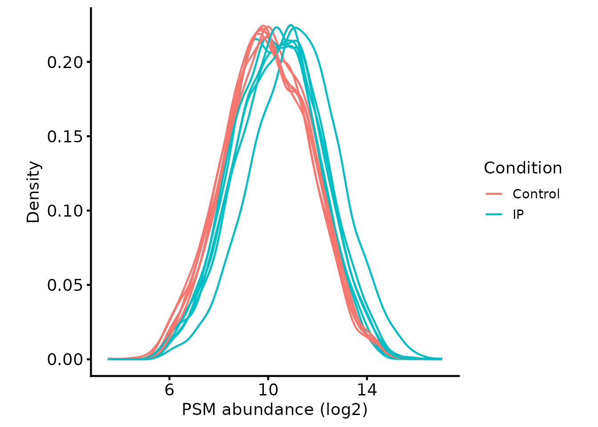
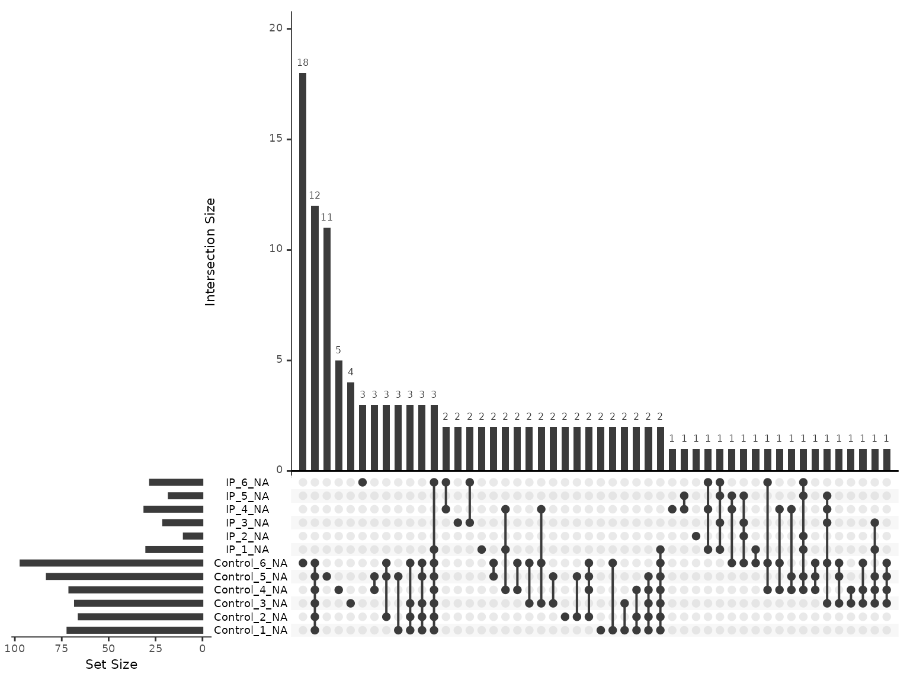
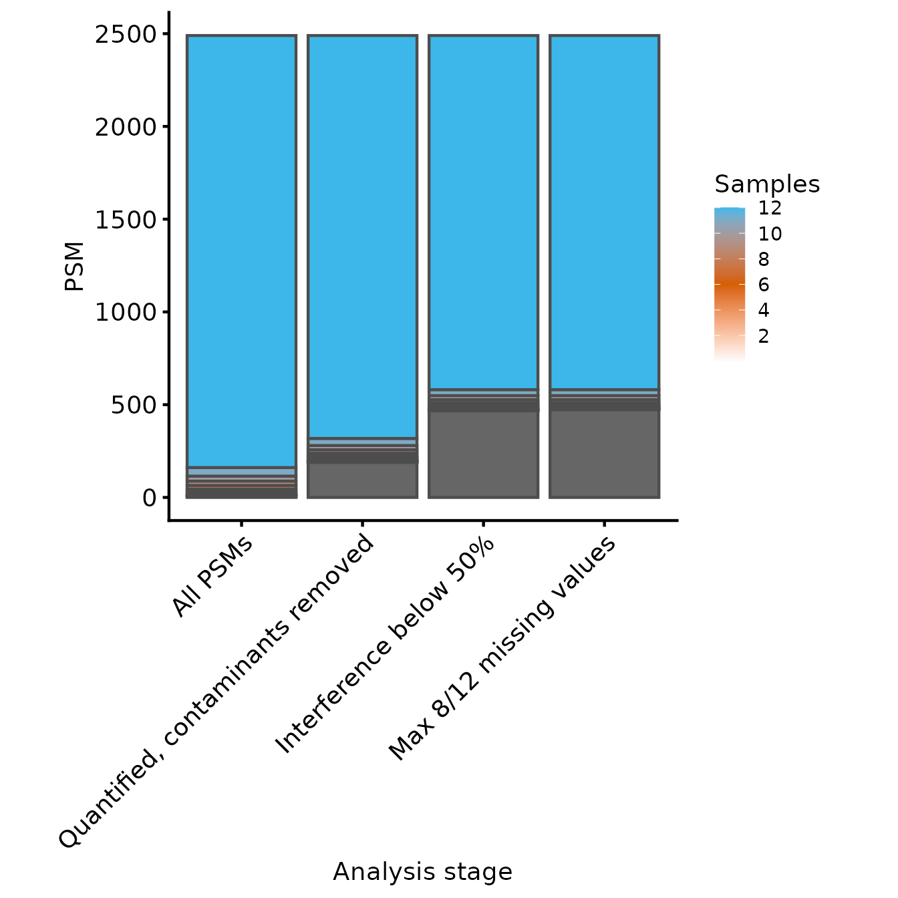
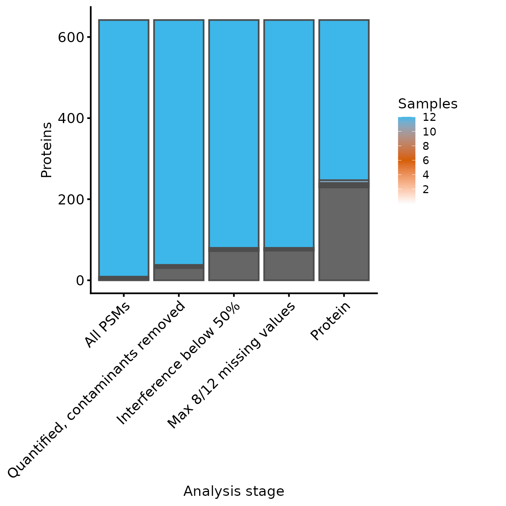
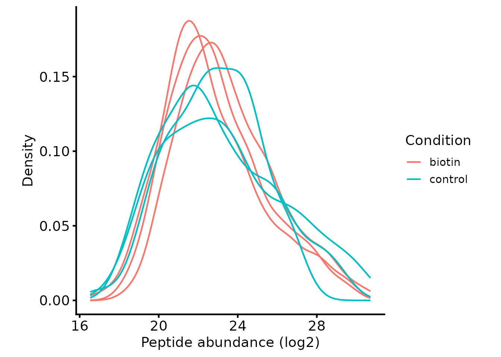
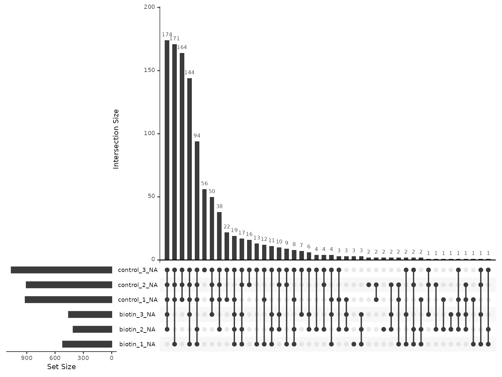

# Enrichment designs: IP, BioID and TurboID

An enrichment experiment — an immunoprecipitation, or a proximity
labelling method such as BioID or TurboID — quantifies a deliberately
unrepresentative slice of the proteome. What that slice is compared
against varies. It may be a control pulldown, in which case the question
is which proteins are recovered with the bait and which are background.
It may equally be the same bait pulled down under two conditions such as
wild-type against knockout or treated against untreated — in which case
the question is which interactions change. Either way, every sample has
been through an enrichment, and it is the enrichment, not the contrast,
that invalidates several of the assumptions the whole-proteome vignettes
rely on:

- **The samples are not expected to have the same protein composition.**
  The bait and its partners are specifically enriched, so median
  normalisation, which assumes most proteins are unchanged, removes part
  of the signal rather than a technical artefact.
- **Absence is frequently real.** A protein missing from every replicate
  of a given condition (e.g. control or KO) may be absent from the
  sample rather than undetected. Discarding features with missing values
  discards the strongest hits, and imputing them invents a background
  level that was never observed.
- **The comparison is often one-sided.** Depletion relative to control
  is rarely of interest, so a two-sided test spends power on a direction
  you do not care about.

How hard each of these bites depends on the contrast. All three are at
their most severe against a control pulldown, where much of what is
quantified is background and absence carries most of the information.
Comparing the same bait between conditions is gentler — both sides have
been enriched the same way, so the compositions are closer and a
two-sided test is usually what you want — but the enrichment still
shapes the data, and normalisation and missingness need the same
scrutiny rather than the whole-proteome defaults.

Two experiments are worked through below, because the three consequences
do not all bite in the same place and no single dataset shows all of
them well.

- **Part A: a TMT immunoprecipitation.** The normalisation consequence
  is the live one. Within a TMT plex the channels are quantified from
  the same spectrum, and Part A shows by measurement that the second
  consequence does not materialise there at all.
- **Part B: an LFQ-DDA TurboID pulldown**, taken through to a tested
  list of candidate interactors. Here each sample is a separate run,
  absence from the control is common and real, and the second and third
  consequences decide the result.

Which of the two your own experiment resembles is set by the acquisition
rather than by the pulldown, so it is worth reading both.

## Load required packages

``` r

library(QFeatures)
library(biomasslmb)
library(ggplot2)
library(tidyr)
library(dplyr)
library(limma)
```

## Part A: a TMT immunoprecipitation

The data are a real MaxQuant TMT18plex immunoprecipitation comparing a
bait pulldown (`IP`) against a control pulldown (`Control`), 6
replicates each. The MaxQuant input also differs in shape from the
Proteome Discoverer output used in the [TMT PSM QC and
summarisation](https://lmb-mass-spec-compbio.github.io/biomasslmb/articles/TMT_PSM_QC_Summarisation.md)
vignette: the `evidence.txt` file uses different column names
(`Leading.razor.protein` instead of `Master.Protein.Accessions`,
`Reporter.intensity.corrected.*` instead of `Abundance.*`), and it does
not report the PD-specific QC metrics (signal:noise, interference,
SPS-MM). Those differences are noted as they arise.

### Read in input data and design

`psm_tmt_per2_mq` and `tmt_per2_mq_design` are the MaxQuant analogues of
the `psm_tmt_clock`/`tmt_clock_design` pair used in that vignette:
`psm_tmt_per2_mq` is the `evidence.txt` PSM-level output (truncated to a
subset of proteins), and `tmt_per2_mq_design` gives the
`Condition`/`Replicate` for each sample.

``` r

knitr::kable(tmt_per2_mq_design)
```

|           | Condition | Replicate | quantCols |
|:----------|:----------|:----------|:----------|
| IP_1      | IP        | 1         | IP_1      |
| Control_4 | Control   | 4         | Control_4 |
| IP_5      | IP        | 5         | IP_5      |
| Control_1 | Control   | 1         | Control_1 |
| IP_4      | IP        | 4         | IP_4      |
| Control_3 | Control   | 3         | Control_3 |
| Control_6 | Control   | 6         | Control_6 |
| IP_2      | IP        | 2         | IP_2      |
| Control_2 | Control   | 2         | Control_2 |
| IP_3      | IP        | 3         | IP_3      |
| Control_5 | Control   | 5         | Control_5 |
| IP_6      | IP        | 6         | IP_6      |

``` r


tmt_qf_mq <- QFeatures::readQFeatures(assayData = psm_tmt_per2_mq,
                                      colData = tmt_per2_mq_design,
                                      quantCols = rownames(tmt_per2_mq_design),
                                      name = "psms_raw")
#> Checking arguments.
#> Loading data as a 'SummarizedExperiment' object.
#> Formatting sample annotations (colData).
#> Formatting data as a 'QFeatures' object.

tmt_qf_mq <- sync_coldata(tmt_qf_mq, 'psms_raw')

tmt_qf_mq[['psms_raw']] <- QFeatures::zeroIsNA(tmt_qf_mq[['psms_raw']])
```

### Defining the contaminant proteins

MaxQuant has its own contaminants FASTA convention (`CON__` prefixed
accessions). `get_maxquant_cont_accessions` extracts these from the
contaminants FASTA bundled with the package, in the same way
`get_contaminant_fasta_accessions` does for the PD contaminants FASTA in
the [TMT PSM QC and
summarisation](https://lmb-mass-spec-compbio.github.io/biomasslmb/articles/TMT_PSM_QC_Summarisation.md)
vignette.

``` r

contaminant_proteins <- get_maxquant_cont_accessions()
#> No contaminants fasta supplied, defaulting to contaminants.fasta.gz from biomasslmb
```

We filter contaminants in the same way as for PD, using
`filter_features_mq_dda` in place of `filter_features_pd_dda`. MaxQuant
gives every PSM a single razor protein rather than reporting a tie, so
there is no `unique_master` filter to apply here; the equivalent
information is the per-peptide `Unique..Proteins.` flag, which this
PSM-level export does not carry. See [peptides are not
proteins](https://lmb-mass-spec-compbio.github.io/biomasslmb/articles/gotcha_peptide_to_protein.md).

``` r

tmt_qf_mq[['psms_filtered']] <- filter_features_mq_dda(
  tmt_qf_mq[['psms_raw']],
  contaminant_proteins = contaminant_proteins,
  filter_contaminant = TRUE,
  filter_associated_contaminant = TRUE)
#> Filtering data...
#> 4960 features found from 666 master proteins => Input
#> 4960 features found from 666 master proteins => Removed hits to decoy database
#> 246 contaminant proteins supplied
#> 793 proteins identified as 'contaminant associated'
#> 4535 features found from 646 master proteins => contaminant features removed
#> 4414 features found from 635 master proteins => associated contaminant features removed
#> 4414 features found from 635 master proteins => MaxQuant-labelled 'Contaminants' removed
#> 4414 features found from 635 master proteins => features without a master protein removed
#> 3070 features found from 612 master proteins => features without quantification removed

tmt_qf_mq <- sync_coldata(tmt_qf_mq, 'psms_filtered')
```

### Normalise (or not)

Since this is an immunoprecipitation, the IP samples are expected to
have a genuinely different protein composition to the controls: the bait
and its interactors are specifically enriched. Standard normalisation
assumes overall protein content is equivalent between samples and would
partially erode this real biological difference, so — unlike a
whole-proteome comparison — we do not normalise here. Where
normalisation is still desired for this kind of experiment, an
alternative to standard whole-proteome normalisation is to define a set
of ‘invariant’ proteins that are expected to be equally abundant across
all samples (e.g. proteins with no plausible relationship to the bait)
and normalise using only these.

``` r

plot_quant(tmt_qf_mq[['psms_filtered']], log2transform=TRUE, method='density') +
  theme_biomasslmb() +
  aes(colour=Condition, group=sample) +
  xlab('PSM abundance (log2)')
```



### Removing low quality PSMs

`filter_TMT_PSMs` still removes PSMs with no quantification values at
all, but with `from_PD = FALSE` it skips the PD-specific
`Quan.Info`/`PSM.Ambiguity` checks. We also need to point it at the
MaxQuant protein column, `Leading.razor.protein`.

Co-isolation is reported, under a different name and on the opposite
scale. PD gives `Isolation.Interference.in.Percent`, the share of the
isolation window that did not come from the target precursor. MaxQuant
gives `PIF`, the precursor intensity fraction, which is the share that
did. They are complements, so one converts into the other and
`filter_TMT_PSMs` can use it unchanged.

``` r

interference_mq <- (1 - rowData(tmt_qf_mq[['psms_filtered']])$PIF) * 100

pif_missing <- sum(is.na(interference_mq))

interference_mq[is.na(interference_mq)] <- 100

rowData(tmt_qf_mq[['psms_filtered']])$Isolation.Interference.in.Percent <- interference_mq
```

`PIF` is `NA` for 277 of the 3070 PSMs, where MaxQuant could not assess
the isolation window. Assigning those 100% treats an unassessable window
as a failed one, so they are discarded rather than passed through
unchecked.

Signal:noise and SPS-MM have no MaxQuant counterpart — the reporter
columns hold corrected intensities rather than S:N ratios, and
`evidence.txt` carries no SPS mass-match statistic — so `sn_thresh` and
`spsmm_thresh` stay at their ‘no filtering’ defaults.

``` r

tmt_qf_mq[['psms_filtered_interference']] <- filter_TMT_PSMs(
  tmt_qf_mq[['psms_filtered']],
  inter_thresh = 50, sn_thresh = 0, spsmm_thresh = 0,
  master_protein_col = 'Leading.razor.protein',
  from_PD = FALSE)
#> Filtering PSMs...
#> 3070 features found from 612 master proteins => Initial PSMs
#> 3070 features found from 612 master proteins => Removing PSMs without quantification values
#> 2590 features found from 570 master proteins => Removing PSMs with high Co-isolation/interference
#> Not performing filtering by average S:N ratio (`sn_thresh`=0)
#> Not performing filtering by SPS-MM (`spsmm_thresh`=0)

tmt_qf_mq <- sync_coldata(tmt_qf_mq, 'psms_filtered_interference')
```

That drops 480 PSMs, 277 of them for an unassessable window rather than
a measured one. Worth knowing which half of the loss you are taking:
raising the threshold relaxes the measured group, but the `NA` group
only leaves if you choose to keep it.

### Exploring missing values

We check the missingness structure before deciding how to handle it,
using `plot_missing_upset` and
`condition_miss_score`/`condition_miss_index` (the [TMT PSM QC and
summarisation](https://lmb-mass-spec-compbio.github.io/biomasslmb/articles/TMT_PSM_QC_Summarisation.md)
vignette explains these functions more fully).

``` r

plot_missing_upset(tmt_qf_mq, i = 'psms_filtered_interference')
```



``` r

miss_res_mq <- condition_miss_score(tmt_qf_mq, i = 'psms_filtered_interference', group_cols = 'Condition')
#> Analysing assay 'psms_filtered_interference': 2590 features x 12 samples
#> Group variable: Condition (2 levels: Control, IP)
#> Results: 172 informative features | mean condition miss score = 0.277 | condition-structured: 0.9% | condition-independent: 4.2%
condition_miss_index(miss_res_mq$summary)$index
#> Condition missingness index: 0.0256 | Weighted mean score: 0.3852 | Coverage: 6.6% (172 / 2590 features informative) [coverage penalty applied]
#> [1] 0.02558401
```

A meaningful fraction of PSMs here have missing values (172 out of
2590), consistent with this being an IP rather than a whole-proteome
comparison: a protein absent from the control pulldown is expected to be
missing in every `Control` replicate but present in every `IP`
replicate. The condition missingness index is still modest, so this
isn’t yet a dominant pattern at the PSM level, but it’s enough to make
blanket removal of any PSM with a missing value an unattractive option
here.

### Summarising to protein-level abundances

Since missing values here are more likely to be genuinely informative —
a protein absent from the control pulldown — than in a whole-proteome
comparison, instead of removing every PSM with any missing value, we
retain PSMs with a modest number of missing values and use
[`MsCoreUtils::robustSummary`](https://rdrr.io/pkg/MsCoreUtils/man/robustSummary.html),
which handles missing values appropriately during aggregation (see the
[Comparing protein summarisation
approaches](https://lmb-mass-spec-compbio.github.io/biomasslmb/articles/summarisation_methods.md)
vignette for a direct comparison with `sum`).

``` r

tmt_qf_mq[['psms_filtered_interference']] <- QFeatures::logTransform(
  tmt_qf_mq[['psms_filtered_interference']], base = 2)

tmt_qf_mq[['psms_filtered_forSummary']] <- QFeatures::filterNA(
  tmt_qf_mq[['psms_filtered_interference']], 8/12)

message_parse(rowData(tmt_qf_mq[['psms_filtered_forSummary']]),
                           'Leading.razor.protein',
                           "Removing PSMs with excessive missing values")
#> 2581 features found from 569 master proteins => Removing PSMs with excessive missing values
```

``` r

tmt_qf_mq <- QFeatures::aggregateFeatures(
  tmt_qf_mq,
  i = "psms_filtered_forSummary",
  fcol = "Leading.razor.protein",
  name = "protein",
  fun = MsCoreUtils::robustSummary)
#> Your quantitative and row data contain missing values. Please read the
#> relevant section(s) in the aggregateFeatures manual page regarding the
#> effects of missing values on data aggregation.
#> Aggregated: 1/1

tmt_qf_mq <- sync_coldata(tmt_qf_mq, 'protein')
```

### Requiring more than one PSM behind every value

Having taken care to preserve the informative missing values, it is
worth asking how many of them reached protein level.

``` r

count_quantified <- function(se, group_col = 'Condition'){
  groups <- colData(se)[[group_col]]
  sapply(sort(unique(groups)), function(g){
    rowSums(!is.na(assay(se)[, groups == g, drop = FALSE]))
  })
}

n_quant_mq <- count_quantified(tmt_qf_mq[['protein']])

c(protein_percent_missing = round(
    100 * mean(is.na(assay(tmt_qf_mq[['protein']]))), 2),
  proteins_absent_from_control = sum(n_quant_mq[, 'Control'] == 0))
#>      protein_percent_missing proteins_absent_from_control 
#>                         0.23                         0.00
```

Almost none, and none at all in the pattern the design predicts.
`robustSummary` gives a protein a value in a sample whenever *any* of
its PSMs was quantified there, so a protein loses a channel only when
every one of its PSMs does.

That is not a reassuring result, because it means a protein-level value
can rest on a single PSM in one channel and several in another, and
nothing in the matrix says which. The QC vignettes for both LFQ
acquisition types apply the same correction:
[`get_protein_no_quant_mask()`](https://lmb-mass-spec-compbio.github.io/biomasslmb/reference/get_protein_no_quant_mask.md)
finds the protein-by-sample cells built from fewer than `min_features`
features, and
[`mask_protein_level_quant()`](https://lmb-mass-spec-compbio.github.io/biomasslmb/reference/mask_protein_level_quant.md)
returns them to `NA`.

``` r

retain_mask_mq <- get_protein_no_quant_mask(
  tmt_qf_mq[['psms_filtered_forSummary']], min_features = 2,
  master_protein_col = 'Leading.razor.protein')

tmt_qf_mq[['protein']] <- mask_protein_level_quant(
  tmt_qf_mq[['protein']], retain_mask_mq)
```

``` r

n_quant_masked <- count_quantified(tmt_qf_mq[['protein']])

c(proteins_absent_from_control = sum(n_quant_masked[, 'Control'] == 0),
  proteins_with_no_values_at_all = sum(rowSums(n_quant_masked) == 0))
#>   proteins_absent_from_control proteins_with_no_values_at_all 
#>                            157                            156
```

Masking empties 156 proteins entirely — each had a single PSM in every
channel, so requiring two leaves nothing. The two counts differ by 1,
and that difference is the answer to the question this section asked: it
is how many proteins are left quantified in the IP and absent from the
control.

So the presence/absence pattern an enrichment experiment is supposed to
generate is all but absent from this dataset, rather than being hidden
by summarisation. Within a plex all twelve channels are quantified from
the same MS2 spectrum, so a protein pulled down in the IP and absent
from the control does not go missing in the control channels — it
registers there at whatever low reporter intensity co-isolation and the
isolation window give it. TMT turns what would be an on/off result in
separate runs into a compressed ratio.

That is worth knowing in its own right, because it means the second
consequence listed at the top of this article barely applies to a
single-plex TMT pulldown, whatever it does to the label-free case in
Part B.

A protein with no quantification left in any sample is not data, so we
drop those rather than carry them.

``` r

tmt_qf_mq[['protein']] <- tmt_qf_mq[['protein']][
  rowSums(!is.na(assay(tmt_qf_mq[['protein']]))) > 0, ]
#> Warning in replaceAssay(x = x, y = value, i = i): Links between assays were
#> lost/removed during replacement. See '?addAssayLink' to restore them manually.

c(proteins = nrow(tmt_qf_mq[['protein']]),
  percent_missing = round(100 * mean(is.na(assay(tmt_qf_mq[['protein']]))), 2))
#>        proteins percent_missing 
#>          413.00            1.07
```

### Inspecting the number of PSMs and proteins through the processing steps

``` r

rename_cols_mq <- c('All PSMs' = 'psms_raw',
                    'Quantified, contaminants removed' = 'psms_filtered',
                    'Interference below 50%' = 'psms_filtered_interference',
                    'Max 8/12 missing values' = 'psms_filtered_forSummary')

rowvars_mq <- c('Sequence', 'Modifications')

samples_present_mq <- get_samples_present(
  tmt_qf_mq[,,unname(rename_cols_mq)], rowvars_mq, rename_cols_mq)
#> Warning: 'experiments' dropped; see 'drops()'
#> harmonizing input:
#>   removing 12 sampleMap rows not in names(experiments)
plot_samples_present(samples_present_mq, rowvars_mq, breaks=seq(2,12,2)) + ylab('PSM')
#> Scale for fill is already present.
#> Adding another scale for fill, which will replace the existing scale.
```



``` r

rename_cols_mq_prot <- c(rename_cols_mq, 'Protein' = 'protein')
rowvars_mq_prot <- c('Leading.razor.protein')

samples_present_mq_prot <- get_samples_present(tmt_qf_mq, rowvars_mq_prot, rename_cols_mq_prot)
plot_samples_present(samples_present_mq_prot, rowvars_mq_prot, breaks=seq(2,12,2))
#> Scale for fill is already present.
#> Adding another scale for fill, which will replace the existing scale.
```



``` r

# Save file to package as data so it can be read back in in other vignettes
usethis::use_data(tmt_qf_mq, overwrite=TRUE)
```

## Part B: an LFQ-DDA TurboID pulldown

`lfq_dda_pd_turboid_PeptideGroups.txt` is Proteome Discoverer
peptide-level output from a TurboID experiment in mouse cells: three
biotin-treated samples against three untreated controls, subset to 500
proteins. Because each sample is a separate acquisition rather than a
channel in a shared spectrum, the presence/absence pattern that Part A
could not produce is the dominant feature of this dataset from the
start.

``` r

turboid_inf <- system.file(
  "extdata", "lfq_dda_pd_turboid_PeptideGroups.txt", package = "biomasslmb")

infdf <- read.delim(turboid_inf)

abundance_cols_ix <- grep('^Abundance', colnames(infdf))
colnames(infdf)[abundance_cols_ix]
#> [1] "Abundance.F2.Sample.biotin"  "Abundance.F4.Sample.biotin" 
#> [3] "Abundance.F6.Sample.biotin"  "Abundance.F1.Sample.control"
#> [5] "Abundance.F3.Sample.control" "Abundance.F5.Sample.control"
```

The condition is encoded in the abundance column names, so the design is
derived from them rather than read from a separate table.

``` r

turboid_design <- data.frame(
  quantCols = colnames(infdf)[abundance_cols_ix],
  Condition = sub('.*Sample[.]', '', colnames(infdf)[abundance_cols_ix]))

turboid_design$Replicate <- as.integer(ave(
  turboid_design$Condition, turboid_design$Condition, FUN = seq_along))
turboid_design$Sample <- paste(
  turboid_design$Condition, turboid_design$Replicate, sep = '_')

colnames(infdf)[abundance_cols_ix] <- turboid_design$Sample
turboid_design$quantCols <- turboid_design$Sample

knitr::kable(turboid_design)
```

| quantCols | Condition | Replicate | Sample    |
|:----------|:----------|----------:|:----------|
| biotin_1  | biotin    |         1 | biotin_1  |
| biotin_2  | biotin    |         2 | biotin_2  |
| biotin_3  | biotin    |         3 | biotin_3  |
| control_1 | control   |         1 | control_1 |
| control_2 | control   |         2 | control_2 |
| control_3 | control   |         3 | control_3 |

``` r

lfq_qf_turboid <- readQFeatures(assayData = infdf,
                                quantCols = abundance_cols_ix,
                                colData = turboid_design,
                                name = 'peptides_raw')
#> Checking arguments.
#> Loading data as a 'SummarizedExperiment' object.
#> Formatting sample annotations (colData).
#> Formatting data as a 'QFeatures' object.

lfq_qf_turboid <- sync_coldata(lfq_qf_turboid, 'peptides_raw')
```

### Filtering

The filtering is the LFQ-DDA sequence from the [LFQ-DDA QC
vignette](https://lmb-mass-spec-compbio.github.io/biomasslmb/articles/LFQ_DDA_Peptide_QC_Summarisation.md),
against the PD contaminants database.

``` r

contaminant_accessions <- get_contaminant_fasta_accessions(system.file(
  "extdata", "0602_Universal_Contaminants.fasta.gz", package = "biomasslmb"))
contaminant_accessions <- c(contaminant_accessions,
                            sub('^Cont_', '', contaminant_accessions))

lfq_qf_turboid[['peptides']] <- filter_features_pd_dda(
  lfq_qf_turboid[['peptides_raw']],
  contaminant_proteins = contaminant_accessions,
  filter_contaminant = TRUE,
  filter_associated_contaminant = TRUE,
  unique_master = TRUE,
  remove_no_quant = TRUE)

lfq_qf_turboid[['peptides']] <- logTransform(
  lfq_qf_turboid[['peptides']], base = 2)
lfq_qf_turboid <- sync_coldata(lfq_qf_turboid, 'peptides')
```

As in Part A, we do not median-normalise: the biotin samples are
expected to contain a different set of proteins from the controls, which
is the whole point of the experiment.

``` r

plot_quant(lfq_qf_turboid[['peptides']], log2transform = FALSE, method = 'density') +
  theme_biomasslmb() +
  aes(colour = Condition, group = sample) +
  xlab('Peptide abundance (log2)')
```



### Missingness is the signal here

``` r

turboid_miss <- condition_miss_score(
  lfq_qf_turboid, i = 'peptides', group_cols = 'Condition')
#> Analysing assay 'peptides': 1142 features x 6 samples
#> Group variable: Condition (2 levels: biotin, control)
#> Results: 642 informative features | mean condition miss score = 0.530 | condition-structured: 14.6% | condition-independent: 14.4%

condition_miss_index(turboid_miss$summary)$index
#> Condition missingness index: 0.3076 | Weighted mean score: 0.5472 | Coverage: 56.2% (642 / 1142 features informative) [coverage penalty applied]
#> [1] 0.3076012
```

That index is an order of magnitude above the whole-proteome datasets in
[handling missing
values](https://lmb-mass-spec-compbio.github.io/biomasslmb/articles/handling_missing_values.md),
and the reason is visible in how one-sided the pattern is.

``` r

plot_missing_upset(lfq_qf_turboid, i = 'peptides')
```



The sample names sort the sets into their two conditions, which makes
the structure easy to read. The five largest combinations all include
the three controls; they differ only in how many biotin samples are
missing as well.

``` r

pep_quant <- assay(lfq_qf_turboid[['peptides']])
pep_cond <- lfq_qf_turboid[['peptides']]$Condition

c(percent_missing = round(100 * mean(is.na(pep_quant)), 1),
  all_biotin_no_control = sum(
    rowSums(!is.na(pep_quant[, pep_cond == 'biotin'])) == 3 &
    rowSums(!is.na(pep_quant[, pep_cond == 'control'])) == 0),
  all_control_no_biotin = sum(
    rowSums(!is.na(pep_quant[, pep_cond == 'control'])) == 3 &
    rowSums(!is.na(pep_quant[, pep_cond == 'biotin'])) == 0))
#>       percent_missing all_biotin_no_control all_control_no_biotin 
#>                  62.3                 164.0                   3.0
```

They are not the same size, and the asymmetry is the enrichment:
peptides appear in the biotin samples and vanish from the controls, not
the other way round. Discarding features with missing values would
remove that finding and leave the experiment looking like a weak version
of itself.

### Summarising to protein level

``` r

lfq_qf_turboid[['peptides_filtered']] <- filterNA(
  lfq_qf_turboid[['peptides']], 4/6)

lfq_qf_turboid[['peptides_for_summarisation']] <- filter_features_per_protein(
  lfq_qf_turboid[['peptides_filtered']], min_features = 2)

set.seed(42)
lfq_qf_turboid <- aggregateFeatures(
  lfq_qf_turboid, i = 'peptides_for_summarisation',
  fcol = 'Master.Protein.Accessions', name = 'protein',
  fun = MsCoreUtils::robustSummary, maxit = 10000)

lfq_qf_turboid <- sync_coldata(lfq_qf_turboid, 'protein')

retain_mask_turboid <- get_protein_no_quant_mask(
  lfq_qf_turboid[['peptides_for_summarisation']], min_features = 2)

lfq_qf_turboid[['protein']] <- mask_protein_level_quant(
  lfq_qf_turboid[['protein']], retain_mask_turboid)
```

The `4/6` threshold is what keeps the on/off peptides: a peptide seen in
all three biotin samples and no control has three missing values, and a
stricter threshold would discard exactly the features carrying the
signal.

### Which proteins can be tested?

``` r

n_quant_turboid <- count_quantified(lfq_qf_turboid[['protein']])

knitr::kable(table(control = n_quant_turboid[, 'control'],
                   biotin = n_quant_turboid[, 'biotin']))
```

|     |   1 |   2 |   3 |
|:----|----:|----:|----:|
| 0   |   4 |  22 |  37 |
| 1   |   2 |   1 |   4 |
| 2   |   0 |   0 |  10 |
| 3   |   0 |   1 |   9 |

Read the first row. Most of the proteins in this experiment were
quantified in two or three biotin samples and in none of the controls —
the result the pulldown was run to produce.

``` r

whole_proteome <- rownames(n_quant_turboid)[
  apply(n_quant_turboid, 1, min) >= 2]

candidates <- rownames(n_quant_turboid)[n_quant_turboid[, 'biotin'] >= 2]

c(proteins = nrow(n_quant_turboid),
  whole_proteome_rule = length(whole_proteome),
  enrichment_rule = length(candidates),
  absent_from_control = sum(n_quant_turboid[, 'control'] == 0))
#>            proteins whole_proteome_rule     enrichment_rule absent_from_control 
#>                  90                  20                  84                  63
```

The rule used in the whole-proteome vignettes — at least two quantified
values in *both* conditions — keeps 20 of the 90 proteins. It is the
right rule there and the wrong one here, because in an enrichment
experiment “not quantified in the control” is the outcome of interest
rather than a failure to measure.

The rule that matches the design asks for enough measurements in the
*enriched* condition to estimate the protein at all, and treats the
control side as something to be modelled rather than required. That
keeps 84 proteins.

### Imputing only where absence is defensible

Requiring two biotin values leaves proteins that `limma` still cannot
fit, because a group with no values has no mean.
[`restrict_imputation()`](https://lmb-mass-spec-compbio.github.io/biomasslmb/reference/restrict_imputation.md)
fills those in from a low-abundance distribution, but only in the
conditions and at the missingness levels you nominate — here, control
samples where at most one replicate was quantified.

That happens in two steps, and the first fills every missing value in
the assay.
[`QFeatures::impute()`](https://rdrr.io/pkg/ProtGenerics/man/protgenerics.html)
produces a completely imputed copy;
[`restrict_imputation()`](https://lmb-mass-spec-compbio.github.io/biomasslmb/reference/restrict_imputation.md)
then builds a third assay by starting from the unimputed data and
copying cells out of the imputed one wherever `use_imputed_df` says
imputation is warranted. It selects rather than imputes, so it needs a
complete matrix to select from.

``` r

set.seed(42)

lfq_qf_turboid <- QFeatures::impute(
  lfq_qf_turboid, i = 'protein', name = 'protein_imputed', method = 'MinProb')
#> [1] 1.49165

use_imputed_df <- data.frame(Condition = 'control', n_finite = c(0, 1))

lfq_qf_turboid <- restrict_imputation(
  lfq_qf_turboid,
  i_unimputed = 'protein',
  i_imputed = 'protein_imputed',
  i_restricted_imputed = 'protein_restricted',
  use_imputed_df = use_imputed_df)
```

The assumption being made is explicit and checkable: a protein seen in
the biotin samples and not the controls is being treated as present at a
level below detection in the controls, not as unmeasured. That is
defensible for a pulldown in a way it is not for a whole-proteome
comparison, where the same missing value is more likely to be an
ordinary detection failure. Nothing is imputed in the biotin samples,
and nothing is imputed for a control with two or three quantified
replicates.

### One-sided testing

``` r

quant_turboid <- assay(lfq_qf_turboid[['protein_restricted']])[candidates, ]

condition <- factor(
  lfq_qf_turboid[['protein_restricted']]$Condition,
  levels = c('control', 'biotin'))

fit_turboid <- eBayes(
  lmFit(quant_turboid, model.matrix(~ condition)),
  trend = TRUE, robust = TRUE)

res_turboid <- topTable(fit_turboid, coef = 2, number = Inf, sort.by = 'none')
```

`limma` reports a two-sided p-value: the probability of a difference
this large in *either* direction. A protein depleted relative to the
control is not a candidate interactor, so half of that p-value is being
spent on an outcome the experiment does not care about. Halving it for
proteins enriched in the pulldown, and taking the complement for the
rest, converts it to a one-sided test of enrichment; the adjustment for
multiple testing then applies to those p-values.

``` r

res_turboid$P.Value.OneSided <- ifelse(
  res_turboid$logFC > 0,
  res_turboid$P.Value / 2,
  1 - res_turboid$P.Value / 2)

res_turboid$adj.P.Val.OneSided <- p.adjust(
  res_turboid$P.Value.OneSided, method = 'BH')

c(two_sided_enriched = sum(res_turboid$adj.P.Val < 0.05 & res_turboid$logFC > 0),
  one_sided_enriched = sum(res_turboid$adj.P.Val.OneSided < 0.05))
#> two_sided_enriched one_sided_enriched 
#>                 53                 58
```

The gain is modest and it is not free: the one-sided test cannot report
depletion at all, so it is only appropriate where depletion genuinely is
uninteresting. In a pulldown it is. In a comparison between two
treatments it is not, which is why the whole-proteome vignettes do not
do this.

### What the design-appropriate route recovered

``` r

hits <- rownames(res_turboid)[res_turboid$adj.P.Val.OneSided < 0.05]

c(candidate_interactors = length(hits),
  absent_from_control = sum(n_quant_turboid[hits, 'control'] == 0),
  untestable_under_whole_proteome_rule = sum(!hits %in% whole_proteome))
#>                candidate_interactors                  absent_from_control 
#>                                   58                                   43 
#> untestable_under_whole_proteome_rule 
#>                                   48
```

48 of the 58 candidate interactors would never have been tested under
the whole-proteome testability rule. They are not marginal calls that
the rule was right to be cautious about — they are the proteins with the
cleanest presence/absence separation in the experiment, excluded for
having too few measurements in the condition where the design predicts
they should have none.

Report the per-condition counts alongside the result, as in the
whole-proteome vignettes, so that a reader can tell a protein quantified
in three biotin samples and imputed in three controls from one measured
in all six.

``` r

head(data.frame(
  Protein = hits,
  logFC = round(res_turboid[hits, 'logFC'], 2),
  adj.P.Val = signif(res_turboid[hits, 'adj.P.Val.OneSided'], 2),
  n_biotin = n_quant_turboid[hits, 'biotin'],
  n_control = n_quant_turboid[hits, 'control']) %>%
  arrange(adj.P.Val), 8)
#>        Protein logFC adj.P.Val n_biotin n_control
#> Q9DC23  Q9DC23  6.85   1.5e-05        3         1
#> P18572  P18572  6.75   2.7e-05        3         0
#> P02469  P02469  5.01   9.7e-05        3         3
#> Q61937  Q61937  6.58   9.7e-05        3         1
#> Q99KF1  Q99KF1  5.86   9.7e-05        3         0
#> P20029  P20029  5.08   1.1e-04        3         3
#> Q61090  Q61090  6.54   1.1e-04        3         0
#> O08795  O08795  5.60   1.2e-04        3         2
```

``` r

# Save file to package as data so it can be read back in in other vignettes
usethis::use_data(lfq_qf_turboid, overwrite=TRUE)
```

## Where to go next

Part A leaves `tmt_qf_mq` holding protein-level abundances with the
informative missing values preserved and every value backed by at least
two PSMs. The [data exploration and statistical
testing](https://lmb-mass-spec-compbio.github.io/biomasslmb/articles/exploration_and_statistical_testing.md)
vignette picks it up and works through the exploratory checks — sample
correlation, PCA, inspecting a hit across the processing steps — that
any design needs before testing, using the two-sided treatment for
comparison with the route above.

For the enrichment-specific decisions, Part B is the worked example: a
testability rule that keeps the control-absent proteins, imputation
restricted to the condition where absence is defensible, and a one-sided
test. [Handling missing
values](https://lmb-mass-spec-compbio.github.io/biomasslmb/articles/handling_missing_values.md)
covers
[`restrict_imputation()`](https://lmb-mass-spec-compbio.github.io/biomasslmb/reference/restrict_imputation.md)
and the alternatives to it in more depth, including what blanket
imputation costs.

## Getting help

If your experiment does not fit what this article assumes, or a result
looks wrong, please get in touch with Tom Smith (<tsmith@mrclmb.ac.uk>)
rather than guessing — it is far easier to help while an analysis is in
progress than to unpick a decision afterwards, and easier still before
the samples are run. [Getting
started](https://lmb-mass-spec-compbio.github.io/biomasslmb/articles/biomasslmb.md)
sets out which article applies to which experiment.

``` r

sessionInfo()
#> R version 4.5.3 (2026-03-11)
#> Platform: x86_64-pc-linux-gnu
#> Running under: Ubuntu 24.04.5 LTS
#> 
#> Matrix products: default
#> BLAS:   /usr/lib/x86_64-linux-gnu/openblas-pthread/libblas.so.3 
#> LAPACK: /usr/lib/x86_64-linux-gnu/openblas-pthread/libopenblasp-r0.3.26.so;  LAPACK version 3.12.0
#> 
#> locale:
#>  [1] LC_CTYPE=C.UTF-8       LC_NUMERIC=C           LC_TIME=C.UTF-8       
#>  [4] LC_COLLATE=C.UTF-8     LC_MONETARY=C.UTF-8    LC_MESSAGES=C.UTF-8   
#>  [7] LC_PAPER=C.UTF-8       LC_NAME=C              LC_ADDRESS=C          
#> [10] LC_TELEPHONE=C         LC_MEASUREMENT=C.UTF-8 LC_IDENTIFICATION=C   
#> 
#> time zone: UTC
#> tzcode source: system (glibc)
#> 
#> attached base packages:
#> [1] stats4    stats     graphics  grDevices utils     datasets  methods  
#> [8] base     
#> 
#> other attached packages:
#>  [1] limma_3.66.0                dplyr_1.2.1                
#>  [3] tidyr_1.3.2                 ggplot2_4.0.3              
#>  [5] biomasslmb_0.1.0            QFeatures_1.20.0           
#>  [7] MultiAssayExperiment_1.36.2 SummarizedExperiment_1.40.0
#>  [9] Biobase_2.70.0              GenomicRanges_1.62.1       
#> [11] Seqinfo_1.0.0               IRanges_2.44.0             
#> [13] S4Vectors_0.48.1            BiocGenerics_0.56.0        
#> [15] generics_0.1.4              MatrixGenerics_1.22.0      
#> [17] matrixStats_1.5.0          
#> 
#> loaded via a namespace (and not attached):
#>   [1] DBI_1.3.0               gridExtra_2.3.1         sandwich_3.1-3         
#>   [4] rlang_1.3.0             magrittr_2.0.5          clue_0.3-68            
#>   [7] otel_0.2.0              compiler_4.5.3          RSQLite_3.53.3         
#>  [10] png_0.1-9               systemfonts_1.3.2       vctrs_0.7.3            
#>  [13] reshape2_1.4.5          stringr_1.6.0           ProtGenerics_1.42.0    
#>  [16] pkgconfig_2.0.3         crayon_1.5.3            fastmap_1.2.0          
#>  [19] backports_1.5.1         XVector_0.50.0          labeling_0.4.3         
#>  [22] rmarkdown_2.32          UpSetR_1.4.1            visdat_0.6.0           
#>  [25] ragg_1.5.2              purrr_1.2.2             bit_4.6.0              
#>  [28] xfun_0.60               cachem_1.1.0            jsonlite_2.0.0         
#>  [31] gmm_1.9-1               blob_1.3.0              DelayedArray_0.36.1    
#>  [34] cluster_2.1.8.2         R6_2.6.1                bslib_0.12.0           
#>  [37] stringi_1.8.9           RColorBrewer_1.1-3      genefilter_1.92.0      
#>  [40] jquerylib_0.1.4         Rcpp_1.1.2              knitr_1.52             
#>  [43] zoo_1.9-0               BiocBaseUtils_1.12.0    Matrix_1.7-4           
#>  [46] splines_4.5.3           igraph_2.3.3            tidyselect_1.2.1       
#>  [49] abind_1.4-8             yaml_2.3.12             lattice_0.22-9         
#>  [52] tibble_3.3.1            plyr_1.8.9              withr_3.0.3            
#>  [55] KEGGREST_1.50.0         S7_0.2.2                tmvtnorm_1.7           
#>  [58] evaluate_1.0.5          uniprotREST_1.0.0       desc_1.4.3             
#>  [61] survival_3.8-6          norm_1.0-11.1           Biostrings_2.78.0      
#>  [64] pillar_1.11.1           corrplot_0.95           checkmate_2.3.4        
#>  [67] scales_1.4.0            xtable_1.8-8            glue_1.8.1             
#>  [70] lazyeval_0.2.3          tools_4.5.3             robustbase_0.99-7      
#>  [73] annotate_1.88.0         imputeLCMD_2.1          mvtnorm_1.4-2          
#>  [76] fs_2.1.0                XML_3.99-0.24           grid_4.5.3             
#>  [79] impute_1.84.0           MsCoreUtils_1.22.1      AnnotationDbi_1.72.0   
#>  [82] naniar_1.1.0            cli_3.6.6               textshaping_1.0.5      
#>  [85] S4Arrays_1.10.1         AnnotationFilter_1.34.0 pcaMethods_2.2.0       
#>  [88] gtable_0.3.6            DEoptimR_1.2-1          sass_0.4.10            
#>  [91] digest_0.6.39           SparseArray_1.10.10     htmlwidgets_1.6.4      
#>  [94] farver_2.1.2            memoise_2.0.1           htmltools_0.5.9        
#>  [97] pkgdown_2.2.1           lifecycle_1.0.5         httr_1.4.9             
#> [100] statmod_1.5.2           bit64_4.8.6             MASS_7.3-65
```
