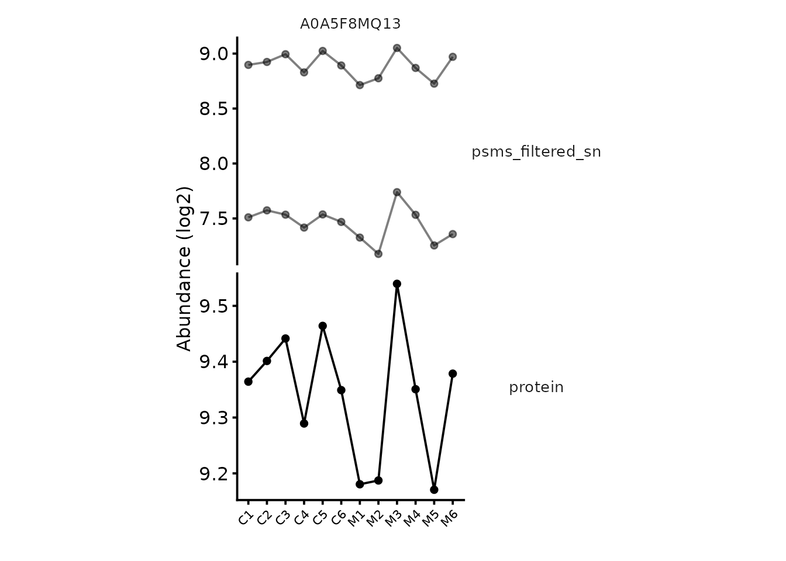

# Working with QFeatures objects

Every analysis in these vignettes keeps its data in a `QFeatures`
object, and the operations used to move through a pipeline — adding an
assay, filtering rows, aggregating to protein level — are `QFeatures`
operations rather than `biomasslmb` ones. This article covers the
handful you need, so that the other vignettes can concentrate on the
proteomics.

It is worth twenty minutes before starting an analysis of your own.
Nothing here is specific to any acquisition type. The [QFeatures
documentation](https://www.bioconductor.org/packages/release/bioc/html/QFeatures.html)
covers the object in more depth.

``` r

library(QFeatures)
library(biomasslmb)

tmt_qf <- biomasslmb::tmt_qf
lfq_qf <- biomasslmb::lfq_qf
```

## The idea: assays accumulate

A `QFeatures` object holds a list of assays. Each assay is a
`SummarizedExperiment`: a matrix of quantification values, with
`rowData` describing the features (PSMs, peptides, precursors or
proteins) and `colData` describing the samples.

What makes it suited to proteomics is that a processing step adds a
*new* assay rather than overwriting the previous one. `tmt_qf` is the
object built by the [TMT
workflow](https://lmb-mass-spec-compbio.github.io/biomasslmb/articles/TMT_PSM_QC_Summarisation.md)
vignette, and its assay names are a record of what was done to it:

``` r

tmt_qf
#> An instance of class QFeatures (type: bulk) with 8 sets:
#> 
#>  [1] psms_raw: SummarizedExperiment with 11281 rows and 12 columns 
#>  [2] psms_filtered: SummarizedExperiment with 6312 rows and 12 columns 
#>  [3] psms_filtered_norm: SummarizedExperiment with 6312 rows and 12 columns 
#>  ...
#>  [6] psms_filtered_missing: SummarizedExperiment with 4987 rows and 12 columns 
#>  [7] psms_filtered_forSum: SummarizedExperiment with 4853 rows and 12 columns 
#>  [8] protein: SummarizedExperiment with 402 rows and 12 columns
```

Each of those is a snapshot. Nothing was thrown away, so a protein-level
value can always be traced back to the PSMs behind it — which is what
[`plot_protein_assays()`](https://lmb-mass-spec-compbio.github.io/biomasslmb/reference/plot_protein_assays.md)
does, and why the QC vignettes accumulate names like `psms_filtered_sn`
rather than reassigning one matrix.

The cost is that you have to name every intermediate. The names are
yours to choose; the vignettes use a convention of the feature level
followed by what was done (`psms_filtered_rank`,
`peptides_for_summarisation`).

## Getting at the parts

`[[` extracts one assay as a `SummarizedExperiment`:

``` r

protein_se <- tmt_qf[['protein']]

protein_se
#> class: SummarizedExperiment 
#> dim: 402 12 
#> metadata(0):
#> assays(2): assay aggcounts
#> rownames(402): A0A286YCX6 A0A5F8MQ13 ... Q9Z2W1 S4R1W1
#> rowData names(21): Checked Tags ... Number.of.Protein.Groups .n
#> colnames(12): M1 C6 ... M2 M5
#> colData names(4): tag Condition Replicate quantCols
```

From there the usual `SummarizedExperiment` accessors apply — `assay()`
for the quantification matrix, `rowData()` for the feature annotations,
`colData()` for the sample annotations:

``` r

dim(assay(protein_se))
#> [1] 402  12

head(colnames(rowData(protein_se)))
#> [1] "Checked"               "Tags"                  "Confidence"           
#> [4] "Identifying.Node.Type" "Identifying.Node"      "Search.ID"
```

Single brackets subset the object itself, and take three arguments:
rows, columns (samples), and assays. This is how you restrict to a
subset of samples, as the testing vignette does when it drops the
conditions it is not comparing:

``` r

# every assay, control samples only
control_only <- tmt_qf[, tmt_qf$Condition == 'Control']

dim(assay(control_only[['protein']]))
#> [1] 402   6
```

The third argument selects assays, which is useful when a function
should only see part of the object:

``` r

names(tmt_qf[, , c('psms_raw', 'protein')])
#> [1] "psms_raw" "protein"
```

Assigning into `[[` adds or replaces an assay. This is the workhorse of
the QC vignettes:

``` r

tmt_qf[['psms_filtered']] <- filter_features_pd_dda(tmt_qf[['psms_raw']], ...)
```

## The experimental design

`colData` holds one row per sample, and it is what every function that
knows about experimental conditions reads — `plot_pca(colour_by = )`,
`condition_miss_score(group_cols = )`, and the
[`model.matrix()`](https://rdrr.io/r/stats/model.matrix.html) calls in
the testing vignettes.

``` r

colData(tmt_qf)
#> DataFrame with 12 rows and 4 columns
#>             tag   Condition   Replicate   quantCols
#>     <character> <character> <character> <character>
#> M1          126      Mutant           1          M1
#> C6         128N     Control           6          C6
#> C5         128C     Control           5          C5
#> M4         129N      Mutant           4          M4
#> C3         130N     Control           3          C3
#> ...         ...         ...         ...         ...
#> C4         132N     Control           4          C4
#> M3         133N      Mutant           3          M3
#> C2         133C     Control           2          C2
#> M2         134C      Mutant           2          M2
#> M5         135N      Mutant           5          M5
```

### What your design table needs

The design table you pass as `colData` when reading data in has to
satisfy a small contract, and getting it wrong is the most common thing
to go wrong at the first step.

- **A `quantCols` column**, holding the names of the columns in your
  data file that contain quantification values. This is how
  [`readQFeatures()`](https://rformassspectrometry.github.io/QFeatures/reference/readQFeatures.html)
  knows which columns are abundances and which are annotation.
  Alternatively, pass `quantCols` directly to
  [`readQFeatures()`](https://rformassspectrometry.github.io/QFeatures/reference/readQFeatures.html)
  as a column index or name vector, and the design table does not need
  the column.
- **Rownames, or a `quantCols` column, matching the sample
  identifiers.** After reading, the assay’s column names come from
  `quantCols`, and `colData` rows are matched to them by name. If they
  disagree, samples silently fail to line up.
- **A `runCol` column**, only when one file holds several runs that
  should become separate assays — several TMT plexes, or the per-run
  output of DIA-NN. See [multi-plex
  TMT](https://lmb-mass-spec-compbio.github.io/biomasslmb/articles/TMT_multiplex.md).
- **Your experimental variables**, named as you like: `Condition`,
  `Replicate`, `Timepoint`, `Genotype`. These are what you refer to
  later by name.

`tmt_clock_design` is a minimal example:

``` r

knitr::kable(tmt_clock_design)
```

|     | tag  | Condition | Replicate | quantCols |
|:----|:-----|:----------|:----------|:----------|
| C1  | 130C | Control   | 1         | C1        |
| C4  | 132N | Control   | 4         | C4        |
| C5  | 128C | Control   | 5         | C5        |
| C6  | 128N | Control   | 6         | C6        |
| M1  | 126  | Mutant    | 1         | M1        |
| M4  | 129N | Mutant    | 4         | M4        |
| M3  | 133N | Mutant    | 3         | M3        |
| C2  | 133C | Control   | 2         | C2        |
| C3  | 130N | Control   | 3         | C3        |
| M2  | 134C | Mutant    | 2         | M2        |
| M6  | 131C | Mutant    | 6         | M6        |
| M5  | 135N | Mutant    | 5         | M5        |

Its rownames are the quantification column names in `psm_tmt_clock`,
which is why the vignette passes
`quantCols = rownames(tmt_clock_design)`.

In practice the design usually arrives as a spreadsheet from whoever ran
the samples, and the first job of an analysis is to read it in and check
it against the column names in the data file. That check is worth making
explicitly — a mismatch produces a working-looking object with the
labels shuffled.

### Attaching the design to an assay

[`readQFeatures()`](https://rformassspectrometry.github.io/QFeatures/reference/readQFeatures.html)
attaches `colData` at the object level only, so the assays inside start
with an empty `colData`:

``` r

tmt_qf_new <- readQFeatures(assayData = psm_tmt_clock,
                            colData = tmt_clock_design,
                            quantCols = rownames(tmt_clock_design),
                            name = 'psms_raw')
#> Checking arguments.
#> Loading data as a 'SummarizedExperiment' object.
#> Formatting sample annotations (colData).
#> Formatting data as a 'QFeatures' object.

dim(colData(tmt_qf_new))
#> [1] 12  4
dim(colData(tmt_qf_new[['psms_raw']]))
#> [1] 12  0
```

Functions that plot or model a single assay need the design on that
assay.
[`sync_coldata()`](https://lmb-mass-spec-compbio.github.io/biomasslmb/reference/sync_coldata.md)
copies it across, matching on sample name:

``` r

tmt_qf_new <- sync_coldata(tmt_qf_new)

dim(colData(tmt_qf_new[['psms_raw']]))
#> [1] 12  4
```

Assays created by
[`aggregateFeatures()`](https://rdrr.io/pkg/ProtGenerics/man/protgenerics.html)
and
[`joinAssays()`](https://rformassspectrometry.github.io/QFeatures/reference/joinAssays.html)
also start without `colData`, so it is worth calling again after those.
Calling it on the whole object is cheap and idempotent.

## Filtering rows

[`filterFeatures()`](https://rdrr.io/pkg/ProtGenerics/man/filterFeatures.html)
filters on `rowData` columns, across the whole object or one named
assay, using a formula:

``` r

nrow(tmt_qf[['psms_raw']])
#> [1] 11281

filtered <- filterFeatures(tmt_qf, ~ Rank == 1, i = 'psms_raw')
#> 'Rank' found in 8 out of 8 assay(s).

nrow(filtered[['psms_raw']])
#> [1] 11201
```

Note that
[`filterFeatures()`](https://rdrr.io/pkg/ProtGenerics/man/filterFeatures.html)
modifies the assay in place rather than adding a new one, which is why
the vignettes usually copy an assay to a new name first and then filter
it.

[`filterNA()`](https://rdrr.io/pkg/ProtGenerics/man/protgenerics.html)
filters on missingness instead, taking the maximum proportion of missing
values a feature may have:

``` r

peptides <- lfq_qf[['peptides_filtered_norm']]

c(all = nrow(peptides),
  at_most_4_of_6_missing = nrow(filterNA(peptides, pNA = 4/6)),
  complete_only = nrow(filterNA(peptides, pNA = 0)))
#>                    all at_most_4_of_6_missing          complete_only 
#>                   2325                   2226                   1439
```

`pNA = 0` means no missing values at all. The threshold is a real
decision rather than a tidying step, and [handling missing
values](https://lmb-mass-spec-compbio.github.io/biomasslmb/articles/handling_missing_values.md)
covers how to choose it.

## Aggregating to protein level

[`aggregateFeatures()`](https://rdrr.io/pkg/ProtGenerics/man/protgenerics.html)
summarises features into a new assay, grouping by a `rowData` column and
applying a function:

``` r

tmt_qf <- aggregateFeatures(tmt_qf,
                            i = 'psms_filtered_forSum',
                            fcol = 'Master.Protein.Accessions',
                            name = 'protein',
                            fun = base::colSums)
```

`fcol` is the grouping column — the protein each feature was assigned to
— and `fun` is the summarisation method. Which `fun` to use is the
subject of [choosing a summarisation
method](https://lmb-mass-spec-compbio.github.io/biomasslmb/articles/summarisation_methods.md).

Unlike the filtering functions, this one takes the whole object and
returns the whole object, because it needs to record the link between
the input and output assays.

## Assay links

Those links are what lets you go back.
[`aggregateFeatures()`](https://rdrr.io/pkg/ProtGenerics/man/protgenerics.html)
records which features contributed to which protein, so a protein-level
value can be traced to the PSMs behind it:

``` r

poi <- rownames(tmt_qf[['protein']])[2]

contributing <- tmt_qf[[ 'psms_filtered_forSum' ]]
contributing <- contributing[
  rowData(contributing)$Master.Protein.Accessions == poi, ]

c(protein = poi, n_psms = nrow(contributing))
#>      protein       n_psms 
#> "A0A5F8MQ13"          "2"
```

[`plot_protein_assays()`](https://lmb-mass-spec-compbio.github.io/biomasslmb/reference/plot_protein_assays.md)
does this across several assays at once, which is the quickest way to
check whether a hit rests on agreeing features or on one outlier:

``` r

plot_protein_assays(tmt_qf, poi,
                    experiments_to_plot = c('psms_filtered_sn', 'protein'),
                    log2transform_cols = 'psms_filtered_sn')
```



## Transformations

Two operations return a modified assay rather than a whole object, and
both are used in every QC vignette:

``` r

# log2 transform
tmt_qf[['protein']] <- logTransform(tmt_qf[['protein']], base = 2)

# normalise, here shifting every sample to a common median
tmt_qf[['peptides_norm']] <- normalize(tmt_qf[['peptides']], method = 'diff.median')
```

[`normalize()`](https://rdrr.io/pkg/BiocGenerics/man/normalize.html)
expects log-scale values. Where a later step needs the original scale —
summing PSMs, for instance — the vignettes exponentiate back with
`assay(x) <- 2^assay(x)`.

## Joining assays

[`joinAssays()`](https://rformassspectrometry.github.io/QFeatures/reference/joinAssays.html)
merges several assays into one, matching features by row name. This is
how separately processed TMT plexes are brought together, and how
DIA-NN’s per-run assays are combined:

``` r

qf <- joinAssays(qf, i = c('protein_1', 'protein_2'), name = 'protein_joined')
```

Features present in one assay and not another become `NA`, which for
multi-plex TMT is a meaningful category rather than a nuisance — see
[multi-plex
TMT](https://lmb-mass-spec-compbio.github.io/biomasslmb/articles/TMT_multiplex.md).

## A summary of the vocabulary

| Operation | Function | Returns |
|----|----|----|
| Read data in | [`readQFeatures()`](https://rformassspectrometry.github.io/QFeatures/reference/readQFeatures.html) | `QFeatures` |
| Extract one assay | `obj[[i]]` | `SummarizedExperiment` |
| Subset samples or assays | `obj[rows, cols, assays]` | `QFeatures` |
| Add or replace an assay | `obj[[i]] <- ...` | — |
| Attach the design to assays | [`sync_coldata()`](https://lmb-mass-spec-compbio.github.io/biomasslmb/reference/sync_coldata.md) | `QFeatures` |
| Filter on feature annotation | [`filterFeatures()`](https://rdrr.io/pkg/ProtGenerics/man/filterFeatures.html) | `QFeatures` |
| Filter on missingness | [`filterNA()`](https://rdrr.io/pkg/ProtGenerics/man/protgenerics.html) | same as input |
| Log transform | [`logTransform()`](https://rformassspectrometry.github.io/QFeatures/reference/QFeatures-processing.html) | `SummarizedExperiment` |
| Normalise | [`normalize()`](https://rdrr.io/pkg/BiocGenerics/man/normalize.html) | same as input |
| Summarise to protein | [`aggregateFeatures()`](https://rdrr.io/pkg/ProtGenerics/man/protgenerics.html) | `QFeatures` |
| Merge assays | [`joinAssays()`](https://rformassspectrometry.github.io/QFeatures/reference/joinAssays.html) | `QFeatures` |

## Where to go next

With the vocabulary in hand, [getting
started](https://lmb-mass-spec-compbio.github.io/biomasslmb/articles/biomasslmb.md)
explains which analysis vignette applies to your experiment, and the
vignette for your acquisition type works through one from search engine
output to protein-level quantification.

## Getting help

If your experiment does not fit what this article assumes, or a result
looks wrong, please get in touch with Tom Smith (<tsmith@mrclmb.ac.uk>)
rather than guessing — it is far easier to help while an analysis is in
progress than to unpick a decision afterwards, and easier still before
the samples are run. [Getting
started](https://lmb-mass-spec-compbio.github.io/biomasslmb/articles/biomasslmb.md)
sets out which article applies to which experiment.

``` r

sessionInfo()
#> R version 4.5.3 (2026-03-11)
#> Platform: x86_64-pc-linux-gnu
#> Running under: Ubuntu 24.04.5 LTS
#> 
#> Matrix products: default
#> BLAS:   /usr/lib/x86_64-linux-gnu/openblas-pthread/libblas.so.3 
#> LAPACK: /usr/lib/x86_64-linux-gnu/openblas-pthread/libopenblasp-r0.3.26.so;  LAPACK version 3.12.0
#> 
#> locale:
#>  [1] LC_CTYPE=C.UTF-8       LC_NUMERIC=C           LC_TIME=C.UTF-8       
#>  [4] LC_COLLATE=C.UTF-8     LC_MONETARY=C.UTF-8    LC_MESSAGES=C.UTF-8   
#>  [7] LC_PAPER=C.UTF-8       LC_NAME=C              LC_ADDRESS=C          
#> [10] LC_TELEPHONE=C         LC_MEASUREMENT=C.UTF-8 LC_IDENTIFICATION=C   
#> 
#> time zone: UTC
#> tzcode source: system (glibc)
#> 
#> attached base packages:
#> [1] stats4    stats     graphics  grDevices utils     datasets  methods  
#> [8] base     
#> 
#> other attached packages:
#>  [1] biomasslmb_0.1.0            QFeatures_1.20.0           
#>  [3] MultiAssayExperiment_1.36.2 SummarizedExperiment_1.40.0
#>  [5] Biobase_2.70.0              GenomicRanges_1.62.1       
#>  [7] Seqinfo_1.0.0               IRanges_2.44.0             
#>  [9] S4Vectors_0.48.1            BiocGenerics_0.56.0        
#> [11] generics_0.1.4              MatrixGenerics_1.22.0      
#> [13] matrixStats_1.5.0          
#> 
#> loaded via a namespace (and not attached):
#>  [1] tidyselect_1.2.1        dplyr_1.2.1             farver_2.1.2           
#>  [4] blob_1.3.0              Biostrings_2.78.0       S7_0.2.2               
#>  [7] fastmap_1.2.0           lazyeval_0.2.3          XML_3.99-0.24          
#> [10] digest_0.6.39           lifecycle_1.0.5         cluster_2.1.8.2        
#> [13] ProtGenerics_1.42.0     survival_3.8-6          KEGGREST_1.50.0        
#> [16] RSQLite_3.53.3          magrittr_2.0.5          genefilter_1.92.0      
#> [19] compiler_4.5.3          rlang_1.3.0             sass_0.4.10            
#> [22] tools_4.5.3             igraph_2.3.3            yaml_2.3.12            
#> [25] corrplot_0.95           knitr_1.52              labeling_0.4.3         
#> [28] S4Arrays_1.10.1         htmlwidgets_1.6.4       bit_4.6.0              
#> [31] DelayedArray_0.36.1     plyr_1.8.9              RColorBrewer_1.1-3     
#> [34] abind_1.4-8             withr_3.0.3             purrr_1.2.2            
#> [37] desc_1.4.3              grid_4.5.3              xtable_1.8-8           
#> [40] ggplot2_4.0.3           scales_1.4.0            MASS_7.3-65            
#> [43] cli_3.6.6               rmarkdown_2.32          crayon_1.5.3           
#> [46] ragg_1.5.2              otel_0.2.0              robustbase_0.99-7      
#> [49] httr_1.4.9              reshape2_1.4.5          BiocBaseUtils_1.12.0   
#> [52] DBI_1.3.0               cachem_1.1.0            stringr_1.6.0          
#> [55] splines_4.5.3           AnnotationDbi_1.72.0    AnnotationFilter_1.34.0
#> [58] XVector_0.50.0          vctrs_0.7.3             Matrix_1.7-4           
#> [61] jsonlite_2.0.0          naniar_1.1.0            visdat_0.6.0           
#> [64] bit64_4.8.6             clue_0.3-68             systemfonts_1.3.2      
#> [67] tidyr_1.3.2             jquerylib_0.1.4         annotate_1.88.0        
#> [70] glue_1.8.1              DEoptimR_1.2-1          pkgdown_2.2.1          
#> [73] uniprotREST_1.0.0       stringi_1.8.9           gtable_0.3.6           
#> [76] tibble_3.3.1            pillar_1.11.1           htmltools_0.5.9        
#> [79] R6_2.6.1                textshaping_1.0.5       evaluate_1.0.5         
#> [82] lattice_0.22-9          backports_1.5.1         png_0.1-9              
#> [85] memoise_2.0.1           bslib_0.12.0            Rcpp_1.1.2             
#> [88] checkmate_2.3.4         SparseArray_1.10.10     xfun_0.60              
#> [91] MsCoreUtils_1.22.1      fs_2.1.0                pkgconfig_2.0.3
```
