# Choosing a summarisation method

Summarising lower-level quantification (PSMs for TMT, peptides for LFQ)
to protein-level abundance can be done with `sum`, `median` or
[`MsCoreUtils::robustSummary`](https://rdrr.io/pkg/MsCoreUtils/man/robustSummary.html),
and the choice changes both which proteins are quantified and what their
abundance profiles look like. (`mean` is not considered separately: it’s
just `sum` divided by the number of contributing features, so it
produces the same abundance profile across samples as `sum`, only
rescaled.) These are general considerations for bottom-up proteomics,
independent of the quantification technology: the same weighting and
missing-value behaviours apply whether the lower-level features are PSMs
or peptides. The methods differ in two distinct ways, and the two are
easy to run together, so they are separated here across three datasets —
two from the [TMT
QC](https://lmb-mass-spec-compbio.github.io/biomasslmb/articles/TMT_PSM_QC_Summarisation.md)
vignette and one from the [LFQ-DDA
QC](https://lmb-mass-spec-compbio.github.io/biomasslmb/articles/LFQ_DDA_Peptide_QC_Summarisation.md)
vignette:

- **How the methods weight individual features.** Even with complete
  data, `sum` and `robustSummary`/`median` produce different
  protein-level estimates, because they do not treat the underlying
  features equally. Part 1 isolates this using `tmt_qf`, the
  whole-proteome TMT PD dataset, which has very little missingness for
  it to be confounded with.
- **How the methods handle missing values.** `sum` requires complete
  data, whereas `robustSummary` can use features with some missing
  values. Part 2 takes this up with `tmt_qf_mq`, the TMT MaxQuant IP
  dataset, where missingness is common and potentially informative; Part
  3 repeats it with `lfq_qf`, an LFQ-DDA whole-proteome dataset, to
  establish that the conclusion is about missingness rather than about
  TMT.

## Load required packages

``` r

library(QFeatures)
library(biomasslmb)
library(ggplot2)
library(tidyr)
library(dplyr)

tmt_qf <- biomasslmb::tmt_qf
tmt_qf_mq <- biomasslmb::tmt_qf_mq
lfq_qf <- biomasslmb::lfq_qf
```

## Part 1: How the methods weight individual PSMs

`tmt_qf` already contains protein-level quantification from a simple
`sum` summarisation (`protein`), with missing values and single-PSM
proteins removed. `robustSummary` and `median` are computed below from
the same starting point, so that any difference between the three is
attributable to the estimator.

### Summarisation with robustSummary

`robustSummary` handles missing values within the algorithm, so PSMs
carrying some do not have to be discarded. PSMs missing from most
channels still contribute little beyond noise, so a threshold is applied
anyway — here, PSMs missing from at most half the channels.

``` r

tmt_qf[['psms_filtered_forRobust']] <- QFeatures::filterNA(
  tmt_qf[['psms_filtered_rank']], 5/10)
```

PSMs belonging to proteins with fewer than 2 PSMs are then removed.

``` r


min_psms <- 2

tmt_qf[['psms_filtered_forRobust']] <- biomasslmb::filter_features_per_protein(
  tmt_qf[['psms_filtered_forRobust']], min_features = min_psms)
```

`robustSummary` assumes approximately Gaussian quantification values, so
they are log transformed.

``` r

tmt_qf[['psms_filtered_forRobust']] <- QFeatures::logTransform(
  tmt_qf[['psms_filtered_forRobust']], base=2)
```

Summarising with `robustSummary`:

``` r

# Aggregate to protein-level abundances (using QFeatures function)
tmt_qf <- QFeatures::aggregateFeatures(tmt_qf,
                                       i = "psms_filtered_forRobust",
                                       fcol = "Master.Protein.Accessions",
                                       name = "protein_robust",
                                       fun = MsCoreUtils::robustSummary,
                                       maxit=1000)
#> Your quantitative and row data contain missing values. Please read the
#> relevant section(s) in the aggregateFeatures manual page regarding the
#> effects of missing values on data aggregation.
#> Aggregated: 1/1
```

### Summarisation with median

`median` is included because it is a typical way to summarise across
observations, and because it makes the behaviour of the other two easier
to read — not because it is recommended, for reasons the rest of Part 1
sets out. It is given the PSMs with missing values already filtered out.
`median` would accept them with `na.rm=TRUE`, but silently taking the
median of whichever PSMs happen to be present computes a different
quantity in each sample.

``` r


tmt_qf <- QFeatures::aggregateFeatures(tmt_qf,
                                       i = "psms_filtered_forSum",
                                       fcol = "Master.Protein.Accessions",
                                       name = "protein_median",
                                       fun = matrixStats::colMedians, na.rm=TRUE)
#> Your row data contain missing values. Please read the relevant
#> section(s) in the aggregateFeatures manual page regarding the effects
#> of missing values on data aggregation.
#> Aggregated: 1/1

tmt_qf[['protein_median']] <- QFeatures::logTransform(
  tmt_qf[['protein_median']], base=2)
```

### Comparing the summarisation approaches

As established in the QC vignette, this dataset has very few missing
values to begin with, so tolerating missing PSMs gains `robustSummary`
no proteins here. That is what makes it the right dataset for the first
question: with the missing-value advantage held at zero, any
disagreement between the methods is about how they weight features. Part
2 takes the missing-value question to a dataset that has some.

``` r


# Single object with protein inference from both methods
compare_protein_abundances <- qfeatures_long(
  tmt_qf[,,c('protein', 'protein_robust', 'protein_median')]) %>%
  data.frame() %>%
  mutate(method=recode_values(
    assay,
    'protein'~'Sum',
    'protein_robust'~'Robust',
    'protein_median'~'Median'))
#> Warning: 'experiments' dropped; see 'drops()'
#> harmonizing input:
#>   removing 96 sampleMap rows not in names(experiments)
```

The proteins where the methods disagree most are the informative ones to
look at, and a disagreement between three methods has three shapes: any
one of them can be the odd one out while the other two agree. One
protein is taken for each shape — the protein where that method departs
furthest from the other two, scored as the correlation between the other
two minus the better of the departing method’s own two correlations.

The comparison is restricted to proteins where all three methods
summarise an identical set of PSMs. `robustSummary` accepts PSMs
carrying missing values that `sum` and `median` never see, and where it
does, a departure would be a difference in the features available to it
rather than in the estimator — that is Part 2’s subject, and it would
confound this one.

``` r

psms_per_protein <- function(i) {
  split(rownames(tmt_qf[[i]]),
        rowData(tmt_qf[[i]])$Master.Protein.Accessions)
}

sum_psms <- psms_per_protein('psms_filtered_forSum')
robust_psms <- psms_per_protein('psms_filtered_forRobust')

same_psms <- Filter(function(protein) setequal(sum_psms[[protein]], robust_psms[[protein]]),
                    intersect(names(sum_psms), names(robust_psms)))

method_agreement <- compare_protein_abundances %>%
  filter(rowname %in% same_psms) %>%
  select(method, value, rowname, colname) %>%
  pivot_wider(names_from = method, values_from = value) %>%
  group_by(rowname) %>%
  filter(!any(is.na(c(Sum, Robust, Median)))) %>%
  summarise(sum_robust = cor(Sum, Robust),
            sum_median = cor(Sum, Median),
            robust_median = cor(Robust, Median)) %>%
  mutate(Sum = robust_median - pmax(sum_robust, sum_median),
         Robust = sum_median - pmax(sum_robust, robust_median),
         Median = sum_robust - pmax(sum_median, robust_median))

proteins_of_interest <- sapply(
  c(Sum = 'Sum', Robust = 'Robust', Median = 'Median'),
  function(method) method_agreement$rowname[which.max(method_agreement[[method]])])

proteins_of_interest
#>          Sum       Robust       Median 
#>     "Q9WU28" "A0A286YCX6"     "Q99PJ0"
```

A helper plots one protein twice: its PSM-level abundances on their
original scale, and the protein-level abundance from each method
normalised to mean abundance, so the three methods sit on a comparable
scale.

``` r

plot_pep_and_protein <- function(protein_of_interest) {

  to_plot_compare <- compare_protein_abundances %>%
    filter(rowname == protein_of_interest) %>%
    group_by(method) %>%
    mutate(value = value - mean(value)) %>%
    ungroup()

  pep_plot <- QFeatures::filterFeatures(
    tmt_qf,
    VariableFilter("Master.Protein.Accessions",
                   protein_of_interest,
                   condition = "=="))[['psms_filtered_sn']] %>%
    qfeatures_long() %>%
    ggplot(aes(x = colname, y = log2(value))) +
    geom_line(aes(group = rowname), colour = 'grey') +
    geom_point(colour = 'grey') +
    theme_biomasslmb(base_size = 15, border = FALSE, base_family = 'sans') +
    theme(axis.text.x = element_text(angle = 45, vjust = 1, hjust = 1)) +
    labs(
      title = protein_of_interest,
      x = '',
      y = 'PSM abundance (log2)'
    )

  protein_plot <- to_plot_compare %>%
    ggplot(aes(x = colname, y = value, colour = method, group = method)) +
    geom_line() +
    scale_colour_manual(values = get_cat_palette(3),
                        name = 'Protein summarisation method') +
    theme_biomasslmb(base_size = 15, border = FALSE, base_family = 'sans') +
    theme(axis.text.x = element_text(angle = 45, vjust = 1, hjust = 1)) +
    labs(
      title = protein_of_interest,
      x = '',
      y = 'Protein abundance (log2, mean-normalised)'
    ) +
    guides(color = guide_legend(override.aes = list(linewidth = 2) ) )

  list(peptide = pep_plot, protein = protein_plot)
}
```

In the peptide-level plots below, each grey line is a single PSM’s
abundance on its original scale. In the protein-level plots, each
summarisation method’s abundance profile is mean-normalised, so the
methods sit on a comparable scale and can be compared directly. The
important thing to focus on is the abundance profile across the tags for
any one summarisation method or PSM.

``` r

for(method in names(proteins_of_interest)) {
  plots <- plot_pep_and_protein(proteins_of_interest[[method]])
  print(plots$peptide + labs(subtitle = paste(method, 'departs')))
  print(plots$protein + labs(subtitle = paste(method, 'departs')))
}
```

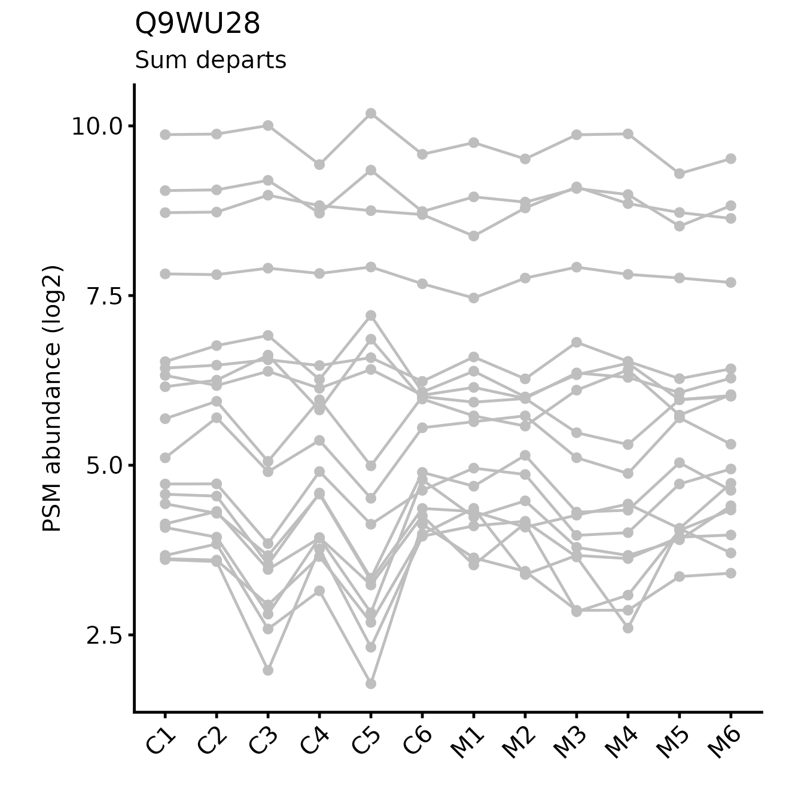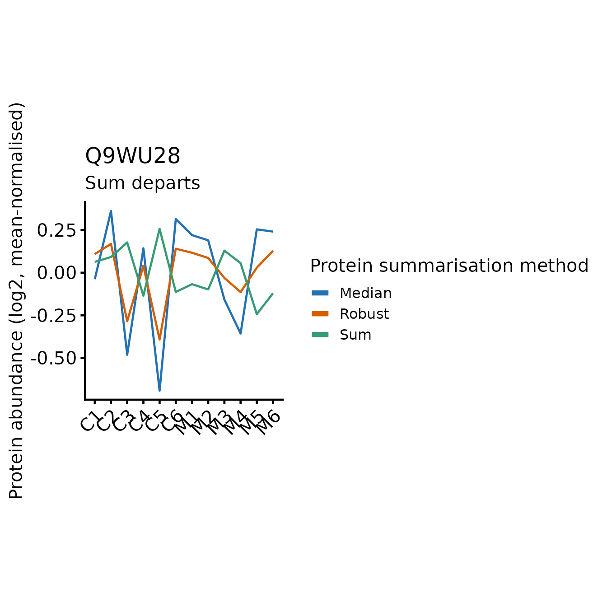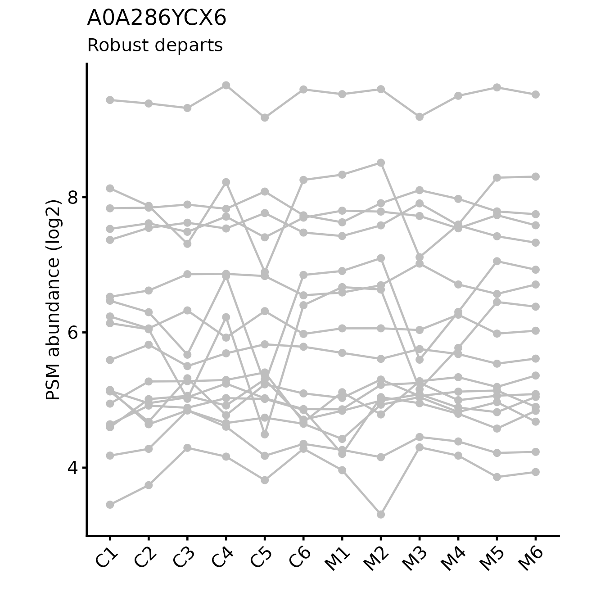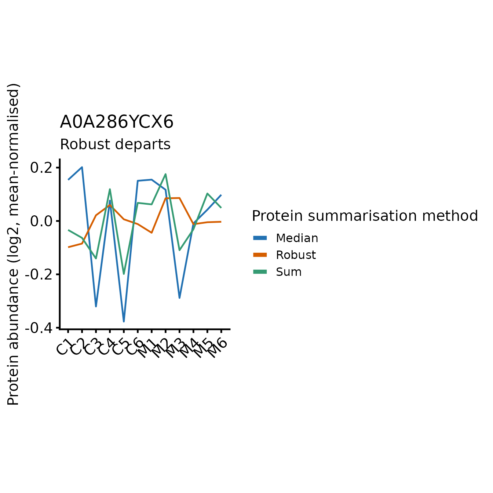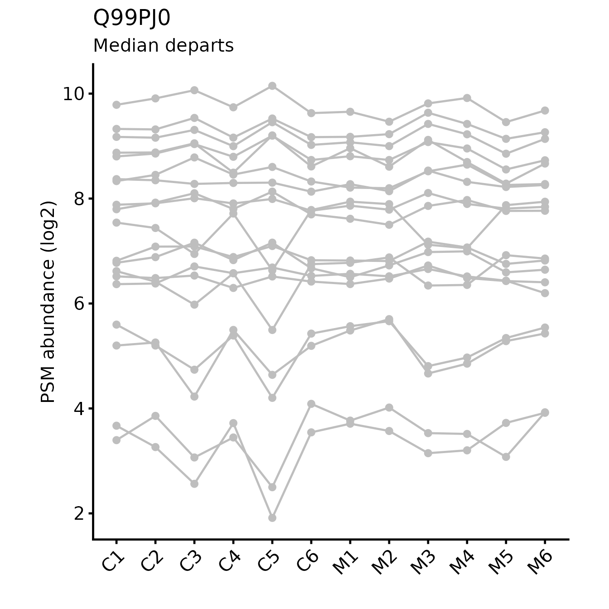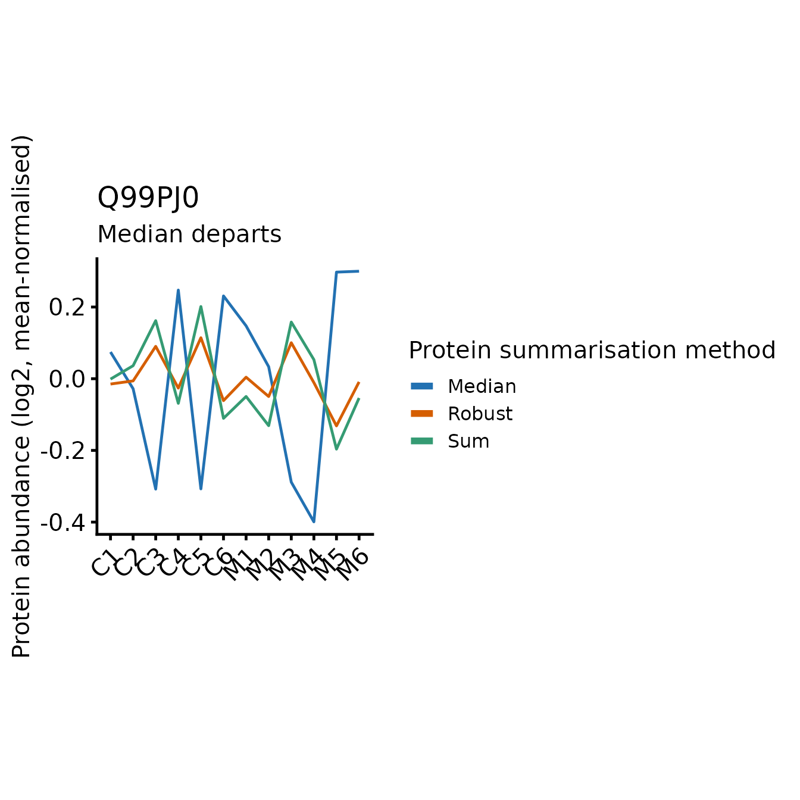

Two of the three are shapes of genuine conflict: for Q9WU28 and Q99PJ0,
the departing method describes a different profile across most of the
plex rather than a discrepancy at one or two tags.

**`robustSummary` is seldom the method that departs.** The worst case
for `sum` scores 1.62 on the measure above and the worst case for
`median` 1.69, while across the 386 proteins compared here the worst
case for `robustSummary` reaches only 0.56. That worst case is milder
than its correlations suggest: the `robustSummary` profile for
A0A286YCX6 varies across the tags with a standard deviation of 0.06
against 0.21 for `median`, so the disagreement is between a nearly flat
profile and a structured one rather than between two conflicting
accounts of the protein.

Since `sum` simply adds together the abundance values across the PSMs
for a given tag and the abundance values may span multiple orders of
magnitude, the protein-level abundance pattern across the tags is
weighted towards the most abundant PSMs. This is likely to be a positive
attribute, since the most abundant PSMs will be more accurately
quantified. However, the summarisation is also sensitive to high
abundance outliers. `robustSummary` and `median`, by contrast, ignore
absolute abundance: `robustSummary` weights each PSM by how far it sits
from the consensus profile, while `median` keeps only whichever PSMs
fall in the middle of the range.

This is visible directly for the protein where `median` departs.
Correlating each PSM’s abundance profile across the tags against the
`sum`-summarised protein profile gives a low or negative value for any
PSM that disagrees with the majority.

``` r

poi <- proteins_of_interest[['Median']]

rd <- rowData(tmt_qf[['psms_filtered_sn']])
psm_mask <- rd$Master.Protein.Accessions == poi
psm_values <- log2(assay(tmt_qf[['psms_filtered_sn']])[psm_mask, , drop = FALSE])
sum_profile <- assay(tmt_qf[['protein']])[poi, ]

psm_cors <- apply(psm_values, 1, function(x) cor(x, sum_profile, use = "complete.obs"))

sort(psm_cors)
#>       7405       8404       8504       7498       8570       7552       9283 
#> -0.9134327 -0.8962110 -0.8405904 -0.8317057 -0.8237807 -0.5217825  0.5278807 
#>      10524       6842       5315       5314       4172       6843      10521 
#>  0.6475433  0.6520070  0.8087495  0.8165681  0.8699799  0.8865314  0.8909420 
#>       9282       4284      10142       9280      10522 
#>  0.8950271  0.9212267  0.9321681  0.9694289  0.9721052
```

Colouring the same PSM traces by that correlation puts the disagreement
and the abundance on one pair of axes.

``` r

psm_cor_long <- data.frame(psm_values, check.names = FALSE) %>%
  mutate(rowname = rownames(psm_values),
         correlation = psm_cors[rowname]) %>%
  pivot_longer(cols = all_of(colnames(psm_values)),
               names_to = 'colname', values_to = 'abundance')

psm_cor_long %>%
  ggplot(aes(x = colname, y = abundance, group = rowname, colour = correlation)) +
  geom_line(linewidth = 1.2) +
  geom_point(size = 1.5) +
  scale_colour_gradient2(low = get_cat_palette(2)[2], mid = 'grey80',
                         high = get_cat_palette(1), midpoint = 0,
                         limits = c(-1, 1),
                         name = 'Correlation with\nsum profile') +
  theme_biomasslmb(base_size = 15, border = FALSE, base_family = 'sans') +
  theme(axis.text.x = element_text(angle = 45, vjust = 1, hjust = 1)) +
  labs(title = poi, x = '', y = 'PSM abundance (log2)')
```

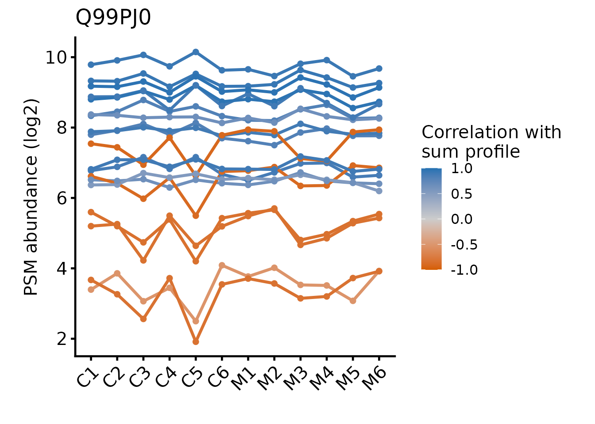

**Disagreement concentrates in the faint PSMs, and the one that matters
is the exception.** Agreement with the summed profile rises with
abundance — Spearman 0.79 between the two here — which is what noise in
the poorly quantified PSMs would look like, and it is the case for
weighting by intensity, since `sum` discounts those automatically. The
most strongly anticorrelated PSM is the one that breaks the pattern: it
ranks 10 of 19 by mean abundance and carries 3.9% of the summed signal
against the 5.3% an equal split would give it, so `sum` neither
discounts it for being dim nor lets it dominate for being bright.

What a PSM in that position costs each method can be measured by
dropping each PSM in turn and re-summarising from the rest.

``` r

summarise_psms <- function(ids, method) {
  m <- 2^psm_values[ids, , drop = FALSE]
  profile <- switch(method,
                    Sum = log2(colSums(m)),
                    Robust = MsCoreUtils::robustSummary(log2(m), maxit = 1000),
                    Median = log2(matrixStats::colMedians(m)))
  profile - mean(profile)
}

loo_cor <- sapply(c(Sum = 'Sum', Robust = 'Robust', Median = 'Median'), function(method) {
  full <- summarise_psms(rownames(psm_values), method)
  sapply(rownames(psm_values), function(psm)
    cor(full, summarise_psms(setdiff(rownames(psm_values), psm), method)))
})

# the largest and second-largest effect any single PSM has on each method
round(data.frame(worst = apply(loo_cor, 2, min),
                 next_worst = apply(loo_cor, 2, function(x) sort(x)[2])), 3)
#>         worst next_worst
#> Sum     0.987      0.994
#> Robust  0.955      0.957
#> Median -0.741      0.915
```

**One PSM out of 19 decides the `median` profile, and none of them
decides the other two.** No single PSM moves `sum` below a correlation
of 0.987 with its original profile, or `robustSummary` below 0.955.
`median` survives the loss of any PSM equally well — down to 0.92 —
except one, whose removal takes it to -0.74, inverting the profile. That
PSM ranks 10 of 19 by abundance: `median` reads the middle of the range
and nothing else, so whichever PSM sits there controls the result, and
here that PSM disagrees with the rest. `sum` gives it only the weight
its intensity earns and `robustSummary` discounts it further for sitting
away from the consensus, which is why the two of them track each other
at 0.95 for this protein while `median` sits at -0.85 against `sum`.

The median is less sensitive to a bright outlier than the mean, but
ignores much of the quantitative data since it’s only affected by the
‘middle’ PSMs. In the most extreme instances, median just simplifies the
PSM level abundances down to a single representative ‘middle’ PSM. That
instability is a general property of the estimator rather than a quirk
of this protein, and the next section measures it across the dataset.

### Why the median is the least stable summarisation

In the profiles above, the `median` line moves around more than the
other two. This is a general property rather than a feature of these
particular proteins, and it can be measured. Because `median` and `sum`
are both computed here from the same PSMs (`psms_filtered_forSum`), any
difference between them is down to the estimator alone.

The proteins in this dataset genuinely differ between `Control` and
`Mutant`, so the spread of a profile across all twelve tags mixes real
signal with noise. What is noise, and only noise, is how much an
estimate moves between replicates of the *same* condition.

``` r

psm_counts <- table(
  rowData(tmt_qf[['psms_filtered_forSum']])$Master.Protein.Accessions)

condition <- colData(tmt_qf)$Condition

replicate_sd <- function(x) {
  sqrt(mean(tapply(seq_along(condition), condition, function(i) var(x[i]))))
}

methods <- c(Sum = 'protein', Robust = 'protein_robust', Median = 'protein_median')

shared <- Reduce(intersect, lapply(methods, function(a) rownames(tmt_qf[[a]])))
shared <- shared[Reduce(`&`, lapply(methods, function(a)
  complete.cases(assay(tmt_qf[[a]])[shared, ])))]

stability <- data.frame(
  sapply(methods, function(a) apply(assay(tmt_qf[[a]])[shared, ], 1, replicate_sd)),
  n_psm = as.integer(psm_counts[shared]))
```

``` r

stability %>%
  mutate(psms = cut(n_psm, c(1, 2, 3, 5, 9, Inf),
                    labels = c('2', '3', '4-5', '6-9', '10 or more'))) %>%
  group_by(psms) %>%
  summarise(proteins = n(),
            across(c(Sum, Robust, Median), ~ round(median(.x), 3)))
#> # A tibble: 5 × 5
#>   psms       proteins   Sum Robust Median
#>   <fct>         <int> <dbl>  <dbl>  <dbl>
#> 1 2                62 0.146  0.151  0.146
#> 2 3                36 0.139  0.143  0.186
#> 3 4-5              67 0.124  0.126  0.15 
#> 4 6-9              90 0.107  0.104  0.149
#> 5 10 or more      147 0.108  0.1    0.13
```

Two things stand out. With exactly 2 PSMs all three methods are equally
stable, and `sum` and `median` are in fact identical: the median of two
values is their mean, which is the sum divided by two, and dividing by a
constant is an offset on the log scale that a profile cannot see. From 3
PSMs upwards `median` is the noisiest, typically by around 22%, and the
gap widens as PSMs accumulate: `sum` and `robustSummary` become steadily
more precise, while `median` improves very little.

That is the explanation in full. **`sum` and `robustSummary` combine
every PSM; `median` reports one of them.** Averaging several
measurements of the same quantity cancels part of the error in each, so
the more PSMs a protein has, the better those two estimates get. Taking
the middle value does not average anything, so the protein estimate
carries a single PSM’s worth of noise however many PSMs were available.
Even when everything is well behaved this costs about a fifth more
variability — the standard penalty for using a median in place of a
mean.

The bigger cost is that rank position says nothing about how well a PSM
was measured, so `median` has no protection against landing on a badly
measured one, and when it does the protein inherits that PSM’s noise in
full. For 49 of the 340 proteins with 3 or more PSMs, `median` is more
than twice as noisy as `sum`. `sum` avoids this without doing anything
clever, because weighting PSMs by their absolute intensity is close to
weighting them by their precision:

``` r

psm_quant <- log2(assay(tmt_qf[['psms_filtered_forSum']]))

data.frame(intensity = rowMeans(psm_quant),
           noise = apply(psm_quant, 1, replicate_sd)) %>%
  mutate(quartile = cut(intensity, quantile(intensity), include.lowest = TRUE,
                        labels = paste0('Q', 1:4))) %>%
  group_by(quartile) %>%
  summarise(psms = n(), noise = round(median(noise), 3))
#> # A tibble: 4 × 3
#>   quartile  psms noise
#>   <fct>    <int> <dbl>
#> 1 Q1        1214 0.257
#> 2 Q2        1213 0.184
#> 3 Q3        1213 0.167
#> 4 Q4        1213 0.164
```

The most intense PSMs are the most reproducibly quantified, so `sum`
leans on them automatically. `median` weights by rank instead, which is
uninformative about quality.

A smaller contribution is that the PSM occupying the middle need not be
the same one in every tag. Since the PSMs of a single protein sit at
different absolute intensities, every switch moves the estimate to a
different baseline:

``` r

poi_odd <- proteins_of_interest[
  as.integer(psm_counts[proteins_of_interest]) %% 2 == 1][1]

poi_psms <- log2(assay(tmt_qf[['psms_filtered_forSum']])[
  rowData(tmt_qf[['psms_filtered_forSum']])$Master.Protein.Accessions == poi_odd, ])

middle_psm <- apply(poi_psms, 2, function(x) rownames(poi_psms)[order(x)[(length(x) + 1) / 2]])

round(sort(rowMeans(poi_psms)[unique(middle_psm)]), 2)
#> 4172 9282 7405 5315 
#> 6.83 6.94 7.49 7.83
```

Q99PJ0 has 19 PSMs, and 4 different ones take a turn in the middle
across the twelve tags, at mean intensities spanning a 2-fold range.
Each handover puts a step into the profile that is not an abundance
change, which is why these profiles look jagged rather than merely
noisy.

`robustSummary` avoids all of this while keeping its resistance to
outliers, because it does not summarise each sample separately. It fits
one linear model across the whole PSM-by-sample matrix, with a term for
every PSM and a term for every sample, by iteratively reweighted least
squares, and returns the sample terms. Discordant observations are
down-weighted rather than discarded, so every PSM informs every sample’s
estimate; and each PSM’s own intensity is absorbed into its own term, so
it cannot leak into the between-sample profile. Resistance to outliers
comes from the weights rather than from ignoring all but the middle
value, which is why it matches `sum` for stability in the table above
while remaining, as the disagreeing PSM earlier showed, far less
sensitive to any one PSM.

This is why `median` is included here for interpretation rather than
recommended: it shows what happens when a summarisation discards
quantitative information, and the cost begins as soon as a protein has
more than two PSMs.

## Part 2: How the methods handle missing values

Part 2 switches to `tmt_qf_mq`, the MaxQuant IP dataset from the
[enrichment
designs](https://lmb-mass-spec-compbio.github.io/biomasslmb/articles/interactome_designs.md)
vignette. Missing values here are common and potentially informative — a
protein absent from the control pulldown is genuinely absent rather than
undetected by chance — which is exactly the condition under which the
two methods can be expected to diverge.

`tmt_qf_mq[['psms_filtered_interference']]` (the PSMs used for
summarisation in that vignette) is stored on the log2 scale, since that
is what `robustSummary` requires. A `sum` comparison needs the values
back on their original scale.

``` r

tmt_qf_mq[['psms_filtered_interference_raw']] <- tmt_qf_mq[['psms_filtered_interference']]
assay(tmt_qf_mq[['psms_filtered_interference_raw']]) <- 2^assay(tmt_qf_mq[['psms_filtered_interference_raw']])
```

A fair comparison needs the same rule applied to both approaches, so
both keep only proteins with at least 2 retained PSMs. They differ in
one respect alone: how much missingness a PSM may carry before it is
discarded — none for `sum`, up to 8/12 for `robustSummary`, the same
threshold used in the QC vignette.

``` r

tmt_qf_mq[['psms_filtered_forSum_mq']] <- QFeatures::filterNA(
  tmt_qf_mq[['psms_filtered_interference_raw']], 0)
tmt_qf_mq[['psms_filtered_forSum_mq']] <- biomasslmb::filter_features_per_protein(
  tmt_qf_mq[['psms_filtered_forSum_mq']], min_features = min_psms,
  master_protein_col = 'Leading.razor.protein')

tmt_qf_mq[['psms_filtered_forRobust_mq']] <- QFeatures::filterNA(
  tmt_qf_mq[['psms_filtered_interference']], 8/12)
tmt_qf_mq[['psms_filtered_forRobust_mq']] <- biomasslmb::filter_features_per_protein(
  tmt_qf_mq[['psms_filtered_forRobust_mq']], min_features = min_psms,
  master_protein_col = 'Leading.razor.protein')
```

Both are then summarised to protein level.

``` r

tmt_qf_mq <- QFeatures::aggregateFeatures(
  tmt_qf_mq, i = 'psms_filtered_forSum_mq', fcol = 'Leading.razor.protein',
  name = 'protein_mq_sum', fun = base::colSums)
#> Your row data contain missing values. Please read the relevant
#> section(s) in the aggregateFeatures manual page regarding the effects
#> of missing values on data aggregation.
#> Aggregated: 1/1
tmt_qf_mq[['protein_mq_sum']] <- QFeatures::logTransform(tmt_qf_mq[['protein_mq_sum']], base = 2)

tmt_qf_mq <- QFeatures::aggregateFeatures(
  tmt_qf_mq, i = 'psms_filtered_forRobust_mq', fcol = 'Leading.razor.protein',
  name = 'protein_mq_robust', fun = MsCoreUtils::robustSummary, maxit = 1000)
#> Your quantitative and row data contain missing values. Please read the
#> relevant section(s) in the aggregateFeatures manual page regarding the
#> effects of missing values on data aggregation.
#> Aggregated: 1/1
```

``` r

n_sum <- nrow(tmt_qf_mq[['protein_mq_sum']])
n_robust <- nrow(tmt_qf_mq[['protein_mq_robust']])

data.frame(method = factor(c('Sum', 'Robust'), levels = c('Sum', 'Robust')),
          n_proteins = c(n_sum, n_robust)) %>%
  ggplot(aes(method, n_proteins, fill = method)) +
  geom_col(width = 0.6) +
  geom_text(aes(label = n_proteins), vjust = -0.5) +
  scale_y_continuous(expand = expansion(mult = c(0, 0.1))) +
  scale_fill_manual(values = get_cat_palette(2), guide = 'none') +
  theme_biomasslmb(border = FALSE) +
  ylab('Proteins quantified') + xlab('')
```

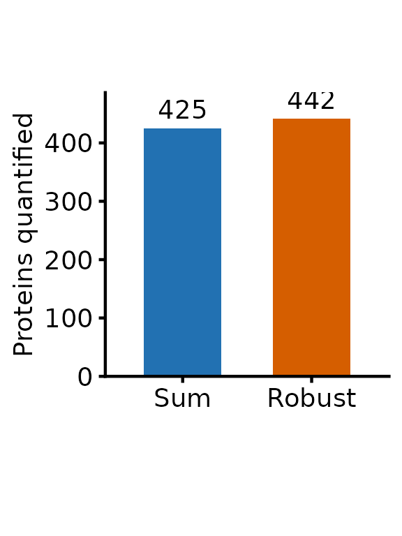

**Tolerating incomplete PSMs is worth 17 proteins here** — 442 against
425 for `sum`. The proteins quantified only via `robustSummary` are the
ones to examine, since they show what the completeness requirement
actually costs.

``` r

sum_proteins_mq <- rownames(tmt_qf_mq[['protein_mq_sum']])
robust_proteins_mq <- rownames(QFeatures::filterNA(tmt_qf_mq[['protein_mq_robust']]))

rescued_proteins <- setdiff(robust_proteins_mq, sum_proteins_mq)
length(rescued_proteins)
#> [1] 16
```

The mechanism is clearest in one of these 16 proteins with exactly 2
retained PSMs — the minimum allowed — where at least one PSM has missing
values.

``` r

rd_mq <- rowData(tmt_qf_mq[['psms_filtered_forRobust_mq']])
mat_mq <- assay(tmt_qf_mq[['psms_filtered_forRobust_mq']])

example_protein <- rescued_proteins[vapply(rescued_proteins, function(p) {
  psm_rows <- which(rd_mq$Leading.razor.protein == p)
  length(psm_rows) == 2 && any(is.na(mat_mq[psm_rows, ]))
}, logical(1))][2]

retain_psms <- rd_mq$Leading.razor.protein == example_protein
round(2^mat_mq[retain_psms, ], 1)
#>        IP_1 Control_4   IP_5 Control_1 IP_4 Control_3 Control_6  IP_2 Control_2
#> 15   1244.1        NA  599.2        NA 39.2     138.9    1480.7  76.8      54.0
#> 1457 5569.0       487 3091.5     231.1 85.0    1195.5    6363.2 508.2     185.4
#>       IP_3 Control_5 IP_6
#> 15      NA     159.6   NA
#> 1457 408.4     703.2  346
```

One PSM is missing in most samples, while the other is complete. With
`sum`, the incomplete PSM fails the zero-missing-values filter and is
discarded, leaving only 1 PSM for this protein — below the minimum of 2,
so the protein is dropped entirely. With `robustSummary`, both PSMs are
retained (the incomplete one has few enough missing values to pass the
8/12 threshold), giving 2 PSMs to summarise from and allowing the
protein to be quantified.

Plotted the same way as Part 1 — PSM-level abundances in grey,
summarised protein-level abundance overlaid in colour. Only the
`robustSummary` line appears, because `sum` has no value at all for this
protein.

``` r

compare_protein_abundances_mq <- qfeatures_long(
  tmt_qf_mq[,,c('protein_mq_sum', 'protein_mq_robust')]) %>%
  data.frame() %>%
  mutate(method=recode_values(
    assay,
    'protein_mq_sum'~'Sum',
    'protein_mq_robust'~'Robust'))
#> Warning: 'experiments' dropped; see 'drops()'
#> harmonizing input:
#>   removing 96 sampleMap rows not in names(experiments)

plot_pep_and_protein_mq <- function(protein_of_interest) {

  to_plot_compare <- compare_protein_abundances_mq %>%
    filter(rowname == protein_of_interest)

  QFeatures::filterFeatures(
    tmt_qf_mq,
    VariableFilter("Leading.razor.protein",
                   protein_of_interest,
                   condition = "=="))[['psms_filtered_forRobust_mq']] %>%
    qfeatures_long() %>%
    ggplot(aes(x = colname, y = value)) +
    geom_line(aes(group = rowname), colour = 'grey') +
    geom_point(colour = 'grey') +
    geom_line(data = to_plot_compare,
              aes(x = colname, y = value, colour = method, group = method)) +
    scale_colour_manual(values = get_cat_palette(4),
                        name = 'Protein summarisation method') +
    theme_biomasslmb(base_size = 15, border = FALSE, base_family = 'sans') +
    theme(axis.text.x = element_text(angle = 45, vjust = 1, hjust = 1)) +
    labs(
      title = protein_of_interest,
      x = '',
      y = 'PSM/Protein abundance (log2)'
    )
}
```

``` r

plot_pep_and_protein_mq(example_protein)
```

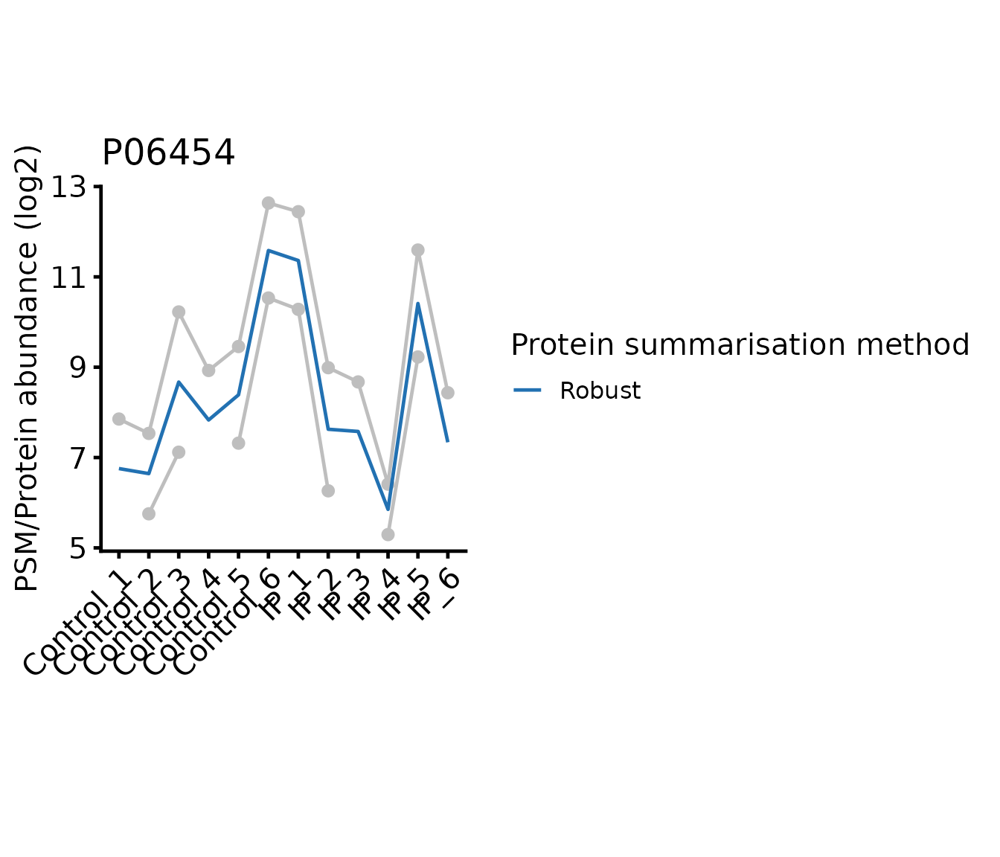

The two PSMs (grey) track each other where both are present, and the
`robustSummary` protein-level estimate (blue) follows information
presented from both PSMs.

### Where both methods quantify a protein, but disagree

`sum` and `robustSummary` can also disagree on proteins that both
methods manage to quantify, simply because they draw on different PSMs:
`sum` requires complete PSMs, while `robustSummary` also incorporates
partially-missing ones. `P27695` is a good example: it has 3 PSMs
retained by `robustSummary`, only 2 of which are complete enough to be
used by `sum`.

``` r

example_protein_3psm <- 'P27695'

sum_mat <- assay(tmt_qf_mq[['protein_mq_sum']])
robust_mat <- assay(tmt_qf_mq[['protein_mq_robust']])
```

``` r

rd_mq2 <- rowData(tmt_qf_mq[['psms_filtered_forRobust_mq']])
mat_mq2 <- assay(tmt_qf_mq[['psms_filtered_forRobust_mq']])
psm_rows_2 <- rd_mq2$Leading.razor.protein == example_protein_3psm
round(2^mat_mq2[psm_rows_2, ], 1)
#>        IP_1 Control_4   IP_5 Control_1   IP_4 Control_3 Control_6   IP_2
#> 1106 1215.9    2961.3 1611.3    2516.6 1258.1    2605.5    2286.6 2277.1
#> 2087  365.9        NA  659.5     143.2  429.6     132.0     124.9 1933.6
#> 2951  565.4     115.5 1919.1     114.6  700.6     218.5     193.8 3017.0
#>      Control_2   IP_3 Control_5   IP_6
#> 1106    2492.6 1813.4    2509.2 1370.1
#> 2087     183.4  957.5        NA  701.1
#> 2951      85.0 1408.0     167.2 1144.0
```

The third PSM is missing in exactly the two `Control` channels
(`Control_4` and `Control_5`) - consistent with genuinely low abundance
in the control samples, rather than a random dropout - so `sum` discards
it and summarises the protein from the other two, complete, PSMs alone.
`robustSummary` retains all three. Since `sum` weights PSMs by their
absolute abundance, its profile is dominated by whichever of the two
complete PSMs is more abundant, and here those two PSMs disagree on the
direction of the IP-vs-Control difference; `robustSummary` also
incorporates the partially-missing PSM, which is clearly enriched in the
IP samples. The two methods end up describing quite different abundance
profiles for the same protein (correlation of 0.58 between them).

``` r

plot_pep_and_protein_mq(example_protein_3psm)
```

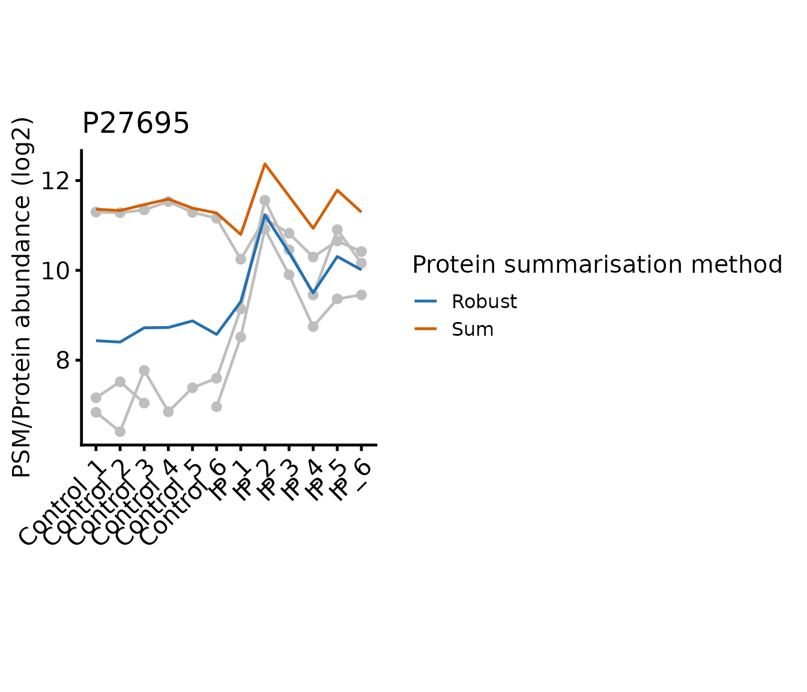

Comparing the `Control` and `IP` abundances for each method puts the
consequence in one plot.

``` r

condition_lookup <- setNames(tmt_per2_mq_design$Condition, rownames(tmt_per2_mq_design))

compare_protein_abundances_mq %>%
  filter(rowname == example_protein_3psm) %>%
  mutate(condition = condition_lookup[colname]) %>%
  ggplot(aes(x = method, y = value, colour = condition)) +
  geom_point(position = position_jitterdodge(jitter.width = 0.1, dodge.width = 0.5), size = 2) +
  stat_summary(fun = mean, geom = 'crossbar', width = 0.4,
               position = position_dodge(width = 0.5)) +
  scale_colour_manual(values = get_cat_palette(2),
                      name = '') +
  theme_biomasslmb(base_size = 15, border = FALSE, base_family = 'sans') +
  labs(title = example_protein_3psm, x = '', y = 'Protein abundance (log2)')
```

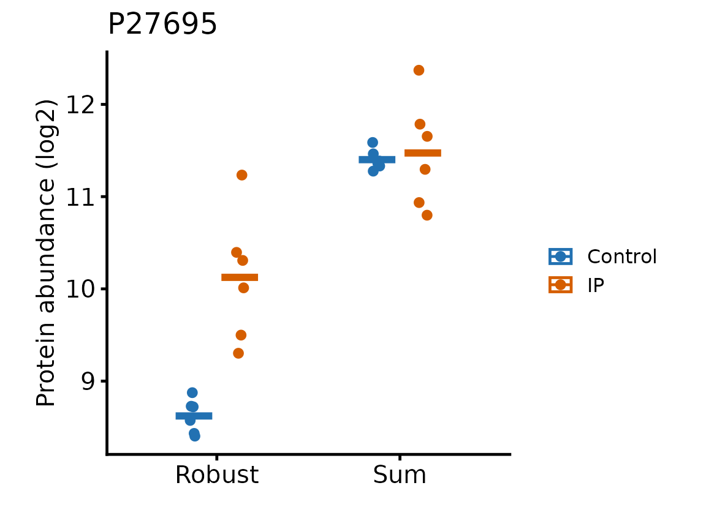

**`robustSummary` separates `IP` from `Control` here and `sum` largely
does not.** `sum` is working from the two complete PSMs alone, which
disagree with each other on direction, so its estimate is diluted.
`robustSummary` also draws on the missing-value PSM — the one PSM that
is unambiguously enriched in the IP samples, and unambiguously enriched
for the same reason it goes undetected in two of the `Control` channels.
Discarding it as incomplete discards the observation that carries the
finding.

## Part 3: The same missing-value trade-off with LFQ peptides

Parts 1 and 2 both used TMT PSMs as the lower-level feature, which
leaves open whether the Part 2 conclusion is about missingness or about
TMT. Repeating the same comparison on `lfq_qf`, the LFQ-DDA
whole-proteome dataset from the [LFQ-DDA
QC](https://lmb-mass-spec-compbio.github.io/biomasslmb/articles/LFQ_DDA_Peptide_QC_Summarisation.md)
vignette, settles it: there the lower-level feature is a peptide rather
than a PSM. Missingness here differs from Part 2 in kind as well as
degree: it is not concentrated in one condition, but it is pervasive,
because every sample was quantified in a separate run.

`lfq_qf[['peptides_filtered_norm']]` (the peptides used for
summarisation in the QC vignette) is stored on the log2 scale, since
that is what `robustSummary` requires. A `sum` comparison needs the
values back on their original scale.

``` r

lfq_qf[['peptides_filtered_forSum']] <- lfq_qf[['peptides_filtered_norm']]
assay(lfq_qf[['peptides_filtered_forSum']]) <- 2^assay(lfq_qf[['peptides_filtered_forSum']])
```

As in Part 2, the same rule is applied to both approaches: keep only
proteins with at least 2 retained peptides. They differ again in one
respect alone — how much missingness a peptide may carry before it is
discarded, none for `sum` and up to 4/6 for `robustSummary`, the same
threshold used in the QC vignette.

``` r

min_peps <- 2

lfq_qf[['peptides_filtered_forSum']] <- QFeatures::filterNA(
  lfq_qf[['peptides_filtered_forSum']], 0)
lfq_qf[['peptides_filtered_forSum']] <- biomasslmb::filter_features_per_protein(
  lfq_qf[['peptides_filtered_forSum']], min_features = min_peps)
```

Both are then summarised to protein level.
`lfq_qf[['peptides_for_summarisation']]` is the same peptide set (at
most 4/6 missing, at least 2 peptides per protein) used for
`robustSummary` in the QC vignette.

``` r

lfq_qf <- QFeatures::aggregateFeatures(
  lfq_qf, i = 'peptides_filtered_forSum', fcol = 'Master.Protein.Accessions',
  name = 'protein_lfq_sum', fun = base::colSums)
#> Aggregated: 1/1
lfq_qf[['protein_lfq_sum']] <- QFeatures::logTransform(lfq_qf[['protein_lfq_sum']], base = 2)

set.seed(42)
lfq_qf <- QFeatures::aggregateFeatures(
  lfq_qf, i = 'peptides_for_summarisation', fcol = 'Master.Protein.Accessions',
  name = 'protein_lfq_robust', fun = MsCoreUtils::robustSummary, maxit = 10000)
#> Your quantitative data contain missing values. Please read the relevant
#> section(s) in the aggregateFeatures manual page regarding the effects
#> of missing values on data aggregation.
#> Aggregated: 1/1
```

``` r

n_sum_lfq <- nrow(lfq_qf[['protein_lfq_sum']])
n_robust_lfq <- nrow(QFeatures::filterNA(lfq_qf[['protein_lfq_robust']]))

data.frame(method = factor(c('Sum', 'Robust'), levels = c('Sum', 'Robust')),
          n_proteins = c(n_sum_lfq, n_robust_lfq)) %>%
  ggplot(aes(method, n_proteins, fill = method)) +
  geom_col(width = 0.6) +
  geom_text(aes(label = n_proteins), vjust = -0.5) +
  scale_y_continuous(expand = expansion(mult = c(0, 0.1))) +
  scale_fill_manual(values = get_cat_palette(2), guide = 'none') +
  theme_biomasslmb(border = FALSE) +
  ylab('Proteins quantified') + xlab('')
```

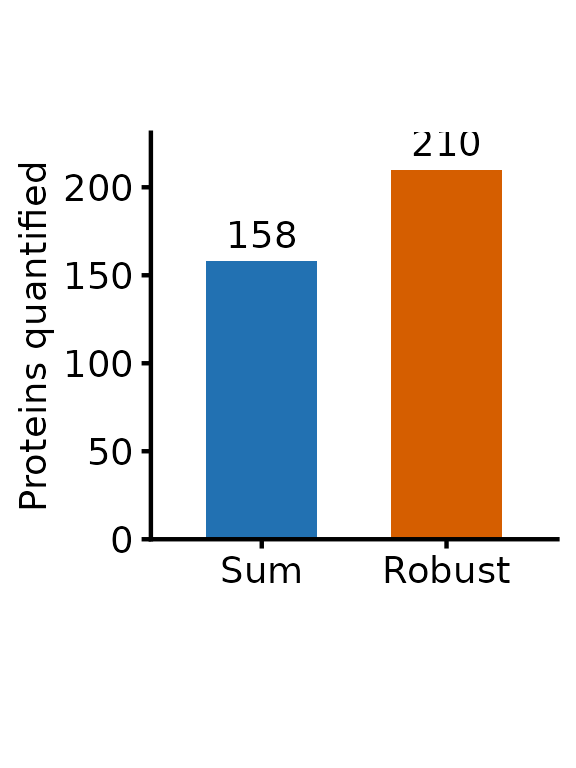

**The same trade appears with peptides.** Tolerating incomplete peptides
is worth 52 proteins here — 210 against 158 for `sum`. The proteins
quantified only via `robustSummary`, and the peptides behind one of
them:

``` r

sum_proteins_lfq <- rownames(lfq_qf[['protein_lfq_sum']])
robust_proteins_lfq <- rownames(QFeatures::filterNA(lfq_qf[['protein_lfq_robust']]))

rescued_proteins_lfq <- setdiff(robust_proteins_lfq, sum_proteins_lfq)
length(rescued_proteins_lfq)
#> [1] 52
```

``` r

rd_lfq <- rowData(lfq_qf[['peptides_for_summarisation']])
mat_lfq <- assay(lfq_qf[['peptides_for_summarisation']])

example_protein_lfq <- rescued_proteins_lfq[vapply(rescued_proteins_lfq, function(p) {
  pep_rows <- which(rd_lfq$Master.Protein.Accessions == p)
  length(pep_rows) == 2 && any(is.na(mat_lfq[pep_rows, ]))
}, logical(1))][1]

retain_peps_lfq <- rd_lfq$Master.Protein.Accessions == example_protein_lfq
round(2^mat_lfq[retain_peps_lfq, ], 1)
#>         WT_1    WT_2 WT_3 Mutant_1 Mutant_2 Mutant_3
#> 3033 25583.3      NA   NA  36333.4  20889.1  43536.7
#> 3460  6444.1 10246.4 6628  13522.1  12884.5  27020.1
```

One peptide is missing in every `Control` replicate, while the other is
complete. With `sum`, the incomplete peptide fails the
zero-missing-values filter and is discarded, leaving only 1 peptide for
this protein — below the minimum of 2, so the protein is dropped
entirely. With `robustSummary`, both peptides are retained (the
incomplete one has few enough missing values to pass the 4/6 threshold),
giving 2 peptides to summarise from and allowing the protein to be
quantified - exactly the same mechanism as the TMT example above, just
with peptides in place of PSMs.

``` r

compare_protein_abundances_lfq <- qfeatures_long(
  lfq_qf[,,c('protein_lfq_sum', 'protein_lfq_robust')]) %>%
  data.frame() %>%
  mutate(method=recode_values(
    assay,
    'protein_lfq_sum'~'Sum',
    'protein_lfq_robust'~'Robust'))
#> Warning: 'experiments' dropped; see 'drops()'
#> harmonizing input:
#>   removing 42 sampleMap rows not in names(experiments)

plot_pep_and_protein_lfq <- function(protein_of_interest) {

  to_plot_compare <- compare_protein_abundances_lfq %>%
    filter(rowname == protein_of_interest)

  QFeatures::filterFeatures(
    lfq_qf,
    VariableFilter("Master.Protein.Accessions",
                   protein_of_interest,
                   condition = "=="))[['peptides_for_summarisation']] %>%
    qfeatures_long() %>%
    ggplot(aes(x = colname, y = value)) +
    geom_line(aes(group = rowname), colour = 'grey') +
    geom_point(colour = 'grey') +
    geom_line(data = to_plot_compare,
              aes(x = colname, y = value, colour = method, group = method)) +
    scale_colour_manual(values = get_cat_palette(4),
                        name = 'Protein summarisation method') +
    theme_biomasslmb(base_size = 15, border = FALSE, base_family = 'sans') +
    theme(axis.text.x = element_text(angle = 45, vjust = 1, hjust = 1)) +
    labs(
      title = protein_of_interest,
      x = '',
      y = 'Peptide/Protein abundance (log2)'
    )
}
```

``` r

plot_pep_and_protein_lfq(example_protein_lfq)
```

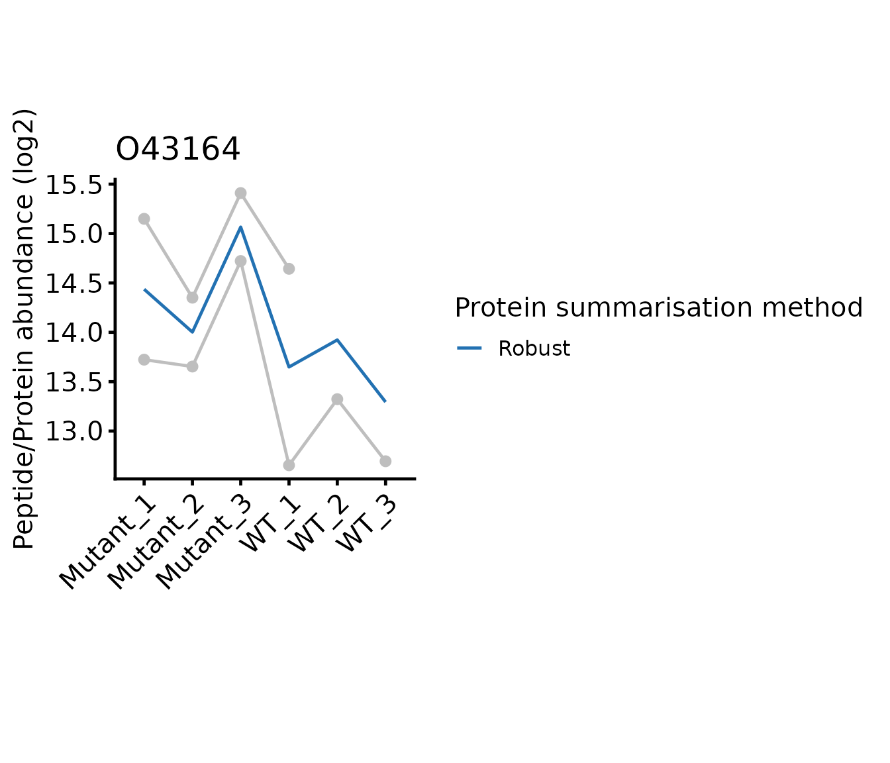

One of the two peptides is quantified in every sample; the other is
missing from two of the wild type replicates. `sum` needs complete
peptides, so discarding the incomplete one leaves the protein with a
single peptide, below the two-peptide requirement, and it drops out
entirely. `robustSummary` uses both peptides and estimates the protein
in all six samples, with the partially-observed peptide contributing
where it was measured.

``` r

both_proteins_lfq <- intersect(sum_proteins_lfq, robust_proteins_lfq)
cors_lfq <- sapply(both_proteins_lfq, function(p) {
  cor(assay(lfq_qf[['protein_lfq_sum']])[p, ], assay(lfq_qf[['protein_lfq_robust']])[p, ])
})
summary(cors_lfq)
#>    Min. 1st Qu.  Median    Mean 3rd Qu.    Max. 
#>  0.4927  0.9135  0.9736  0.9321  0.9934  1.0000
```

Where both methods do manage to quantify a protein here, most agree
well, but a meaningful minority do not: 32 of the 158 jointly-quantified
proteins correlate below 0.9, and the lowest is 0.49. That is the Part 1
effect - the methods weight the underlying features differently -
showing up alongside the Part 2 effect rather than instead of it, and it
is more visible here than in the TMT data because LFQ peptide
intensities for one protein span a wider range.

Both effects are larger with LFQ peptides than with TMT PSMs, but the
rescuing of otherwise-discarded proteins (210 vs 158) remains the
dominant one, consistent with LFQ carrying more missing values to begin
with.

### Summary

`sum` and `mean` weight the highest intensity features most heavily,
which are usually the most accurately quantified — and are also where a
high-abundance outlier does the most damage. `robustSummary` treats
features more equally regardless of abundance, which costs it some of
that automatic weighting towards precision but lets it use features that
are partly missing, and so quantify proteins `sum` has to discard.
`median` gives up more than either, for the reasons in Part 1.

These are properties of the estimators rather than of any one
quantification technology: Part 3 reproduced the Part 2 trade-off with
LFQ peptides in place of TMT PSMs, and more strongly, since LFQ carries
more missing values to begin with.

**Which one to use follows from how much missingness there is, not from
a preference.** Where missingness is very low, as in Part 1, `sum` is
the better choice: tolerating missing features buys nothing when there
are almost none, and complete data is simpler to reason about
downstream. Where missing values are common — informative, as in the
Part 2 IP dataset, or merely pervasive, as in the Part 3 LFQ-DDA dataset
— `robustSummary` is the better choice, because it recovers proteins
`sum` would discard and uses more of the lower-level quantification that
was actually measured. Measuring the missingness before choosing is the
point; [handling missing
values](https://lmb-mass-spec-compbio.github.io/biomasslmb/articles/handling_missing_values.md)
covers how.

## Where to go next

- [Handling missing
  values](https://lmb-mass-spec-compbio.github.io/biomasslmb/articles/handling_missing_values.md)
  is the article this one defers to. Summarisation is one of four stages
  that make a decision about missing values, and choosing
  `robustSummary` here interacts with what is done at the other three.
- The core workflow articles apply the choice made here:
  [TMT](https://lmb-mass-spec-compbio.github.io/biomasslmb/articles/TMT_PSM_QC_Summarisation.md)
  sums PSMs within a plex,
  [LFQ-DDA](https://lmb-mass-spec-compbio.github.io/biomasslmb/articles/LFQ_DDA_Peptide_QC_Summarisation.md)
  and
  [LFQ-DIA](https://lmb-mass-spec-compbio.github.io/biomasslmb/articles/LFQ_DIA_Precursor_QC_Summarisation.md)
  use `robustSummary`, and each says what the dataset’s missingness rate
  had to look like for that to be right.
- Both estimators assume the features they are given belong to the
  protein they are labelled with. [Peptides are not
  proteins](https://lmb-mass-spec-compbio.github.io/biomasslmb/articles/gotcha_peptide_to_protein.md)
  measures how often that assumption fails.
- [Data exploration and statistical
  testing](https://lmb-mass-spec-compbio.github.io/biomasslmb/articles/exploration_and_statistical_testing.md)
  takes the protein-level abundances onward, whichever estimator
  produced them.

## Getting help

If your experiment does not fit what this article assumes, or a result
looks wrong, please get in touch with Tom Smith (<tsmith@mrclmb.ac.uk>)
rather than guessing — it is far easier to help while an analysis is in
progress than to unpick a decision afterwards, and easier still before
the samples are run. [Getting
started](https://lmb-mass-spec-compbio.github.io/biomasslmb/articles/biomasslmb.md)
sets out which article applies to which experiment.

``` r

sessionInfo()
#> R version 4.5.3 (2026-03-11)
#> Platform: x86_64-pc-linux-gnu
#> Running under: Ubuntu 24.04.5 LTS
#> 
#> Matrix products: default
#> BLAS:   /usr/lib/x86_64-linux-gnu/openblas-pthread/libblas.so.3 
#> LAPACK: /usr/lib/x86_64-linux-gnu/openblas-pthread/libopenblasp-r0.3.26.so;  LAPACK version 3.12.0
#> 
#> locale:
#>  [1] LC_CTYPE=C.UTF-8       LC_NUMERIC=C           LC_TIME=C.UTF-8       
#>  [4] LC_COLLATE=C.UTF-8     LC_MONETARY=C.UTF-8    LC_MESSAGES=C.UTF-8   
#>  [7] LC_PAPER=C.UTF-8       LC_NAME=C              LC_ADDRESS=C          
#> [10] LC_TELEPHONE=C         LC_MEASUREMENT=C.UTF-8 LC_IDENTIFICATION=C   
#> 
#> time zone: UTC
#> tzcode source: system (glibc)
#> 
#> attached base packages:
#> [1] stats4    stats     graphics  grDevices utils     datasets  methods  
#> [8] base     
#> 
#> other attached packages:
#>  [1] dplyr_1.2.1                 tidyr_1.3.2                
#>  [3] ggplot2_4.0.3               biomasslmb_0.1.0           
#>  [5] QFeatures_1.20.0            MultiAssayExperiment_1.36.2
#>  [7] SummarizedExperiment_1.40.0 Biobase_2.70.0             
#>  [9] GenomicRanges_1.62.1        Seqinfo_1.0.0              
#> [11] IRanges_2.44.0              S4Vectors_0.48.1           
#> [13] BiocGenerics_0.56.0         generics_0.1.4             
#> [15] MatrixGenerics_1.22.0       matrixStats_1.5.0          
#> 
#> loaded via a namespace (and not attached):
#>  [1] tidyselect_1.2.1        farver_2.1.2            blob_1.3.0             
#>  [4] Biostrings_2.78.0       S7_0.2.2                fastmap_1.2.0          
#>  [7] lazyeval_0.2.3          XML_3.99-0.24           digest_0.6.39          
#> [10] lifecycle_1.0.5         cluster_2.1.8.2         ProtGenerics_1.42.0    
#> [13] survival_3.8-6          KEGGREST_1.50.0         RSQLite_3.53.3         
#> [16] magrittr_2.0.5          genefilter_1.92.0       compiler_4.5.3         
#> [19] rlang_1.3.0             sass_0.4.10             tools_4.5.3            
#> [22] utf8_1.2.6              igraph_2.3.3            yaml_2.3.12            
#> [25] corrplot_0.95           knitr_1.52              labeling_0.4.3         
#> [28] S4Arrays_1.10.1         htmlwidgets_1.6.4       bit_4.6.0              
#> [31] DelayedArray_0.36.1     plyr_1.8.9              RColorBrewer_1.1-3     
#> [34] abind_1.4-8             withr_3.0.3             purrr_1.2.2            
#> [37] desc_1.4.3              grid_4.5.3              xtable_1.8-8           
#> [40] scales_1.4.0            MASS_7.3-65             cli_3.6.6              
#> [43] rmarkdown_2.32          crayon_1.5.3            ragg_1.5.2             
#> [46] otel_0.2.0              robustbase_0.99-7       httr_1.4.9             
#> [49] reshape2_1.4.5          BiocBaseUtils_1.12.0    DBI_1.3.0              
#> [52] cachem_1.1.0            stringr_1.6.0           splines_4.5.3          
#> [55] AnnotationDbi_1.72.0    AnnotationFilter_1.34.0 XVector_0.50.0         
#> [58] vctrs_0.7.3             Matrix_1.7-4            jsonlite_2.0.0         
#> [61] naniar_1.1.0            visdat_0.6.0            bit64_4.8.6            
#> [64] clue_0.3-68             systemfonts_1.3.2       jquerylib_0.1.4        
#> [67] annotate_1.88.0         glue_1.8.1              DEoptimR_1.2-1         
#> [70] pkgdown_2.2.1           uniprotREST_1.0.0       stringi_1.8.9          
#> [73] gtable_0.3.6            tibble_3.3.1            pillar_1.11.1          
#> [76] htmltools_0.5.9         R6_2.6.1                textshaping_1.0.5      
#> [79] evaluate_1.0.5          lattice_0.22-9          backports_1.5.1        
#> [82] png_0.1-9               memoise_2.0.1           bslib_0.12.0           
#> [85] Rcpp_1.1.2              checkmate_2.3.4         SparseArray_1.10.10    
#> [88] xfun_0.60               MsCoreUtils_1.22.1      fs_2.1.0               
#> [91] pkgconfig_2.0.3
```
